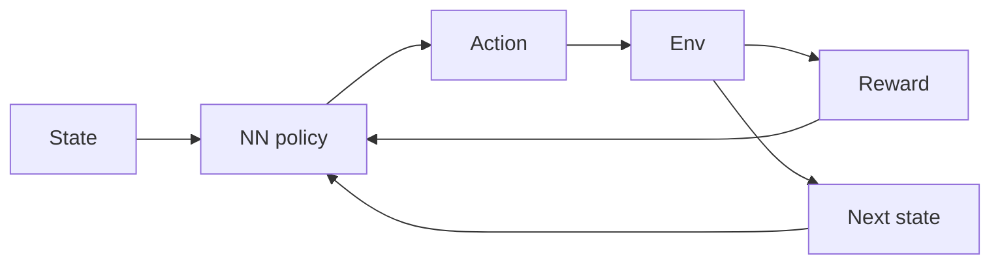

# Aprendizaje por refuerzo profundo (DRL)

## Definición

El RL profundo combina aprendizaje por refuerzo con redes neuronales profundas to handle high-dimensional state and action spaces. Examples: DQN, A3C, PPO, SAC.

[Neural networks](/docs/neural-networks) aproximan la función de valor y/o la política para que [RL](/docs/rl) can scale to raw pixels, high-D controls, and large discrete actions. Training is unstable without tricks (experience replay, target networks, advantage estimation); modern algorithms (PPO, SAC) are widely used in robotics and [LLM](/docs/llms) alignment (RLHF, DPO).

## Cómo funciona

The **state** (por ej. image, vector) se alimenta en un **neural network policy** (or value network) que produce an **action**. The **env** returns **reward** and **next state**; the agent uses this experience to update the policy (por ej. policy gradient or Q-learning with function approximation). **Experience replay** (store transitions, sample batches) and **target networks** (slow-moving copy of the network) stabilize training. **Advantage estimation** (por ej. GAE) reduces variance in policy gradients. PPO and SAC are common for continuous control; DQN and variants for discrete actions.

## Casos de uso

Deep RL se usa cuando el problema de decisión es complejo y se puede aprender por ensayo y error (simulación o entorno real).

- High-dimensional control (por ej. robotics, autonomous driving)
- Game AI and simulation (por ej. DQN, PPO in complex environments)
- LLM alignment via policy optimization (por ej. RLHF, DPO)

## Documentación externa

- [Spinning Up in Deep RL (OpenAI)](https://spinningup.openai.com/)
- [Stable-Baselines3 – DRL algorithms](https://stable-baselines3.readthedocs.io/)

## Ver también

- [RL](/docs/rl)
- [Neural networks](/docs/neural-networks)
