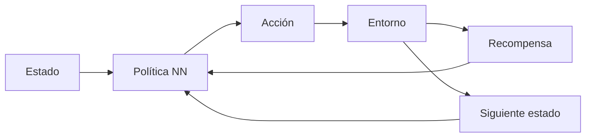

# Aprendizaje por refuerzo profundo (DRL)

## Definición

El RL profundo combina el aprendizaje por refuerzo con redes neuronales profundas para manejar espacios de estados y acciones de alta dimensionalidad. Ejemplos: DQN, A3C, PPO, SAC.

Las [redes neuronales](/docs/neural-networks) aproximan la función de valor y/o la política para que el [RL](/docs/rl) pueda escalar a píxeles sin procesar, controles de alta dimensión y grandes acciones discretas. El entrenamiento es inestable sin trucos (repetición de experiencias, redes objetivo, estimación de ventaja); los algoritmos modernos (PPO, SAC) se usan ampliamente en robótica y alineación de [LLMs](/docs/llms) (RLHF, DPO).

## Cómo funciona

El **estado** (como imagen, vector) se alimenta en una **política de red neuronal** (o red de valor) que produce una **acción**. El **entorno** devuelve **recompensa** y **siguiente estado**; el agente usa esta experiencia para actualizar la política (como gradiente de política o Q-learning con aproximación de función). La **repetición de experiencias** (almacenar transiciones, muestrear lotes) y las **redes objetivo** (copia de movimiento lento de la red) estabilizan el entrenamiento. La **estimación de ventaja** (como GAE) reduce la varianza en los gradientes de política. PPO y SAC son comunes para control continuo; DQN y variantes para acciones discretas.

## Casos de uso

El RL profundo se usa cuando el problema de decisión es complejo y se puede aprender por ensayo y error (simulación o entorno real).

- Control de alta dimensionalidad (como robótica, conducción autónoma)
- IA de juegos y simulación (como DQN, PPO en entornos complejos)
- Alineación de LLMs mediante optimización de políticas (como RLHF, DPO)

## Recursos prácticos

- [Spinning Up in Deep RL (OpenAI)](https://spinningup.openai.com/)
- [Stable-Baselines3 – Algoritmos DRL](https://stable-baselines3.readthedocs.io/)

## Ver también

- [RL](/docs/rl)
- [Redes neuronales](/docs/neural-networks)
