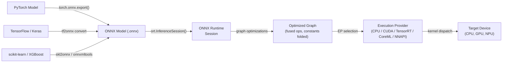

# ONNX Runtime

## Definición

ONNX Runtime (ORT) es una biblioteca de inferencia y aceleración de entrenamiento de código abierto y multiplataforma desarrollada por Microsoft. Su propósito principal es ejecutar modelos en el formato **Open Neural Network Exchange (ONNX)** — una representación intermedia agnóstica al framework para modelos de aprendizaje automático — con alto rendimiento en una amplia gama de objetivos de hardware y sistemas operativos. ORT no está vinculado a ningún framework de entrenamiento en particular: los modelos de PyTorch, TensorFlow, scikit-learn, LightGBM, XGBoost y otros pueden exportarse a ONNX y ejecutarse a través de la misma API de runtime, convirtiéndolo en una de las soluciones de inferencia más interoperables disponibles.

En su núcleo, ORT carga un grafo ONNX, aplica una extensa serie de optimizaciones a nivel de grafo (plegado de constantes, fusión de nodos, transformación de diseño) y despacha las operaciones al mejor proveedor de ejecución disponible para el hardware actual. La abstracción del **Proveedor de Ejecución (EP)** permite a ORT enrutar subgrafos a CPUs, GPUs NVIDIA a través de CUDA o TensorRT, GPUs AMD a través de ROCm, hardware Intel a través de OpenVINO, Apple Silicon a través de CoreML, Android a través de NNAPI y Windows a través de DirectML — todo a través de una superficie de API unificada. Esto hace que ORT sea adecuado para un espectro de despliegue que va desde servidores en la nube hasta laptops con Windows y dispositivos móviles.

ONNX Runtime es particularmente valioso en entornos empresariales y de producción donde un solo pipeline de despliegue debe servir modelos entrenados en diferentes frameworks. Es el backend de inferencia que impulsa los endpoints de Azure ML, la biblioteca Optimum de Hugging Face, Windows ML y muchos sistemas de recomendación y clasificación en producción. Su extensión de entrenamiento (ORT Training) también habilita el ajuste fino acelerado de modelos de transformadores grandes, pero la inferencia es su caso de uso principal.

## Cómo funciona



### Formato ONNX e interoperabilidad de modelos

ONNX representa un modelo como un grafo de cómputo dirigido acíclico donde los nodos son operadores estandarizados (p. ej. `Conv`, `MatMul`, `LayerNormalization`) definidos en la especificación de operadores ONNX, y los bordes transportan tensores tipados. El formato está versionado: cada versión del opset ONNX (actualmente 21) define el conjunto completo de operadores soportados y su semántica. Los exportadores de cada framework mapean las operaciones específicas del framework a sus equivalentes ONNX; cuando no existe un mapeo directo, se pueden registrar extensiones `custom_op`. El archivo `.onnx` serializado en protobuf incluye la topología del grafo, nombres de operadores, formas de tensores y valores de pesos constantes, haciendo el formato autocontenido y portátil.

### Optimizaciones de grafo

Cuando se crea una `InferenceSession`, ORT aplica tres niveles de optimización de grafo controlados por la configuración `GraphOptimizationLevel`. El nivel 1 (básico) realiza reescrituras seguras: plegado de constantes, eliminación de nodos redundantes, inferencia de formas y eliminación de identidades. El nivel 2 (extendido) agrega fusión de operaciones: `Conv + BatchNorm`, `Conv + Relu`, `Transpose + MatMul` y patrones similares se fusionan en kernels únicos para eliminar asignaciones de memoria intermedias y sobrecarga de inicio de kernels. El nivel 3 (optimización de diseño) reestructura los diseños de memoria de tensores para que coincidan con lo que prefieren los proveedores de ejecución (p. ej. NHWC para convoluciones en GPU). Los grafos optimizados pueden serializarse de vuelta a `.onnx` para inspección o para omitir la re-optimización en cargas posteriores.

### Proveedores de ejecución

El mecanismo de Proveedor de Ejecución es el principal palanca de extensibilidad y rendimiento de ORT. Cuando se crea una sesión con un EP específico, ORT consulta qué nodos puede manejar el EP, particiona el grafo y reemplaza los subgrafos reclamados con implementaciones `ComputeKernel` específicas del EP. El **CPU EP** usa MLAS (Microsoft Linear Algebra Subprograms), una implementación BLAS vectorizada a mano con soporte AVX-512 y NEON. El **CUDA EP** descarga convoluciones y GEMMs a cuDNN y cuBLAS. El **TensorRT EP** aplica fusión de capas y calibración de precisión de TensorRT para FP16 e INT8, logrando el mayor rendimiento en GPUs NVIDIA. El **CoreML EP** delega al Motor Neural de Apple en macOS e iOS. El **DirectML EP** soporta inferencia acelerada por hardware en cualquier GPU capaz de DirectX 12 en Windows, incluyendo gráficos integrados de AMD e Intel.

### Cuantización en ONNX Runtime

ORT soporta inferencia INT8 a través del patrón de nodos **QDQ (Quantize-Dequantize)**: el grafo ONNX contiene nodos explícitos `QuantizeLinear` y `DequantizeLinear` que representan los límites de precisión. La cuantización estática requiere un conjunto de datos de calibración para calcular escalas de entrada/salida; el paquete Python `onnxruntime.quantization` proporciona funciones `quantize_static` y `quantize_dynamic`. ORT también acepta modelos exportados con QAT donde los nodos Q/DQ se insertaron durante el entrenamiento. La aceleración INT8 por hardware solo se activa cuando el proveedor de ejecución lo soporta (CUDA EP requiere CUDA 11+, TensorRT EP maneja INT8 de forma nativa a través de tablas de calibración). El `ORTQuantizer` en Hugging Face Optimum proporciona una interfaz de alto nivel para cuantizar modelos de transformadores de extremo a extremo.

### Despliegue móvil y en el borde

ORT Mobile es una compilación reducida de ONNX Runtime para Android e iOS que elimina operadores no utilizados y bibliotecas EP, reduciendo el tamaño binario a ~1-3 MB comprimidos. El paquete Python `onnxruntime-mobile` prepara modelos para móvil pre-empaquetando pesos y eliminando metadatos de tiempo de entrenamiento. En Android, el NNAPI EP delega al acelerador de hardware. En iOS y macOS, el CoreML EP usa el Motor Neural de Apple. ORT también se ejecuta en Raspberry Pi (ARM Linux) a través del CPU EP, y existe soporte experimental para objetivos WebAssembly. El paquete npm `ort` habilita ORT en Node.js y contextos de navegador a través de WASM.

## Cuándo usar / Cuándo NO usar

| Usar cuando | Evitar cuando |
|---|---|
| Necesitas inferencia agnóstica al framework — sirviendo modelos de PyTorch, TF y scikit-learn a través de un runtime | Tu objetivo de despliegue es un microcontrolador con \<256 KB de RAM (TFLM cubre esto mejor) |
| Estás construyendo pipelines ML empresariales en Windows/Azure donde las herramientas de Microsoft ya están en uso | Necesitas delegación de hardware Android profunda con herramientas maduras hoy (TFLite es más probado en batalla para Android) |
| Necesitas aceleración NVIDIA TensorRT sin gestionar directamente la API de TensorRT | Tu modelo usa operaciones personalizadas que no tienen equivalente ONNX y son imprácticas de registrar |
| Quieres inferencia en navegador/WASM para el mismo modelo que se ejecuta en el lado del servidor | Tu equipo es nativo de PyTorch y quiere el bucle más estrecho posible desde entrenamiento a móvil (PyTorch Mobile / ExecuTorch puede ser más simple) |
| La portabilidad multiplataforma es una preocupación de primer orden (mismo modelo en Windows, Linux, macOS, Android, iOS) | Necesitas entrenamiento en tiempo real o aprendizaje en línea en el borde (ORT Training existe pero añade complejidad significativa) |

## Comparaciones

Comparación de ONNX Runtime con TFLite y PyTorch Mobile para despliegue en el borde y multiplataforma.

| Criterio | ONNX Runtime | TensorFlow Lite | PyTorch Mobile |
|---|---|---|---|
| Soporte de plataformas | Windows, Linux, macOS, Android, iOS, WASM, nube — cobertura más amplia | Android, iOS, Linux embebido, microcontroladores (TFLM) | Android, iOS; ExecuTorch agrega embebido y bare-metal |
| Conversión de modelos | Cualquier framework → exportación ONNX (ruta más interoperable, múltiples convertidores) | TF/Keras → TFLite Converter (maduro, solo ecosistema TF) | PyTorch → TorchScript o ExecuTorch (nativo de PyTorch, menor fricción para usuarios de PT) |
| Rendimiento en dispositivo | CPU EP con MLAS es competitivo; TensorRT/CUDA EPs lideran para GPU; CoreML/NNAPI EPs para móvil | Excelente en Android a través de NNAPI/delegado GPU; mejor en su clase para microcontroladores | XNNPACK en CPUs ARM; GPU Vulkan; delegación NPU de ExecuTorch |
| Ecosistema | Agnóstico al framework; Hugging Face Optimum; Windows ML; Azure ML; fuerte adopción empresarial | Maduro: MediaPipe, TF Hub, Model Garden; la mayor comunidad de ML móvil | Fuerte en investigación; Hugging Face; comunidad ExecuTorch en crecimiento |
| Soporte de cuantización | INT8 a través de nodos QDQ; PTQ dinámico y estático; QAT; INT8 por hardware a través de EP | Completo: rango dinámico, INT8, FP16, QAT con rutas INT8 completas | PTQ (INT8 dinámico + estático) y QAT a través de torch.ao.quantization |

## Pros y contras

| Pros | Contras |
|------|------|
| Agnóstico al framework: cualquier modelo exportable a ONNX funciona con el mismo runtime | La exportación ONNX puede fallar para modelos con operaciones no soportadas o personalizadas |
| Cobertura de proveedor de ejecución más amplia: CPU, CUDA, TensorRT, DirectML, CoreML, NNAPI, OpenVINO | Depurar grafos ONNX es más difícil que depurar en el framework nativo |
| Fuerte integración con Windows y Azure; ciudadano de primera clase en la pila ML de Microsoft | Mayor complejidad operativa que TFLite para escenarios puros de Android/iOS |
| Hugging Face Optimum proporciona cuantización y optimización de alto nivel para transformadores | El versionado del opset ONNX puede crear fricción de compatibilidad entre exportadores y versiones de ORT |
| Rendimiento CPU competitivo a través de MLAS con vectorización AVX-512 y NEON | El tamaño binario móvil es mayor que TFLite cuando se incluyen todos los EPs |

## Ejemplos de código

```python
import numpy as np
import torch
import torch.nn as nn
import onnxruntime as ort

# ── 1. Define a simple model in PyTorch ───────────────────────────────────────
class SimpleClassifier(nn.Module):
    """Minimal classifier for demonstration."""

    def __init__(self, input_dim: int = 784, num_classes: int = 10):
        super().__init__()
        self.net = nn.Sequential(
            nn.Linear(input_dim, 128),
            nn.ReLU(),
            nn.Linear(128, 64),
            nn.ReLU(),
            nn.Linear(64, num_classes),
        )

    def forward(self, x: torch.Tensor) -> torch.Tensor:
        return self.net(x)


model = SimpleClassifier()
# Switch to inference mode: disables dropout, BatchNorm uses running statistics
model.train(False)

# ── 2. Export PyTorch model to ONNX ──────────────────────────────────────────
dummy_input = torch.randn(1, 784)  # batch=1, flattened 28x28 image

torch.onnx.export(
    model,
    dummy_input,
    "model.onnx",
    opset_version=17,                         # target ONNX opset
    input_names=["input"],
    output_names=["logits"],
    dynamic_axes={
        "input":  {0: "batch_size"},          # allow variable batch size
        "logits": {0: "batch_size"},
    },
    do_constant_folding=True,                 # fold constant sub-expressions during export
)
print("Exported model.onnx")

# ── 3. Apply INT8 post-training dynamic quantization ─────────────────────────
from onnxruntime.quantization import quantize_dynamic, QuantType

quantize_dynamic(
    "model.onnx",
    "model_int8.onnx",
    weight_type=QuantType.QInt8,              # quantize weights to INT8
)
print("Quantized model saved as model_int8.onnx")

# ── 4. Run inference with ONNX Runtime ───────────────────────────────────────
# SessionOptions allow controlling graph optimization level and thread counts
sess_options = ort.SessionOptions()
sess_options.graph_optimization_level = ort.GraphOptimizationLevel.ORT_ENABLE_ALL

# Providers list is checked in order; falls back to CPU if GPU is unavailable
providers = ["CUDAExecutionProvider", "CPUExecutionProvider"]
session = ort.InferenceSession("model_int8.onnx", sess_options, providers=providers)

print(f"Active execution provider: {session.get_providers()[0]}")

# Prepare a batch of random inputs as float32 numpy arrays
batch = np.random.randn(4, 784).astype(np.float32)
input_name = session.get_inputs()[0].name
output_name = session.get_outputs()[0].name

outputs = session.run([output_name], {input_name: batch})
logits = outputs[0]                          # shape (4, 10)
predicted_classes = np.argmax(logits, axis=1)
print(f"Batch predictions: {predicted_classes}")
```

## Recursos prácticos

- [Documentación de ONNX Runtime](https://onnxruntime.ai/docs/) — referencia oficial que cubre instalación, proveedores de ejecución, optimización de grafos, cuantización y despliegue móvil para todas las plataformas soportadas.
- [Referencia de la API de Python de ONNX Runtime](https://onnxruntime.ai/docs/api/python/api_summary.html) — documentación detallada de la API para `InferenceSession`, `SessionOptions`, proveedores de ejecución y el sub-paquete de cuantización.
- [Hugging Face Optimum](https://huggingface.co/docs/optimum/onnxruntime/overview) — biblioteca de alto nivel que envuelve ORT para optimización de modelos de transformadores, proporcionando clases `ORTModelForXxx` y `ORTQuantizer` para exportación de modelos e cuantización INT8 en un paso.
- [ONNX Model Zoo](https://github.com/onnx/models) — repositorio curado de modelos ONNX pre-entrenados que abarcan visión computacional, NLP, voz y ML clásico; útil para evaluar el rendimiento de ORT y como plantillas de despliegue.
- [Guía de despliegue móvil de ONNX Runtime](https://onnxruntime.ai/docs/tutorials/mobile/) — tutorial paso a paso para construir una aplicación ORT mínima para Android o iOS, incluyendo preparación del modelo y configuración del NNAPI/CoreML EP.

## Ver también

- [TensorFlow Lite](/docs/edge-ai/tflite)
- [PyTorch Mobile](/docs/edge-ai/pytorch-mobile)
- [PyTorch](/docs/frameworks/pytorch)
- [TensorFlow](/docs/frameworks/tensorflow)
