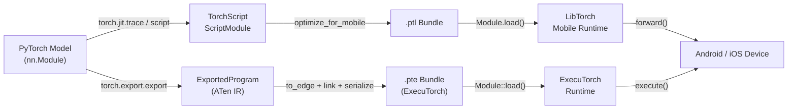

# PyTorch Mobile

## Definición

PyTorch Mobile es la familia de herramientas y runtimes que lleva los modelos entrenados con PyTorch a dispositivos Android e iOS sin requerir un servidor o conexión a la nube. Preserva la experiencia de desarrollo de PyTorch — investigadores e ingenieros entrenan en la familiar API de Python en modo eager, luego exportan sus modelos a través de la ruta **TorchScript** o el más nuevo **ExecuTorch** para el despliegue en dispositivo. Este estrecho acoplamiento entre los entornos de entrenamiento y despliegue reduce la superficie de errores de discrepancia numérica que a menudo emergen al cambiar entre frameworks.

La ruta histórica de despliegue se centra en TorchScript, un subconjunto de Python con tipado estático que puede compilarse y serializarse a un formato independiente de la plataforma (`.ptl` para móvil). TorchScript soporta dos modos de compilación: **tracing**, donde se pasa una entrada de muestra a través del modelo y se registra la ruta ejecutada, y **scripting**, donde el flujo de control de Python se analiza estáticamente. Ambos producen un `ScriptModule` que puede cargarse por el runtime C++ de LibTorch integrado en el SDK móvil.

Google y Meta desarrollaron conjuntamente **ExecuTorch** como el framework de nueva generación para ejecutar modelos PyTorch en el borde. ExecuTorch introduce un formato de ejecución portátil (`.pte`), un runtime C++ mínimo (menos de 50 KB para modelos simples) y soporte de primera clase para la delegación a backends de hardware incluyendo Qualcomm AI Engine, Apple Neural Engine, NPUs Arm Ethos y DSPs Cadence. ExecuTorch está diseñado para uso en producción y reemplaza al runtime original de PyTorch Mobile para nuevos proyectos que requieren amplia portabilidad de hardware y tamaño binario mínimo.

## Cómo funciona



### Tracing y scripting con TorchScript

El tracing (`torch.jit.trace`) ejecuta una entrada de muestra a través del modelo y registra la secuencia de operaciones de tensor, produciendo un grafo de cómputo estático. El tracing es simple y cubre la mayoría de las arquitecturas estándar, pero captura solo la ruta de ejecución para la entrada dada — el flujo de control dependiente de datos (sentencias if, bucles que varían con los valores de entrada) se integrará silenciosamente. El scripting (`torch.jit.script`) analiza el código fuente Python con un verificador de tipos de TorchScript y preserva el flujo de control, haciéndolo correcto para modelos con lógica de ramificación. En la práctica, los enfoques híbridos son comunes: hacer scripting del módulo de nivel superior mientras se hace tracing de submódulos internos que no tienen flujo de control dinámico.

### Pipeline de exportación de ExecuTorch

ExecuTorch usa `torch.export.export` para capturar una representación estricta y libre de efectos secundarios del modelo en ATen IR — un conjunto canónico de operadores de PyTorch con semántica bien definida garantizada. El programa exportado luego se reduce al **Edge IR** a través de `to_edge`, que realiza pasadas de grafo específicas del backend (descomposición de operadores, propagación de diseño). Los backends (objetivos de delegación) pueden reclamar subgrafos durante el paso `to_backend`, reemplazándolos con implementaciones específicas del hardware. El artefacto final se serializa en un flatbuffer `.pte` que carga el runtime C++ de ExecuTorch, que no requiere asignación de memoria dinámica durante la inferencia.

### Optimización: cuantización y poda

PyTorch ofrece cuantización estática y dinámica post-entrenamiento a través de `torch.quantization` (heredado) y el espacio de nombres más nuevo `torch.ao.quantization`. La cuantización estática INT8 requiere un conjunto de datos de calibración representativo y reduce el tamaño del modelo en ~4x con una mejora de latencia de 2-3x en CPUs ARM. El entrenamiento consciente de la cuantización (QAT) inserta nodos `FakeQuantize` en el grafo de avance durante el ajuste fino, permitiendo que el modelo adapte sus pesos a la precisión INT8. La poda (`torch.nn.utils.prune`) elimina pesos individuales o canales completos basándose en criterios de magnitud o estructurales, reduciendo la carga de cómputo efectiva antes de la cuantización. Ambas técnicas pueden combinarse: primero podar para reducir canales, luego cuantizar para reducir la precisión.

### Runtime móvil e integración de plataforma

El bundle `.ptl` producido por `optimize_for_mobile` incluye optimizaciones de fusión de operadores y elimina los operadores no utilizados del registro de operadores, reduciendo la huella binaria. El SDK de Android (`pytorch_android`) se publica en Maven Central y expone una API Kotlin/Java. El SDK de iOS se distribuye como CocoaPod o Swift Package y proporciona bindings Objective-C y Swift. Ambos SDKs envuelven el mismo núcleo C++ de LibTorch. ExecuTorch apunta a las mismas plataformas pero expone una API C más ligera y también soporta objetivos embebidos bare-metal. La clase `torch::executor::Module` proporciona una API `execute()` mínima que opera directamente en tensores `EValue` pre-asignados, evitando la sobrecarga al estilo JNI.

### Aceleración con GPU y NPU

El delegado GPU de PyTorch Mobile para Android funciona a través del backend Vulkan (`torch.backends.vulkan`), que descarga convoluciones y multiplicaciones de matrices a la GPU. El backend XNNPACK de ExecuTorch acelera las operaciones de punto flotante e INT8 en CPUs ARM a través de instrucciones SIMD NEON y es el predeterminado recomendado para la aceleración en CPU. El backend Qualcomm AI Engine Direct y el backend Apple Core ML proporcionan aceleración a nivel de NPU a través de la API de delegación de ExecuTorch, logrando típicamente aceleraciones de 5-15x sobre las rutas de CPU de referencia para modelos estándar de visión y NLP.

## Cuándo usar / Cuándo NO usar

| Usar cuando | Evitar cuando |
|---|---|
| Tu base de código de entrenamiento es PyTorch y quieres mínima fricción de conversión | Tus modelos se originan en TensorFlow/Keras y la sobrecarga de conversión es una preocupación |
| Necesitas desplegar en Android o iOS con un flujo de trabajo familiar de Python | Necesitas objetivos de microcontrolador con \<256 KB de RAM (TFLM está mejor adaptado) |
| Quieres ExecuTorch para delegación NPU de hardware de nueva generación (Qualcomm, Apple ANE) | Tu modelo usa flujo de control dinámico a nivel de Python que TorchScript no puede capturar a través de tracing |
| Iteración rápida: reutiliza la misma clase de modelo para entrenamiento e inferencia móvil | Necesitas herramientas de producción maduras con amplia cobertura de delegados de hardware hoy (TFLite es más maduro) |
| Estás construyendo sobre el ecosistema de Hugging Face (muchos modelos exportan a través de TorchScript) | El tamaño binario está extremadamente restringido y la huella del runtime de LibTorch (~3-8 MB comprimidos) es demasiado grande |

## Comparaciones

Comparación de PyTorch Mobile con TFLite y ONNX Runtime para escenarios de despliegue en el borde.

| Criterio | PyTorch Mobile | TensorFlow Lite | ONNX Runtime |
|---|---|---|---|
| Soporte de plataformas | Android, iOS; ExecuTorch extiende a embebido y bare-metal | Android, iOS, Linux embebido, microcontroladores (TFLM) | Windows, Linux, macOS, Android, iOS, WebAssembly |
| Conversión de modelos | torch.jit.trace / script (nativo de PyTorch) o torch.export (ExecuTorch) | TFLite Converter desde SavedModel de TF/Keras | Cualquier framework → exportación ONNX (ruta más interoperable) |
| Rendimiento en dispositivo | XNNPACK en CPUs ARM; GPU Vulkan; delegación NPU de ExecuTorch | Excelente en Android a través de NNAPI/delegado GPU; mejor en su clase para microcontroladores | CPU EP competitivo; CUDA/TensorRT EPs brillan en dispositivos de borde con GPU |
| Ecosistema | Fuerte en investigación; integración de Hugging Face; comunidad ExecuTorch en crecimiento | Maduro: MediaPipe, TF Hub, Model Garden; la mayor comunidad de ML móvil | Soporte empresarial amplio; agnóstico al framework; fuerte integración con Microsoft/Azure |
| Soporte de cuantización | PTQ (INT8 dinámico + estático) y QAT a través de torch.ao.quantization; cuantización específica del backend de ExecuTorch | Completo: rango dinámico, INT8, FP16, QAT con rutas INT8 completas | INT8 a través de nodos QDQ; INT8 por hardware depende del proveedor de ejecución |

## Pros y contras

| Pros | Contras |
|------|------|
| Flujo de trabajo sin interrupciones para usuarios de PyTorch — la misma clase de modelo entrena y despliega | El binario móvil de LibTorch agrega ~3-8 MB al tamaño de la app comprimida |
| ExecuTorch proporciona una arquitectura moderna y extensible para delegación NPU | El tracing con TorchScript ignora silenciosamente el flujo de control dependiente de datos |
| Fuerte integración con el ecosistema de Hugging Face | Menos maduro que TFLite para despliegues en producción de Android/iOS |
| QAT está bien integrado con el bucle de entrenamiento estándar | La cobertura del delegado GPU Vulkan es más estrecha que el delegado GPU de TFLite |
| Desarrollo activo con fuerte respaldo de Meta y la comunidad | La interoperabilidad con ONNX requiere un paso de conversión adicional a través del exportador ONNX |

## Ejemplos de código

```python
import torch
import torch.nn as nn

# ── 1. Define a simple convolutional model ────────────────────────────────────
class SmallCNN(nn.Module):
    """Minimal CNN for demonstration. Replace with your real model."""

    def __init__(self, num_classes: int = 10):
        super().__init__()
        self.features = nn.Sequential(
            nn.Conv2d(1, 16, kernel_size=3, padding=1),
            nn.ReLU(inplace=True),
            nn.MaxPool2d(2),
            nn.Conv2d(16, 32, kernel_size=3, padding=1),
            nn.ReLU(inplace=True),
            nn.AdaptiveAvgPool2d(1),
        )
        self.classifier = nn.Linear(32, num_classes)

    def forward(self, x: torch.Tensor) -> torch.Tensor:
        x = self.features(x)
        x = x.flatten(1)
        return self.classifier(x)


model = SmallCNN(num_classes=10)
model.eval()  # set model to inference mode

# ── 2. Export with TorchScript tracing ───────────────────────────────────────
example_input = torch.rand(1, 1, 28, 28)

scripted_model = torch.jit.trace(model, example_input)

from torch.utils.mobile_optimizer import optimize_for_mobile

optimized_model = optimize_for_mobile(scripted_model)
optimized_model._save_for_lite_interpreter("model.ptl")
print("Saved model.ptl")

# ── 3. Apply post-training dynamic quantization ───────────────────────────────
quantized_model = torch.quantization.quantize_dynamic(
    model,
    qconfig_spec={nn.Linear, nn.Conv2d},
    dtype=torch.qint8,
)
quantized_model.eval()

with torch.no_grad():
    output = quantized_model(example_input)
print(f"Output shape: {output.shape}, predicted class: {output.argmax(dim=1).item()}")

# ── 4. Load .ptl on Python ────────────────────────────────────────────────────
loaded = torch.jit.load("model.ptl")
loaded.eval()
with torch.no_grad():
    result = loaded(example_input)
print(f"Loaded mobile model predicted class: {result.argmax(dim=1).item()}")
```

## Recursos prácticos

- [Documentación de PyTorch Mobile](https://pytorch.org/mobile/home/) — guía oficial que cubre la exportación con TorchScript, los SDKs de Android e iOS, la optimización de modelos y el perfilado de rendimiento en dispositivo.
- [Documentación de ExecuTorch](https://pytorch.org/executorch/) — documentación del runtime de borde de nueva generación, que cubre el pipeline de exportación, la delegación de backends y guías de integración de hardware para Qualcomm, Apple y objetivos ARM.
- [Guía de torch.ao.quantization](https://pytorch.org/docs/stable/quantization.html) — referencia completa para la API de cuantización de PyTorch, que cubre PTQ, QAT y el espacio de nombres más nuevo `torch.ao` usado en flujos de trabajo de ExecuTorch.
- [Apps de demo de Android de PyTorch](https://github.com/pytorch/android-demo-app) — apps de Android de código abierto que demuestran clasificación de imágenes, detección de objetos, reconocimiento de voz y NLP con PyTorch Mobile; útiles como plantillas de integración.
- [Tutoriales de ExecuTorch](https://pytorch.org/executorch/stable/tutorials/export-to-executorch-tutorial.html) — tutoriales paso a paso para exportar modelos a través del pipeline de ExecuTorch y ejecutarlos con el runtime C++.

## Ver también

- [TensorFlow Lite](/docs/edge-ai/tflite)
- [ONNX Runtime](/docs/edge-ai/onnx)
- [PyTorch](/docs/frameworks/pytorch)
- [Cuantización](/docs/quantization)
