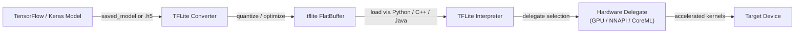

# TensorFlow Lite

## Definición

TensorFlow Lite (TFLite) es el framework de código abierto de Google para ejecutar modelos de aprendizaje automático en dispositivos con recursos limitados — teléfonos móviles, tabletas, sistemas embebidos y microcontroladores. En lugar de un framework de entrenamiento, TFLite es un **runtime de inferencia** específicamente diseñado: los modelos se entrenan con TensorFlow completo, se convierten al formato compacto `.tflite` y luego se ejecutan en el dispositivo sin requerir una conexión al servidor. Este diseño permite que las aplicaciones realicen tareas de ML — clasificación de imágenes, detección de objetos, reconocimiento de voz, comprensión del lenguaje natural — completamente offline y con baja latencia.

El núcleo de TFLite es un formato de modelo flat-buffer que minimiza la sobrecarga de asignación de memoria y evita la necesidad de un intérprete de grafo de runtime complejo. El formato elimina las construcciones de tiempo de entrenamiento (gradientes, estado del optimizador) y retiene solo las operaciones necesarias para la inferencia en pase hacia adelante. Esto resulta en archivos de modelos que a menudo son un orden de magnitud más pequeños que sus contrapartes de TensorFlow completo, haciendo práctico su distribución a través de tiendas de aplicaciones incluso para usuarios con conexiones limitadas.

TFLite apunta a un rango de hardware inusualmente amplio. En el extremo superior, se ejecuta en dispositivos Android e iOS y aprovecha los aceleradores de hardware a través de su API de **delegados**. En el extremo inferior, la variante TensorFlow Lite para Microcontroladores (TFLM) elimina completamente la asignación de memoria dinámica y puede caber en decenas de kilobytes de flash, habilitando el despliegue en chips Cortex-M bare-metal y objetivos ultra restringidos similares.

## Cómo funciona



### Conversión de modelos

El TFLite Converter (`tf.lite.TFLiteConverter`) acepta directorios SavedModel, archivos Keras `.h5` o funciones concretas de TensorFlow y emite un flatbuffer `.tflite`. Durante la conversión, el grafo se congela (las variables se convierten en constantes), las operaciones no utilizadas se podan y la fusión de operadores (p. ej. Conv + ReLU → ConvReLU fusionado) reduce la sobrecarga de despacho de kernels. El convertidor soporta un conjunto creciente de ops de TensorFlow a través del mecanismo de **select TF ops**, recurriendo a un conjunto restringido de ops integrados de TFLite que se garantiza que se ejecuten en cada objetivo. La cuantización post-entrenamiento puede aplicarse en esta etapa, reduciendo el tamaño del modelo y desbloqueando rutas de inferencia de solo enteros.

### Cuantización

TFLite soporta cuatro modos de cuantización: cuantización de rango dinámico (solo pesos, activaciones cuantizadas en tiempo de ejecución), cuantización de entero completo (pesos y activaciones, requiere un conjunto de datos representativo para calibración), cuantización float16 (buena para delegados GPU) y entrenamiento consciente de la cuantización (QAT, donde se insertan nodos de cuantización falsa durante el entrenamiento para que el modelo aprenda a ser robusto a la reducción de precisión). La cuantización INT8 completa típicamente reduce el tamaño del modelo en 4x y la latencia en 2-3x en CPUs con soporte SIMD. La cuantización es particularmente impactante en chipsets móviles que carecen de rutas de ejecución FP32 rápidas.

### Intérprete y kernels de ops

El Intérprete de TFLite carga un archivo `.tflite`, asigna memoria de tensores (todo en una sola arena para evitar la fragmentación) y ejecuta las operaciones en orden topológico. Cada operación está implementada por un kernel registrado en el op resolver; el MutableOpResolver permite que las aplicaciones incluyan solo los ops que necesitan, reduciendo significativamente el tamaño binario. El intérprete expone una API C++ mínima (`AllocateTensors`, `Invoke`, `typed_input_tensor`, `typed_output_tensor`) y existen wrappers de nivel superior para Java/Kotlin (Android), Swift/ObjC (iOS) y Python. El intérprete de Python se usa principalmente para validación y benchmarking antes de desplegar binarios nativos.

### Delegados

Los delegados son la interfaz de plugin de aceleración de hardware de TFLite. Cuando se aplica un delegado al intérprete, inspecciona el grafo del modelo y reclama los subgrafos que puede acelerar, reemplazando los kernels de CPU de referencia de TFLite con implementaciones optimizadas. El **delegado GPU** descarga convoluciones y multiplicaciones de matrices a OpenGL ES o Metal, logrando aceleraciones de 2-7x en modelos de visión típicos. El **delegado NNAPI** enruta las operaciones a través de la API de Redes Neuronales de Android hacia cualquier acelerador proporcionado por el proveedor (DSP, NPU). El **delegado CoreML** usa CoreML de Apple en iOS. El **delegado Hexagon** apunta directamente a DSPs de Qualcomm. Los delegados degradan graciosamente: las ops no soportadas recurren automáticamente a la CPU.

### TFLite para Microcontroladores

La bifurcación TFLM elimina el asignador estándar de C++, la E/S de archivos y el despacho dinámico. Los modelos se compilan en el firmware como arrays de bytes de C y la inferencia se ejecuta desde SRAM con un búfer de scratch de tamaño fijo. Los objetivos soportados incluyen STM32, Arduino Nano 33 BLE Sense, SparkFun Edge y Sony Spresense. TFLM soporta un subconjunto de operaciones suficiente para detección de palabras clave, reconocimiento de gestos y tareas de visión simples con presupuestos de energía de sub-milivatio.

## Cuándo usar / Cuándo NO usar

| Usar cuando | Evitar cuando |
|---|---|
| Desplegando en Android o iOS sin dependencia en la nube | Tu modelo usa ops que aún no están soportadas por el conjunto de ops de TFLite |
| Necesitas latencia sub-100ms para inferencia en tiempo real en móvil | Requieres formas dinámicas o flujo de control no expresable en grafos estáticos de TFLite |
| Ejecutando en tarjetas Linux embebidas (Raspberry Pi, Coral Edge TPU) | Tu equipo trabaja principalmente en PyTorch y la fricción de conversión de modelos es un obstáculo |
| El tamaño binario importa y quieres un runtime de inferencia mínimo | Necesitas características avanzadas de servicio: procesamiento por lotes, versionado de modelos, enrutamiento A/B |
| Quieres amplia aceleración de hardware a través de la API de delegados | Tu arquitectura de modelo cambia frecuentemente durante la experimentación |

## Comparaciones

Comparación de TFLite con PyTorch Mobile y ONNX Runtime para escenarios de despliegue en el borde.

| Criterio | TensorFlow Lite | PyTorch Mobile | ONNX Runtime |
|---|---|---|---|
| Soporte de plataformas | Android, iOS, Linux embebido, microcontroladores | Android, iOS (embebido limitado) | Windows, Linux, macOS, Android, iOS, WebAssembly |
| Conversión de modelos | TF/Keras → TFLite Converter (maduro, bien documentado) | PyTorch → TorchScript o ExecuTorch (Pythónico, menos fricción para usuarios de PyTorch) | Cualquier framework → exportación ONNX → ORT (más interoperable) |
| Rendimiento en dispositivo | Excelente en Android a través de NNAPI/delegado GPU; mejor en su clase para microcontroladores | Bueno en móvil; ExecuTorch trae mejor rendimiento y portabilidad | Competitivo con CPU EP; CUDA/TensorRT EPs destacan en escenarios GPU de nube/borde |
| Ecosistema | Grande: modelos de TensorFlow Hub, Model Garden, integración MediaPipe | En crecimiento: fuerte en investigación, modelos torchvision, integración de Hugging Face | Amplio: cualquier framework compatible con ONNX; fuerte en empresas y pila Microsoft |
| Soporte de cuantización | Completo: rango dinámico, INT8, FP16, QAT | PTQ y QAT a través de torch.quantization; ExecuTorch agrega más backends | Soporta INT8 a través de nodos QDQ; depende del proveedor de ejecución para INT8 por hardware |

## Pros y contras

| Pros | Contras |
|------|------|
| Ecosistema maduro con amplias herramientas móviles y documentación | Requiere paso de conversión; no todos los ops de TensorFlow están soportados |
| Excelente soporte para microcontroladores a través de TFLM | Depurar modelos convertidos es más difícil que en TensorFlow en modo eager |
| La API de delegados de hardware cubre los principales aceleradores móviles | La interoperabilidad con ONNX requiere conversión intermedia |
| El formato flat-buffer se carga instantáneamente sin sobrecarga de análisis | Menos flexible que TF completo para arquitecturas de modelos dinámicos |
| Fuerte comunidad, respaldo de Google e integración con MediaPipe | Los usuarios de PyTorch enfrentan más fricción que los flujos de trabajo nativos de TF en TFLite |

## Ejemplos de código

```python
import numpy as np
import tensorflow as tf

# ── 1. Build and train a simple Keras model ──────────────────────────────────
model = tf.keras.Sequential([
    tf.keras.layers.InputLayer(input_shape=(28, 28, 1)),
    tf.keras.layers.Conv2D(8, (3, 3), activation="relu"),
    tf.keras.layers.MaxPooling2D(),
    tf.keras.layers.Flatten(),
    tf.keras.layers.Dense(10, activation="softmax"),
])
model.compile(optimizer="adam", loss="sparse_categorical_crossentropy", metrics=["accuracy"])

# Dummy training data — replace with real dataset (e.g. MNIST)
x_train = np.random.rand(128, 28, 28, 1).astype(np.float32)
y_train = np.random.randint(0, 10, 128).astype(np.int32)
model.fit(x_train, y_train, epochs=1, verbose=0)

# ── 2. Convert to TFLite with full INT8 quantization ─────────────────────────
def representative_dataset():
    """Yields small batches from training data for calibration."""
    for i in range(0, len(x_train), 8):
        yield [x_train[i : i + 8]]

converter = tf.lite.TFLiteConverter.from_keras_model(model)
converter.optimizations = [tf.lite.Optimize.DEFAULT]
converter.representative_dataset = representative_dataset
converter.target_spec.supported_ops = [tf.lite.OpsSet.TFLITE_BUILTINS_INT8]
converter.inference_input_type = tf.int8
converter.inference_output_type = tf.int8

tflite_model = converter.convert()

# Persist the .tflite file
with open("model.tflite", "wb") as f:
    f.write(tflite_model)
print(f"Model size: {len(tflite_model) / 1024:.1f} KB")

# ── 3. Run inference with the TFLite Interpreter ─────────────────────────────
interpreter = tf.lite.Interpreter(model_content=tflite_model)
interpreter.allocate_tensors()

input_details = interpreter.get_input_details()
output_details = interpreter.get_output_details()

# Quantize a float32 input to INT8 using the input tensor's scale and zero-point
scale, zero_point = input_details[0]["quantization"]
sample = x_train[:1]  # shape (1, 28, 28, 1)
sample_int8 = (sample / scale + zero_point).astype(np.int8)

interpreter.set_tensor(input_details[0]["index"], sample_int8)
interpreter.invoke()

output = interpreter.get_tensor(output_details[0]["index"])
# Dequantize output
out_scale, out_zero = output_details[0]["quantization"]
probabilities = (output.astype(np.float32) - out_zero) * out_scale
predicted_class = np.argmax(probabilities)
print(f"Predicted class: {predicted_class}")
```

## Recursos prácticos

- [Guía oficial de TensorFlow Lite](https://www.tensorflow.org/lite/guide) — documentación completa que cubre la conversión de modelos, optimización, delegados y guías de despliegue específicas de plataforma para Android, iOS y Linux embebido.
- [TFLite Model Maker](https://www.tensorflow.org/lite/models/modify/model_maker) — API de alto nivel para aprendizaje por transferencia que produce directamente modelos `.tflite`, útil para prototipado rápido con conjuntos de datos personalizados.
- [TFLite para Microcontroladores](https://www.tensorflow.org/lite/microcontrollers) — la guía de TFLM que explica cómo desplegar en tarjetas Cortex-M sin dependencia de SO; incluye ejemplos de detección de palabras clave y reconocimiento de gestos.
- [MediaPipe Solutions](https://developers.google.com/mediapipe/solutions) — pipelines listos para producción de Google (detección de rostros, seguimiento de manos, estimación de pose) construidos sobre TFLite; útiles como referencia para integrar TFLite en aplicaciones reales.
- [Benchmarks de rendimiento de TFLite](https://www.tensorflow.org/lite/performance/benchmarks) — benchmarks oficiales de latencia y precisión en chipsets móviles para modelos de visión comunes, útiles para decisiones de selección de hardware.

## Ver también

- [PyTorch Mobile](/docs/edge-ai/pytorch-mobile)
- [ONNX Runtime](/docs/edge-ai/onnx)
- [Infraestructura](/docs/infrastructure)
- [Compresión de modelos](/docs/model-compression)
