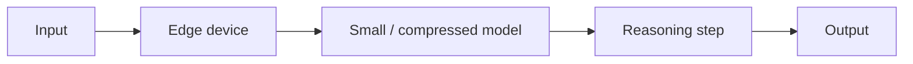

# Razonamiento en el edge

## Definición

El razonamiento en el edge ejecuta **razonamiento o inferencia ligera** en dispositivos edge—teléfonos, gateways IoT, cámaras, vehículos—en lugar de en la nube. El objetivo es **baja latencia**, **capacidad offline**, **privacidad** (data stays on device), and **reduced bandwidth** by doing as much work locally as possible.

Combina small or distilled [LLMs](/docs/llms), [model compression](/docs/model-compression) ([quantization](/docs/quantization), [pruning](/docs/pruning)), and hardware-friendly runtimes (TFLite, ONNX Runtime, Core ML). Techniques like **speculative decodificación**, **early exit**, and **mixture-of-experts** (with small experts) can reduce compute per token so [razonamiento patterns](/docs/reasoning-patterns) (por ej. [chain-of-thought](/docs/reasoning-patterns/cot)) remain viable at the edge.

## Cómo funciona

**Edge device** (phone, gateway, embedded system) holds a **small or compressed model** (por ej. distilled [transformer](/docs/transformers), quantized [LLM](/docs/llms)). **Input** (sensor data, text, or a prompt) is fed to the model; **razonamiento** may be a short [chain-of-thought](/docs/reasoning-patterns/cot) or a single forward pass. **Early exit** skips later layers when the model is confident; **speculative decodificación** uses a small draft model locally and optionally verifies with a larger model when online. Output is returned without a round-trip to the cloud (or with optional cloud fallback).

## Casos de uso

Edge razonamiento applies when you need low-latency or offline razonamiento on devices with limited compute and memory.

- Smart assistants and wearables that answer or act without a constant cloud connection
- Vehicles and robotics where latency and offline operation are critical
- Privacy-first apps (health, home) that keep sensitive data on-device
- Cost and bandwidth reduction by moving simple razonamiento from cloud to edge

## Ventajas y desventajas

| Pros | Cons |
|------|------|
| Low latency, no round-trip to cloud | Smaller models; less capable than large cloud LLMs |
| Works offline and in poor connectivity | Hardware constraints (memory, power, thermal) |
| Data stays on device for privacidad | Trade-off between model size and razonamiento quality |
| Lower bandwidth and cloud cost | Requires [quantization](/docs/quantization) and [compression](/docs/model-compression) |

## Documentación externa

- [TensorFlow Lite – On-device inference](https://www.tensorflow.org/lite/guide)
- [ONNX Runtime – Mobile and edge](https://onnxruntime.ai/docs/tutorials/mobile/)
- [Apple – Core ML and MLX](https://developer.apple.com/machine-learning/) — On-device ML on Apple Silicon
- [Google – Edge ML](https://developers.google.com/ml-kit) — ML Kit for mobile and edge

## Ver también

- [Local inference](/docs/local-inference)
- [Model compression](/docs/model-compression)
- [Quantization](/docs/quantization)
- [Reasoning patterns](/docs/reasoning-patterns)
