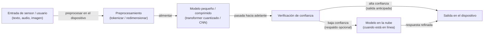
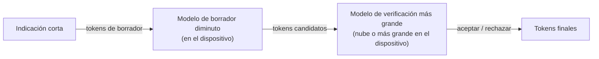

# Razonamiento en el borde

## Definición

El razonamiento en el borde se refiere a realizar inferencia de IA y razonamiento ligero en **dispositivos de borde** — teléfonos inteligentes, gateways IoT, sensores industriales, computadoras en vehículos, cámaras inteligentes y dispositivos wearables — en lugar de enrutar los datos a un servidor en la nube para su procesamiento. El objetivo es lograr un comportamiento inteligente aceptable respetando las restricciones estrictas del hardware de borde: DRAM limitada (típicamente 2–16 GB), cómputo con restricciones de batería, conectividad intermitente o nula, y requisitos de latencia estrictos medidos en milisegundos en lugar de segundos.

La distinción respecto a la [inferencia local](/docs/local-inference) es el alcance y la clase de hardware: la inferencia local típicamente apunta a laptops de desarrolladores, estaciones de trabajo o servidores on-premises con memoria suficiente y GPUs dedicadas. El razonamiento en el borde opera en hardware mucho más restringido — un microcontrolador con 256 KB de RAM, una NPU dentro del SoC de un teléfono (Apple Neural Engine, Qualcomm Hexagon), o un dispositivo ARM de bajo consumo sin GPU discreta. Lograr un razonamiento útil en tal hardware requiere una combinación de [LLMs](/docs/llms) pequeños o destilados, [cuantización](/docs/quantization) y [poda](/docs/pruning) agresivas, runtimes conscientes del hardware (TFLite, ONNX Runtime Mobile, Core ML) y estrategias de razonamiento como salida anticipada y decodificación especulativa.

Las aplicaciones van desde asistentes de voz con capacidad offline y wearables hasta vehículos autónomos que deben responder sin un viaje de ida y vuelta a la nube, monitores de salud con privacidad primero que mantienen los datos biométricos sensibles en el dispositivo, y equipos industriales que necesitan clasificar fallos en el borde de un piso de fábrica sin una red confiable.

## Cómo funciona

### Pipeline de inferencia en el borde



### Estrategias de razonamiento en el borde



### Técnicas clave

**Destilación de modelos** — entrenar un estudiante pequeño para imitar a un maestro grande; ver [destilación de conocimiento](/docs/knowledge-distillation). **Cuantización** — pesos y activaciones INT8 o INT4 reducen la memoria y el cómputo; ver [cuantización](/docs/quantization). **Poda estructurada** — eliminar canales o cabezas para dispersidad eficiente en hardware; ver [poda](/docs/pruning). **Salida anticipada** — adjuntar clasificadores en capas intermedias; salir cuando la confianza es suficiente para evitar ejecutar todas las capas. **Decodificación especulativa** — el modelo de borrador pequeño en el dispositivo genera tokens que un modelo más grande verifica, amortizando el costo de verificación.

## Cuándo usar / Cuándo NO usar

| Escenario | Usar razonamiento en el borde | NO usar razonamiento en el borde |
|----------|-------------------|-----------------------------|
| Entornos offline o con conectividad poco confiable | Sí — sin dependencia de la nube | |
| Latencia ultra baja (respuesta inferior a 100 ms) | Sí — sin viaje de ida y vuelta a la red | |
| Datos sensibles a la privacidad que deben permanecer en el dispositivo | Sí — los datos nunca se transmiten | |
| Despliegues con ancho de banda limitado (IoT, sensores remotos) | Sí — procesar localmente, enviar solo resultados | |
| Se necesita calidad del modelo frontera para razonamiento complejo | | Los LLMs en la nube son mucho más capaces |
| El modelo requiere más memoria que la DRAM del dispositivo | | Se necesita inferencia local en un servidor GPU |
| Se necesitan actualizaciones frecuentes del modelo | | Los modelos en la nube pueden actualizarse sin actualizaciones en el dispositivo |

## Ventajas y desventajas

| Ventajas | Desventajas |
|------|------|
| Baja latencia — sin viaje de ida y vuelta a la nube | Modelos más pequeños; menos capaces que los LLMs grandes en la nube |
| Funciona offline y con mala conectividad | Restricciones de hardware (memoria, energía, presupuesto térmico) |
| Los datos permanecen en el dispositivo para privacidad fuerte | Compensación entre tamaño del modelo y calidad del razonamiento |
| Menor ancho de banda y costo de la nube | Requiere esfuerzo significativo de [cuantización](/docs/quantization) y [compresión](/docs/model-compression) |

## Ejemplos de código

```python
# Cargar un modelo cuantizado con TensorFlow Lite para inferencia en el dispositivo
import numpy as np
import tensorflow as tf

# Cargar el modelo .tflite (por ejemplo, MobileNetV3 o un transformer destilado)
interpreter = tf.lite.Interpreter(model_path="model_int8.tflite")
interpreter.allocate_tensors()

input_details = interpreter.get_input_details()
output_details = interpreter.get_output_details()

# Preparar la entrada (por ejemplo, una lectura de sensor preprocesada o texto tokenizado)
input_data = np.array([[0.1, 0.5, 0.3, 0.8]], dtype=np.float32)
interpreter.set_tensor(input_details[0]["index"], input_data)

# Ejecutar la inferencia
interpreter.invoke()
output = interpreter.get_tensor(output_details[0]["index"])
predicted_class = np.argmax(output)
print(f"Clase predicha: {predicted_class}")
```

## Consejos para un uso efectivo

- Perfile la memoria y la latencia en el dispositivo objetivo real con anticipación — los benchmarks de escritorio rara vez se trasladan al hardware de borde.
- Use runtimes específicos del hardware (Core ML en Apple, SNPE en Qualcomm, TFLite en Android) para el mejor rendimiento.
- Diseñe un respaldo elegante: inténtelo primero en el dispositivo, recurra a la nube si el modelo tiene poca confianza o la tarea es demasiado compleja.
- Prefiera la poda estructurada sobre la no estructurada para modelos de borde — las matrices densas más pequeñas se ejecutan más rápido en las NPUs que las matrices dispersas.
- Evalúe la exactitud en datos representativos de las condiciones de borde (sensores ruidosos, iluminación variada) y no solo en benchmarks de laboratorio.

## Recursos prácticos

- [TensorFlow Lite — Inferencia en el dispositivo](https://www.tensorflow.org/lite/guide) — Conversión de modelos, cuantización y despliegue en móvil/embebido
- [ONNX Runtime — Móvil y borde](https://onnxruntime.ai/docs/tutorials/mobile/) — Inferencia en el dispositivo multiplataforma
- [Apple — Core ML y MLX](https://developer.apple.com/machine-learning/) — ML en el dispositivo en Apple Silicon (iPhone, iPad, Mac)
- [Google — ML Kit](https://developers.google.com/ml-kit) — APIs de ML listas para usar en Android e iOS
- [Qualcomm — AI Hub](https://aihub.qualcomm.com/) — Modelos optimizados para NPU Snapdragon

## Ver también

- [Inferencia local](/docs/local-inference)
- [Compresión de modelos](/docs/model-compression)
- [Cuantización](/docs/quantization)
- [Poda](/docs/pruning)
- [Destilación de conocimiento](/docs/knowledge-distillation)
- [Patrones de razonamiento](/docs/reasoning-patterns)
