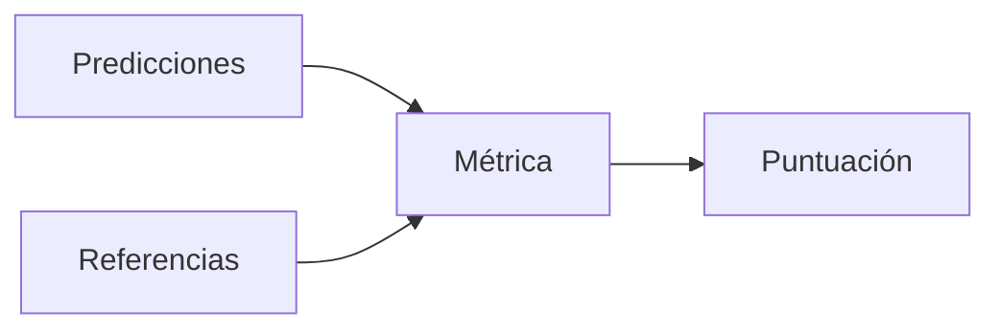

# Métricas de evaluación

## Definición

Las métricas de evaluación cuantifican qué tan bien funcionan los modelos: exactitud, F1, BLEU, ROUGE, perplejidad, preferencia humana, etc. La elección depende de la tarea (clasificación, generación, recuperación) y los objetivos (equidad, robustez).

Se usan en [benchmarks](/docs/benchmarks), desarrollo y producción (pruebas A/B, monitorización). Ninguna métrica captura todo; combine métricas automatizadas con evaluación humana para [LLMs](/docs/llms) y tareas subjetivas. Ver [sesgo en la IA](/docs/bias-in-ai) para métricas relacionadas con la equidad.

## Cómo funciona

Las **predicciones** (salidas del modelo) y las **referencias** (verdad de base o respuestas humanas) se alimentan en una **métrica** que calcula una **puntuación**. Clasificación: exactitud, F1, AUC. Generación: BLEU, ROUGE, BERTScore o métricas aprendidas. Recuperación: recall@k, MRR. Para LLMs, los [benchmarks](/docs/benchmarks) (MMLU, HumanEval) ejecutan indicaciones fijas y agregan métricas; la evaluación humana (preferencia, corrección) a menudo es necesaria para la calidad de extremo abierto. Las métricas deben alinearse con el objetivo del producto y reportarse en divisiones retenidas o estándar.

## Casos de uso

Las métricas de evaluación son necesarias siempre que entrene o publique un modelo: para comparar ejecuciones, hacer seguimiento de la calidad y auditar la equidad o la seguridad.

- Comparar modelos en clasificación (exactitud, F1), generación (BLEU, ROUGE) o recuperación
- Hacer seguimiento del progreso en desarrollo y pruebas A/B
- Auditar equidad, robustez o seguridad

## Recursos prácticos

- [Hugging Face – Evaluate](https://huggingface.co/docs/evaluate/)
- [Papers with Code – Métricas](https://paperswithcode.com/task/image-classification)

## Ver también

- [Benchmarks](/docs/benchmarks)
- [Sesgo en la IA](/docs/bias-in-ai)
