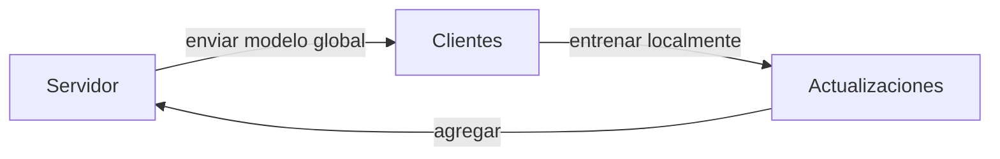

# Aprendizaje federado

## Definición

El aprendizaje federado entrena modelos a través de muchos dispositivos u organizaciones mientras mantiene los datos sin procesar de forma local. Solo se comparten las actualizaciones del modelo (como gradientes), reduciendo el riesgo de privacidad y regulatorio.

Úselo cuando los datos no pueden centralizarse (como hospitales, teléfonos) pero aun así desea un modelo compartido de [aprendizaje automático](/docs/fundamentals/machine-learning). La privacidad mejora en comparación con el envío de datos sin procesar; se pueden añadir técnicas adicionales (privacidad diferencial, agregación segura). Ver [ética de la IA](/docs/ai-ethics) para el contexto de privacidad y gobernanza.

## Cómo funciona

El **servidor** mantiene el modelo global y lo envía a los **clientes** (dispositivos u organizaciones). Cada cliente **entrena localmente** en sus propios datos y envía **actualizaciones** (gradientes o diferencia del modelo) de vuelta. El servidor **agrega** las actualizaciones (como FedAvg: promediar los modelos o gradientes del cliente) y produce un nuevo modelo global, luego transmite de nuevo. Las rondas se repiten hasta la convergencia. Desafíos: **heterogeneidad** (datos no IID, diferente cómputo), **costo de comunicación** (limitar el conteo de rondas o el tamaño de actualización) y **privacidad** (las actualizaciones pueden filtrar información; DP o la agregación segura mitigan esto).

## Casos de uso

El aprendizaje federado es adecuado cuando los datos deben permanecer en dispositivos o silos y aún desea un modelo compartido.

- Entrenamiento en datos sensibles (como atención médica, finanzas) sin centralizarlos
- Dispositivos móviles y de borde (como sugerencias de teclado, ML en el dispositivo)
- Colaboración entre organizaciones bajo restricciones de privacidad

## Recursos prácticos

- [Aprendizaje eficiente en comunicación (McMahan et al.) – FedAvg](https://arxiv.org/abs/1602.05629)
- [TensorFlow Federated](https://www.tensorflow.org/federated)

## Ver también

- [Aprendizaje automático](/docs/fundamentals/machine-learning)
- [Privacidad y ética de la IA](/docs/ai-ethics)
