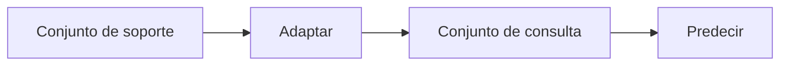

# Aprendizaje con pocos ejemplos

## Definición

El aprendizaje few-shot busca adaptarse rápidamente a partir de un número pequeño de ejemplos etiquetados (como 1–5 por clase). El meta-aprendizaje (como MAML) entrena modelos para ser buenos en la adaptación con pocos ejemplos.

Se sitúa entre el [aprendizaje por transferencia](/docs/transfer-learning) (más datos objetivo) y el [aprendizaje zero-shot](/docs/zero-shot-learning) (sin ejemplos objetivo). Los [LLMs](/docs/llms) hacen few-shot implícitamente mediante ejemplos en el contexto en la indicación; el few-shot clásico usa meta-entrenamiento episódico (como MAML) para que el modelo aprenda a adaptarse a partir de un conjunto de soporte.

## Cómo funciona

Cada tarea tiene un **conjunto de soporte** (pocos ejemplos etiquetados, como 1–5 por clase) y un **conjunto de consulta** (ejemplos para predecir). **Adaptar**: el modelo usa el conjunto de soporte para adaptarse (como calcular prototipos, o tomar algunos pasos de gradiente en MAML). **Predecir**: el modelo adaptado predice etiquetas para el conjunto de consulta. **Entrenamiento episódico**: muestrear muchas tareas few-shot de un conjunto meta-entrenamiento; para cada una, adaptar en el conjunto de soporte de la tarea y optimizar para que las predicciones en el conjunto de consulta mejoren. En el momento de la prueba, el modelo obtiene el conjunto de soporte de una nueva tarea y predice en su conjunto de consulta. Para los LLMs, "adaptar" es simplemente condicionar en los ejemplos de soporte en la indicación (few-shot en contexto).

## Casos de uso

El aprendizaje few-shot aplica cuando solo tiene un puñado de ejemplos por clase o tarea (incluyendo indicaciones LLM en contexto).

- Clasificar clases raras con solo unos pocos ejemplos etiquetados
- Aprendizaje en contexto de LLMs (como 1–5 ejemplos en la indicación)
- Adaptación rápida en robótica o personalización con datos mínimos

## Recursos prácticos

- [Model-Agnostic Meta-Learning (MAML) (Finn et al.)](https://arxiv.org/abs/1703.03400)
- [Hugging Face – Aprendizaje few-shot](https://huggingface.co/docs/transformers/tasks/summarization#few-shot-summarization)

## Ver también

- [Aprendizaje zero-shot](/docs/zero-shot-learning)
- [LLMs](/docs/llms)
- [Aprendizaje por transferencia](/docs/transfer-learning)
