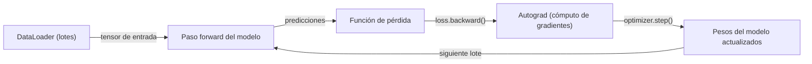
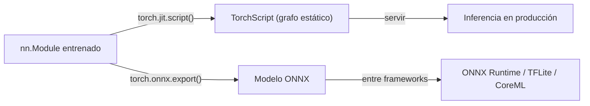

# PyTorch

## Definición

PyTorch es un framework de [aprendizaje profundo](/docs/fundamentals/deep-learning) con Python como lenguaje principal, desarrollado por Meta AI, caracterizado por grafos de cómputo dinámicos y un modelo de programación imperativo. Cada operación se ejecuta inmediatamente (modo eager), y el grafo computacional para la retropropagación se construye sobre la marcha. Esto hace que sea sencillo escribir, ejecutar y depurar código de redes neuronales usando herramientas estándar de Python — sentencias print, depuradores y el REPL de Python funcionan exactamente como se espera.

PyTorch se ha convertido en el framework dominante en investigación y es la base del ecosistema moderno de ML: la biblioteca Transformers de [Hugging Face](/docs/tools/huggingface) usa PyTorch por defecto, la mayoría de los artículos académicos publican implementaciones en PyTorch, y bibliotecas como torchvision, torchaudio, torchtext y PyTorch Geometric lo extienden a los dominios de visión computacional, audio, texto y grafos. El framework admite CPU, GPU, Apple Silicon (backend MPS) y entrenamiento multi-GPU a través de `torch.distributed`, con envolturas de nivel superior como HuggingFace Accelerate y PyTorch Lightning que reducen el código repetitivo para entrenamiento distribuido.

Comparado con [TensorFlow](/docs/frameworks/tensorflow), PyTorch es preferido para investigación y prototipado rápido debido a su experiencia de depuración nativa en Python y su ciclo de iteración más rápido. TensorFlow mantiene una ventaja en la implementación móvil (TFLite), el entrenamiento con TPU y las herramientas de pipeline de producción. Para la implementación, PyTorch proporciona TorchScript (grafo estático para producción), exportación ONNX (interoperabilidad entre frameworks) y PyTorch Mobile. La mayor parte del trabajo de entrenamiento y ajuste fino de [LLM](/docs/llms) ocurre en PyTorch a través del ecosistema de HuggingFace.

## Cómo funciona

### Bucle de entrenamiento



### Pipeline de implementación



### Abstracciones clave

**`nn.Module`** — clase base para todos los modelos; define `__init__` (capas) y `forward` (cómputo). **`autograd`** — diferenciación automática; `loss.backward()` calcula gradientes para todos los parámetros. **`DataLoader`** — agrupación en lotes, mezcla y carga de datos multiproceso. **`torch.optim`** — optimizadores (Adam, SGD, AdamW). **`torch.distributed`** — entrenamiento distribuido paralelo de datos y de modelo.

## Cuándo usar / Cuándo NO usar

| Escenario | Usar PyTorch | NO usar PyTorch |
|----------|------------|-------------------|
| Investigación y experimentación con nuevas arquitecturas | Sí — modo eager, depuración nativa en Python | |
| Ajuste fino de modelos de HuggingFace | Sí — backend predeterminado para HuggingFace | |
| Cargas de trabajo de entrenamiento e inferencia de LLM | Sí — dominante en el ecosistema de LLM | |
| Implementación móvil o edge (iOS, Android) | | [TensorFlow Lite](/docs/frameworks/tensorflow) es más maduro para esto |
| Entrenamiento en Google TPUs | | [TensorFlow](/docs/frameworks/tensorflow) o JAX tienen mejor soporte para TPU |
| Pipelines de ML en producción con servicio gestionado | | TF Serving + TFX proporcionan una pila más integrada |

## Comparaciones

| Característica | PyTorch | TensorFlow / Keras |
|---------|---------|-------------------|
| Modo de ejecución | Eager (predeterminado) + TorchScript | Eager (predeterminado) + tf.function |
| Experiencia de depuración | Nativa en Python (pdb, print) | tf.function puede ocultar errores |
| Adopción en investigación | Dominante | En disminución |
| Móvil / edge | PyTorch Mobile (experimental) | TFLite (primera clase) |
| Ecosistema HuggingFace | Backend predeterminado | Admitido pero secundario |
| Soporte TPU | Vía PyTorch/XLA | Primera clase |
| API de alto nivel | Lightning, Ignite (terceros) | Keras (integrado) |

## Pros y contras

| Pros | Contras |
|------|------|
| Depuración nativa en Python con ejecución eager | El entrenamiento distribuido requiere más configuración manual |
| Dominante en investigación; la mayoría de los artículos publican código PyTorch | Sin API de entrenamiento de alto nivel integrada (se necesita Lightning o similar) |
| Base del ecosistema HuggingFace | La implementación móvil es menos madura que TFLite |
| Flexible; fácil de implementar capas y funciones de pérdida personalizadas | La serialización de modelos (TorchScript) tiene limitaciones vs SavedModel |

## Ejemplos de código

```python
import torch
import torch.nn as nn
from torch.utils.data import DataLoader, TensorDataset

# Define a simple feedforward network
class MLP(nn.Module):
    def __init__(self, in_features: int, hidden: int, num_classes: int):
        super().__init__()
        self.net = nn.Sequential(
            nn.Linear(in_features, hidden),
            nn.ReLU(),
            nn.Linear(hidden, num_classes),
        )

    def forward(self, x: torch.Tensor) -> torch.Tensor:
        return self.net(x)

model = MLP(in_features=784, hidden=256, num_classes=10)
optimizer = torch.optim.AdamW(model.parameters(), lr=1e-3)
loss_fn = nn.CrossEntropyLoss()

# Explicit training loop
for epoch in range(5):
    for x_batch, y_batch in train_loader:
        optimizer.zero_grad()
        logits = model(x_batch)
        loss = loss_fn(logits, y_batch)
        loss.backward()          # compute gradients
        optimizer.step()         # update weights

# Export for cross-framework deployment
dummy_input = torch.randn(1, 784)
torch.onnx.export(model, dummy_input, "mlp.onnx")
```

## Recursos prácticos

- [PyTorch — Primeros pasos](https://pytorch.org/get-started/locally/) — Instalación e inicio rápido
- [Tutoriales de PyTorch](https://pytorch.org/tutorials/) — Tutoriales oficiales desde lo básico hasta el entrenamiento distribuido
- [Documentación de PyTorch](https://pytorch.org/docs/stable/) — Referencia completa de la API
- [HuggingFace Accelerate](https://huggingface.co/docs/accelerate) — Envolturas para entrenamiento distribuido y de precisión mixta
- [PyTorch Lightning](https://lightning.ai/docs/pytorch/stable/) — Framework de entrenamiento de alto nivel construido sobre PyTorch

## Ver también

- [TensorFlow](/docs/frameworks/tensorflow)
- [Hugging Face](/docs/tools/huggingface)
- [Aprendizaje profundo](/docs/fundamentals/deep-learning)
