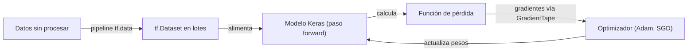
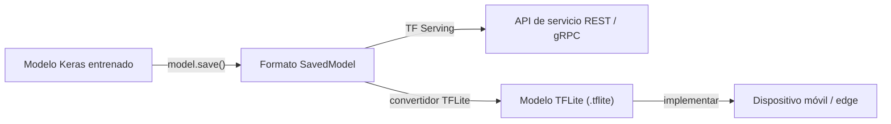

# TensorFlow

## Definición

TensorFlow es el framework de [aprendizaje profundo](/docs/fundamentals/deep-learning) de código abierto de Google, diseñado con un fuerte énfasis en la implementación en producción. Lanzado originalmente en 2015, ha madurado hasta convertirse en una plataforma de extremo a extremo que cubre pipelines de datos (`tf.data`), construcción de modelos (Keras), entrenamiento distribuido (`tf.distribute`) y servicio (TensorFlow Serving, Vertex AI). La API de Keras de alto nivel es la interfaz principal para la mayoría de los profesionales, proporcionando patrones de construcción de modelos secuenciales y funcionales que reducen el código repetitivo.

TensorFlow admite una amplia gama de objetivos de hardware: CPUs, GPUs de NVIDIA, TPUs de Google y dispositivos móviles/edge a través de TensorFlow Lite. Esta amplitud de hardware, combinada con SavedModel — un formato de serialización de modelos estandarizado — hace que TensorFlow sea el framework de elección cuando el objetivo de implementación abarca nube, infraestructura de servicio local e inferencia en dispositivo (iOS, Android, microcontroladores) dentro del mismo proyecto.

Comparado con [PyTorch](/docs/frameworks/pytorch), TensorFlow ha sido históricamente más sólido en pipelines de producción, entrenamiento con TPU e implementación móvil, mientras que PyTorch ha sido preferido en investigación por su experiencia de depuración imperativa. Desde que TensorFlow 2.x introdujo la ejecución eager como predeterminada, la experiencia de desarrollo diaria ha convergido, pero las diferencias del ecosistema permanecen: TF Serving, TFLite y TensorFlow Extended (TFX) son componentes de nivel de producción sin equivalente directo en PyTorch.

## Cómo funciona

### Pipeline de entrenamiento



### Pipeline de implementación



### Componentes clave

**Keras** — API de alto nivel para definir capas, modelos y bucles de entrenamiento. **`tf.data`** — carga de datos eficiente, mezcla, agrupación en lotes y aumento. **`tf.distribute`** — estrategias de entrenamiento distribuido multi-GPU y multi-host. **SavedModel** — formato de serialización portátil para inferencia y servicio. **TensorFlow Lite** — modelos cuantizados para dispositivos móviles y edge. **TensorFlow Hub** — modelos preentrenados para [aprendizaje por transferencia](/docs/transfer-learning).

## Cuándo usar / Cuándo NO usar

| Escenario | Usar TensorFlow | NO usar TensorFlow |
|----------|---------------|----------------------|
| Pipelines de ML en producción con TF Serving | Sí — integración nativa | |
| Implementación móvil y edge vía TFLite | Sí — mejor soporte edge de su clase | |
| Entrenamiento en Google TPUs | Sí — el soporte TPU es de primera clase | |
| Iteración rápida de investigación y arquitecturas personalizadas | | [PyTorch](/docs/frameworks/pytorch) tiene una experiencia de depuración más natural |
| Cargar modelos Transformers de HuggingFace | | La mayoría de los modelos de HuggingFace usan PyTorch por defecto; algunos admiten TF |
| Investigación de RL y entornos | | PyTorch es más prevalente en investigación de RL |

## Comparaciones

| Característica | TensorFlow / Keras | PyTorch |
|---------|-------------------|---------|
| Caso de uso principal | Pipelines de producción, móvil, TPU | Investigación, prototipado rápido |
| API de alto nivel | Keras (integrada) | Lightning, Ignite (terceros) |
| Modo de ejecución | Eager (predeterminado) + grafo (tf.function) | Eager (predeterminado) + TorchScript |
| Móvil / edge | TFLite (primera clase) | PyTorch Mobile (experimental) |
| Soporte TPU | Primera clase | Vía XLA / PyTorch/XLA |
| Ecosistema | TFX, TF Serving, TF Hub | HuggingFace, torchvision, ONNX |
| Adopción en investigación | En disminución | Dominante |

## Pros y contras

| Pros | Contras |
|------|------|
| Ecosistema de producción maduro (TF Serving, TFX, TFLite) | El modo grafo y `tf.function` agregan complejidad de depuración |
| Soporte de primera clase para TPU e implementación móvil | Curva de aprendizaje más pronunciada para código de investigación personalizado |
| SavedModel es un formato portátil con versiones | El ecosistema HuggingFace usa PyTorch por defecto |
| Keras proporciona una API de alto nivel limpia | Algunas APIs todavía están en flujo entre versiones de TF |

## Ejemplos de código

```python
import tensorflow as tf
from tensorflow import keras

# Build a simple image classifier with Keras functional API
inputs = keras.Input(shape=(28, 28, 1))
x = keras.layers.Conv2D(32, 3, activation="relu")(inputs)
x = keras.layers.GlobalAveragePooling2D()(x)
outputs = keras.layers.Dense(10, activation="softmax")(x)
model = keras.Model(inputs, outputs)

model.compile(
    optimizer="adam",
    loss="sparse_categorical_crossentropy",
    metrics=["accuracy"],
)

# Load and batch data with tf.data
(x_train, y_train), (x_test, y_test) = keras.datasets.mnist.load_data()
x_train = x_train[..., tf.newaxis] / 255.0

dataset = tf.data.Dataset.from_tensor_slices((x_train, y_train))
dataset = dataset.shuffle(10000).batch(64).prefetch(tf.data.AUTOTUNE)

model.fit(dataset, epochs=5)

# Export for serving
model.save("mnist_model")  # SavedModel format
```

## Recursos prácticos

- [TensorFlow — Primeros pasos](https://www.tensorflow.org/tutorials) — Tutoriales oficiales que cubren Keras y tf.data
- [Documentación de Keras](https://keras.io/) — Referencia completa de la API de Keras y guías
- [TensorFlow Lite — Guía de inferencia](https://www.tensorflow.org/lite/guide) — Implementación móvil y edge
- [TensorFlow Hub](https://tfhub.dev/) — Modelos preentrenados para aprendizaje por transferencia
- [TensorFlow Extended (TFX)](https://www.tensorflow.org/tfx) — Pipelines de ML en producción

## Ver también

- [PyTorch](/docs/frameworks/pytorch)
- [Aprendizaje profundo](/docs/fundamentals/deep-learning)
- [Infraestructura](/docs/infrastructure)
