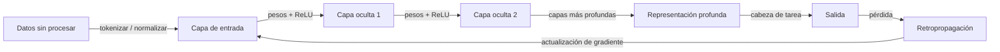

# Aprendizaje profundo

## Definición

El aprendizaje profundo usa redes neuronales con muchas capas para aprender representaciones jerárquicas a partir de datos. Ha impulsado el progreso en visión, lenguaje y otros dominios al escalar datos y cómputo.

Extiende el [aprendizaje automático](/docs/fundamentals/machine-learning) usando modelos diferenciables y en capas (ver [redes neuronales](/docs/neural-networks)) que aprenden características automáticamente en lugar de las elaboradas a mano. La profundidad permite al modelo construir representaciones progresivamente más abstractas (p. ej. bordes -> texturas -> partes -> objetos en visión).

La característica definitoria del aprendizaje profundo es el **aprendizaje de extremo a extremo**: las entradas en bruto (píxeles, tokens, muestras de audio) se transforman a través de capas no lineales sucesivas, y todo el pipeline se optimiza conjuntamente mediante descenso de gradiente. Esto elimina la necesidad de ingeniería de características específica del dominio en la que confía el ML tradicional. La compensación es que los modelos profundos necesitan sustancialmente más datos y cómputo — GPUs, TPUs y mucha memoria — y son más difíciles de interpretar que los modelos clásicos.

## Cómo funciona



### Paso forward

Los **datos** se introducen en la capa de entrada. Cada capa aplica una transformación lineal (multiplicación de matrices + sesgo) seguida de una no-linealidad (p. ej. ReLU). Apilar capas produce **representaciones** progresivamente más abstractas. La capa final mapea a la salida de la tarea (puntuaciones de clase, valor de regresión o logits de token).

### Paso backward y optimización

La **pérdida** (p. ej. entropía cruzada para clasificación) se calcula entre predicciones y objetivos. La **retropropagación** usa la regla de la cadena para calcular gradientes de la pérdida con respecto a cada peso en la red. Luego un optimizador (SGD, Adam) actualiza los pesos en la dirección que reduce la pérdida.

### Arquitecturas

La elección de arquitectura adapta la conectividad al tipo de datos: las [CNNs](/docs/neural-networks/cnn) explotan la localidad espacial para imágenes; las [RNNs](/docs/neural-networks/rnn) manejan secuencias de longitud variable; los [Transformers](/docs/transformers) usan auto-atención global y ahora dominan tanto tareas de visión como de lenguaje a escala.

## Cuándo usar / Cuándo NO usar

| Escenario | ¿Usar aprendizaje profundo? | Notas |
|---|---|---|
| Reconocimiento de imágenes o video a gran escala | Sí | Las CNNs son la columna vertebral estándar |
| Comprensión o generación de texto | Sí | Los Transformers establecen el estado del arte en NLP |
| Conjunto de datos estructurado/tabular pequeño | No | El gradient boosting típicamente supera al AP |
| Se necesita interpretabilidad completa del modelo | No | Los modelos profundos son en gran medida cajas negras |
| Cómputo limitado / implementación edge | Con precaución | Usar cuantización o modelos destilados |
| Reconocimiento de voz y audio | Sí | Los modelos profundos superan al procesamiento clásico de señales |

## Comparaciones

| Aspecto | ML Clásico | Aprendizaje Profundo |
|---|---|---|
| Ingeniería de características | Manual | Automática (de extremo a extremo) |
| Requisitos de datos | Bajo a medio | Alto |
| Requisitos de cómputo | Bajo | Alto (GPU/TPU) |
| Interpretabilidad | Alta (p. ej. árboles) | Baja |
| Rendimiento en datos no estructurados | Moderado | Muy alto |

## Pros y contras

| Pros | Contras |
|---|---|
| Aprendizaje automático de características | Necesita muchos datos |
| Estado del arte en visión y lenguaje | Requiere GPU/TPU |
| Optimización de extremo a extremo | Difícil de interpretar |
| El aprendizaje por transferencia reduce las necesidades de datos | Tiempos de entrenamiento largos |

## Ejemplos de código

```python
# Feedforward network with PyTorch for image classification (MNIST)
import torch
import torch.nn as nn
import torch.optim as optim
from torchvision import datasets, transforms
from torch.utils.data import DataLoader

# Data loaders
transform = transforms.Compose([
    transforms.ToTensor(),
    transforms.Normalize((0.5,), (0.5,))
])
train_loader = DataLoader(
    datasets.MNIST('.', train=True, download=True, transform=transform),
    batch_size=64, shuffle=True
)
test_loader = DataLoader(
    datasets.MNIST('.', train=False, download=True, transform=transform),
    batch_size=1000
)

# Model definition
class MLP(nn.Module):
    def __init__(self):
        super().__init__()
        self.net = nn.Sequential(
            nn.Flatten(),
            nn.Linear(28 * 28, 256), nn.ReLU(),
            nn.Linear(256, 128),     nn.ReLU(),
            nn.Linear(128, 10),
        )

    def forward(self, x):
        return self.net(x)

device  = "cuda" if torch.cuda.is_available() else "cpu"
model   = MLP().to(device)
opt     = optim.Adam(model.parameters(), lr=1e-3)
loss_fn = nn.CrossEntropyLoss()

# Training
for epoch in range(3):
    model.train()
    for X, y in train_loader:
        X, y = X.to(device), y.to(device)
        opt.zero_grad()
        loss_fn(model(X), y).backward()
        opt.step()

# Evaluation
model.train(False)
correct = sum(
    (model(X.to(device)).argmax(1) == y.to(device)).sum().item()
    for X, y in test_loader
)
print(f"Test accuracy: {correct / len(test_loader.dataset):.2%}")
```

## Recursos prácticos

- [Aprendizaje Profundo (Goodfellow et al.)](https://www.deeplearningbook.org/) — Libro de texto en línea gratuito que cubre la teoría en profundidad
- [PyTorch – Introducción](https://pytorch.org/tutorials/beginner/deep_learning_60min_blitz.html) — Tutorial práctico de aprendizaje profundo de 60 minutos
- [fast.ai – Aprendizaje Profundo Práctico](https://course.fast.ai/) — Curso de arriba hacia abajo con proyectos del mundo real y código

## Ver también

- [Redes neuronales](/docs/neural-networks)
- [Transformers](/docs/transformers)
- [Frameworks (PyTorch, TensorFlow)](/docs/frameworks/pytorch)
