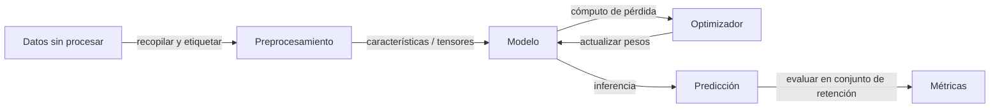

# Fundamentos de IA

## Definición

Los fundamentos de IA cubren las ideas centrales detrás de la inteligencia artificial: qué entendemos por aprendizaje, representación y generalización. Esto incluye el aprendizaje supervisado y no supervisado, la optimización y la relación entre datos, modelos y objetivos.

Estas ideas sustentan tanto el [aprendizaje automático](/docs/fundamentals/machine-learning) clásico como el [aprendizaje profundo](/docs/fundamentals/deep-learning). Comprenderlas te ayuda a elegir el paradigma correcto, interpretar resultados y razonar sobre límites (p. ej. requisitos de datos, sesgo, robustez).

En el corazón de la IA hay un bucle simple: recopilas datos que codifican algún aspecto del mundo, defines un objetivo que formaliza qué significa "bueno", y ejecutas un optimizador que ajusta un modelo hasta que cumple el objetivo en ejemplos retenidos. Todo lo demás — arquitecturas neuronales, técnicas de regularización, algoritmos de alineación — es un refinamiento de este bucle central. Desarrollar intuición sobre cada componente te ayuda a diagnosticar fallos rápidamente y tomar decisiones de diseño con principios al construir sistemas reales.

## Cómo funciona



### Recopilación de datos y preprocesamiento

Los **datos** se recopilan o etiquetan; deben ser representativos de la distribución del mundo real que el modelo encontrará. El preprocesamiento transforma las entradas en bruto (imágenes, texto, filas tabulares) en características o tensores que el modelo puede consumir.

### Selección y entrenamiento del modelo

Se elige un **modelo** (p. ej. una función lineal, árbol de decisión o red neuronal) según el tipo de datos y la tarea. Un objetivo (pérdida para supervisado/no supervisado, recompensa para RL) se optimiza con un algoritmo como el descenso de gradiente. El **optimizador** actualiza los parámetros del modelo para minimizar la pérdida en los datos de entrenamiento.

### Evaluación y generalización

El resultado es un modelo ajustado que debe generalizarse a nuevas entradas. La evaluación usa divisiones de entrenamiento/validación/prueba. Si el modelo funciona bien en los datos de entrenamiento pero mal en el conjunto de prueba, está sobreajustando. Técnicas como la validación cruzada, la regularización y la parada temprana abordan esto. Los fundamentos matemáticos — probabilidad, álgebra lineal, cálculo — unen cada paso.

## Cuándo usar / Cuándo NO usar

| Escenario | ¿Usar IA/ML? | Notas |
|---|---|---|
| Reconocimiento de patrones complejos a partir de grandes datos | Sí | El ML destaca cuando las reglas son difíciles de codificar a mano |
| Lógica determinista bien definida (p. ej. cálculos de impuestos) | No | El código determinista es más simple y auditable |
| Los datos etiquetados están disponibles y son abundantes | Sí | El aprendizaje supervisado funciona mejor aquí |
| Los datos son muy escasos (\< unos pocos cientos de ejemplos) | Con precaución | El aprendizaje de pocos ejemplos o por transferencia puede aplicarse |
| Decisiones en tiempo real que requieren garantías estrictas | No | Los modelos de ML son probabilísticos; usar con alternativas |
| Exploración o recomendación con retroalimentación del usuario | Sí | El RL y el filtrado colaborativo brillan aquí |

## Comparaciones

| Concepto | Descripción | Datos típicos | Requiere etiquetas |
|---|---|---|---|
| Aprendizaje supervisado | Aprender de ejemplos etiquetados | Estructurado, imágenes, texto | Sí |
| Aprendizaje no supervisado | Encontrar estructura sin etiquetas | Cualquiera | No |
| Aprendizaje por refuerzo | Aprender de señales de recompensa | Secuencial/interactivo | No (usa recompensas) |
| Sistemas de reglas clásicas | Lógica codificada a mano | Cualquiera | No |

## Ejemplos de código

```python
# Minimal supervised learning pipeline with scikit-learn
from sklearn.datasets import load_iris
from sklearn.model_selection import train_test_split
from sklearn.preprocessing import StandardScaler
from sklearn.linear_model import LogisticRegression
from sklearn.metrics import accuracy_score

# 1. Load data
X, y = load_iris(return_X_y=True)

# 2. Split into train / test
X_train, X_test, y_train, y_test = train_test_split(
    X, y, test_size=0.2, random_state=42
)

# 3. Preprocess
scaler = StandardScaler()
X_train = scaler.fit_transform(X_train)
X_test = scaler.transform(X_test)

# 4. Train model
model = LogisticRegression(max_iter=200)
model.fit(X_train, y_train)

# 5. Evaluate
preds = model.predict(X_test)
print(f"Accuracy: {accuracy_score(y_test, preds):.2%}")
```

## Recursos prácticos

- [Curso intensivo de ML de Google](https://developers.google.com/machine-learning/crash-course) — Introducción completa a los conceptos de ML con ejercicios interactivos
- [MIT 6.S191 – Introducción al Aprendizaje Profundo](http://introtodeeplearning.com/) — Diapositivas de conferencias, videos y laboratorios que cubren la pila completa de aprendizaje profundo
- [fast.ai – Aprendizaje Profundo Práctico para Programadores](https://course.fast.ai/) — Introducción de arriba hacia abajo, centrada en código, ideal para profesionales

## Ver también

- [Aprendizaje automático](/docs/fundamentals/machine-learning)
- [Aprendizaje profundo](/docs/fundamentals/deep-learning)
- [Redes neuronales](/docs/neural-networks)
