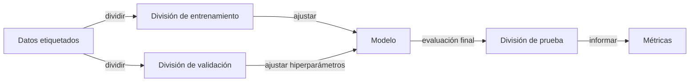

# Aprendizaje automático

## Definición

El aprendizaje automático (ML) es el estudio de algoritmos que mejoran con la experiencia (datos). Los paradigmas clave incluyen el **aprendizaje supervisado** (aprender de ejemplos etiquetados), el **aprendizaje no supervisado** (encontrar estructura sin etiquetas) y el **aprendizaje por refuerzo** (aprender de recompensas).

El ML se prefiere sobre las reglas codificadas a mano cuando el problema es demasiado complejo para especificarlo explícitamente o cuando los datos son abundantes. Se sitúa entre la IA clásica (reglas simbólicas) y el [aprendizaje profundo](/docs/fundamentals/deep-learning) (redes neuronales grandes); muchos sistemas del mundo real combinan modelos de ML con pipelines y lógica de negocio.

El poder del ML proviene de su capacidad para generalizar: un modelo entrenado en un subconjunto de ejemplos puede hacer predicciones precisas sobre datos nuevos no vistos. Esta generalización solo es posible cuando la distribución de entrenamiento es representativa del mundo real, el modelo está adecuadamente regularizado para evitar memorizar el ruido, y la evaluación se realiza rigurosamente en datos retenidos. Comprender el equilibrio entre sesgo y varianza, la validación cruzada y la ingeniería de características adecuada son por lo tanto tan importantes como la elección del algoritmo.

## Cómo funciona



### Entrenamiento

Eliges una representación (p. ej. modelo lineal, árbol o red neuronal) y un objetivo (pérdida para supervisado/no supervisado, recompensa para RL). Un optimizador (p. ej. descenso de gradiente, o un algoritmo de ajuste de árbol) actualiza los parámetros del modelo para minimizar la pérdida en los datos de entrenamiento.

### Validación y ajuste de hiperparámetros

Después del entrenamiento inicial, el rendimiento se mide en el conjunto de **validación**. Los hiperparámetros (tasa de aprendizaje, profundidad del árbol, fuerza de regularización) se ajustan según los resultados de validación. La validación cruzada proporciona estimaciones más confiables cuando los datos son limitados.

### Evaluación de prueba

La **división de prueba** se toca solo una vez, al final, para dar una estimación no sesgada de la generalización. Las métricas como exactitud, F1, AUC o RMSE se informan según el tipo de tarea. El **modelo** entrenado se implementa para inferencia en nuevas entradas.

## Cuándo usar / Cuándo NO usar

| Escenario | ¿Usar ML? | Notas |
|---|---|---|
| Datos estructurados/tabulares con objetivo claro | Sí | Los árboles de decisión, gradient boosting, modelos lineales destacan aquí |
| Datos no estructurados complejos (imágenes, texto sin procesar) | Usar aprendizaje profundo | El ML clásico necesita características elaboradas a mano |
| Conjunto de datos muy pequeño (\< 100 ejemplos) | Con precaución | Preferir modelos simples y validación cruzada |
| Se necesita interpretabilidad del modelo (p. ej. regulaciones) | Sí | Los modelos lineales y los árboles de decisión son auditables |
| Las reglas pueden ser especificadas completamente por expertos del dominio | No | Los sistemas basados en reglas son más predecibles |
| Tarea interactiva basada en recompensas (juegos, control) | Usar RL | El ML supervisado requiere pares etiquetados |

## Comparaciones

| Paradigma | Etiquetas requeridas | Tipo de datos | Algoritmos típicos | Ejemplo de tarea |
|---|---|---|---|---|
| Aprendizaje supervisado | Sí | Cualquiera | Regresión logística, SVM, XGBoost, red neuronal | Detección de spam, clasificación de imágenes |
| Aprendizaje no supervisado | No | Cualquiera | K-means, DBSCAN, PCA, autoencoders | Segmentación de clientes, detección de anomalías |
| Aprendizaje por refuerzo | No (usa recompensas) | Secuencial/interactivo | Q-learning, PPO, SAC | Jugar juegos, control robótico |

## Pros y contras

| Pros | Contras |
|---|---|
| Generaliza a partir de ejemplos sin reglas explícitas | Requiere datos etiquetados de calidad |
| Escala bien con más datos | Frágil fuera de la distribución de entrenamiento |
| Gran biblioteca de algoritmos interpretables (sklearn) | La ingeniería de características sigue siendo frecuentemente necesaria |
| Inferencia eficiente una vez entrenado | Puede codificar sesgos presentes en los datos |

## Ejemplos de código

```python
# Supervised learning with scikit-learn: gradient boosting on tabular data
from sklearn.datasets import load_breast_cancer
from sklearn.model_selection import train_test_split, cross_val_score
from sklearn.ensemble import GradientBoostingClassifier
from sklearn.preprocessing import StandardScaler
from sklearn.metrics import classification_report
import numpy as np

# Load dataset
X, y = load_breast_cancer(return_X_y=True)
X_train, X_test, y_train, y_test = train_test_split(
    X, y, test_size=0.2, random_state=42, stratify=y
)

# Scale features
scaler = StandardScaler()
X_train_sc = scaler.fit_transform(X_train)
X_test_sc = scaler.transform(X_test)

# Train gradient boosting classifier
clf = GradientBoostingClassifier(n_estimators=100, learning_rate=0.1, max_depth=3)
clf.fit(X_train_sc, y_train)

# Cross-validation estimate
cv_scores = cross_val_score(clf, X_train_sc, y_train, cv=5)
print(f"CV accuracy: {np.mean(cv_scores):.2%} ± {np.std(cv_scores):.2%}")

# Final evaluation on held-out test set
print(classification_report(y_test, clf.predict(X_test_sc)))
```

## Recursos prácticos

- [Curso intensivo de ML de Google](https://developers.google.com/machine-learning/crash-course) — Introducción interactiva a los conceptos de ML con codelabs
- [Scikit-learn – Guía del usuario](https://scikit-learn.org/stable/user_guide.html) — Guía completa de ML clásico en la práctica
- [Aprendizaje Automático Práctico (Géron)](https://www.oreilly.com/library/view/hands-on-machine-learning/9781098125967/) — Libro práctico que cubre tanto ML clásico como aprendizaje profundo

## Ver también

- [Aprendizaje profundo](/docs/fundamentals/deep-learning)
- [Aprendizaje por refuerzo](/docs/rl)
- [Métricas de evaluación](/docs/evaluation-metrics)
