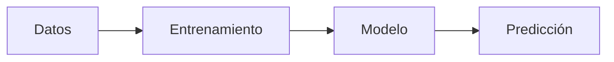

# Aprendizaje automático

## Definición

El aprendizaje automático (ML) es el estudio de algoritmos que mejoran con la experiencia (datos). Los paradigmas principales incluyen **aprendizaje supervisado** (aprender de ejemplos etiquetados), **aprendizaje no supervisado** (encontrar estructura sin etiquetas) y **aprendizaje por refuerzo** (aprender de recompensas).

Se prefiere ML sobre reglas codificadas manualmente cuando el problema es demasiado complejo para especificarlo explícitamente o cuando los datos son abundantes. Se sitúa entre la IA clásica (reglas simbólicas) y el [aprendizaje profundo](/docs/fundamentals/deep-learning) (grandes redes neuronales); muchos sistemas reales combinan modelos ML con pipelines y lógica de negocio.

## Cómo funciona

**Entrenamiento:** Se elige una representación (p. ej., modelo lineal, árbol o red neuronal) y un objetivo (pérdida para supervisado/no supervisado, recompensa para RL). Un optimizador (p. ej., descenso de gradiente) actualiza los parámetros del modelo para minimizar la pérdida o maximizar la recompensa en los datos de entrenamiento. **Modelo:** El resultado es un modelo ajustado (pesos, estructura) que captura patrones en los datos. **Predicción:** En tiempo de inferencia, se alimentan nuevas entradas al modelo para obtener salidas (etiquetas, puntuaciones o acciones). La evaluación usa splits de entrenamiento/validación/prueba para estimar la generalización y evitar el sobreajuste.

## Casos de uso

El ML clásico destaca con datos estructurados o tabulares y etiquetas u objetivos claros.

- Clasificación de spam, detección de fraude y otras tareas de clasificación supervisada
- Sistemas de recomendación y filtrado colaborativo
- Pronósticos y predicción de series temporales

## Documentación externa

- [Curso acelerado de ML de Google](https://developers.google.com/machine-learning/crash-course)
- [Scikit-learn – Guía del usuario](https://scikit-learn.org/stable/user_guide.html) — ML clásico en la práctica

## Ver también

- [Aprendizaje profundo](/docs/fundamentals/deep-learning)
- [Aprendizaje por refuerzo](/docs/rl)
- [Métricas de evaluación](/docs/evaluation-metrics)
