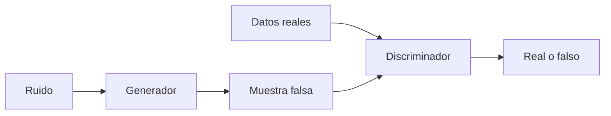

# Redes generativas adversarias (GANs)

## Definición

Las GANs entrenan un generador y un discriminador en un juego: el generador produce muestras; el discriminador intenta distinguirlas de datos reales. El entrenamiento empuja al generador hacia salidas realistas.

Fueron el enfoque generativo dominante antes de los [modelos de difusión](/docs/diffusion-models). En comparación con los [VAEs](/docs/vaes), las GANs a menudo producen imágenes más nítidas pero el entrenamiento puede ser inestable (colapso de modo, equilibrio discriminador/generador). Todavía se usan para transferencia de estilo, aumento de datos y algunas ediciones de imágenes.

## Cómo funciona

**Generador:** Toma **ruido** (vector aleatorio) y produce una **muestra falsa** (como una imagen). **Discriminador:** Recibe **datos reales** y **muestra falsa**, produce **real o falso** (o una puntuación). El entrenamiento es un **juego min-max**: el generador intenta maximizar la pérdida del discriminador (engañarlo), el discriminador intenta minimizarla (distinguir lo real de lo falso). En la práctica se alternan pasos de gradiente. Las variantes (DCGAN, StyleGAN, etc.) usan mejores arquitecturas y trucos de entrenamiento (como norma espectral, crecimiento progresivo) para la estabilidad y la calidad.

## Casos de uso

Las GANs se usan para tareas generativas y discriminativas cuando se desea entrenamiento adversarial y muestras nítidas (imágenes, audio, aumento de datos).

- Generación y edición de imágenes (como StyleGAN, síntesis de rostros)
- Aumento de datos y datos sintéticos para entrenamiento
- Adaptación de dominio y transferencia de estilo

## Recursos prácticos

- [Generative Adversarial Networks (Goodfellow et al.)](https://arxiv.org/abs/1406.2661)
- [PyTorch – Tutorial DCGAN](https://pytorch.org/tutorials/beginner/dcgan_faces_tutorial.html)

## Ver también

- [Modelos de difusión](/docs/diffusion-models)
- [VAEs](/docs/vaes)
