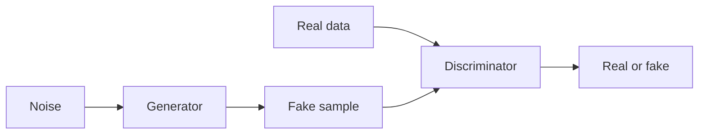

# Redes generativas adversarias (GANs)

## Definición

Las GANs entrenan un generador y un discriminador en un juego: el generador produce muestras; el discriminador intenta distinguirlas de datos reales. Training pushes the generator toward realistic outputs.

They fueron el enfoque generativo dominante antes de [diffusion models](/docs/diffusion-models). En comparación con [VAEs](/docs/vaes), GANs often produce sharper images but training can be unstable (mode collapse, discriminator/generator balance). Still used for style transfer, data augmentation, and some image editing.

## Cómo funciona

**Generator:** Takes **noise** (vector aleatorio) and outputs a **fake sample** (por ej. image). **Discriminator:** Receives **real data** and **fake sample**, outputs **real or fake** (or a score). Training is a **min-max game**: the generator tries to maximize the discriminator’s loss (fool it), the discriminator tries to minimize it (tell real from fake). In practice you alternate gradient steps. Variants (DCGAN, StyleGAN, etc.) use better architectures and training tricks (por ej. spectral norm, progressive growing) for stability and quality.

## Casos de uso

GANs are used for generative and discriminative tasks when you want adversarial training and sharp samples (images, audio, data aug).

- Image generation and editing (por ej. StyleGAN, face synthesis)
- Data augmentation and synthetic data for training
- Domain adaptation and style transfer

## Documentación externa

- [Generative Adversarial Networks (Goodfellow et al.)](https://arxiv.org/abs/1406.2661)
- [PyTorch – DCGAN tutorial](https://pytorch.org/tutorials/beginner/dcgan_faces_tutorial.html)

## Ver también

- [Diffusion models](/docs/diffusion-models)
- [VAEs](/docs/vaes)
