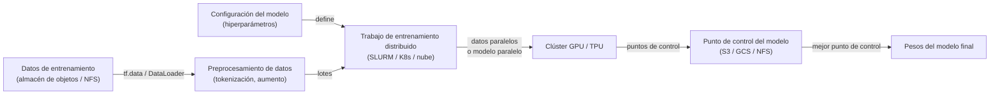
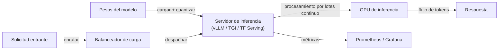

# Infraestructura

## Definición

La infraestructura de IA abarca el hardware, las redes y los sistemas de software necesarios para entrenar y desplegar modelos grandes de aprendizaje automático a escala. En el lado del hardware, esto significa GPUs (NVIDIA H100/A100, serie RTX de consumidor), TPUs (aceleradores de IA personalizados de Google) y chips emergentes específicos de inferencia (AWS Inferentia, Groq LPU). En el lado del software, incluye frameworks de entrenamiento distribuido, programadores de trabajos, pilas de servicio de modelos y herramientas de observabilidad.

La escala de infraestructura necesaria está impulsada principalmente por los [LLMs](/docs/llms) y los grandes modelos de visión. Entrenar un modelo fronterizo puede requerir miles de GPUs funcionando durante semanas, exigiendo una atención cuidadosa a las redes entre nodos (NVLink, InfiniBand), el I/O de almacenamiento (sistemas de archivos paralelos como Lustre, almacenamiento de objetos en la nube con conectores de alto ancho de banda) y la tolerancia a fallos (puntos de control automáticos, manejo de interrupciones). Servir estos modelos entrenados eficientemente requiere diferentes optimizaciones de hardware: la [cuantización](/docs/quantization), la decodificación especulativa y el procesamiento por lotes continuo reducen los costos por token y la latencia.

Los [frameworks](/docs/frameworks/pytorch) como PyTorch, JAX y TensorFlow proporcionan el modelo de programación para expresar cálculos de redes neuronales; la infraestructura proporciona el sustrato. Los proveedores de nube (AWS, GCP, Azure) ofrecen infraestructura de IA administrada (SageMaker, Vertex AI, Azure ML) que maneja el aprovisionamiento de clústeres, la programación de trabajos y el seguimiento de experimentos, mientras que los despliegues on-premises usan orquestadores como SLURM o Kubernetes con plugins de dispositivos GPU.

## Cómo funciona

### Pipeline de entrenamiento



### Pipeline de servicio



### Conceptos clave

**Paralelismo de datos** — replicar el modelo en todos los dispositivos; dividir los datos entre dispositivos; sincronizar los gradientes. **Paralelismo de modelos** — dividir las capas del modelo entre dispositivos; necesario cuando el modelo no cabe en una sola GPU. **Paralelismo de pipeline** — dividir el modelo en etapas entre dispositivos; superponer cómputo y comunicación. **Procesamiento por lotes continuo** — agrupar dinámicamente las solicitudes de inferencia concurrentes para maximizar la utilización de la GPU. **Caché KV** — almacenar en caché los tensores clave/valor de atención entre tokens para evitar el recómputo.

## Cuándo usar / Cuándo NO usar

| Escenario | Invertir en infraestructura dedicada | Usar nube / servicios administrados |
|----------|-----------------------------------|------------------------------|
| Entrenar modelos fronterizos propietarios | Sí — costo y control a escala | |
| Entornos regulados (soberanía de datos) | Sí — on-prem garantiza la residencia de datos | |
| Ajuste fino o inferencia ocasional | | Las instancias spot en la nube o las APIs administradas son más baratas |
| Servir modelos públicos con carga variable | | El servicio de autoescalado en la nube es más fácil de administrar |
| Investigación con necesidades frecuentes de GPU | | Las instancias reservadas en la nube o los clústeres académicos son suficientes |

## Ventajas y desventajas

| Ventajas | Desventajas |
|------|------|
| Control total sobre hardware, datos y seguridad | Alto costo de capital y operativo para clústeres on-prem |
| Costo predecible con alta utilización | Requiere experiencia en sistemas distribuidos y MLOps |
| Menor latencia cuando se coloca junto a los servicios | Riesgo de sobreaprovisionamiento si las cargas de trabajo fluctúan |
| Sin costos de salida ni límites de velocidad de API | Restricciones de suministro de GPU y largos plazos de adquisición |

## Ejemplos de código

```python
# Entrenamiento con PyTorch DistributedDataParallel (DDP) — ejemplo mínimo
import torch
import torch.distributed as dist
import torch.multiprocessing as mp
from torch.nn.parallel import DistributedDataParallel as DDP
from torch.utils.data.distributed import DistributedSampler

def train(rank: int, world_size: int):
    dist.init_process_group("nccl", rank=rank, world_size=world_size)
    torch.cuda.set_device(rank)

    model = MyModel().to(rank)
    model = DDP(model, device_ids=[rank])          # envolver para sincronización distribuida

    sampler = DistributedSampler(dataset, num_replicas=world_size, rank=rank)
    loader = DataLoader(dataset, batch_size=64, sampler=sampler)

    optimizer = torch.optim.AdamW(model.parameters(), lr=1e-4)
    for epoch in range(10):
        sampler.set_epoch(epoch)                   # asegurar diferentes mezclas
        for x, y in loader:
            x, y = x.to(rank), y.to(rank)
            loss = loss_fn(model(x), y)
            loss.backward()
            optimizer.step()
            optimizer.zero_grad()

    dist.destroy_process_group()

if __name__ == "__main__":
    mp.spawn(train, args=(torch.cuda.device_count(),), nprocs=torch.cuda.device_count())
```

## Recursos prácticos

- [PyTorch — Visión general del entrenamiento distribuido](https://pytorch.org/tutorials/beginner/distributed_overview.html) — DDP, FSDP y RPC
- [Google Cloud — Inicio rápido de TPU](https://cloud.google.com/tpu/docs/quick-starts) — Ejecución del entrenamiento en pods TPU
- [Documentación de vLLM](https://docs.vllm.ai/) — Servidor de inferencia LLM de alto rendimiento
- [NVIDIA — Megatron-LM](https://github.com/NVIDIA/Megatron-LM) — Paralelismo de modelos a gran escala para entrenamiento LLM
- [Kubernetes — Programación de GPU](https://kubernetes.io/docs/tasks/manage-gpus/scheduling-gpus/) — Ejecución de cargas de trabajo GPU en K8s

## Ver también

- [Inferencia local](/docs/local-inference)
- [Razonamiento en el borde](/docs/edge-reasoning)
- [Compresión de modelos](/docs/model-compression)
- [Cuantización](/docs/quantization)
- [MLOps](/docs/mlops)
- [Frameworks](/docs/frameworks/pytorch)
