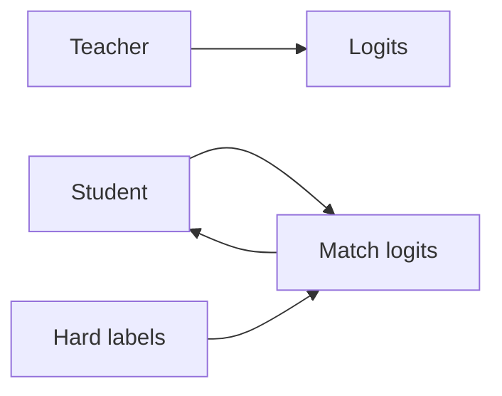

# Destilación de conocimiento

## Definición

La destilación de conocimiento entrena un modelo estudiante más pequeño para igualar las salidas (y a veces representaciones intermedias) de un maestro más grande. El estudiante gains from the teacher’s soft labels and can run with less compute.

Es a [model compression](/docs/model-compression) technique that preserves more of the teacher’s behavior than training the student on hard labels alone. Used for BERT → DistilBERT, large [LLMs](/docs/llms) → smaller variants, and [transfer learning](/docs/transfer-learning) from ensembles.

## Cómo funciona

The **teacher** (modelo grande) produce **logits** (o embeddings) en datos de entrenamiento. The **student** (modelo más pequeño) se entrena para **igualar** the teacher’s logits (por ej. KL divergence with temperature scaling) in addition to or instead of **hard labels** (ground truth). Temperature softens the teacher distribution so the student learns from dark knowledge (relative scores across classes). Optionally, intermediate layers or attention can be igualared. El estudiante is trained with a mix of distillation loss and task loss; after training it runs with the student’s capacity and latency.

## Casos de uso

Knowledge distillation fits when you want a small, fast student that approximates a large teacher for deployment.

- Training smaller, faster models that approximate large ones (por ej. BERT → DistilBERT)
- Enabling deployment when the teacher is too heavy for production
- Transferring knowledge from ensembles or from multiple teachers

## Documentación externa

- [Distilling the Knowledge in a Neural Network (Hinton et al.)](https://arxiv.org/abs/1503.02531)
- [Hugging Face – Distillation](https://huggingface.co/docs/transformers/tasks/distillation)

## Ver también

- [Model compression](/docs/model-compression)
- [Transfer learning](/docs/transfer-learning)
