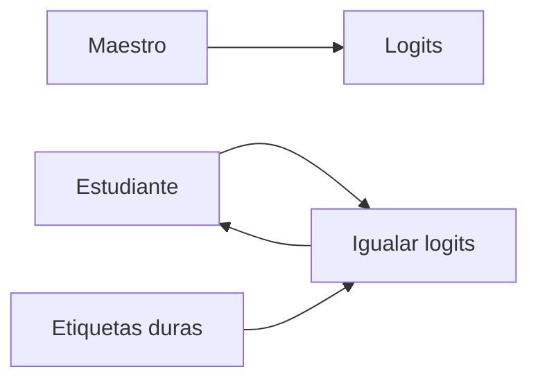

# Destilación de conocimiento

## Definición

La destilación de conocimiento entrena un modelo estudiante más pequeño para igualar las salidas (y a veces representaciones intermedias) de un maestro más grande. El estudiante se beneficia de las etiquetas blandas del maestro y puede ejecutarse con menos cómputo.

Es una técnica de [compresión de modelos](/docs/model-compression) que preserva más del comportamiento del maestro que entrenar al estudiante solo con etiquetas duras. Se usa para BERT → DistilBERT, [LLMs](/docs/llms) grandes → variantes más pequeñas, y [aprendizaje por transferencia](/docs/transfer-learning) a partir de conjuntos de modelos.

## Cómo funciona

El **maestro** (modelo grande) produce **logits** (o embeddings) sobre los datos de entrenamiento. El **estudiante** (modelo más pequeño) se entrena para **igualar** los logits del maestro (como divergencia KL con escala de temperatura) además de o en lugar de **etiquetas duras** (verdad de base). La temperatura suaviza la distribución del maestro para que el estudiante aprenda del conocimiento oscuro (puntuaciones relativas entre clases). Opcionalmente, se pueden igualar capas intermedias o atención. El estudiante se entrena con una mezcla de pérdida de destilación y pérdida de tarea; después del entrenamiento se ejecuta con la capacidad y latencia del estudiante.

## Casos de uso

La destilación de conocimiento es adecuada cuando se desea un estudiante pequeño y rápido que aproxime a un maestro grande para el despliegue.

- Entrenar modelos más pequeños y rápidos que aproximen a los grandes (como BERT → DistilBERT)
- Habilitar el despliegue cuando el maestro es demasiado pesado para producción
- Transferir conocimiento de conjuntos de modelos o de múltiples maestros

## Recursos prácticos

- [Destilando el conocimiento en una red neuronal (Hinton et al.)](https://arxiv.org/abs/1503.02531)
- [Hugging Face – Destilación](https://huggingface.co/docs/transformers/tasks/distillation)

## Ver también

- [Compresión de modelos](/docs/model-compression)
- [Aprendizaje por transferencia](/docs/transfer-learning)
