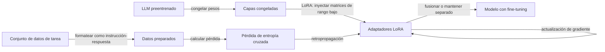

# Fine-tuning

## Definición

El fine-tuning continúa entrenando un modelo preentrenado con datos específicos de la tarea o dominio. El fine-tuning completo actualiza todos los parámetros; los métodos eficientes en parámetros (p. ej. LoRA, adaptadores) actualizan un pequeño subconjunto para reducir el coste.

Úsalo cuando necesites un comportamiento o estilo específico estable para la tarea (p. ej. lenguaje de dominio, formato de salida) y tengas suficientes datos etiquetados. Para el conocimiento que se actualiza con frecuencia o las preguntas puntuales, [RAG](/docs/rag) o la [ingeniería de prompts](/docs/prompt-engineering) suelen ser mejores. Consulta [LLMs](/docs/llms) para el pipeline de entrenamiento completo.

Los métodos de fine-tuning eficientes en parámetros (PEFT), especialmente **LoRA** (Adaptación de Rango Bajo), han hecho que el fine-tuning sea práctico en hardware de consumo. LoRA congela los pesos del modelo original e inyecta matrices entrenables de rango bajo en las proyecciones de atención; solo estas matrices pequeñas se actualizan y almacenan. El modelo original puede compartirse entre muchos adaptadores LoRA, cada uno especializándose para una tarea o dominio diferente. LoRA cuantizado (QLoRA) combina cuantización de 4 bits con LoRA, permitiendo el fine-tuning de modelos de 7B–70B en una única GPU de consumo. Esto reduce drásticamente la barrera para la adaptación de dominio comparado con el fine-tuning completo.

## Cómo funciona



### Comenzar desde un modelo base

Comienzas desde un **modelo base** (p. ej. un [LLM](/docs/llms) preentrenado) y un **conjunto de datos** de ejemplos de la tarea. El conjunto de datos se formatea como pares instrucción-respuesta (para el ajuste de instrucciones) o como texto de dominio en bruto (para el preentrenamiento continuo).

### LoRA: adaptación de rango bajo

En lugar de actualizar todos los parámetros, LoRA agrega matrices entrenables A y B (donde el rango r ≪ d) a las matrices de pesos. Solo A y B se entrenan; los pesos originales están congelados. Esto reduce los parámetros entrenables en más del 99% mientras logra una calidad cercana al fine-tuning completo. Los adaptadores pueden fusionarse en el modelo base en el tiempo de inferencia para cero sobrecarga.

### Validación y parada

La **pérdida de validación** en una división retenida guía la parada temprana. El sobreajuste es común con conjuntos de datos pequeños; técnicas como el recorte de gradientes, tasas de aprendizaje pequeñas (1e-4 a 1e-5) y entrenamiento corto (1–3 épocas) son práctica estándar.

## Cuándo usar / Cuándo NO usar

| Escenario | ¿Usar fine-tuning? | Notas |
|---|---|---|
| Adaptación de dominio (legal, médico, código) | Sí | Unos pocos cientos de ejemplos pueden cambiar significativamente el comportamiento del modelo |
| Formato de salida consistente (JSON, tablas) | Sí | Más confiable que solo con prompts |
| Conocimiento que cambia frecuentemente | No | RAG es más barato y más actualizado |
| Respuesta a preguntas puntuales | No | El prompting de pocos ejemplos es suficiente |
| Reducir alucinaciones en hechos conocidos | Parcialmente | Combinar con RAG para mejores resultados |
| Presupuesto limitado (\< $50) | Sí (LoRA) | QLoRA lo hace factible en hardware de consumo |

## Comparaciones

| Método | Actualizaciones | Coste | Calidad | Cuándo usar |
|---|---|---|---|---|
| Prompting sin ejemplos | Ninguna | Más bajo | Línea de base | Tareas generales |
| Prompting de pocos ejemplos | Ninguna | Bajo | Buena | Guía de formato |
| Fine-tuning completo | Todos los parámetros | Muy alto | Mejor | Datos grandes, máximo rendimiento |
| Fine-tuning LoRA | ~0.1–1% params | Bajo a moderado | Casi completo | Adaptación de dominio práctica |
| RAG | Ninguna | Moderado (recuperación) | Buena para conocimiento | Bases de conocimiento en vivo o grandes |

## Pros y contras

| Pros | Contras |
|---|---|
| Fuerte rendimiento específico de la tarea | Requiere datos etiquetados curados |
| LoRA/QLoRA es barato y accesible | Riesgo de olvido catastrófico |
| Comportamiento incorporado (sin sobrecarga de ingeniería de prompts) | Los modelos con fine-tuning aún pueden alucinar |
| Archivos de adaptadores portátiles (MB no GB) | La evaluación es más difícil que con prompts |

## Ejemplos de código

```python
# LoRA fine-tuning with Hugging Face PEFT and TRL (SFTTrainer)
# pip install transformers peft trl datasets bitsandbytes accelerate
from transformers import AutoTokenizer, AutoModelForCausalLM, BitsAndBytesConfig
from peft import LoraConfig, get_peft_model, TaskType
from trl import SFTTrainer, SFTConfig
from datasets import Dataset

# Small toy dataset — replace with your domain data
data = [
    {"text": "USER: What is LoRA? ASSISTANT: LoRA is a parameter-efficient fine-tuning technique that injects trainable low-rank matrices into frozen model weights."},
    {"text": "USER: Why use LoRA? ASSISTANT: LoRA reduces trainable parameters by 99%+ while achieving near-full fine-tuning quality, making it feasible on consumer GPUs."},
]
dataset = Dataset.from_list(data)

model_name = "facebook/opt-125m"  # tiny model for illustration; swap for llama-3, mistral, etc.
tokenizer  = AutoTokenizer.from_pretrained(model_name)
tokenizer.pad_token = tokenizer.eos_token

# Load model (add BitsAndBytesConfig for 4-bit QLoRA on larger models)
model = AutoModelForCausalLM.from_pretrained(model_name)

# LoRA configuration
lora_config = LoraConfig(
    task_type=TaskType.CAUSAL_LM,
    r=8,            # rank
    lora_alpha=32,
    target_modules=["q_proj", "v_proj"],
    lora_dropout=0.05,
)
model = get_peft_model(model, lora_config)
model.print_trainable_parameters()   # prints e.g. "trainable params: 0.05%"

# Train
training_args = SFTConfig(
    output_dir="./lora-output",
    num_train_epochs=3,
    per_device_train_batch_size=1,
    logging_steps=1,
    save_strategy="no",
    dataset_text_field="text",
    max_seq_length=128,
)
trainer = SFTTrainer(model=model, train_dataset=dataset, args=training_args)
trainer.train()
print("Fine-tuning complete.")
```

## Recursos prácticos

- [Hugging Face – Ajustar fino un modelo preentrenado](https://huggingface.co/docs/transformers/training) — Guía completa con la API Trainer
- [OpenAI – Fine-tuning](https://platform.openai.com/docs/guides/fine-tuning) — Fine-tuning basado en API para modelos GPT
- [Documentación de la biblioteca PEFT](https://huggingface.co/docs/peft) — LoRA, adaptadores y otros métodos PEFT

## Ver también

- [LLMs](/docs/llms)
- [Ingeniería de prompts](/docs/prompt-engineering)
