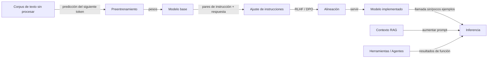

# Modelos de lenguaje grandes (LLMs)

## Definición

Los modelos de lenguaje grandes son modelos basados en transformers entrenados en datos masivos de texto (y a veces multimodal). Exhiben capacidades emergentes: aprendizaje de pocos ejemplos, razonamiento y uso de herramientas cuando se escalan y alinean (p. ej. vía RLHF).

Un modelo mental útil: el **preentrenamiento** aprende la predicción del siguiente token en enormes corpus y le da al modelo amplio conocimiento y capacidad lingüística. El **ajuste de instrucciones** (y similares) entrena al modelo para seguir las instrucciones del usuario y sus formatos. La **alineación** (p. ej. RLHF, DPO) moldea el comportamiento para que sea útil, honesto y seguro. En el tiempo de inferencia puedes usar el modelo sin ejemplos, con pocos ejemplos, o aumentarlo con recuperación (RAG) o herramientas (agentes).

Las "capacidades emergentes" son la propiedad distintiva clave de los LLMs: capacidades que no se entrenan explícitamente pero surgen de la escala. El razonamiento de cadena de pensamiento, la aritmética de múltiples pasos, la síntesis de código y el aprendizaje en contexto a partir de un puñado de ejemplos aparecen todos por encima de ciertos tamaños de modelo y volúmenes de datos. Esto hace que los LLMs sean fundamentalmente diferentes de los modelos de tareas entrenados de forma estrecha — un solo LLM puede reemplazar docenas de clasificadores especializados mediante una cuidadosa [ingeniería de prompts](/docs/prompt-engineering), [fine-tuning](/docs/llms/fine-tuning) o [RAG](/docs/rag). La consecuencia práctica es que las aplicaciones impulsadas por LLM requieren una disciplina de evaluación diferente: más allá de la exactitud, debes probar las alucinaciones, el comportamiento de rechazo, la toxicidad y la robustez al cambio de distribución.

## Cómo funciona



### Preentrenamiento

El **modelo base** se entrena en billones de tokens usando predicción del siguiente token (pérdida de entropía cruzada). Esta fase es intensiva en cómputo (miles de días-GPU) y produce un modelo con amplio conocimiento del mundo y fluidez lingüística.

### Ajuste de instrucciones y alineación

El **ajuste de instrucciones** usa pares (instrucción, respuesta) para que el modelo aprenda a seguir los prompts de forma confiable. La **alineación** (RLHF, DPO, Constitutional AI) usa retroalimentación humana o señales generadas por IA para recompensar las respuestas útiles, honestas y seguras y penalizar las dañinas.

### Aumento de la inferencia

En el tiempo de inferencia, el modelo implementado puede llamarse sin ejemplos, con pocos ejemplos o de forma aumentada. **RAG** inyecta documentos recuperados en el contexto del prompt. Los **agentes** le dan al modelo acceso a herramientas externas (búsqueda, ejecución de código, APIs) y hacen bucle hasta que una tarea se completa.

## Cuándo usar / Cuándo NO usar

| Escenario | ¿Usar LLM? | Notas |
|---|---|---|
| Tareas de lenguaje natural (resumen, QA, chat) | Sí | Los LLMs son la opción predeterminada |
| Predicción estructurada (p. ej. rellenar una tabla SQL) | Con precaución | Los LLMs ajustados o con prompts funcionan; valida las salidas |
| Se requiere determinismo estricto (p. ej. lógica de facturación) | No | Usar código determinista; los LLMs son probabilísticos |
| Base de conocimiento que se actualiza frecuentemente | Usar RAG | El fine-tuning es costoso para datos que cambian rápido |
| Tarea estrecha con datos etiquetados abundantes | Con precaución | Un modelo más pequeño con fine-tuning puede ser más barato y rápido |
| Producción de baja latencia y alto rendimiento | Con precaución | Perfilar el coste por token; los modelos destilados pueden ser suficientes |

## Comparaciones

| Enfoque | Mejor para | Datos necesarios | Coste |
|---|---|---|---|
| Prompting sin ejemplos | Prototipado rápido, tareas generales | Ninguno | Bajo (llamadas API) |
| Prompting de pocos ejemplos | Formato consistente, tareas raras | Algunos ejemplos | Bajo |
| RAG | QA intensivo en conocimiento, datos en vivo | Corpus de recuperación | Moderado |
| Fine-tuning | Adaptación de dominio, estilo específico | Cientos a miles | Alto (entrenamiento) |

## Pros y contras

| Pros | Contras |
|---|---|
| Flexible, un modelo para muchas tareas | Coste y latencia |
| Fuerte rendimiento con pocos ejemplos | Alucinaciones y sesgo |
| Habilita agentes y uso de herramientas | Requiere evaluación cuidadosa |
| Mejora rápidamente con nuevos lanzamientos | Salidas no deterministas |

## Ejemplos de código

```python
# Zero-shot and few-shot prompting with the OpenAI SDK
from openai import OpenAI

client = OpenAI()  # OPENAI_API_KEY from environment

def call_llm(messages: list[dict], model: str = "gpt-4o-mini") -> str:
    response = client.chat.completions.create(
        model=model,
        messages=messages,
        temperature=0.0,
        max_tokens=256,
    )
    return response.choices[0].message.content.strip()

# Zero-shot example
zero_shot = call_llm([
    {"role": "system", "content": "Classify the sentiment of the input as positive or negative. Reply with one word."},
    {"role": "user",   "content": "The delivery was fast and the product quality exceeded my expectations!"},
])
print(f"Zero-shot: {zero_shot}")

# Few-shot example
few_shot_messages = [
    {"role": "system", "content": "Classify sentiment. Reply with one word."},
    {"role": "user",   "content": "Horrible service."},
    {"role": "assistant", "content": "Negative"},
    {"role": "user",   "content": "Best purchase I have ever made!"},
    {"role": "assistant", "content": "Positive"},
    {"role": "user",   "content": "It arrived late but the item is fine."},
]
few_shot = call_llm(few_shot_messages)
print(f"Few-shot: {few_shot}")
```

## Recursos prácticos

- [OpenAI – Descripción general de modelos](https://platform.openai.com/docs/models) — Familias de modelos GPT y capacidades
- [Google AI para Desarrolladores](https://ai.google.dev/) — Modelos Gemini, APIs y guías
- [Anthropic – Modelos](https://www.anthropic.com/product) — Documentación de Claude y API
- [Hugging Face – Curso de NLP](https://huggingface.co/learn/nlp-course/) — De transformers a LLMs con fine-tuning

## Ver también

- [Fine-tuning](/docs/llms/fine-tuning)
- [Ingeniería de prompts](/docs/prompt-engineering)
- [RAG](/docs/rag)
- [Agentes](/docs/agents)
