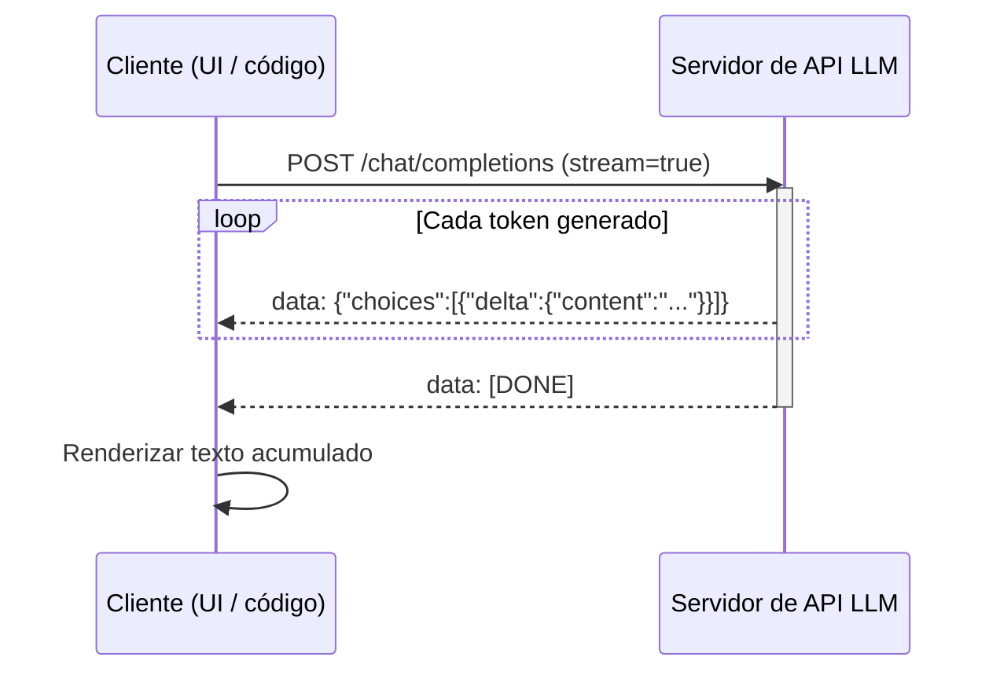

# Streaming (LLMs)

## Definición

El streaming significa devolver la salida del [LLM](/docs/llms) **token a token** (o fragmento a fragmento) según se genera, en lugar de esperar la respuesta completa. Los usuarios ven el texto aparecer de forma incremental, lo que reduce la **latencia percibida** y mejora los [casos de uso](/docs/llms) de chat y asistentes.

Es compatible con la mayoría de las APIs de LLM (OpenAI, Anthropic, Gemini, servidores de código abierto como vLLM) vía Server-Sent Events (SSE) o protocolos similares. Se aplican los mismos patrones de [ingeniería de prompts](/docs/prompt-engineering) y [RAG](/docs/rag) o [agentes](/docs/agents); solo la entrega de la respuesta es incremental.

La diferencia en la experiencia del usuario entre streaming y no-streaming es grande en la práctica: una respuesta que tarda 10 segundos en completarse se siente casi instantánea cuando el primer token llega en 200 ms. Esta métrica de "tiempo hasta el primer token" (TTFT) es tan importante como el rendimiento para aplicaciones interactivas. El streaming también habilita la **cancelación anticipada** — si el modelo comienza a generar una respuesta fuera del objetivo, el usuario o la aplicación puede detener el stream inmediatamente, ahorrando cómputo y tiempo. Para salidas de larga duración como generación de código o redacción de documentos, el streaming proporciona progreso visible que genera confianza en el usuario.

## Cómo funciona



### Generación en el lado del servidor

El **cliente** envía una solicitud con el prompt (y contexto de [RAG](/docs/rag) opcional o resultados de herramientas) con `stream=True`. El **servidor** ejecuta el modelo de forma autorregresiva y, en lugar de almacenar en buffer la salida completa, **empuja** cada nuevo token (o un pequeño fragmento de tokens) al cliente como un evento SSE tan pronto como se genera.

### Renderizado en el lado del cliente

El cliente **recibe** y **renderiza** los tokens según llegan (p. ej. agregando a una UI de chat). Cada evento SSE contiene un delta JSON con el nuevo fragmento de contenido. La conexión permanece abierta hasta que el modelo emite un token de fin de secuencia o el servidor envía `[DONE]`.

### Cancelación y manejo de errores

El cliente puede cerrar la conexión en cualquier momento para cancelar la generación. Las implementaciones de producción deben manejar las respuestas parciales con gracia (p. ej. llamadas a herramientas JSON incompletas) e implementar lógica de reconexión para conexiones interrumpidas.

## Cuándo usar / Cuándo NO usar

| Escenario | ¿Usar streaming? | Notas |
|---|---|---|
| UIs de chat y asistentes | Sí | Predeterminado para toda la salida de texto interactiva |
| Generación de contenido de larga duración | Sí | Muestra el progreso, habilita la cancelación anticipada |
| Procesamiento por lotes / trabajos sin conexión | No | El no-streaming es más simple e igualmente rápido |
| Analizar salida JSON estructurada | Con precaución | Analizar solo cuando se recibe `[DONE]` |
| Resultados de llamadas a herramientas que dependen de la salida completa | No | Esperar la respuesta completa antes de actuar |
| Pipelines de webhook / asíncronos | No | El fire-and-forget es más simple |

## Comparaciones

| Característica | Streaming | No-streaming |
|---|---|---|
| Tiempo hasta el primer token | Muy bajo | Alto (espera la respuesta completa) |
| Latencia percibida | Baja | Alta |
| Cancelación anticipada | Sí | No |
| Complejidad de implementación | Moderada | Baja |
| Mejor para | UI interactiva, respuestas largas | Trabajos por lotes, respuestas cortas |

## Pros y contras

| Pros | Contras |
|---|---|
| Latencia percibida drásticamente menor | Implementación del cliente más compleja |
| Habilita la cancelación anticipada | La salida parcial complica el análisis estructurado |
| Mejor experiencia de usuario para UIs de chat | Requiere conexión persistente |
| Permite el renderizado progresivo de salidas largas | La recuperación de errores es más compleja |

## Ejemplos de código

```python
# Streaming chat completion with OpenAI SDK
from openai import OpenAI
import sys

client = OpenAI()  # OPENAI_API_KEY from environment

def stream_response(prompt: str, system: str = "You are a helpful assistant.") -> str:
    """Stream tokens to stdout and return the full accumulated text."""
    full_text = []

    stream = client.chat.completions.create(
        model="gpt-4o-mini",
        messages=[
            {"role": "system",  "content": system},
            {"role": "user",    "content": prompt},
        ],
        stream=True,
        temperature=0.7,
        max_tokens=512,
    )

    for chunk in stream:
        delta = chunk.choices[0].delta
        if delta.content:
            print(delta.content, end="", flush=True)
            full_text.append(delta.content)

    print()  # newline after stream ends
    return "".join(full_text)


# Example usage
if __name__ == "__main__":
    prompt = "Explain token streaming in LLMs in three short paragraphs."
    result = stream_response(prompt)
    print(f"\nTotal characters: {len(result)}")
```

## Recursos prácticos

- [OpenAI – Streaming](https://platform.openai.com/docs/api-reference/streaming) — Referencia oficial de la API de streaming de OpenAI
- [Anthropic – Streaming](https://docs.anthropic.com/en/api/streaming) — Documentación de streaming de Claude
- [vLLM – Streaming](https://docs.vllm.ai/en/latest/serving/openai_compatible_server.html#streaming) — Servicio de código abierto con soporte de streaming

## Ver también

- [LLMs](/docs/llms)
- [Ingeniería de prompts](/docs/prompt-engineering)
- [Inferencia local](/docs/local-inference)
