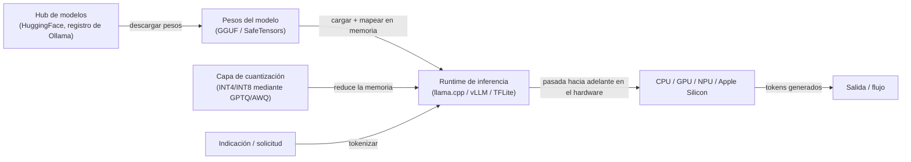
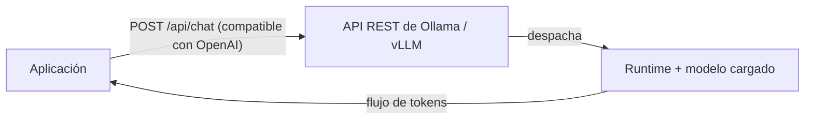

# Inferencia local

## Definición

La inferencia local significa ejecutar [LLMs](/docs/llms), modelos de visión u otros modelos de IA completamente en su propio hardware — una laptop de desarrollador, una estación de trabajo, un servidor on-premises o un dispositivo de borde — sin enviar datos a un proveedor de API en la nube. Cada token generado permanece dentro de su propio entorno, lo que apoya directamente la **privacidad de datos**, la **latencia reducida**, el **costo predecible** y la **operación offline**.

La viabilidad práctica de la inferencia local depende de la [compresión de modelos](/docs/model-compression): los modelos fronterizos de precisión completa (FP16/BF16) típicamente requieren 80–320 GB de memoria GPU, poniéndolos fuera del alcance de la mayoría del hardware local. La [cuantización](/docs/quantization) (INT8, INT4, GPTQ, AWQ) reduce la memoria 2–8 veces, haciendo que los modelos de parámetros 7B–70B sean ejecutables en GPUs de consumidor o prosumidor (16–48 GB de VRAM) e incluso en hardware solo de CPU mediante el formato GGUF. Los runtimes como Ollama, LM Studio, llama.cpp, vLLM y TensorFlow Lite manejan la carga de modelos, la gestión de memoria y la ejecución de inferencia con configuración mínima.

La inferencia local no es una sola tecnología sino una pila: pesos del modelo (GGUF, SafeTensors, ONNX) + runtime (llama.cpp, Ollama, vLLM, TFLite) + capa de servicio opcional (API REST compatible con OpenAI). Esta pila puede ensamblarse para servir a un solo desarrollador de forma interactiva o escalar a un clúster on-premises que sirve a cientos de usuarios concurrentes, todo sin dependencia de la nube.

## Cómo funciona

### Pila de inferencia



### Capa de servicio (opcional)



### Comparación de runtimes

| Runtime | Mejor para | Formato | GPU requerida |
|---------|---------|--------|-------------|
| llama.cpp | Inferencia CPU/GPU de bajos recursos | GGUF | No (compatible con CPU) |
| Ollama | Servicio LLM local amigable para desarrolladores | GGUF / Modelfile | No (compatible con CPU) |
| vLLM | Servidor on-prem de alto rendimiento | HuggingFace / safetensors | Sí (CUDA) |
| TensorFlow Lite | Inferencia en móvil y microcontroladores | .tflite | No |
| LM Studio | GUI para exploración de LLM local | GGUF | No (compatible con CPU) |

## Cuándo usar / Cuándo NO usar

| Escenario | Usar inferencia local | NO usar inferencia local |
|----------|--------------------|-----------------------------|
| Los datos no deben salir de la red (salud, legal, finanzas) | Sí — los datos nunca salen del hardware local | |
| Asistente de baja latencia o integración IDE | Sí — sin viaje de ida y vuelta a la red | |
| Desarrollo y pruebas sin claves de API ni límites de uso | Sí — gratis y offline | |
| Entornos con redes restringidas o air-gapped | Sí — sin conectividad externa necesaria | |
| Se necesita calidad del modelo fronterizo (GPT-4o, Claude 3.7) | | Las APIs en la nube proporcionan modelos más grandes y capaces |
| Patrones de carga impredecibles o en ráfagas | | El autoescalado en la nube es más rentable |
| Sin hardware GPU disponible y la latencia baja es crítica | | La inferencia en la nube es más rápida en hardware insuficiente |

## Ventajas y desventajas

| Ventajas | Desventajas |
|------|------|
| Los datos permanecen en su infraestructura — garantía de privacidad fuerte | Los modelos más pequeños o cuantizados pueden tener menor calidad |
| Sin costo de API por token en el momento de la inferencia | Usted posee el hardware, las operaciones y las actualizaciones del modelo |
| Funciona offline y en redes restringidas | El rendimiento y la longitud del contexto están limitados por el hardware |
| Control total sobre la versión y el comportamiento del modelo | Necesita [cuantización](/docs/quantization) y [compresión](/docs/model-compression) para modelos más grandes |

## Ejemplos de código

```bash
# Instalar Ollama y ejecutar un LLM local
curl -fsSL https://ollama.ai/install.sh | sh

# Descargar y ejecutar un modelo de forma interactiva
ollama run llama3.2

# Servir una API REST compatible con OpenAI (se ejecuta en localhost:11434 por defecto)
ollama serve &

# Llamar a la API desde Python usando el cliente OpenAI
python3 - <<'EOF'
from openai import OpenAI

client = OpenAI(base_url="http://localhost:11434/v1", api_key="ollama")

response = client.chat.completions.create(
    model="llama3.2",
    messages=[{"role": "user", "content": "Explica la cuantización en un párrafo."}],
    stream=True,
)
for chunk in response:
    print(chunk.choices[0].delta.content or "", end="", flush=True)
EOF
```

## Consejos para un uso efectivo

- Comience con la cuantización GGUF Q4_K_M para un buen equilibrio entre precisión y velocidad; baje a Q3 o Q2 solo si la memoria es críticamente limitada.
- Use Ollama para máquinas de desarrolladores y vLLM para servidores on-premises que sirvan a múltiples usuarios concurrentemente.
- Fije las versiones del modelo en su `Modelfile` o configuración para evitar cambios silenciosos de calidad en las actualizaciones.
- Monitorice el rendimiento de tokens y la latencia del primer token — estos revelan si el hardware es el cuello de botella o si el modelo está sobreccuantizado.
- Para Apple Silicon (M1/M2/M3/M4), llama.cpp y Ollama usan el backend GPU Metal automáticamente, proporcionando un rendimiento cercano al de GPU.

## Recursos prácticos

- [Ollama](https://ollama.ai/) — Ejecutar LLMs localmente con una CLI simple y una API compatible con OpenAI
- [llama.cpp](https://github.com/ggerganov/llama.cpp) — Motor de inferencia C++ para LLaMA y modelos compatibles, formato GGUF
- [vLLM](https://docs.vllm.ai/) — Servicio LLM de alto rendimiento con procesamiento por lotes continuo y PagedAttention
- [LM Studio](https://lmstudio.ai/) — GUI para descubrir, descargar y ejecutar LLMs locales
- [TensorFlow Lite](https://www.tensorflow.org/lite) — Inferencia en el dispositivo para móvil y borde

## Ver también

- [Cuantización](/docs/quantization)
- [Compresión de modelos](/docs/model-compression)
- [Infraestructura](/docs/infrastructure)
- [Razonamiento en el borde](/docs/edge-reasoning)
