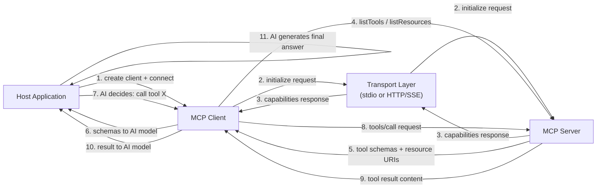

# Construcción de clientes MCP

## Definición

Un **cliente MCP** es el componente dentro de una aplicación host que gestiona la conexión a un único servidor MCP y traduce la intención del modelo de IA en solicitudes a nivel de protocolo. La aplicación host — una interfaz de chat, un asistente de codificación, un agente autónomo — crea un cliente por servidor al que quiere conectarse. El cliente gestiona todo el ciclo de vida del protocolo: establecer la conexión de transporte, completar el handshake de inicialización, descubrir las capacidades del servidor, invocar herramientas en nombre de la IA, leer recursos y obtener prompts. Desde la perspectiva de la aplicación host, el cliente es la superficie de API al mundo del servidor.

El rol del cliente en la aplicación host es el de intermediario inteligente. No decide qué herramientas llamar — esa es la responsabilidad del modelo de IA. En cambio, el cliente proporciona a la IA descripciones de capacidades estructuradas (esquemas de herramientas, URIs de recursos, definiciones de prompts) y luego ejecuta fielmente lo que la IA solicita, devolviendo resultados en un formato sobre el que la IA puede razonar. Un cliente bien construido aísla toda la complejidad del protocolo de la aplicación host: el host simplemente pregunta "¿qué puede hacer este servidor?" y "llama a esta herramienta con estos argumentos", y el cliente maneja todo lo demás.

El descubrimiento de capacidades es una de las responsabilidades más importantes del cliente. Después del handshake de inicialización, el cliente consulta al servidor su manifiesto de capacidades completo llamando a `tools/list`, `resources/list` y `prompts/list`. Estas respuestas incluyen nombres, descripciones, esquemas de entrada y plantillas de URI — todo lo que el modelo de IA necesita para entender cómo y cuándo usar cada capacidad. En entornos dinámicos (servidores que cambian su conjunto de herramientas en tiempo de ejecución), los clientes pueden escuchar eventos `notifications/tools/list_changed` y volver a consultar el manifiesto bajo demanda, asegurando que la IA siempre opere con una vista actualizada de las capacidades disponibles.

## Cómo funciona

### Inicialización del cliente y el handshake

Crear un cliente MCP requiere dos cosas: una identidad del cliente (nombre y versión) y una declaración de capacidades. La declaración de capacidades le dice al servidor qué extensiones del protocolo soporta el cliente — por ejemplo, si puede manejar suscripciones a recursos o validación de argumentos de prompts. Después de la instanciación, el cliente se conecta a un transporte, lo que activa la solicitud `initialize`. El servidor responde con su propia identidad, versión del protocolo y capacidades. El cliente luego envía una notificación `initialized` para confirmar que el handshake está completo. Solo después de esta secuencia puede el cliente hacer solicitudes de capacidad o invocación. El SDK maneja todo esto automáticamente cuando llamas a `client.connect(transport)`.

### Descubrimiento de capacidades

Una vez conectado, el cliente descubre lo que ofrece el servidor. `client.listTools()` devuelve todas las definiciones de herramientas incluyendo sus nombres, descripciones y especificaciones de entrada JSON Schema. `client.listResources()` devuelve URIs de recursos estáticos y metadatos. `client.listResourceTemplates()` devuelve plantillas de URI para recursos dinámicos. `client.listPrompts()` devuelve nombres de prompts y sus definiciones de argumentos. En una aplicación típica de IA, el descubrimiento ocurre una vez al inicio de la sesión y los resultados se proporcionan al modelo de IA como contexto — ya sea inyectados en el prompt del sistema o pasados como datos estructurados a una API de llamada a funciones. Los esquemas de herramientas devueltos por `listTools()` se mapean directamente al formato JSON Schema usado por la mayoría de las APIs de llamada a funciones de LLM, lo que hace que convertir las herramientas MCP descubiertas en definiciones de herramientas de LLM sea sencillo.

### Invocación de herramientas

Invocar una herramienta requiere un nombre de herramienta y un objeto de argumentos que satisfaga el esquema de entrada de la herramienta. `client.callTool({ name, arguments })` envía una solicitud `tools/call` al servidor y devuelve una respuesta que contiene un array `content` de bloques de contenido. Cada bloque tiene un campo `type` (`text`, `image` o `resource`) y los datos correspondientes. Los bloques de texto contienen resultados de cadena; los bloques de imagen contienen datos de imagen codificados en base64 con un tipo MIME; los bloques de recurso incorporan un recurso en línea. El trabajo del cliente es pasar estos bloques de contenido de vuelta al modelo de IA — típicamente como mensajes de resultado de herramienta en un turno de conversación. Si la respuesta tiene `isError: true`, el cliente debe presentar esto claramente para que la IA pueda manejar el error (reintentar, recurrir o reportar al usuario).

### Lectura de recursos

Los recursos se leen a través de `client.readResource({ uri })`, que devuelve un array `contents` de elementos de contenido de recursos. Cada elemento tiene una URI, un tipo MIME y un campo `text` (para recursos basados en texto) o un campo `blob` (para recursos binarios). Los recursos se usan para proporcionar a la IA contexto grande y estructurado — contenido de archivos, registros de bases de datos, respuestas de API — sin pasar por el ciclo de ida y vuelta de invocación de herramientas. El cliente puede suscribirse a actualizaciones de recursos (`client.subscribeResource({ uri })`) y recibir eventos `notifications/resources/updated` cuando el servidor determina que el contenido del recurso ha cambiado, habilitando la actualización de contexto en tiempo real.

### Selección de transporte

La elección del transporte depende de dónde se ejecuta el servidor. El **transporte stdio** (`StdioClientTransport`) se usa cuando el servidor se ejecuta como proceso hijo local — el cliente genera el proceso del servidor directamente y se comunica a través de su stdin/stdout. Esto es de configuración cero e ideal para herramientas de desarrollo, servidores de sistema de archivos locales y cualquier servidor que deba estar en el ámbito de una sola sesión de usuario. El **transporte SSE** (`SSEServerTransport` en el lado del cliente) se usa para servidores remotos — el cliente se conecta a un endpoint HTTP y usa Server-Sent Events para respuestas en streaming. Esto se adapta a servidores organizacionales compartidos, capacidades alojadas en la nube y despliegues de producción donde múltiples instancias de clientes necesitan compartir el mismo servidor. La elección del transporte es completamente transparente para las APIs de descubrimiento e invocación de capacidades; puedes cambiar de transporte sin cambiar ningún otro código del cliente.



## Cuándo usar / Cuándo NO usar

| Escenario | Construir un cliente MCP | Considerar alternativas |
|---|---|---|
| Conectar una aplicación de IA a uno o más servidores MCP | Requerido — este es el caso de uso previsto | Llamadas directas a la API si el servidor no usa MCP |
| Construyendo un asistente de IA de propósito general que debería soportar servidores MCP de la comunidad | Mejor opción — cualquier servidor MCP funciona automáticamente | Integraciones de herramientas personalizadas si el conjunto de herramientas es fijo y pequeño |
| Integrar IA en una aplicación que ya tiene dependencias de servicios | El cliente MCP por servicio proporciona acceso uniforme a herramientas | Llamada a funciones específica del proveedor si estás bloqueado a un proveedor de LLM |
| Desarrollando herramientas que se ejecutan localmente en la máquina del usuario | El transporte stdio requiere un cliente MCP | Scripts de shell o llamadas directas a la biblioteca si la IA no está involucrada |
| Agregando capacidades de múltiples servidores especializados | Un cliente por servidor, el host gestiona todos los clientes | Lista de herramientas monolítica única si todas las herramientas viven en un lugar |
| Consumiendo un servidor que usa HTTP/SSE para acceso remoto | El cliente de transporte SSE maneja esto de forma nativa | WebSocket o cliente REST si el servidor usa un protocolo que no es MCP |

## Ejemplos de código

### Cliente MCP completo — conectar, descubrir, invocar, leer

```typescript
import { Client } from "@modelcontextprotocol/sdk/client/index.js";
import { StdioClientTransport } from "@modelcontextprotocol/sdk/client/stdio.js";

async function main() {
  // -----------------------------------------------------------------------
  // 1. Create transport — spawns the server as a child process
  // -----------------------------------------------------------------------
  const transport = new StdioClientTransport({
    command: "node",
    args: ["./file-and-weather-server.js"], // Path to your MCP server
  });

  // -----------------------------------------------------------------------
  // 2. Create client and connect (triggers the initialize handshake)
  // -----------------------------------------------------------------------
  const client = new Client(
    { name: "demo-client", version: "1.0.0" },
    {
      capabilities: {
        // Declare which protocol extensions this client supports
        roots: { listChanged: true },
      },
    }
  );

  await client.connect(transport);
  console.log("Connected to MCP server");

  // -----------------------------------------------------------------------
  // 3. Discover capabilities
  // -----------------------------------------------------------------------
  const { tools } = await client.listTools();
  console.log(
    "\nAvailable tools:",
    tools.map((t) => `${t.name}: ${t.description}`)
  );

  const { resources } = await client.listResources();
  console.log(
    "\nAvailable resources:",
    resources.map((r) => r.uri)
  );

  const { prompts } = await client.listPrompts();
  console.log(
    "\nAvailable prompts:",
    prompts.map((p) => p.name)
  );

  // -----------------------------------------------------------------------
  // 4. Invoke a tool
  // -----------------------------------------------------------------------
  console.log("\n--- Calling get_weather tool ---");
  const weatherResult = await client.callTool({
    name: "get_weather",
    arguments: { city: "Tokyo", units: "celsius" },
  });

  // weatherResult.content is an array of content blocks
  if (!weatherResult.isError) {
    for (const block of weatherResult.content) {
      if (block.type === "text") {
        console.log("Weather result:", block.text);
      }
    }
  } else {
    console.error("Tool returned an error:", weatherResult.content);
  }

  // -----------------------------------------------------------------------
  // 5. Invoke another tool
  // -----------------------------------------------------------------------
  console.log("\n--- Calling list_directory tool ---");
  const dirResult = await client.callTool({
    name: "list_directory",
    arguments: { dir_path: "/tmp" },
  });

  if (!dirResult.isError) {
    const textBlock = dirResult.content.find((b) => b.type === "text");
    if (textBlock && textBlock.type === "text") {
      console.log("Directory listing:", textBlock.text);
    }
  }

  // -----------------------------------------------------------------------
  // 6. Read a resource
  // -----------------------------------------------------------------------
  console.log("\n--- Reading a resource ---");
  try {
    const resourceResult = await client.readResource({
      uri: "file:///etc/hostname",
    });

    for (const item of resourceResult.contents) {
      console.log(`Resource [${item.uri}]:`, "text" in item ? item.text : "(binary)");
    }
  } catch (err) {
    console.error("Resource read failed:", (err as Error).message);
  }

  // -----------------------------------------------------------------------
  // 7. Fetch a prompt
  // -----------------------------------------------------------------------
  console.log("\n--- Fetching a prompt ---");
  try {
    const promptResult = await client.getPrompt({
      name: "analyze_file",
      arguments: {
        file_path: "/tmp/example.txt",
        focus: "structure and formatting",
      },
    });

    console.log("Prompt messages:");
    for (const msg of promptResult.messages) {
      console.log(`  [${msg.role}]:`, JSON.stringify(msg.content).slice(0, 120) + "...");
    }
  } catch (err) {
    console.error("Prompt fetch failed:", (err as Error).message);
  }

  // -----------------------------------------------------------------------
  // 8. Clean up
  // -----------------------------------------------------------------------
  await client.close();
  console.log("\nClient disconnected.");
}

main().catch((err) => {
  console.error("Client error:", err);
  process.exit(1);
});
```

### Conexión a un servidor remoto a través del transporte SSE

```typescript
import { Client } from "@modelcontextprotocol/sdk/client/index.js";
import { SSEClientTransport } from "@modelcontextprotocol/sdk/client/sse.js";

async function connectRemote() {
  // Point to the SSE endpoint of your remote MCP server
  const transport = new SSEClientTransport(
    new URL("http://localhost:3000/sse")
  );

  const client = new Client(
    { name: "remote-client", version: "1.0.0" },
    { capabilities: {} }
  );

  await client.connect(transport);

  // From here, the API is identical to the stdio client example
  const { tools } = await client.listTools();
  console.log("Remote tools:", tools.map((t) => t.name));

  // Call a tool on the remote server
  const result = await client.callTool({
    name: "get_weather",
    arguments: { city: "Berlin" },
  });
  console.log(result.content);

  await client.close();
}

connectRemote().catch(console.error);
```

### Conversión de herramientas MCP descubiertas a esquemas de llamada a funciones de LLM

```typescript
import { Client } from "@modelcontextprotocol/sdk/client/index.js";
import { StdioClientTransport } from "@modelcontextprotocol/sdk/client/stdio.js";
import type { Tool } from "@modelcontextprotocol/sdk/types.js";

// Convert an MCP tool definition to OpenAI function-calling format
function mcpToolToOpenAIFunction(tool: Tool) {
  return {
    type: "function" as const,
    function: {
      name: tool.name,
      description: tool.description ?? "",
      parameters: tool.inputSchema,
    },
  };
}

async function getToolsForLLM(serverCommand: string, serverArgs: string[]) {
  const transport = new StdioClientTransport({
    command: serverCommand,
    args: serverArgs,
  });

  const client = new Client(
    { name: "llm-bridge", version: "1.0.0" },
    { capabilities: {} }
  );

  await client.connect(transport);

  const { tools } = await client.listTools();

  // Convert to OpenAI format — these can be passed directly to the Chat Completions API
  const openAITools = tools.map(mcpToolToOpenAIFunction);

  return { client, openAITools };
}

// Usage:
// const { client, openAITools } = await getToolsForLLM("node", ["./my-server.js"]);
// Pass openAITools to openai.chat.completions.create({ tools: openAITools, ... })
// When the LLM returns a tool call, use: client.callTool({ name, arguments })
```

## Recursos prácticos

- [Referencia de la API del cliente del SDK de TypeScript de MCP](https://github.com/modelcontextprotocol/typescript-sdk/tree/main/src/client) — Fuente y documentación en línea para `Client`, todas las clases de transporte y tipos del lado del cliente.
- [Ejemplos e integraciones de clientes MCP](https://modelcontextprotocol.io/clients) — Una lista curada de integraciones de clientes MCP existentes en editores, plataformas de IA y herramientas de desarrollo.
- [Especificación del protocolo MCP — comportamiento del cliente](https://spec.modelcontextprotocol.io/specification/client/) — Referencia autorizada para las responsabilidades del cliente incluyendo inicialización, negociación de capacidades y ciclo de vida de solicitudes.
- [Guía de integración MCP](https://modelcontextprotocol.io/docs/concepts/architecture) — Descripción conceptual de cómo se relacionan los clientes, servidores y aplicaciones host, con diagramas y guía de decisiones.

## Ver también

- [Descripción general del Model Context Protocol](/docs/mcp)
- [Construcción de servidores MCP](/docs/mcp/building-servers)
- [Agentes de IA](/docs/agents)
