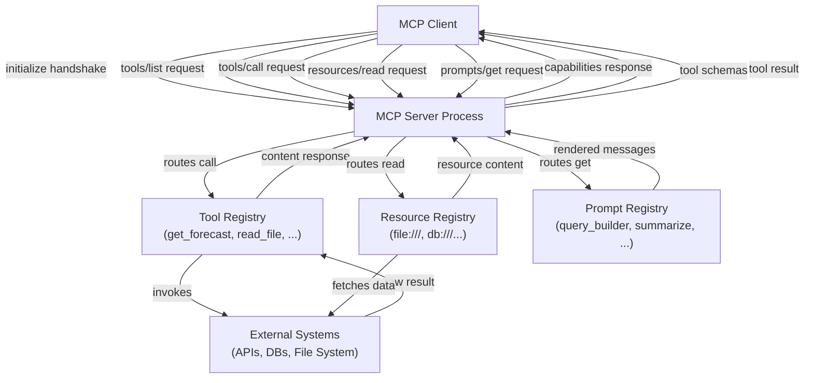

# Construcción de servidores MCP

## Definición

Un **servidor MCP** es un proceso que expone capacidades a aplicaciones de IA compatibles con MCP a través del Model Context Protocol. Actúa como el puente entre un modelo de IA y algún sistema externo — un sistema de archivos, una API REST, una base de datos, un ejecutor de código — envolviendo la funcionalidad de ese sistema en una interfaz bien definida y descubrible. El servidor posee los detalles de implementación; el cliente solo necesita conocer el protocolo. Cualquier cliente compatible con MCP puede conectarse a cualquier servidor MCP e inmediatamente descubrir y usar sus capacidades sin trabajo de integración personalizado.

Un servidor MCP puede exponer tres categorías de capacidades. Las **herramientas** son funciones invocables que aceptan entrada estructurada y devuelven salida — la IA las invoca para tomar acciones o recuperar información dinámica. Los **recursos** son fuentes de datos de solo lectura, direccionadas por URI, que la IA puede leer para obtener contexto — archivos, registros de bases de datos, instantáneas de API. Los **prompts** son plantillas de prompts reutilizables y parametrizadas almacenadas en el servidor que los clientes pueden presentar a los usuarios o inyectar en conversaciones. Un solo servidor puede ofrecer cualquier combinación de estos; muchos servidores solo exponen herramientas.

El **ciclo de vida del servidor** sigue un patrón predecible: el servidor inicia y se vincula a un transporte (stdio o HTTP/SSE), espera a que un cliente se conecte, completa el handshake `initialize` para negociar versiones del protocolo y capacidades, luego entra en su bucle principal respondiendo a las solicitudes. Cuando el cliente se desconecta o envía una señal de apagado, el servidor realiza la limpieza y sale. Dado que el protocolo tiene estado dentro de una sesión, el servidor puede mantener estado por conexión — por ejemplo, almacenando en caché respuestas costosas de la API durante la duración de una sesión.

## Cómo funciona

### Configuración e inicialización del servidor

Configurar un servidor MCP comienza con la creación de una instancia `McpServer` (del SDK de alto nivel) o una instancia `Server` (del SDK de bajo nivel) con un nombre y versión. El nombre y la versión se envían al cliente durante el handshake `initialize` y ayudan con la depuración y el registro. Después de crear el servidor, registras las capacidades — herramientas, recursos, prompts — antes de conectarte a un transporte. La clase `McpServer` de alto nivel del SDK proporciona métodos ergonómicos `server.tool()`, `server.resource()` y `server.prompt()` que manejan el enrutamiento de solicitudes y la validación de esquemas internamente. El paso de conexión (`server.connect(transport)`) inicia el bucle de eventos y bloquea hasta que la sesión termina.

### Definición de herramientas

Las herramientas son la capacidad MCP más comúnmente usada. Cada herramienta tiene tres elementos requeridos: un **nombre** (un identificador corto y en minúsculas usado en solicitudes `tools/call`), una **descripción** (una explicación en lenguaje natural que la IA usa para decidir cuándo y cómo llamar a la herramienta) y un **esquema de entrada** (un esquema Zod en el SDK de TypeScript, convertido a JSON Schema para el protocolo). Cuando un cliente llama a una herramienta, el SDK valida los argumentos entrantes contra el esquema antes de invocar tu función manejadora, por lo que recibes una entrada tipada y validada. El manejador devuelve un array `content` de bloques de contenido — texto, imágenes o recursos incrustados — que el cliente pasa de vuelta al modelo de IA. Las herramientas también pueden establecer `isError: true` en su respuesta para señalar un error recuperable, lo que permite a la IA reintentar o recurrir de forma elegante.

### Definición de recursos

Los recursos exponen datos similares a archivos que la IA puede leer para obtener contexto. Un recurso se identifica por una URI (p. ej., `file:///path/to/data.json` o `postgres://mydb/users/123`) y tiene un tipo MIME que le dice al cliente cómo manejar el contenido. Los recursos se descubren a través de `resources/list` y se leen a través de `resources/read`. El SDK soporta tanto **recursos estáticos** (registrados con una URI fija y contenido) como **recursos dinámicos** (registrados con un patrón de plantilla de URI, resuelto en el momento de lectura). Las plantillas de recursos usan la sintaxis de plantilla de URI RFC 6570 — por ejemplo, `file:///{path}` coincide con cualquier ruta de archivo. Cuando el cliente lee una URI de recurso que coincide con una plantilla, tu manejador recibe las variables de plantilla extraídas y devuelve el contenido. Los recursos deben usarse para datos que la IA necesita leer pero no modificar; para operaciones de escritura, usa una herramienta.

### Definición de prompts

Los prompts son plantillas de interacción reutilizables. Un prompt tiene un nombre, una descripción y una lista opcional de argumentos (nombre, descripción, indicador de requerido). Cuando un cliente solicita un prompt a través de `prompts/get`, tu manejador recibe los valores de los argumentos y devuelve una lista de mensajes — típicamente una combinación de mensajes con rol `user` y `assistant` — que el cliente inyecta en la conversación. Los prompts permiten a los autores de servidores codificar conocimiento del dominio sobre cómo interactuar con las capacidades del servidor. Por ejemplo, un servidor de bases de datos podría exponer un prompt `query_builder` que acepta una descripción en lenguaje natural de una consulta y devuelve un prompt estructurado que guía a la IA para producir SQL seguro y parametrizado.

### Configuración del transporte

La capa de transporte determina cómo el servidor se comunica con los clientes. El **transporte stdio** (`StdioServerTransport`) lee desde `process.stdin` y escribe en `process.stdout`. Es el predeterminado para servidores de herramientas locales — la aplicación host genera el servidor como proceso hijo y se comunica a través de los flujos del proceso. No se necesita configuración de red, y el stderr del servidor está disponible para el registro sin interferir con el protocolo. El **transporte HTTP con SSE** (`SSEServerTransport`) acepta solicitudes HTTP POST para mensajes de cliente a servidor y transmite mensajes de servidor a cliente a través de un endpoint SSE `/sse`. Esto es apropiado para servidores compartidos a los que múltiples clientes pueden conectarse simultáneamente, o para servidores que necesitan ejecutarse como servicios de larga duración en lugar de procesos bajo demanda.



## Cuándo usar / Cuándo NO usar

| Escenario | Construir un servidor MCP | Considerar alternativas |
|---|---|---|
| Exponer una API o servicio existente a múltiples aplicaciones de IA | Mejor opción — un servidor, cualquier cliente puede usarlo | Llamada a funciones directa si solo importa un proveedor y una app |
| Envolver un sistema de archivos, base de datos o fuente de datos interna para contexto de IA | Mejor opción — los recursos y herramientas se mapean naturalmente | Pipeline RAG personalizado si la recuperación semántica es la necesidad principal |
| Proporcionar plantillas de prompts específicas del dominio a usuarios de IA | La capacidad Prompts está específicamente diseñada para esto | Inyección de prompt del sistema si las plantillas son simples y estáticas |
| Construyendo herramientas para una única aplicación de IA interna con un proveedor | MCP añade estructura útil pero puede ser excesivo | Las funciones de herramientas en proceso son más simples |
| Exponer herramientas que requieren resultados en streaming en tiempo real | Soportado a través del transporte SSE | WebSockets o streaming personalizado si la sobrecarga del protocolo importa |
| Herramientas que necesitan mantener estado de larga duración por usuario a través de sesiones | Requiere diseño cuidadoso del servidor — las sesiones son 1:1 | Servicio de backend con estado con un envoltorio MCP delgado |

## Ejemplos de código

### Servidor MCP completo con herramientas, recursos y un prompt

```typescript
import { McpServer, ResourceTemplate } from "@modelcontextprotocol/sdk/server/mcp.js";
import { StdioServerTransport } from "@modelcontextprotocol/sdk/server/stdio.js";
import { z } from "zod";
import * as fs from "fs/promises";
import * as path from "path";

const server = new McpServer({
  name: "file-and-weather-server",
  version: "1.0.0",
});

// -----------------------------------------------------------------------
// Tool 1: Get weather forecast (mock — replace with a real weather API)
// -----------------------------------------------------------------------
server.tool(
  "get_weather",
  "Fetches the current weather forecast for a given city. Returns temperature, conditions, and humidity.",
  {
    city: z.string().describe("The city name, e.g. 'Tokyo' or 'Berlin'"),
    units: z
      .enum(["celsius", "fahrenheit"])
      .default("celsius")
      .describe("Temperature units"),
  },
  async ({ city, units }) => {
    // In production, call a real weather API here (e.g. Open-Meteo, WeatherAPI)
    const mockData = {
      city,
      temperature: units === "celsius" ? 18 : 64,
      units,
      condition: "Partly cloudy",
      humidity_percent: 72,
      forecast: "Light rain expected in the evening",
    };

    return {
      content: [
        {
          type: "text",
          text: JSON.stringify(mockData, null, 2),
        },
      ],
    };
  }
);

// -----------------------------------------------------------------------
// Tool 2: List directory contents
// -----------------------------------------------------------------------
server.tool(
  "list_directory",
  "Lists the files and subdirectories in a given directory path. Use this to explore file system structure.",
  {
    dir_path: z
      .string()
      .describe("Absolute path to the directory to list"),
  },
  async ({ dir_path }) => {
    try {
      const entries = await fs.readdir(dir_path, { withFileTypes: true });
      const listing = entries.map((e) => ({
        name: e.name,
        type: e.isDirectory() ? "directory" : "file",
      }));

      return {
        content: [
          {
            type: "text",
            text: JSON.stringify(listing, null, 2),
          },
        ],
      };
    } catch (err) {
      return {
        isError: true,
        content: [
          {
            type: "text",
            text: `Error listing directory: ${(err as Error).message}`,
          },
        ],
      };
    }
  }
);

// -----------------------------------------------------------------------
// Resource: Read any text file by path (URI template)
// -----------------------------------------------------------------------
server.resource(
  "text-file",
  new ResourceTemplate("file:///{file_path}", { list: undefined }),
  async (uri, { file_path }) => {
    const resolvedPath = path.resolve(String(file_path));

    try {
      const content = await fs.readFile(resolvedPath, "utf-8");
      return {
        contents: [
          {
            uri: uri.href,
            mimeType: "text/plain",
            text: content,
          },
        ],
      };
    } catch (err) {
      throw new Error(`Cannot read file at ${resolvedPath}: ${(err as Error).message}`);
    }
  }
);

// -----------------------------------------------------------------------
// Prompt: Guided file analysis template
// -----------------------------------------------------------------------
server.prompt(
  "analyze_file",
  "Generates a structured prompt that guides the AI to analyze a text file for issues, patterns, or summaries.",
  {
    file_path: z.string().describe("Path to the file to analyze"),
    focus: z
      .string()
      .optional()
      .describe("Optional: specific aspect to focus on, e.g. 'security issues' or 'performance'"),
  },
  async ({ file_path, focus }) => {
    const focusInstruction = focus
      ? `Focus specifically on: ${focus}.`
      : "Provide a general analysis.";

    return {
      messages: [
        {
          role: "user",
          content: {
            type: "text",
            text: `Please analyze the file at \`${file_path}\`.

${focusInstruction}

Use the \`read_file\` resource (URI: file:///${file_path}) to read its contents, then provide:
1. A brief summary of what the file contains
2. Key observations or findings
3. Any recommendations or concerns

Be concise and structured.`,
          },
        },
      ],
    };
  }
);

// -----------------------------------------------------------------------
// Start the server
// -----------------------------------------------------------------------
async function main() {
  const transport = new StdioServerTransport();
  await server.connect(transport);
  // Log to stderr so it doesn't interfere with the stdio protocol
  console.error("file-and-weather-server is running on stdio");
}

main().catch((err) => {
  console.error("Server failed to start:", err);
  process.exit(1);
});
```

### Transporte HTTP/SSE (para servidores remotos compartidos)

```typescript
import { McpServer } from "@modelcontextprotocol/sdk/server/mcp.js";
import { SSEServerTransport } from "@modelcontextprotocol/sdk/server/sse.js";
import express from "express";

const app = express();
const server = new McpServer({ name: "remote-server", version: "1.0.0" });

// Register your tools, resources, and prompts here (same API as stdio)
// server.tool(...), server.resource(...), server.prompt(...)

// SSE endpoint: clients connect here to receive server-to-client messages
app.get("/sse", async (req, res) => {
  const transport = new SSEServerTransport("/messages", res);
  await server.connect(transport);
});

// POST endpoint: clients send messages here
app.post("/messages", express.json(), async (req, res) => {
  // The SSEServerTransport handles routing from the active session
  res.status(200).send("ok");
});

app.listen(3000, () => {
  console.log("MCP server listening on http://localhost:3000");
});
```

## Recursos prácticos

- [Referencia de la API del servidor del SDK de TypeScript de MCP](https://github.com/modelcontextprotocol/typescript-sdk/tree/main/src/server) — Fuente y documentación en línea para `McpServer`, transportes y todos los tipos del lado del servidor.
- [Ejemplos oficiales de servidores MCP](https://github.com/modelcontextprotocol/servers) — Implementaciones de referencia incluyendo sistema de archivos, GitHub, PostgreSQL, Slack y más — invaluables como puntos de partida.
- [Documentación del transporte MCP](https://spec.modelcontextprotocol.io/specification/architecture/) — Sección de la especificación del protocolo que cubre los transportes stdio, HTTP/SSE y Streamable HTTP en profundidad.
- [Documentación de Zod](https://zod.dev) — La biblioteca de esquemas usada por el SDK de TypeScript para la validación de entradas; entender los tipos de Zod se mapea directamente a los esquemas de parámetros de herramientas.

## Ver también

- [Descripción general del Model Context Protocol](/docs/mcp)
- [Construcción de clientes MCP](/docs/mcp/building-clients)
- [Herramientas y acciones de agentes](/docs/agents/tools-actions)
