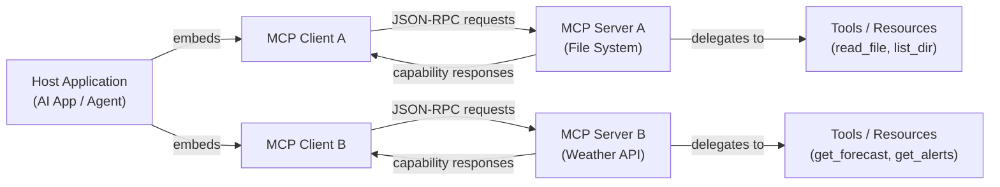

# Model Context Protocol (MCP)

## Definición

El **Model Context Protocol (MCP)** es un estándar abierto que define una forma uniforme para que las aplicaciones de IA se conecten a herramientas externas, fuentes de datos y servicios. En lugar de construir integraciones únicas para cada combinación de modelo de IA y sistema externo, MCP proporciona un lenguaje compartido: una aplicación host habla con un servidor MCP a través de un protocolo bien definido, y el servidor expone capacidades (herramientas, recursos, prompts) que cualquier cliente de IA compatible puede descubrir y usar. MCP fue introducido por Anthropic a finales de 2024 y publicado inmediatamente como un estándar abierto, invitando al ecosistema más amplio a adoptarlo y extenderlo.

Antes de MCP, la integración de herramientas para aplicaciones de IA estaba fragmentada. Cada proveedor tenía su propio formato de llamada a funciones; cada integración tenía que reimplementarse para cada nuevo backend de IA. Una herramienta de ejecución de código escrita para un modelo necesitaba ser reescrita al cambiar de proveedor, y una nueva fuente de datos requería plomería personalizada para cada aplicación de IA que quisiera acceder a ella. MCP resuelve esto separando la preocupación de "cómo habla una IA con una herramienta" (el protocolo) de "qué IA" y "qué herramienta", para que cualquier cliente compatible con MCP pueda usar cualquier servidor compatible con MCP sin código de pegamento adicional.

El impacto práctico es significativo: los desarrolladores pueden construir un servidor MCP una vez — para una base de datos, un sistema de archivos, una API REST, un ejecutor de código — y cada aplicación de IA habilitada para MCP gana acceso a él. El protocolo es agnóstico al transporte (funcionando sobre stdio para procesos locales o HTTP/SSE para servicios remotos), soporta comunicación bidireccional e incluye un handshake de negociación de capacidades para que los clientes y servidores puedan anunciar exactamente lo que soportan.

## Cómo funciona

### Arquitectura cliente-servidor

MCP sigue un modelo estricto cliente-servidor con tres roles distintos. La **aplicación host** es la aplicación orientada a la IA (una interfaz de chat, un asistente de codificación, un agente autónomo) que incorpora uno o más clientes MCP. Cada **cliente MCP** mantiene una conexión 1:1 con un único **servidor MCP** y actúa como intermediario entre el host y las capacidades de ese servidor. El **servidor MCP** es el proceso que posee y expone las capacidades reales — sabe cómo llamar a una API del tiempo, leer un archivo o consultar una base de datos. Esta separación significa que una sola aplicación host puede conectarse a muchos servidores simultáneamente, cada uno proporcionando un conjunto diferente de herramientas.



### Capa de transporte

MCP es agnóstico al transporte: el mismo formato de mensaje JSON-RPC 2.0 se ejecuta sobre dos transportes integrados. El **transporte stdio** se usa para servidores locales — el host genera el servidor como proceso hijo y se comunica a través de sus flujos de entrada y salida estándar. Este es el despliegue más simple: sin red, sin puertos, sin sobrecarga de autenticación. El **transporte HTTP con SSE (Server-Sent Events)** se usa para servidores remotos o compartidos: el cliente envía solicitudes como llamadas HTTP POST y recibe respuestas en streaming a través de un endpoint SSE. Esto habilita servidores alojados de forma centralizada que múltiples clientes pueden compartir, y soporta el despliegue en entornos cloud o de contenedores. Un tercer tipo de transporte, **Streamable HTTP**, se introdujo en la especificación del protocolo como un sucesor más capaz de HTTP/SSE para streaming bidireccional.

### Capacidades: herramientas, recursos y prompts

Un servidor MCP expone hasta tres tipos de capacidades. Las **herramientas** son funciones invocables — análogas a la llamada a funciones en las APIs de LLM — que la IA puede invocar para tomar acciones o recuperar información. Cada herramienta tiene un nombre, una descripción y un JSON Schema que define sus parámetros de entrada. Los **recursos** son fuentes de datos de solo lectura, similares a archivos, que la IA puede acceder — un archivo local, un registro de base de datos, una instantánea de API en vivo — identificados por una URI. Los recursos son el equivalente MCP de la inyección de contexto: permiten al servidor proporcionar a la IA datos estructurados sin requerir una llamada a herramienta. Los **prompts** son plantillas de prompts reutilizables y parametrizadas almacenadas en el servidor; permiten a los autores del servidor definir patrones comunes de interacción (p. ej., "resumir este archivo") que los clientes pueden presentar directamente a los usuarios.

### Negociación de capacidades y ciclo de vida de la sesión

Cuando un cliente se conecta a un servidor, el protocolo comienza con un handshake `initialize`. El cliente envía su versión del protocolo y las capacidades que soporta; el servidor responde con su versión del protocolo y las capacidades que ofrece. Esta negociación asegura que los clientes y servidores con diferentes conjuntos de características puedan interoperar con gracia — un cliente que no soporta prompts simplemente no los usará, incluso si el servidor los ofrece. Después de la inicialización, el cliente llama a `tools/list`, `resources/list` y `prompts/list` para descubrir lo que expone el servidor. Las respuestas de descubrimiento incluyen esquemas completos, descripciones y metadatos. A partir de ese punto, el cliente puede invocar capacidades en nombre del modelo de IA según sea necesario durante toda la sesión.

## Cuándo usar / Cuándo NO usar

| Escenario | MCP | Integración REST/API personalizada | Llamada a funciones nativa |
|---|---|---|---|
| Construyendo herramientas que deben funcionar con múltiples proveedores de IA | Mejor opción — escribe una vez, usa con cualquier cliente MCP | Cada proveedor necesita su propia integración | Bloqueado al formato de API de un solo proveedor |
| Compartir herramientas entre múltiples aplicaciones de IA en tu organización | Mejor opción — un servidor, muchos clientes | Requiere duplicar el código de integración en cada app | No diseñado para compartir entre aplicaciones |
| Herramienta simple y única en una aplicación de un solo proveedor | Excesivo — agrega sobrecarga del protocolo | Bien para casos simples | La opción más sencilla |
| Exponer fuentes de datos existentes (archivos, DBs) como contexto de IA | La capacidad Resources está específicamente diseñada para esto | Requiere lógica de recuperación personalizada | Sin concepto equivalente |
| Resultados en streaming en tiempo real de operaciones de larga duración | Soportado a través del transporte SSE | Requiere lógica de streaming personalizada | Soporte limitado |
| Entornos aislados o muy restringidos | El transporte stdio funciona sin red | Control total | Control total |

## Comparaciones

### MCP vs llamada a funciones de OpenAI

La llamada a funciones de OpenAI y MCP permiten que los modelos de IA invoquen herramientas estructuradas, pero operan a diferentes niveles. La llamada a funciones es una **característica a nivel de API**: los esquemas de herramientas se pasan en el payload de la solicitud, las implementaciones de herramientas viven en el código de tu aplicación, y el patrón es específico al formato de la API de OpenAI. MCP es un **estándar a nivel de protocolo**: las herramientas viven en procesos de servidor separados, el protocolo maneja el descubrimiento y la invocación, y cualquier cliente compatible puede usar cualquier servidor compatible independientemente del proveedor de IA que impulse al cliente. La llamada a funciones es la opción correcta para herramientas simples en proceso en una aplicación de un solo proveedor; MCP es la opción correcta cuando quieres servidores de herramientas portátiles y reutilizables que funcionen entre proveedores y aplicaciones.

### MCP vs herramientas de LangChain

Las herramientas de LangChain son una **abstracción de framework**: envuelven callables de Python en una interfaz estandarizada que entiende el runtime del agente de LangChain. Son poderosas dentro del ecosistema de LangChain pero no definen un protocolo de comunicación entre procesos — una herramienta de LangChain no puede ser llamada por una aplicación que no sea de LangChain sin plomería adicional. MCP es un **protocolo de cable**: define exactamente cómo se serializan y transportan los mensajes entre procesos. Un servidor MCP escrito en TypeScript puede ser llamado por un cliente MCP de Python sin dependencia de framework compartida. Los dos no son mutuamente excluyentes — LangChain y otros frameworks pueden implementar clientes MCP para usar servidores MCP.

### MCP vs llamadas directas a la API REST

Las llamadas directas a la API REST ofrecen máxima flexibilidad y sin sobrecarga de protocolo, pero cada nueva aplicación de IA debe re-implementar la misma autenticación, manejo de errores y formateo de resultados para cada API que llame. MCP proporciona un envelope uniforme que abstrae sobre esas diferencias: la aplicación de IA siempre hace la misma solicitud `tools/call` independientemente de si el servidor está llamando a una API del tiempo, una base de datos SQL o un repositorio de GitHub. El compromiso es que MCP requiere infraestructura de servidor (un proceso de servidor en ejecución), mientras que una llamada REST directa es solo una solicitud HTTP.

## Ejemplos de código

### Servidor MCP mínimo

```typescript
import { McpServer } from "@modelcontextprotocol/sdk/server/mcp.js";
import { StdioServerTransport } from "@modelcontextprotocol/sdk/server/stdio.js";
import { z } from "zod";

// Create the server instance with a name and version
const server = new McpServer({
  name: "demo-server",
  version: "1.0.0",
});

// Register a tool — the AI can call this to get the current time
server.tool(
  "get_current_time",
  "Returns the current UTC time in ISO 8601 format.",
  {}, // No input parameters required
  async () => ({
    content: [
      {
        type: "text",
        text: new Date().toISOString(),
      },
    ],
  })
);

// Register a tool with input parameters
server.tool(
  "add_numbers",
  "Adds two numbers together and returns the result.",
  {
    a: z.number().describe("The first number"),
    b: z.number().describe("The second number"),
  },
  async ({ a, b }) => ({
    content: [
      {
        type: "text",
        text: String(a + b),
      },
    ],
  })
);

// Start the server using stdio transport (runs as a child process)
const transport = new StdioServerTransport();
await server.connect(transport);
console.error("Demo MCP server running on stdio");
```

### Cliente MCP mínimo

```typescript
import { Client } from "@modelcontextprotocol/sdk/client/index.js";
import { StdioClientTransport } from "@modelcontextprotocol/sdk/client/stdio.js";

// Create a transport that spawns the server as a child process
const transport = new StdioClientTransport({
  command: "node",
  args: ["./demo-server.js"],
});

// Create and connect the client
const client = new Client(
  { name: "demo-client", version: "1.0.0" },
  { capabilities: {} }
);

await client.connect(transport);

// Discover available tools
const { tools } = await client.listTools();
console.log("Available tools:", tools.map((t) => t.name));

// Call a tool
const result = await client.callTool({
  name: "add_numbers",
  arguments: { a: 21, b: 21 },
});

console.log("Result:", result.content);
// Output: [{ type: 'text', text: '42' }]

await client.close();
```

## Recursos prácticos

- [Especificación del Model Context Protocol](https://spec.modelcontextprotocol.io) — La especificación oficial del protocolo que cubre todos los tipos de mensajes, transportes y definiciones de capacidades.
- [SDK de TypeScript de MCP](https://github.com/modelcontextprotocol/typescript-sdk) — El SDK oficial de TypeScript/JavaScript para construir servidores y clientes MCP, mantenido por Anthropic.
- [modelcontextprotocol.io](https://modelcontextprotocol.io) — El sitio web oficial de MCP con guías de inicio rápido, documentación conceptual y un registro de servidores construidos por la comunidad.
- [Repositorio de ejemplos de servidores MCP](https://github.com/modelcontextprotocol/servers) — Una colección curada de implementaciones de referencia de servidores MCP que cubren bases de datos, sistemas de archivos, búsqueda web y más.

## Ver también

- [Construcción de servidores MCP](/docs/mcp/building-servers)
- [Construcción de clientes MCP](/docs/mcp/building-clients)
- [Agentes de IA](/docs/agents)
- [Salidas estructuradas](/docs/prompt-engineering/structured-outputs)
