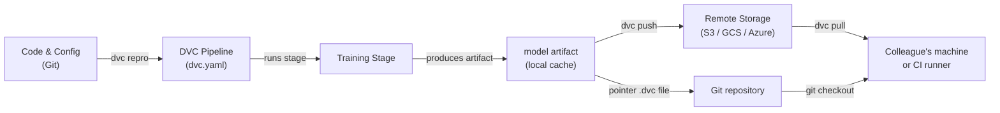

# Data Version Control (DVC)

## Definición

Data Version Control (DVC) es una herramienta de código abierto que extiende Git para rastrear archivos grandes, conjuntos de datos y artefactos de modelos que no pueden almacenarse eficientemente en un repositorio Git. Mientras Git registra cada cambio en el código fuente, DVC almacena un pequeño archivo puntero (`.dvc`) en el repositorio y envía los bytes de datos reales a un backend de almacenamiento remoto configurable — S3, GCS, Azure Blob, SSH o incluso un directorio local. Esto mantiene el repositorio liviano mientras preserva la reproductibilidad completa.

DVC va más allá del simple versionado de archivos. Introduce el concepto de **pipelines** — un DAG (Grafo Acíclico Dirigido) de etapas definidas en un archivo `dvc.yaml`. Cada etapa especifica su comando, sus entradas (dependencias) y sus salidas, para que DVC pueda determinar qué etapas necesitan volver a ejecutarse cuando las entradas cambian. El resultado es un sistema de construcción para ML: reproducible, incremental y con control de versiones junto al código que lo produjo.

DVC se integra estrechamente con los flujos de trabajo de Git. Un archivo `dvc.lock`, confirmado en Git, captura el hash de contenido exacto de cada entrada y salida en el momento en que se ejecutó una pipeline, de modo que verificar un commit histórico de Git y ejecutar `dvc pull` restaura exactamente el conjunto de datos y los artefactos de modelo que existían en ese punto de la historia.

## Cómo funciona



### Inicializar un repositorio DVC

Ejecutar `dvc init` dentro de un repositorio Git crea un directorio `.dvc/` que contiene la configuración y caché local de DVC. DVC registra una entrada `.gitignore` para la carpeta de caché y agrega algunos archivos de seguimiento pequeños que deben confirmarse en Git. A partir de este punto, `dvc add <file>` crea un archivo puntero `.dvc` para cualquier archivo grande — los bytes reales van al caché local y nunca se confirman en Git. Este enfoque de dos capas significa que el repositorio permanece rápido de clonar mientras DVC gestiona los activos pesados por separado.

### Definir y ejecutar pipelines

Un archivo `dvc.yaml` declara cada etapa de la pipeline con su comando, dependencias de entrada y artefactos de salida. Cuando ejecuta `dvc repro`, DVC inspecciona el grafo de dependencias, compara los hashes de contenido de todas las entradas con el snapshot de `dvc.lock`, y vuelve a ejecutar solo las etapas cuyas entradas han cambiado. Esto es análogo a `make` pero con direccionamiento de contenido en lugar de basado en marcas de tiempo, por lo que es determinista incluso entre máquinas y runners de CI. Las pipelines se pueden parametrizar mediante un archivo `params.yaml`, y DVC registra qué valores de parámetros se usaron en cada ejecución.

### Almacenamiento remoto y colaboración

Un remoto DVC es una ubicación de almacenamiento configurada con `dvc remote add`. Los equipos generalmente configuran un bucket de nube compartido para que todos los miembros extraigan los mismos datos. `dvc push` carga artefactos nuevos o modificados al remoto, y `dvc pull` descarga exactamente las versiones referenciadas por el `dvc.lock` del commit de Git actual. Este flujo de trabajo significa que incorporar un nuevo miembro del equipo a un proyecto es `git clone` seguido de `dvc pull` — un único comando que materializa el conjunto de datos correcto y los artefactos de modelo para esa rama.

### Experimentos

`dvc exp run` y `dvc exp show` proporcionan una capa ligera de seguimiento de experimentos sobre las pipelines. Cada experimento es un stash temporal de Git de cambios de parámetros y métricas de resultados, que se pueden comparar en una tabla y promover a una rama completa si son prometedores. Esto es menos rico en características que herramientas dedicadas como MLflow o W&B, pero tiene la ventaja de no requerir infraestructura adicional — todo vive en el repositorio Git.

## Cuándo usar / Cuándo NO usar

| Usar cuando | Evitar cuando |
|---|---|
| Sus conjuntos de datos o archivos de modelo son demasiado grandes para Git (>100 MB) | Todos los datos caben cómodamente en Git LFS y no se necesitan pipelines |
| Necesita pipelines ML reproducibles vinculadas a versiones de código | Sus requisitos de seguimiento de experimentos superan el enfoque ligero de DVC |
| Su equipo usa Git y quiere un flujo de trabajo de control de versiones unificado | Necesita una UI completa para la gestión de experimentos (prefiera MLflow o W&B) |
| Las pipelines CI/CD necesitan extraer artefactos de datos exactos por rama | Los datos son extremadamente sensibles y no pueden salir del almacenamiento on-premises |
| Desea comparar resultados de experimentos sin un servidor separado | El proyecto no tiene remoto compartido y la colaboración no es una preocupación |

## Comparaciones

| Criterio | DVC | Git LFS | MLflow Tracking |
|---|---|---|---|
| Propósito principal | Versionado de datos + pipeline | Versionado de archivos grandes | Seguimiento de experimentos + registro de modelos |
| Soporte de pipeline | Sí (dvc.yaml DAG) | No | No (solo registra ejecuciones) |
| Comparación de experimentos | Básica (dvc exp show) | No | Rica (UI + API) |
| Backends remotos | S3, GCS, Azure, SSH, local | Servidores LFS de GitHub, GitLab | Local, S3, Azure, SFTP |
| Servidor requerido | No | No | Opcional (servidor MLflow) |
| Integración con Git | Principio de diseño central | Principio de diseño central | Opcional (via mlflow.log_param) |

## Pros y contras

| Pros | Contras |
|---|---|
| No se requiere servidor adicional — todo en Git + almacenamiento de objetos | Curva de aprendizaje para equipos no familiarizados con pipelines basadas en DAG |
| Pipelines reproducibles con caché basado en contenido | Los conflictos grandes de dvc.lock pueden ser complicados en monorepos muy activos |
| Funciona con cualquier almacenamiento en la nube o incluso directorios locales | La UI de experimentos es mínima comparada con MLflow / W&B |
| Ligero — DVC es solo una herramienta CLI | No maneja la orquestación de entrenamiento distribuido |
| Integración CI/CD de primera clase via CML | Los costos de almacenamiento remoto son responsabilidad del equipo |

## Ejemplos de código

```bash
# --- DVC setup and basic data tracking ---
git init my-ml-project && cd my-ml-project
dvc init
git add .dvc .dvcignore
git commit -m "Initialize DVC"

dvc remote add -d myremote s3://my-bucket/dvc-store
git add .dvc/config
git commit -m "Add DVC remote"

dvc add data/train.csv
git add data/train.csv.dvc data/.gitignore
git commit -m "Track training dataset with DVC"

dvc push

# --- Collaborator workflow ---
git clone https://github.com/org/my-ml-project
cd my-ml-project
dvc pull
```

```yaml
# dvc.yaml — Define a two-stage pipeline: featurize -> train
stages:
  featurize:
    cmd: python src/featurize.py --input data/train.csv --output data/features.parquet
    deps:
      - src/featurize.py
      - data/train.csv
    outs:
      - data/features.parquet

  train:
    cmd: python src/train.py --features data/features.parquet --output models/
    deps:
      - src/train.py
      - data/features.parquet
      - params.yaml
    outs:
      - models/
    metrics:
      - reports/metrics.json:
          cache: false
```

```python
# src/train.py
import json
import argparse
from pathlib import Path
import yaml
import joblib
import numpy as np
import pandas as pd
from sklearn.ensemble import GradientBoostingClassifier
from sklearn.model_selection import train_test_split
from sklearn.metrics import accuracy_score


def main(features_path: str, output_dir: str) -> None:
    params = yaml.safe_load(Path("params.yaml").read_text())["train"]
    df = pd.read_parquet(features_path)
    X = df.drop(columns=["label"])
    y = df["label"]
    X_train, X_test, y_train, y_test = train_test_split(X, y, test_size=0.2, random_state=42)
    model = GradientBoostingClassifier(
        n_estimators=params["n_estimators"],
        max_depth=params["max_depth"],
        random_state=42,
    )
    model.fit(X_train, y_train)
    out = Path(output_dir)
    out.mkdir(parents=True, exist_ok=True)
    joblib.dump(model, out / "model.joblib")
    accuracy = float(accuracy_score(y_test, model.predict(X_test)))
    Path("reports").mkdir(exist_ok=True)
    Path("reports/metrics.json").write_text(json.dumps({"accuracy": accuracy}, indent=2))
    print(f"Accuracy: {accuracy:.4f}")


if __name__ == "__main__":
    parser = argparse.ArgumentParser()
    parser.add_argument("--features", required=True)
    parser.add_argument("--output", required=True)
    args = parser.parse_args()
    main(args.features, args.output)
```

## Recursos prácticos

- [Documentación oficial de DVC](https://dvc.org/doc) — Guía completa sobre instalación, pipelines, remotos y experimentos.
- [Tutorial DVC Get Started](https://dvc.org/doc/start) — Tutorial práctico para configurar un proyecto DVC desde cero.
- [Blog de Iterative: Git-based MLOps](https://iterative.ai/blog) — Artículos sobre flujos de trabajo MLOps que combinan DVC, CML y MLEM.
- [Repositorio GitHub de DVC](https://github.com/iterative/dvc) — Código fuente e issues de la comunidad.

## Ver también

- [CI/CD para ML](/docs/mlops/cicd)
- [Seguimiento de experimentos](/docs/mlops/experiment-tracking)
- [MLflow](/docs/mlops/mlflow)
