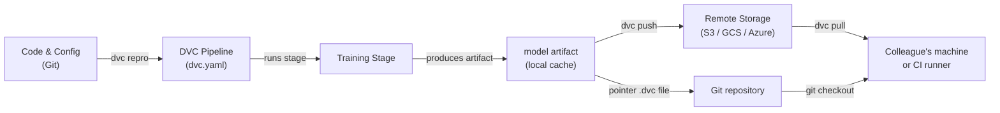

# Data Version Control (DVC)

## Definición

Data Version Control (DVC) es una herramienta de código abierto que extiende Git para rastrear archivos grandes, conjuntos de datos y artefactos de modelos que no pueden almacenarse eficientemente en un repositorio Git. Mientras Git registra cada cambio en el código fuente, DVC almacena un pequeño archivo puntero (`.dvc`) en el repositorio y empuja los bytes de datos reales a un backend de almacenamiento remoto configurable — S3, GCS, Azure Blob, SSH, o incluso un directorio local. Esto mantiene el repositorio ligero mientras preserva la reproducibilidad total.

DVC va más allá del simple versionado de archivos. Introduce el concepto de **pipelines** — un DAG (Grafo Acíclico Dirigido) de etapas definidas en un archivo `dvc.yaml`. Cada etapa especifica su comando, sus entradas (dependencias) y sus salidas, de modo que DVC puede determinar qué etapas necesitan re-ejecutarse cuando cambian las entradas. El resultado es un sistema de construcción para ML: reproducible, incremental y versionado junto al código que lo produjo.

DVC se integra estrechamente con los flujos de trabajo de Git. Un archivo `dvc.lock`, comprometido en Git, captura el hash exacto del contenido de cada entrada y salida en el momento en que se ejecutó un pipeline, de modo que hacer checkout de un commit histórico de Git y ejecutar `dvc pull` restaura el conjunto de datos exacto y los artefactos de modelos que existían en ese punto del historial.

## Cómo funciona



### Inicialización de un repositorio DVC

Ejecutar `dvc init` dentro de un repositorio Git crea un directorio `.dvc/` que contiene la configuración y el caché local de DVC. DVC registra una entrada `.gitignore` para la carpeta de caché y añade algunos pequeños archivos de seguimiento que deben comprometerse en Git. A partir de este punto, `dvc add <file>` crea un archivo puntero `.dvc` para cualquier archivo grande — los bytes reales van al caché local y nunca se comprometen en Git. Este enfoque de dos capas significa que el repositorio permanece rápido de clonar mientras DVC gestiona los activos pesados por separado.

### Definición y ejecución de pipelines

Un archivo `dvc.yaml` declara cada etapa del pipeline con su comando, dependencias de entrada y artefactos de salida. Cuando ejecutas `dvc repro`, DVC inspecciona el gráfico de dependencias, compara los hashes de contenido de todas las entradas con el snapshot `dvc.lock` y re-ejecuta solo las etapas cuyas entradas han cambiado. Esto es análogo a `make` pero basado en contenido en lugar de marcas de tiempo, por lo que es determinista incluso entre máquinas y runners de CI. Los pipelines pueden parametrizarse mediante un archivo `params.yaml`, y DVC registra qué valores de parámetros se usaron en cada ejecución.

### Almacenamiento remoto y colaboración

Un remote de DVC es una ubicación de almacenamiento configurada con `dvc remote add`. Los equipos típicamente configuran un bucket compartido en la nube para que todos los miembros descarguen los mismos datos. `dvc push` carga artefactos nuevos o modificados al remote, y `dvc pull` descarga exactamente las versiones referenciadas por el `dvc.lock` del commit de Git actual. Este flujo de trabajo significa que incorporar a un nuevo miembro del equipo a un proyecto es `git clone` seguido de `dvc pull` — un solo comando que materializa el conjunto de datos correcto y los artefactos de modelos para esa rama.

### Experimentos

`dvc exp run` y `dvc exp show` proporcionan una capa ligera de seguimiento de experimentos sobre los pipelines. Cada experimento es un stash temporal de Git con cambios de parámetros y métricas de resultados, que pueden compararse en una tabla y promovidos a una rama completa si son prometedores. Esto es menos rico en características que herramientas dedicadas como MLflow o W&B, pero tiene la ventaja de no requerir infraestructura adicional — todo vive en el repositorio Git.

## Cuándo usar / Cuándo NO usar

| Usar cuando | Evitar cuando |
|---|---|
| Tus conjuntos de datos o archivos de modelos son demasiado grandes para Git (>100 MB) | Todos los datos caben cómodamente en Git LFS y no se necesitan pipelines |
| Necesitas pipelines de ML reproducibles vinculados a versiones de código | Tus requisitos de seguimiento de experimentos superan el enfoque ligero de DVC |
| Tu equipo usa Git y quiere un flujo de trabajo unificado de control de versiones | Necesitas una interfaz de usuario completa para la gestión de experimentos (prefiere MLflow o W&B) |
| Los pipelines de CI/CD necesitan extraer artefactos de datos exactos por rama | Los datos son extremadamente sensibles y no pueden salir del almacenamiento on-premises |
| Quieres comparar resultados de experimentos sin un servidor separado | El proyecto no tiene remote compartido y la colaboración no es una preocupación |

## Comparaciones

| Criterio | DVC | Git LFS | MLflow Tracking |
|---|---|---|---|
| Propósito principal | Versionado de datos + pipelines | Versionado de archivos grandes | Seguimiento de experimentos + registro de modelos |
| Soporte de pipelines | Sí (DAG dvc.yaml) | No | No (solo registra ejecuciones) |
| Comparación de experimentos | Básica (dvc exp show) | No | Rica (interfaz de usuario + API) |
| Backends remotos | S3, GCS, Azure, SSH, local | Servidores LFS de GitHub, GitLab | Local, S3, Azure, SFTP |
| Servidor requerido | No | No | Opcional (servidor MLflow) |
| Integración con Git | Principio de diseño central | Principio de diseño central | Opcional (vía mlflow.log_param) |

## Ventajas y desventajas

| Ventajas | Desventajas |
|---|---|
| No se requiere servidor extra — todo en Git + almacenamiento de objetos | Curva de aprendizaje para equipos no familiarizados con pipelines basados en DAG |
| Pipelines reproducibles con caché basado en contenido | Los conflictos grandes de dvc.lock pueden ser complicados en monorepos muy activos |
| Funciona con cualquier almacenamiento en la nube o incluso directorios locales | La interfaz de usuario de experimentos es mínima comparada con MLflow / W&B |
| Ligero — DVC es solo una herramienta CLI | No maneja la orquestación de entrenamiento distribuido |
| Integración CI/CD de primera clase vía CML | Los costos de almacenamiento remoto son responsabilidad del equipo |

## Ejemplos de código

```bash
# --- DVC setup and basic data tracking ---

# 1. Initialize DVC inside an existing Git repository
git init my-ml-project && cd my-ml-project
dvc init
git add .dvc .dvcignore
git commit -m "Initialize DVC"

# 2. Configure a remote storage backend (AWS S3 example)
dvc remote add -d myremote s3://my-bucket/dvc-store
git add .dvc/config
git commit -m "Add DVC remote"

# 3. Track a large dataset — DVC creates data/train.csv.dvc
dvc add data/train.csv
git add data/train.csv.dvc data/.gitignore
git commit -m "Track training dataset with DVC"

# 4. Push data to the remote
dvc push

# --- Collaborator workflow ---

# 5. Clone the repo and pull the data artifacts
git clone https://github.com/org/my-ml-project
cd my-ml-project
dvc pull   # downloads data/train.csv from the configured remote
```

```yaml
# dvc.yaml — Define a two-stage pipeline: featurize -> train

stages:
  featurize:
    cmd: python src/featurize.py --input data/train.csv --output data/features.parquet
    deps:
      - src/featurize.py
      - data/train.csv
    outs:
      - data/features.parquet

  train:
    cmd: python src/train.py --features data/features.parquet --output models/
    deps:
      - src/train.py
      - data/features.parquet
      - params.yaml        # parameter file changes trigger re-run
    outs:
      - models/
    metrics:
      - reports/metrics.json:
          cache: false     # small metrics file — commit it to Git
```

```python
# src/train.py — DVC-compatible training script
# Uses joblib (safer than pickle) for model serialization

import json
import argparse
from pathlib import Path

import yaml
import joblib
import pandas as pd
from sklearn.ensemble import GradientBoostingClassifier
from sklearn.model_selection import train_test_split
from sklearn.metrics import accuracy_score


def main(features_path: str, output_dir: str) -> None:
    # Load parameters tracked by DVC from params.yaml
    params = yaml.safe_load(Path("params.yaml").read_text())["train"]

    # Load feature-engineered data produced by the featurize stage
    df = pd.read_parquet(features_path)
    X = df.drop(columns=["label"])
    y = df["label"]

    X_train, X_test, y_train, y_test = train_test_split(
        X, y, test_size=0.2, random_state=42
    )

    # Train with parameters sourced from params.yaml — DVC tracks these
    model = GradientBoostingClassifier(
        n_estimators=params["n_estimators"],
        max_depth=params["max_depth"],
        random_state=42,
    )
    model.fit(X_train, y_train)

    # Save the model artifact — DVC will cache and hash the output directory
    out = Path(output_dir)
    out.mkdir(parents=True, exist_ok=True)
    joblib.dump(model, out / "model.joblib")

    # Write metrics.json so DVC can track and compare across experiments
    accuracy = float(accuracy_score(y_test, model.predict(X_test)))
    Path("reports").mkdir(exist_ok=True)
    Path("reports/metrics.json").write_text(
        json.dumps({"accuracy": accuracy}, indent=2)
    )
    print(f"Accuracy: {accuracy:.4f}")


if __name__ == "__main__":
    parser = argparse.ArgumentParser()
    parser.add_argument("--features", required=True)
    parser.add_argument("--output", required=True)
    args = parser.parse_args()
    main(args.features, args.output)
```

## Recursos prácticos

- [Documentación oficial de DVC](https://dvc.org/doc) — Guía completa que cubre instalación, pipelines, remotes y experimentos.
- [Tutorial de inicio de DVC](https://dvc.org/doc/start) — Tutorial práctico para configurar un proyecto DVC desde cero.
- [Blog de Iterative: MLOps basado en Git](https://iterative.ai/blog) — Artículos sobre flujos de trabajo de MLOps que combinan DVC, CML y MLEM.
- [Repositorio de DVC en GitHub](https://github.com/iterative/dvc) — Código fuente e issues de la comunidad.

## Ver también

- [CI/CD para ML](/docs/mlops/cicd)
- [Seguimiento de experimentos](/docs/mlops/experiment-tracking)
- [MLflow](/docs/mlops/mlflow)
