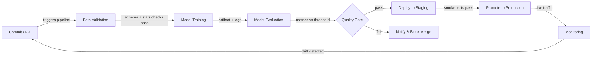

# CI/CD para ML

## Definición

La Integración Continua y Entrega Continua (CI/CD) es una práctica de ingeniería de software que automatiza la construcción, prueba e implementación de código en cada cambio. Cuando se aplica al aprendizaje automático, el alcance se expande más allá del código: la calidad de los datos, el rendimiento del modelo y el versionado de artefactos se convierten en ciudadanos de primera clase de la pipeline. Una pipeline CI/CD de ML rota puede enviar un modelo que se degrada silenciosamente en producción sin que cambie ni una sola línea de código de la aplicación.

El CI/CD tradicional valida la lógica y los contratos de API. El CI/CD de ML debe validar adicionalmente las propiedades estadísticas de los datos (esquema, distribuciones, tasas de valores faltantes), los umbrales de calidad del modelo (precisión, latencia, equidad) y la reproducibilidad — la capacidad de reentrenar exactamente el mismo modelo a partir de las mismas entradas. Herramientas como [DVC](/docs/mlops/cicd/dvc) para el versionado de datos y CML (Continuous Machine Learning) para reportar métricas dentro de las pull requests hacen esto práctico.

El objetivo final es un camino completamente automatizado desde un cambio de código o datos hasta un modelo desplegado de forma segura, con puertas humanas solo donde realmente agregan valor — como revisar una tarjeta de modelo antes de una promoción a producción.

## Cómo funciona



### Validación de datos

Antes de que comience el entrenamiento, la pipeline verifica que los datos entrantes coincidan con el esquema esperado y el perfil estadístico. Great Expectations o TensorFlow Data Validation (TFDV) pueden afirmar que los tipos de columnas son correctos, los rangos de valores son sensatos y no hay picos inesperados en los valores faltantes. Fallar en esta puerta tempranamente evita el desperdicio de cómputo en lotes corruptos. Cualquier deriva del esquema se muestra como una verificación fallida en la pull request, lo que bloquea el merge hasta que el problema sea comprendido y corregido o aceptado explícitamente. Este paso es el equivalente de ML a la verificación de tipos de código antes de ejecutar pruebas.

### Entrenamiento del modelo

El entrenamiento se ejecuta como un trabajo reproducible y parametrizado — idealmente en contenedor para que el entorno exacto (versión de CUDA, fijación de bibliotecas) quede capturado. Un buen sistema CI/CD pasa los hiperparámetros a través de archivos de configuración rastreados en el control de versiones, no codificados en los scripts. Herramientas como [DVC](/docs/mlops/cicd/dvc) rastrean qué versión del conjunto de datos y qué configuración produjo qué artefacto de modelo, para que cualquier modelo entrenado pueda rastrearse hasta sus entradas. Los ejecutados de entrenamiento se registran en un rastreador de experimentos (MLflow, W&B) para que la comparación con el modelo campeón anterior sea automática.

### Evaluación del modelo

Después del entrenamiento, los scripts de evaluación automatizados calculan las métricas objetivo en un conjunto de prueba reservado y las comparan con un umbral definido o con el modelo de producción actual. CML (de Iterative.ai) puede publicar un informe Markdown con tablas de métricas y gráficas directamente en la pull request de GitHub o GitLab, para que los revisores vean las regresiones de rendimiento sin salir de su flujo de trabajo de revisión de código. La evaluación también debe cubrir métricas de equidad basadas en segmentos para dominios regulados. La puerta de calidad solo pasa si el nuevo modelo cumple o supera los umbrales.

### Despliegue y monitoreo

Al pasar la puerta de calidad, el artefacto del modelo se registra en un [registro de modelos](/docs/mlops/cicd/model-registry) y se despliega en un entorno de staging donde se ejecutan pruebas de humo contra tráfico real (o representativo). La promoción a producción puede ser manual (un clic en la UI del registro) o completamente automatizada. Una vez en producción, una capa de [monitoreo](/docs/mlops/monitoring) rastrea la deriva de datos, la deriva de predicciones y los KPIs de negocio, y puede activar una ejecución de reentrenamiento — completando el ciclo de retroalimentación de vuelta al paso de Commit.

## Cuándo usar / Cuándo NO usar

| Usar cuando | Evitar cuando |
|---|---|
| Múltiples científicos de datos hacen commits en código de modelo compartido | Se trabaja solo en un experimento de notebook puntual |
| Los modelos se reentrenan regularmente con datos frescos | El modelo es estático y se entrenó una vez, sin actualizaciones |
| Los fallos en producción son costosos (fraude, salud, seguridad) | Etapa de prototipo donde la velocidad de iteración supera la corrección |
| El equipo necesita reproducibilidad y registros de auditoría | La madurez de infraestructura/DevOps es muy baja |
| El cumplimiento normativo requiere versionado documentado del modelo | El conjunto de datos es pequeño y cabe en un único notebook |

## Comparaciones

| Criterio | CI/CD tradicional | CI/CD de ML |
|---|---|---|
| Artefacto principal | Binario / imagen Docker | Artefacto de modelo + versión de datos |
| Tipos de prueba | Unitaria, integración, E2E | Unitaria + calidad de datos + calidad de modelo + equidad |
| Disparador | Push de código | Push de código O nuevos datos O reentrenamiento programado |
| Rollback | Redesplegar imagen anterior | Redesplegar versión anterior del modelo desde el registro |
| Observabilidad | Logs de aplicación, trazas | Deriva de datos, deriva de predicciones, métricas de negocio |

## Pros y contras

| Pros | Contras |
|---|---|
| Detecta regresiones antes de que lleguen a producción | Mayor costo de configuración que el CI/CD tradicional |
| Registro de auditoría completo de datos + código + versiones de modelo | La validación de datos requiere experiencia de dominio para definirse correctamente |
| Permite actualizaciones de modelos frecuentes y seguras | Los trabajos de entrenamiento pueden ser lentos, alargando los ciclos de retroalimentación CI |
| Reduce las transferencias manuales entre ciencia de datos y operaciones | Requiere alineación entre equipos de datos, ML y plataforma |
| Las métricas en PRs mejoran la calidad de la revisión de código | Los umbrales mal configurados pueden bloquear mejoras válidas |

## Ejemplos de código

```yaml
# .github/workflows/ml-pipeline.yml
name: ML Pipeline
on:
  push:
    branches: [main, "feat/**"]
  pull_request:
    branches: [main]
jobs:
  ml-pipeline:
    runs-on: ubuntu-latest
    steps:
      - name: Checkout code
        uses: actions/checkout@v4
        with:
          fetch-depth: 0
      - name: Set up Python 3.11
        uses: actions/setup-python@v5
        with:
          python-version: "3.11"
      - name: Install dependencies
        run: pip install -r requirements.txt
      - name: Pull DVC artifacts
        env:
          AWS_ACCESS_KEY_ID: ${{ secrets.AWS_ACCESS_KEY_ID }}
          AWS_SECRET_ACCESS_KEY: ${{ secrets.AWS_SECRET_ACCESS_KEY }}
        run: dvc pull
      - name: Validate data
        run: python src/validate_data.py --data data/train.csv
      - name: Train model
        run: python src/train.py --config configs/train.yaml
      - name: Evaluate model
        run: python src/evaluate.py --output reports/metrics.md
      - name: Post CML report
        uses: iterative/setup-cml@v2
        with:
          version: latest
      - name: Publish CML report
        env:
          REPO_TOKEN: ${{ secrets.GITHUB_TOKEN }}
        run: |
          echo "## Model evaluation report" >> reports/metrics.md
          cml comment create reports/metrics.md
      - name: Push DVC artifacts
        if: github.ref == 'refs/heads/main'
        env:
          AWS_ACCESS_KEY_ID: ${{ secrets.AWS_ACCESS_KEY_ID }}
          AWS_SECRET_ACCESS_KEY: ${{ secrets.AWS_SECRET_ACCESS_KEY }}
        run: dvc push
```

```python
# src/validate_data.py
import argparse
import sys
import pandas as pd

EXPECTED_COLUMNS = {"feature_a", "feature_b", "label"}
MAX_MISSING_RATE = 0.05

def validate(path: str) -> None:
    df = pd.read_csv(path)
    missing_cols = EXPECTED_COLUMNS - set(df.columns)
    if missing_cols:
        print(f"FAIL: Missing columns: {missing_cols}")
        sys.exit(1)
    for col in EXPECTED_COLUMNS:
        rate = df[col].isna().mean()
        if rate > MAX_MISSING_RATE:
            print(f"FAIL: Column '{col}' has {rate:.1%} missing values (threshold: {MAX_MISSING_RATE:.0%})")
            sys.exit(1)
    print("Data validation passed.")

if __name__ == "__main__":
    parser = argparse.ArgumentParser()
    parser.add_argument("--data", required=True)
    args = parser.parse_args()
    validate(args.data)
```

## Recursos prácticos

- [CML (Continuous Machine Learning) by Iterative](https://cml.dev/) — Documentación oficial para publicar métricas y gráficas de ML directamente en PRs de GitHub/GitLab.
- [GitHub Actions for ML — Iterative guide](https://iterative.ai/blog/github-actions-ml) — Tutorial para configurar una pipeline ML de extremo a extremo con GitHub Actions y DVC.
- [Google MLOps: Continuous delivery and automation pipelines in ML](https://cloud.google.com/architecture/mlops-continuous-delivery-and-automation-pipelines-in-machine-learning) — Arquitectura de referencia de Google que describe tres niveles de madurez de automatización ML.
- [Great Expectations documentation](https://docs.greatexpectations.io/) — Framework para la validación y documentación de datos en pipelines de ML.

## Ver también

- [Data Version Control (DVC)](/docs/mlops/cicd/dvc)
- [Registro de modelos](/docs/mlops/cicd/model-registry)
- [Visión general de MLOps](/docs/mlops)
