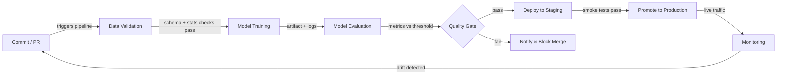

# CI/CD para ML

## Definición

La Integración Continua y la Entrega Continua (CI/CD) es una práctica de ingeniería de software que automatiza la construcción, prueba y despliegue de código en cada cambio. Cuando se aplica al aprendizaje automático, el alcance se expande más allá del código: la calidad de los datos, el rendimiento del modelo y el versionado de artefactos se convierten en ciudadanos de primera clase del pipeline. Un pipeline de CI/CD de ML roto puede entregar un modelo que se degrada silenciosamente en producción sin que cambie una sola línea del código de la aplicación.

El CI/CD tradicional valida la lógica y los contratos de API. El CI/CD de ML debe además validar las propiedades estadísticas de los datos (esquema, distribuciones, tasas de valores faltantes), los umbrales de calidad del modelo (precisión, latencia, equidad) y la reproducibilidad — la capacidad de re-entrenar exactamente el mismo modelo a partir de exactamente las mismas entradas. Herramientas como [DVC](/docs/mlops/cicd/dvc) para el versionado de datos y CML (Continuous Machine Learning) para informar métricas dentro de pull requests hacen esto práctico.

El objetivo final es una ruta completamente automatizada desde un cambio de código o datos hasta un modelo desplegado de forma segura, con puertas humanas solo donde genuinamente agregan valor — como revisar una tarjeta de modelo antes de una promoción a producción.

## Cómo funciona



### Validación de datos

Antes de que comience el entrenamiento, el pipeline verifica que los datos entrantes coincidan con el esquema y el perfil estadístico esperados. Great Expectations o TensorFlow Data Validation (TFDV) pueden verificar que los tipos de columnas sean correctos, los rangos de valores sean razonables y no haya picos inesperados en los valores faltantes. Fallar en esta puerta de forma temprana previene el desperdicio de cómputo en lotes corruptos. Cualquier drift de esquema se expone como una verificación fallida en el pull request, lo que bloquea el merge hasta que el problema se entienda y se corrija o se acepte explícitamente. Este paso es el equivalente en ML de verificar tipos en el código antes de ejecutar las pruebas.

### Entrenamiento del modelo

El entrenamiento se ejecuta como un trabajo reproducible y parametrizado — idealmente en contenedores para que el entorno exacto (versión CUDA, fijación de bibliotecas) quede capturado. Un buen sistema de CI/CD pasa los hiperparámetros a través de archivos de configuración rastreados en el control de versiones, no codificados directamente en los scripts. Herramientas como [DVC](/docs/mlops/cicd/dvc) rastrean qué versión del conjunto de datos y qué configuración produjo qué artefacto de modelo, de modo que cualquier modelo entrenado puede rastrearse hasta sus entradas. Las ejecuciones de entrenamiento se registran en un tracker de experimentos (MLflow, W&B) para que la comparación con el modelo campeón anterior sea automática.

### Evaluación del modelo

Después del entrenamiento, los scripts de evaluación automatizados calculan las métricas objetivo en un conjunto de prueba reservado y las comparan con un umbral definido o con el modelo de producción actual. CML (de Iterative.ai) puede publicar un informe Markdown con tablas de métricas y gráficos directamente en el pull request de GitHub o GitLab, para que los revisores vean las regresiones de rendimiento sin salir de su flujo de revisión de código. La evaluación también debe cubrir métricas de equidad por segmentos para dominios regulados. La puerta de calidad pasa solo si el nuevo modelo cumple o supera los umbrales.

### Despliegue y monitoreo

Al pasar la puerta de calidad, el artefacto del modelo se registra en un [registro de modelos](/docs/mlops/cicd/model-registry) y se despliega en un entorno de staging donde las pruebas de humo se ejecutan contra el tráfico real (o representativo). La promoción a producción puede ser manual (un clic en la interfaz del registro) o completamente automatizada. Una vez en producción, una capa de [monitoreo](/docs/mlops/monitoring) rastrea el drift de datos, el drift de predicciones y los KPIs de negocio, y puede activar una ejecución de re-entrenamiento — completando el bucle de retroalimentación de vuelta al paso de Commit.

## Cuándo usar / Cuándo NO usar

| Usar cuando | Evitar cuando |
|---|---|
| Múltiples científicos de datos hacen commits al código de modelos compartidos | Trabajando en solitario en un experimento de notebook único |
| Los modelos se re-entrenan regularmente con datos frescos | El modelo es estático y se entrena una vez, nunca se actualiza |
| Los fallos de producción son costosos (fraude, salud, seguridad) | Etapa de prototipo donde la velocidad de iteración supera la corrección |
| El equipo necesita reproducibilidad y rastros de auditoría | La madurez de infraestructura / DevOps es muy baja |
| El cumplimiento regulatorio requiere el versionado documentado del modelo | El conjunto de datos es pequeño y cabe en un solo notebook de principio a fin |

## Comparaciones

| Criterio | CI/CD tradicional | CI/CD de ML |
|---|---|---|
| Artefacto principal | Binario / imagen Docker | Artefacto del modelo + versión de datos |
| Tipos de prueba | Unitaria, integración, E2E | Unitaria + calidad de datos + calidad del modelo + equidad |
| Disparador | Push de código | Push de código O nuevos datos O re-entrenamiento programado |
| Rollback | Redesplegar imagen anterior | Redesplegar versión anterior del modelo desde el registro |
| Observabilidad | Logs de aplicación, trazas | Drift de datos, drift de predicciones, métricas de negocio |

## Ventajas y desventajas

| Ventajas | Desventajas |
|---|---|
| Detecta regresiones antes de que lleguen a producción | Mayor costo de configuración que el CI/CD tradicional |
| Rastro de auditoría completo de versiones de datos + código + modelo | La validación de datos requiere experiencia de dominio para definirse correctamente |
| Permite actualizaciones frecuentes y seguras del modelo | Los trabajos de entrenamiento pueden ser lentos, alargando los bucles de retroalimentación de CI |
| Reduce los traspasos manuales entre ciencia de datos y operaciones | Requiere alineación entre equipos de datos, ML y plataforma |
| Las métricas en PRs mejoran la calidad de la revisión de código | Los umbrales mal configurados pueden bloquear mejoras válidas |

## Ejemplos de código

```yaml
# .github/workflows/ml-pipeline.yml
# GitHub Actions workflow for a full ML CI/CD pipeline with CML reporting

name: ML Pipeline

on:
  push:
    branches: [main, "feat/**"]
  pull_request:
    branches: [main]

jobs:
  ml-pipeline:
    runs-on: ubuntu-latest

    steps:
      # 1. Check out the repository with full git history (needed for DVC)
      - name: Checkout code
        uses: actions/checkout@v4
        with:
          fetch-depth: 0

      # 2. Set up Python and install dependencies
      - name: Set up Python 3.11
        uses: actions/setup-python@v5
        with:
          python-version: "3.11"

      - name: Install dependencies
        run: pip install -r requirements.txt

      # 3. Pull data and model artifacts from DVC remote
      - name: Pull DVC artifacts
        env:
          AWS_ACCESS_KEY_ID: ${{ secrets.AWS_ACCESS_KEY_ID }}
          AWS_SECRET_ACCESS_KEY: ${{ secrets.AWS_SECRET_ACCESS_KEY }}
        run: dvc pull

      # 4. Validate data quality before training
      - name: Validate data
        run: python src/validate_data.py --data data/train.csv

      # 5. Train the model and save metrics to metrics.json
      - name: Train model
        run: python src/train.py --config configs/train.yaml

      # 6. Evaluate model and write report for CML
      - name: Evaluate model
        run: python src/evaluate.py --output reports/metrics.md

      # 7. Post CML report as a comment on the pull request
      - name: Post CML report
        uses: iterative/setup-cml@v2
        with:
          version: latest

      - name: Publish CML report
        env:
          REPO_TOKEN: ${{ secrets.GITHUB_TOKEN }}
        run: |
          # Append the confusion matrix image to the report
          echo "## Model evaluation report" >> reports/metrics.md
          cml comment create reports/metrics.md

      # 8. Push updated DVC artifacts (only on main)
      - name: Push DVC artifacts
        if: github.ref == 'refs/heads/main'
        env:
          AWS_ACCESS_KEY_ID: ${{ secrets.AWS_ACCESS_KEY_ID }}
          AWS_SECRET_ACCESS_KEY: ${{ secrets.AWS_SECRET_ACCESS_KEY }}
        run: dvc push
```

```python
# src/validate_data.py
# Simple data validation gate using pandas — replace with Great Expectations for production

import argparse
import sys
import pandas as pd

EXPECTED_COLUMNS = {"feature_a", "feature_b", "label"}
MAX_MISSING_RATE = 0.05  # 5% threshold


def validate(path: str) -> None:
    df = pd.read_csv(path)

    # Check that all required columns are present
    missing_cols = EXPECTED_COLUMNS - set(df.columns)
    if missing_cols:
        print(f"FAIL: Missing columns: {missing_cols}")
        sys.exit(1)

    # Check missing-value rates
    for col in EXPECTED_COLUMNS:
        rate = df[col].isna().mean()
        if rate > MAX_MISSING_RATE:
            print(f"FAIL: Column '{col}' has {rate:.1%} missing values (threshold: {MAX_MISSING_RATE:.0%})")
            sys.exit(1)

    print("Data validation passed.")


if __name__ == "__main__":
    parser = argparse.ArgumentParser()
    parser.add_argument("--data", required=True)
    args = parser.parse_args()
    validate(args.data)
```

## Recursos prácticos

- [CML (Continuous Machine Learning) de Iterative](https://cml.dev/) — Documentación oficial para publicar métricas y gráficos de ML directamente en PRs de GitHub/GitLab.
- [GitHub Actions para ML — guía de Iterative](https://iterative.ai/blog/github-actions-ml) — Tutorial para configurar un pipeline de ML de extremo a extremo con GitHub Actions y DVC.
- [Google MLOps: pipelines de entrega y automatización continua en ML](https://cloud.google.com/architecture/mlops-continuous-delivery-and-automation-pipelines-in-machine-learning) — Arquitectura de referencia de Google que describe tres niveles de madurez de automatización de ML.
- [Documentación de Great Expectations](https://docs.greatexpectations.io/) — Framework para la validación y documentación de datos en pipelines de ML.

## Ver también

- [Data Version Control (DVC)](/docs/mlops/cicd/dvc)
- [Registro de modelos](/docs/mlops/cicd/model-registry)
- [Visión general de MLOps](/docs/mlops)
