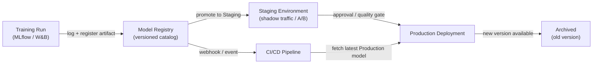

# Registro de modelos

## Definición

Un registro de modelos es un catálogo centralizado que almacena, versiona y gobierna los artefactos de modelos de ML entrenados a lo largo de su ciclo de vida — desde la experimentación inicial pasando por el staging, el despliegue en producción y el eventual retiro. Piénsalo como el equivalente de un repositorio de artefactos de software (como Nexus o Artifactory) pero diseñado específicamente para el aprendizaje automático, con metadatos adicionales sobre los datos de entrenamiento, métricas de evaluación y estado de aprobación adjuntos a cada versión.

Sin un registro, los equipos suelen compartir modelos a través de canales ad-hoc: mensajes de Slack con enlaces S3, directorios compartidos o rutas codificadas directamente en scripts de despliegue. Esto hace imposible responder preguntas básicas de gobernanza como "¿qué modelo está actualmente en producción?", "¿quién aprobó este modelo para su despliegue?" o "¿qué conjunto de datos se usó para entrenar la versión que causó el incidente la semana pasada?". Un registro hace que estas preguntas sean trivialmente respondibles.

Los registros de modelos se integran tanto con el lado del entrenamiento (los trackers de experimentos registran una ejecución y el artefacto de la mejor ejecución se registra en el catálogo) como con el lado del despliegue (la infraestructura de CI/CD o de servicio extrae el artefacto en la etapa `Production`). Típicamente imponen un flujo de trabajo de promoción — `None → Staging → Production → Archived` — que puede requerir aprobación humana, puertas de calidad automatizadas o ambas antes de que un modelo avance a la siguiente etapa.

## Cómo funciona



### Registro del modelo

Después de que se completa una ejecución de entrenamiento y las métricas se registran en un tracker de experimentos, el mejor artefacto se registra en el registro con `mlflow.register_model()` o la llamada SDK equivalente. Cada registro crea una nueva **versión** de un modelo con nombre (p. ej., `fraud-detector`). Las versiones son inmutables — no puedes sobrescribir una versión registrada, solo crear una nueva. Los metadatos como el ID de ejecución, el hash del conjunto de datos, los parámetros de entrenamiento y las métricas de evaluación se adjuntan a la versión y son consultables a través de la API o la interfaz del registro.

### Flujo de trabajo de staging

Las versiones recién registradas comienzan en la etapa `None` (o `Candidate`). Un científico de datos o una puerta automatizada promueve una versión a `Staging` para una validación más profunda — pruebas de integración, despliegue en sombra, división de tráfico canary o comparación A/B con el modelo de producción actual. El staging es un entorno seguro donde las regresiones quedan contenidas; cualquier fallo aquí evita que el modelo llegue a producción sin bloquear el sistema de servicio.

### Promoción a producción y gobernanza

La promoción a `Production` puede requerir un paso de aprobación humana, especialmente en industrias reguladas. Muchos equipos implementan una revisión estilo pull request: el registro emite un webhook, un revisor examina la tarjeta del modelo (que documenta los datos de entrenamiento, las métricas de equidad y las limitaciones conocidas), y la promoción se registra en un log de auditoría con la identidad del aprobador y la marca de tiempo. La infraestructura de servicio se suscribe a la etapa `Production` y carga automáticamente la nueva versión del modelo cuando ocurre la promoción, habilitando actualizaciones de modelos sin tiempo de inactividad.

### Archivado y rollback

Cuando una nueva versión llega a `Production`, la versión anterior pasa a `Archived`. El archivado no elimina el artefacto — permanece completamente recuperable para rollback o análisis forense. Si la nueva versión de producción se degrada (detectado por el [monitoreo](/docs/mlops/monitoring)), el equipo de operaciones puede volver a promover la versión archivada a `Production` en segundos, haciendo rollback sin un despliegue de código.

## Cuándo usar / Cuándo NO usar

| Usar cuando | Evitar cuando |
|---|---|
| Múltiples modelos o versiones de modelos se despliegan simultáneamente | Tienes un único modelo entrenado una sola vez sin planes de actualizarlo |
| Los requisitos regulatorios o de auditoría exigen la procedencia del modelo | El equipo está en fase de I+D temprana sin despliegue en producción aún |
| Diferentes equipos son dueños del entrenamiento vs. el despliegue | Una sola persona entrena y despliega en un único script |
| Necesitas capacidad de rollback para los modelos en producción | La sobrecarga del proceso de gobernanza no está justificada por el nivel de riesgo |
| Las pruebas A/B o el despliegue en sombra requieren gestionar múltiples versiones en vivo | El seguimiento de experimentos por sí solo ya satisface tus necesidades de gobernanza |

## Comparaciones

| Criterio | MLflow Model Registry | W&B Registry | AWS SageMaker Model Registry |
|---|---|---|---|
| Alojamiento | Auto-hospedado o gestionado por Databricks | SaaS (nube W&B) | Servicio AWS completamente gestionado |
| Integración | Servidor de tracking de MLflow | Seguimiento de experimentos de W&B | Entrenamiento + endpoints de SageMaker |
| Flujo de trabajo de etapas | None → Staging → Production → Archived | Basado en alias (etapas personalizadas) | Pending → Approved → Rejected |
| Proceso de aprobación | Manual vía interfaz/API | Manual vía interfaz/API | Integración con AWS IAM / CodePipeline |
| Costo | Código abierto (auto-hospedado gratuito) | Nivel gratuito + planes de pago | Precios de AWS por uso |

## Ventajas y desventajas

| Ventajas | Desventajas |
|---|---|
| Fuente única de verdad para todos los modelos en producción | Agrega sobrecarga de proceso — los equipos deben recordar registrar los artefactos |
| Permite rollback en segundos sin un despliegue de código | Los registros auto-hospedados requieren mantenimiento de infraestructura |
| Rastro de auditoría completo con identidad del aprobador y marcas de tiempo | Se requiere trabajo de integración para conectar los pipelines de entrenamiento al registro |
| Desacopla la promoción del modelo de los ciclos de despliegue de código | Los procesos de gobernanza pueden ralentizar a los equipos que se mueven rápido si están sobrediseñados |
| Permite pruebas A/B seguras al servir múltiples versiones registradas | Los costos de almacenamiento de artefactos crecen con el tiempo a medida que se acumulan versiones |

## Ejemplos de código

```python
# model_registry_example.py
# Demonstrates registering, transitioning, and loading models with MLflow Model Registry

import mlflow
import mlflow.sklearn
from mlflow.tracking import MlflowClient
from sklearn.datasets import make_classification
from sklearn.ensemble import RandomForestClassifier
from sklearn.model_selection import train_test_split
from sklearn.metrics import accuracy_score

# --- 1. Train and log a model to MLflow tracking server ---

mlflow.set_tracking_uri("http://localhost:5000")  # or your MLflow server URI
mlflow.set_experiment("fraud-detection")

X, y = make_classification(n_samples=5000, n_features=20, random_state=42)
X_train, X_test, y_train, y_test = train_test_split(X, y, test_size=0.2, random_state=42)

with mlflow.start_run(run_name="rf-baseline") as run:
    model = RandomForestClassifier(n_estimators=100, random_state=42)
    model.fit(X_train, y_train)

    accuracy = accuracy_score(y_test, model.predict(X_test))

    # Log parameters and metrics — these attach to the registered version
    mlflow.log_param("n_estimators", 100)
    mlflow.log_metric("accuracy", accuracy)

    # Log the model artifact with a schema signature for validation at serving time
    signature = mlflow.models.infer_signature(X_train, model.predict(X_train))
    mlflow.sklearn.log_model(
        sk_model=model,
        artifact_path="model",
        signature=signature,
        registered_model_name="fraud-detector",  # registers on log if name provided
    )

    run_id = run.info.run_id
    print(f"Run ID: {run_id} | Accuracy: {accuracy:.4f}")

# --- 2. Transition the newly registered version to Staging ---

client = MlflowClient()

# Fetch the latest version of the model (just registered above)
latest_versions = client.get_latest_versions("fraud-detector", stages=["None"])
new_version = latest_versions[0].version

# Promote to Staging for integration testing
client.transition_model_version_stage(
    name="fraud-detector",
    version=new_version,
    stage="Staging",
    archive_existing_versions=False,  # keep other Staging versions for comparison
)
print(f"Version {new_version} promoted to Staging")

# --- 3. After validation, promote Staging model to Production ---

# Archive the current Production version and promote Staging to Production
client.transition_model_version_stage(
    name="fraud-detector",
    version=new_version,
    stage="Production",
    archive_existing_versions=True,  # automatically archive the old Production version
)
print(f"Version {new_version} is now Production")

# Add a description to document why this version was promoted
client.update_model_version(
    name="fraud-detector",
    version=new_version,
    description="Promoted after passing shadow traffic test with 0.1% error rate improvement.",
)

# --- 4. Load the Production model in a serving or batch scoring script ---

production_model = mlflow.sklearn.load_model("models:/fraud-detector/Production")
predictions = production_model.predict(X_test)
print(f"Loaded Production model accuracy: {accuracy_score(y_test, predictions):.4f}")
```

## Recursos prácticos

- [Documentación del MLflow Model Registry](https://mlflow.org/docs/latest/model-registry.html) — Guía oficial con referencia de la API Python y tutorial de la interfaz de usuario.
- [W&B Registry](https://docs.wandb.ai/guides/model_registry) — Registro de modelos de W&B con artefactos enlazados y gráficos de linaje.
- [AWS SageMaker Model Registry](https://docs.aws.amazon.com/sagemaker/latest/dg/model-registry.html) — Registro gestionado integrado con SageMaker Pipelines y CodePipeline.
- [Google Vertex AI Model Registry](https://cloud.google.com/vertex-ai/docs/model-registry/introduction) — Solución gestionada de GCP para el versionado y despliegue de modelos.

## Ver también

- [MLflow](/docs/mlops/mlflow)
- [Weights & Biases (W&B)](/docs/mlops/wandb)
- [Servicio de modelos](/docs/mlops/deployment/model-serving)
