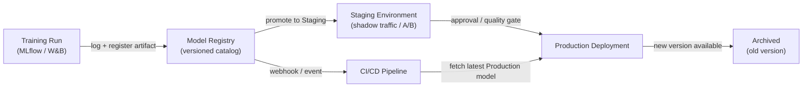

# Registro de modelos

## Definición

Un registro de modelos es un catálogo centralizado que almacena, versiona y gobierna los artefactos de modelos ML entrenados durante todo su ciclo de vida — desde la experimentación inicial, pasando por el staging y el despliegue en producción, hasta su eventual retiro. Piénselo como el equivalente de un repositorio de artefactos de software (como Nexus o Artifactory) pero construido específicamente para el machine learning, con metadatos adicionales sobre datos de entrenamiento, métricas de evaluación y estado de aprobación adjuntos a cada versión.

Sin un registro, los equipos comúnmente comparten modelos a través de canales ad hoc: mensajes de Slack con enlaces S3, directorios compartidos o rutas codificadas en los scripts de despliegue. Esto hace imposible responder preguntas básicas de gobernanza como "¿qué modelo está actualmente en producción?", "¿quién aprobó este modelo para el despliegue?" o "¿qué conjunto de datos se usó para entrenar la versión que causó el incidente la semana pasada?". Un registro hace que estas preguntas sean trivialmente respondibles.

Los registros de modelos se integran tanto en el lado del entrenamiento (los rastreadores de experimentos registran una ejecución, y el artefacto de la mejor ejecución se registra) como en el lado del despliegue (CI/CD o la infraestructura de serving extrae el artefacto en la etapa `Production`). Generalmente aplican un flujo de trabajo de promoción — `None → Staging → Production → Archived` — que puede requerir aprobación humana, puertas de calidad automatizadas, o ambas antes de que un modelo avance a la siguiente etapa.

## Cómo funciona



### Registro del modelo

Después de que se completa una ejecución de entrenamiento y se registran las métricas en un rastreador de experimentos, el mejor artefacto se registra en el registro con `mlflow.register_model()` o la llamada SDK equivalente. Cada registro crea una nueva **versión** de un modelo con nombre (por ejemplo, `fraud-detector`). Las versiones son inmutables — no puede sobrescribir una versión registrada, solo crear una nueva. Los metadatos como el ID de ejecución, el hash del conjunto de datos, los parámetros de entrenamiento y las métricas de evaluación se adjuntan a la versión y son consultables a través de la API o la UI del registro.

### Flujo de trabajo de staging

Las versiones recién registradas comienzan en la etapa `None` (o `Candidate`). Un científico de datos o una puerta automatizada promueve una versión a `Staging` para una validación más profunda — pruebas de integración, despliegue en sombra, división de tráfico canary o comparación A/B con el modelo de producción actual. Staging es un entorno seguro donde las regresiones se contienen; cualquier fallo aquí evita que el modelo llegue a producción sin bloquear el sistema de serving.

### Promoción a producción y gobernanza

La promoción a `Production` puede requerir un paso de aprobación humana, especialmente en industrias reguladas. Muchos equipos implementan una revisión estilo pull-request: el registro emite un webhook, un revisor examina la tarjeta del modelo (que documenta los datos de entrenamiento, las métricas de equidad y las limitaciones conocidas), y la promoción se registra en un log de auditoría con la identidad del aprobador y el timestamp. La infraestructura de serving se suscribe a la etapa `Production` y carga automáticamente la nueva versión del modelo cuando ocurre la promoción, lo que permite actualizaciones de modelo con zero downtime.

### Archivado y rollback

Cuando una nueva versión llega a `Production`, la versión anterior pasa a `Archived`. El archivado no elimina el artefacto — permanece totalmente recuperable para rollback o análisis forense. Si la nueva versión de producción se degrada (detectado por [monitoreo](/docs/mlops/monitoring)), el equipo de operaciones puede re-promover la versión archivada a `Production` en segundos, realizando rollback sin un despliegue de código.

## Cuándo usar / Cuándo NO usar

| Usar cuando | Evitar cuando |
|---|---|
| Múltiples modelos o versiones de modelos se despliegan simultáneamente | Tiene un único modelo entrenado una vez sin planes de actualizarlo |
| Los requisitos regulatorios o de auditoría exigen proveniencia del modelo | El equipo está en fase de I+D temprana sin despliegue en producción aún |
| Diferentes equipos poseen el entrenamiento vs. el despliegue | Una única persona entrena y despliega en un solo script |
| Necesita capacidad de rollback para modelos de producción | El overhead del proceso de gobernanza no está justificado por el nivel de riesgo |
| Las pruebas A/B o el despliegue en sombra requieren gestionar múltiples versiones en vivo | El seguimiento de experimentos por sí solo ya satisface sus necesidades de gobernanza |

## Comparaciones

| Criterio | MLflow Model Registry | W&B Registry | AWS SageMaker Model Registry |
|---|---|---|---|
| Alojamiento | Self-hosted o gestionado por Databricks | SaaS (nube W&B) | Servicio AWS totalmente gestionado |
| Integración | Servidor de seguimiento MLflow | Seguimiento de experimentos W&B | Entrenamiento SageMaker + endpoints |
| Flujo de etapas | None → Staging → Production → Archived | Basado en alias (etapas personalizadas) | Pending → Approved → Rejected |
| Proceso de aprobación | Manual via UI/API | Manual via UI/API | Integración con AWS IAM / CodePipeline |
| Costo | Open source (self-hosted gratuito) | Nivel gratuito + planes de pago | Precios AWS pay-per-use |

## Pros y contras

| Pros | Contras |
|---|---|
| Fuente única de verdad para todos los modelos de producción | Agrega overhead de proceso — los equipos deben recordar registrar artefactos |
| Permite rollback en segundos sin un despliegue de código | Los registros self-hosted requieren mantenimiento de infraestructura |
| Registro de auditoría completo con identidad del aprobador y timestamps | Se requiere trabajo de integración para conectar las pipelines de entrenamiento al registro |
| Desacopla la promoción de modelos de los ciclos de despliegue de código | Los procesos de gobernanza pueden ralentizar equipos ágiles si están sobre-ingeniados |
| Permite pruebas A/B seguras sirviendo múltiples versiones registradas | Los costos de almacenamiento de artefactos crecen con el tiempo al acumularse versiones |

## Ejemplos de código

```python
# model_registry_example.py
import mlflow
import mlflow.sklearn
from mlflow.tracking import MlflowClient
from sklearn.datasets import make_classification
from sklearn.ensemble import RandomForestClassifier
from sklearn.model_selection import train_test_split
from sklearn.metrics import accuracy_score

mlflow.set_tracking_uri("http://localhost:5000")
mlflow.set_experiment("fraud-detection")

X, y = make_classification(n_samples=5000, n_features=20, random_state=42)
X_train, X_test, y_train, y_test = train_test_split(X, y, test_size=0.2, random_state=42)

with mlflow.start_run(run_name="rf-baseline") as run:
    model = RandomForestClassifier(n_estimators=100, random_state=42)
    model.fit(X_train, y_train)
    accuracy = accuracy_score(y_test, model.predict(X_test))
    mlflow.log_param("n_estimators", 100)
    mlflow.log_metric("accuracy", accuracy)
    signature = mlflow.models.infer_signature(X_train, model.predict(X_train))
    mlflow.sklearn.log_model(
        sk_model=model,
        artifact_path="model",
        signature=signature,
        registered_model_name="fraud-detector",
    )
    run_id = run.info.run_id
    print(f"Run ID: {run_id} | Accuracy: {accuracy:.4f}")

client = MlflowClient()
latest_versions = client.get_latest_versions("fraud-detector", stages=["None"])
new_version = latest_versions[0].version

client.transition_model_version_stage(
    name="fraud-detector", version=new_version, stage="Staging", archive_existing_versions=False,
)
print(f"Version {new_version} promoted to Staging")

client.transition_model_version_stage(
    name="fraud-detector", version=new_version, stage="Production", archive_existing_versions=True,
)
print(f"Version {new_version} is now Production")

client.update_model_version(
    name="fraud-detector", version=new_version,
    description="Promoted after passing shadow traffic test with 0.1% error rate improvement.",
)

production_model = mlflow.sklearn.load_model("models:/fraud-detector/Production")
predictions = production_model.predict(X_test)
print(f"Loaded Production model accuracy: {accuracy_score(y_test, predictions):.4f}")
```

## Recursos prácticos

- [Documentación del MLflow Model Registry](https://mlflow.org/docs/latest/model-registry.html) — Guía oficial con referencia de API Python y recorrido por la UI.
- [Weights & Biases Registry](https://docs.wandb.ai/guides/model_registry) — Registro de modelos de W&B con artefactos vinculados y gráficos de linaje.
- [AWS SageMaker Model Registry](https://docs.aws.amazon.com/sagemaker/latest/dg/model-registry.html) — Registro gestionado integrado con SageMaker Pipelines y CodePipeline.
- [Google Vertex AI Model Registry](https://cloud.google.com/vertex-ai/docs/model-registry/introduction) — Solución gestionada de GCP para versionado y despliegue de modelos.

## Ver también

- [MLflow](/docs/mlops/mlflow)
- [Weights & Biases (W&B)](/docs/mlops/wandb)
- [Serving de modelos](/docs/mlops/deployment/model-serving)
