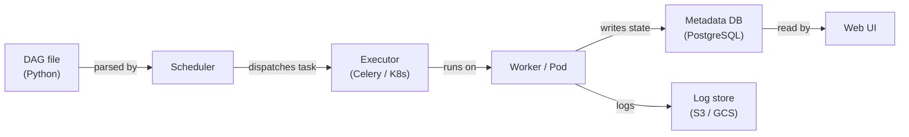

# Apache Airflow

## Definición

Apache Airflow es una plataforma de código abierto para crear, programar y monitorear flujos de trabajo de manera programática. Los flujos de trabajo se expresan como **Grafos Acíclicos Dirigidos (DAGs)** escritos en Python, lo que proporciona a los ingenieros la plena expresividad de un lenguaje de programación para definir dependencias complejas, lógica de ramificación, generación dinámica de tareas y políticas de reintento. Airflow fue creado originalmente en Airbnb en 2014 y posteriormente donado a la Apache Software Foundation; se ha convertido en el estándar de facto para la orquestación de flujos de trabajo batch en ingeniería de datos y MLOps.

En el contexto de ML, Airflow orquesta el ciclo de vida completo del modelo: ingestión de datos, preprocesamiento, ingeniería de características, entrenamiento del modelo, evaluación, registro de artefactos y despliegue. No ejecuta el cómputo en sí — en cambio, delega a sistemas especializados (Spark, dbt, SageMaker, Kubernetes) a través de su rico ecosistema de operadores. Esta separación de la orquestación de la ejecución es una fortaleza arquitectónica clave: puedes cambiar la capa de cómputo subyacente sin cambiar la lógica del DAG.

El scheduler de Airflow analiza continuamente los archivos DAG, evalúa el estado de cada instancia de tarea y despacha las tareas listas a un executor (LocalExecutor, CeleryExecutor o KubernetesExecutor). La interfaz web proporciona visibilidad en tiempo real sobre las ejecuciones de DAG, los logs de tareas y el linaje. Airflow está diseñado para cargas de trabajo batch con calendarios conocidos — no es adecuado para pipelines de streaming sub-minuto o basados en eventos.

## Cómo funciona

### DAGs y dependencias de tareas

Un DAG es un archivo Python que instancia un objeto `airflow.DAG` y define tareas usando operadores. Las dependencias entre tareas se declaran con el operador de desplazamiento de bits `>>` o las llamadas `set_downstream`/`set_upstream`. El scheduler lee estos archivos desde la carpeta de DAGs, calcula el gráfico de dependencias y activa las instancias de tareas cuando todas las dependencias upstream están en estado `success`. Las ejecuciones de DAG pueden programarse con una expresión cron o activarse externamente a través de la API REST o el `TriggerDagRunOperator`.

### Operadores, sensores y hooks

Los **operadores** son las unidades atómicas de trabajo en Airflow. El `PythonOperator` ejecuta un callable de Python; `BashOperator` ejecuta un comando de shell; `SparkSubmitOperator` envía un trabajo de Spark; `BigQueryOperator` ejecuta una consulta SQL. Los **sensores** son una clase especial de operador que bloquea hasta que se cumple una condición — un archivo llega a S3, aparece una partición en una tabla de Hive, o se completa un DAG externo. Los **hooks** proporcionan conexiones reutilizables a sistemas externos (bases de datos, APIs en la nube, colas de mensajes) y son utilizados internamente por los operadores pero también pueden llamarse directamente. Esta abstracción en capas significa que la mayoría de las integraciones ya existen en los paquetes `apache-airflow-providers-*`.

### XComs y comunicación entre tareas

Los **XComs** (comunicaciones cruzadas) permiten que las tareas envíen y reciban pequeños valores — cadenas, números, blobs JSON — entre instancias de tareas dentro de la misma ejecución de DAG. Una tarea envía un XCom retornando un valor desde su callable Python o llamando a `context['ti'].xcom_push(key, value)`. Las tareas downstream lo obtienen con `context['ti'].xcom_pull(task_ids='upstream_task', key='value')`. Los XComs se almacenan en la base de datos de metadatos de Airflow, por lo que no son adecuados para cargas útiles grandes (usa almacenamiento de objetos para eso). Son ideales para pasar métricas de evaluación de modelos, rutas de artefactos o indicadores de decisión entre los pasos del pipeline.

### Arquitectura del scheduler

El scheduler de Airflow es un proceso Python que analiza los archivos DAG en un intervalo configurable, calcula qué instancias de tareas están listas para ejecutarse y las envía al executor. Con `CeleryExecutor`, las tareas se despachan a un grupo de procesos worker a través de un broker de mensajes (Redis o RabbitMQ). Con `KubernetesExecutor`, cada instancia de tarea obtiene su propio pod Kubernetes aislado — eliminando la contención de recursos de workers compartidos y permitiendo especificaciones de recursos por tarea. La base de datos de metadatos (PostgreSQL o MySQL en producción) almacena el estado de ejecución del DAG, el historial de instancias de tareas, XComs, variables y conexiones.



## Cuándo usar / Cuándo NO usar

| Usar cuando | Evitar cuando |
|----------|------------|
| Necesitas orquestación de flujos de trabajo batch con dependencias complejas | Tu carga de trabajo requiere latencia sub-minuto o está basada en eventos |
| Tu equipo se siente cómodo escribiendo flujos de trabajo en Python | Quieres un constructor de flujos de trabajo con bajo código o primero-interfaz-de-usuario |
| Necesitas integración rica con servicios en la nube (AWS, GCP, Azure) | Tus DAGs son extremadamente simples y un cron job sería suficiente |
| Requieres rastros de auditoría detallados, reintentos y alertas | Necesitas un servicio de orquestación gestionado y sin operaciones |
| Quieres KubernetesExecutor para entornos de tareas aislados y reproducibles | Tu organización no puede mantener el scheduler y los workers de Airflow |

## Comparaciones

| Criterio | Apache Airflow | Prefect |
|-----------|---------------|---------|
| Facilidad de uso | Moderada — requiere entender el modelo DAG, la configuración del scheduler y los executors | Alta — flujos Pythonic con mínimo boilerplate; la ejecución local simplemente funciona |
| Escalabilidad | Alta — KubernetesExecutor escala tareas independientemente | Alta — servidor Prefect Cloud o auto-hospedado con work pools |
| Calidad de la interfaz | Buena — gráfico DAG, Gantt, logs de tareas; diseño algo anticuado | Excelente — interfaz moderna con observabilidad de ejecución de flujos y rastreo de artefactos |
| Soporte de Kubernetes | Primera clase vía KubernetesExecutor (un pod por tarea) | Vía work pools de Kubernetes; más fácil de configurar que Airflow |
| Curva de aprendizaje | Empinada — semántica DAG, XComs, providers, configuración del executor | Suave — se siente como escribir Python regular; menos que aprender inicialmente |

## Ventajas y desventajas

| Ventajas | Desventajas |
|------|------|
| Ecosistema maduro con cientos de integraciones de providers | Sobrecarga operacional significativa (scheduler, workers, base de datos de metadatos) |
| Plena expresividad Python para generación dinámica de DAGs | Los errores de análisis de DAG pueden romper silenciosamente el scheduler |
| Fuerte comunidad y soporte empresarial (MWAA, Cloud Composer, Astronomer) | No adecuado para streaming o programación sub-minuto |
| KubernetesExecutor permite aislamiento de recursos por tarea | Los XComs son limitados en tamaño — no adecuados para pasar artefactos grandes |
| Interfaz rica con vista de grafo, gráfico de Gantt y logs a nivel de tarea | Proliferación de configuración en archivos DAG, variables de entorno e interfaz de Airflow |

## Ejemplos de código

```python
"""
Airflow DAG for a complete ML pipeline:
  1. Extract training data from a source database
  2. Preprocess and validate the data
  3. Train a model and register it in a model registry

Requires: apache-airflow >= 2.7, apache-airflow-providers-postgres,
          scikit-learn, pandas, mlflow
"""

from __future__ import annotations

from datetime import datetime, timedelta

from airflow import DAG
from airflow.operators.python import PythonOperator

# --- Default arguments applied to every task ---
default_args = {
    "owner": "ml-team",
    "retries": 2,
    "retry_delay": timedelta(minutes=5),
    "email_on_failure": True,
    "email": ["ml-alerts@example.com"],
}

# ---------------------------------------------------------------------------
# Task callables
# ---------------------------------------------------------------------------

def extract_data(**context) -> None:
    """
    Pull the latest training window from the feature store and
    save it to a shared location. Push the output path via XCom.
    """
    import pandas as pd

    # In production, replace with a real DB/feature-store connection
    df = pd.DataFrame(
        {
            "feature_a": [1.0, 2.0, 3.0, 4.0, 5.0],
            "feature_b": [0.1, 0.4, 0.9, 1.6, 2.5],
            "label": [0, 0, 1, 1, 1],
        }
    )

    output_path = "/tmp/airflow/training_data.parquet"
    import pathlib
    pathlib.Path(output_path).parent.mkdir(parents=True, exist_ok=True)
    df.to_parquet(output_path, index=False)

    # Push artifact path to XCom so downstream tasks can consume it
    context["ti"].xcom_push(key="data_path", value=output_path)
    print(f"[extract] saved {len(df)} rows to {output_path}")


def preprocess_data(**context) -> None:
    """
    Load extracted data, validate schema, apply feature scaling,
    and persist the preprocessed dataset.
    """
    import pandas as pd
    from sklearn.preprocessing import StandardScaler

    # Pull the path produced by the extract task
    data_path = context["ti"].xcom_pull(task_ids="extract_data", key="data_path")
    df = pd.read_parquet(data_path)

    # Validate required columns
    required = {"feature_a", "feature_b", "label"}
    missing = required - set(df.columns)
    if missing:
        raise ValueError(f"Missing columns: {missing}")

    # Scale features
    scaler = StandardScaler()
    df[["feature_a", "feature_b"]] = scaler.fit_transform(
        df[["feature_a", "feature_b"]]
    )

    output_path = "/tmp/airflow/preprocessed_data.parquet"
    df.to_parquet(output_path, index=False)
    context["ti"].xcom_push(key="preprocessed_path", value=output_path)
    print(f"[preprocess] scaled and saved {len(df)} rows to {output_path}")


def train_model(**context) -> None:
    """
    Train a logistic regression model, evaluate on a hold-out split,
    and log the run to MLflow.
    """
    import pandas as pd
    import mlflow
    import mlflow.sklearn
    from sklearn.linear_model import LogisticRegression
    from sklearn.model_selection import train_test_split
    from sklearn.metrics import accuracy_score

    preprocessed_path = context["ti"].xcom_pull(
        task_ids="preprocess_data", key="preprocessed_path"
    )
    df = pd.read_parquet(preprocessed_path)

    X = df[["feature_a", "feature_b"]].values
    y = df["label"].values
    X_train, X_test, y_train, y_test = train_test_split(
        X, y, test_size=0.2, random_state=42
    )

    with mlflow.start_run(run_name="airflow-logistic-regression"):
        model = LogisticRegression()
        model.fit(X_train, y_train)

        accuracy = accuracy_score(y_test, model.predict(X_test))
        mlflow.log_metric("accuracy", accuracy)
        mlflow.sklearn.log_model(model, artifact_path="model")

        print(f"[train] accuracy={accuracy:.4f}")
        mlflow.register_model(
            f"runs:/{mlflow.active_run().info.run_id}/model",
            name="airflow-demo-model",
        )


# ---------------------------------------------------------------------------
# DAG definition
# ---------------------------------------------------------------------------

with DAG(
    dag_id="ml_training_pipeline",
    description="Extract → Preprocess → Train pipeline for nightly model refresh",
    default_args=default_args,
    start_date=datetime(2024, 1, 1),
    schedule="0 2 * * *",  # Run at 02:00 UTC daily
    catchup=False,
    tags=["ml", "training"],
) as dag:

    extract = PythonOperator(
        task_id="extract_data",
        python_callable=extract_data,
    )

    preprocess = PythonOperator(
        task_id="preprocess_data",
        python_callable=preprocess_data,
    )

    train = PythonOperator(
        task_id="train_model",
        python_callable=train_model,
    )

    # Define linear dependency: extract → preprocess → train
    extract >> preprocess >> train
```

## Recursos prácticos

- [Documentación de Apache Airflow](https://airflow.apache.org/docs/) — Referencia oficial para DAGs, operadores, executors y configuración
- [Astronomer — Guías de Airflow](https://www.astronomer.io/docs/learn/) — Tutoriales prácticos sobre creación de DAGs, pruebas y despliegue
- [Índice de paquetes de providers de Airflow](https://airflow.apache.org/docs/#providers-packages-docs-apache-airflow-providers) — Examina todas las integraciones oficiales (AWS, GCP, Spark, dbt, etc.)
- [Airflow gestionado — Amazon MWAA](https://docs.aws.amazon.com/mwaa/latest/userguide/what-is-mwaa.html) — Referencia del servicio Airflow gestionado de AWS

## Ver también

- [Pipelines de datos](/docs/mlops/data-engineering)
- [Apache Spark](/docs/mlops/data-engineering/spark)
- [CI/CD de MLOps](/docs/mlops/cicd)
