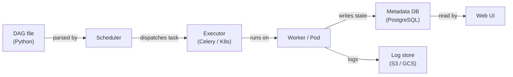

# Apache Airflow

## Definición

Apache Airflow es una plataforma de código abierto para la creación, programación y monitoreo programático de workflows. Los workflows se expresan como **Grafos Acíclicos Dirigidos (DAGs)** escritos en Python, lo que brinda a los ingenieros la expresividad completa de un lenguaje de programación para definir dependencias complejas, lógica de ramificación, generación dinámica de tareas y políticas de reintento. Airflow fue creado originalmente en Airbnb en 2014 y luego donado a la Apache Software Foundation; se ha convertido en el estándar de facto para la orquestación de workflows batch en ingeniería de datos y MLOps.

En el contexto ML, Airflow orquesta el ciclo de vida completo del modelo: ingesta de datos, preprocesamiento, ingeniería de características, entrenamiento del modelo, evaluación, registro de artefactos y despliegue. No ejecuta el cómputo por sí mismo — en cambio, delega a sistemas especializados (Spark, dbt, SageMaker, Kubernetes) a través de su rico ecosistema de operadores.

## Cómo funciona

### DAGs y dependencias de tareas

Un DAG es un archivo Python que instancia un objeto `airflow.DAG` y define tareas usando operadores. Las dependencias entre tareas se declaran con el operador de desplazamiento de bits `>>` o llamadas `set_downstream`/`set_upstream`. El programador lee estos archivos desde la carpeta de DAGs y desencadena instancias de tareas cuando todas las dependencias upstream están en estado `success`.

### Operadores, sensores y hooks

Los **operadores** son las unidades atómicas de trabajo en Airflow. Los **sensores** son una clase especial de operador que bloquea hasta que se cumple una condición. Los **hooks** proporcionan conexiones reutilizables a sistemas externos.

### XComs y comunicación entre tareas

Los **XComs** permiten a las tareas empujar y extraer pequeños valores entre instancias de tareas dentro del mismo DAG run. Son ideales para pasar métricas de evaluación del modelo, rutas de artefactos o flags de decisión.

### Arquitectura del scheduler

Con `KubernetesExecutor`, cada instancia de tarea obtiene su propio pod de Kubernetes aislado, eliminando la contención de recursos de trabajadores compartidos.



## Cuándo usar / Cuándo NO usar

| Usar cuando | Evitar cuando |
|---|---|
| Necesita orquestación de workflows batch con dependencias complejas | Su carga de trabajo requiere latencia sub-minuto o es dirigida por eventos |
| Su equipo se siente cómodo escribiendo workflows en Python | Quiere un constructor de workflows low-code o UI-first |
| Necesita integración rica con servicios cloud (AWS, GCP, Azure) | Sus DAGs son extremadamente simples y un cron job sería suficiente |
| Requiere registros de auditoría detallados, reintentos y alertas | Necesita un servicio de orquestación gestionado y sin operaciones |

## Comparaciones

| Criterio | Apache Airflow | Prefect |
|---|---|---|
| Facilidad de uso | Moderada | Alta |
| Escalabilidad | Alta | Alta |
| Calidad de UI | Buena | Excelente |
| Curva de aprendizaje | Pronunciada | Suave |

## Pros y contras

| Pros | Contras |
|---|---|
| Ecosistema maduro con cientos de integraciones de proveedores | Overhead operacional significativo |
| Expresividad completa de Python para generación dinámica de DAGs | Los errores de análisis de DAG pueden romper el scheduler silenciosamente |
| Soporte sólido de comunidad y empresa | No apto para streaming o programación sub-minuto |
| KubernetesExecutor permite aislamiento de recursos por tarea | XComs son limitados en tamaño |

## Ejemplo de código

```python
from __future__ import annotations
from datetime import datetime, timedelta
from airflow import DAG
from airflow.operators.python import PythonOperator

default_args = {
    "owner": "ml-team",
    "retries": 2,
    "retry_delay": timedelta(minutes=5),
    "email_on_failure": True,
    "email": ["ml-alerts@example.com"],
}

def extract_data(**context) -> None:
    import pandas as pd, pathlib
    df = pd.DataFrame({"feature_a": [1.0, 2.0], "feature_b": [0.1, 0.4], "label": [0, 1]})
    output_path = "/tmp/airflow/training_data.parquet"
    pathlib.Path(output_path).parent.mkdir(parents=True, exist_ok=True)
    df.to_parquet(output_path, index=False)
    context["ti"].xcom_push(key="data_path", value=output_path)

def train_model(**context) -> None:
    import pandas as pd, mlflow, mlflow.sklearn
    from sklearn.linear_model import LogisticRegression
    from sklearn.model_selection import train_test_split
    from sklearn.metrics import accuracy_score

    data_path = context["ti"].xcom_pull(task_ids="extract_data", key="data_path")
    df = pd.read_parquet(data_path)
    X = df[["feature_a", "feature_b"]].values
    y = df["label"].values
    X_train, X_test, y_train, y_test = train_test_split(X, y, test_size=0.2, random_state=42)
    with mlflow.start_run(run_name="airflow-logistic-regression"):
        model = LogisticRegression()
        model.fit(X_train, y_train)
        accuracy = accuracy_score(y_test, model.predict(X_test))
        mlflow.log_metric("accuracy", accuracy)
        mlflow.sklearn.log_model(model, artifact_path="model")

with DAG(
    dag_id="ml_training_pipeline",
    description="Extract -> Train pipeline for nightly model refresh",
    default_args=default_args,
    start_date=datetime(2024, 1, 1),
    schedule="0 2 * * *",
    catchup=False,
    tags=["ml", "training"],
) as dag:
    extract = PythonOperator(task_id="extract_data", python_callable=extract_data)
    train = PythonOperator(task_id="train_model", python_callable=train_model)
    extract >> train
```

## Recursos prácticos

- [Documentación de Apache Airflow](https://airflow.apache.org/docs/) — Referencia oficial para DAGs, operadores, ejecutores y configuración.
- [Astronomer — Guías de Airflow](https://www.astronomer.io/docs/learn/) — Tutoriales prácticos sobre autoría, pruebas y despliegue de DAGs.
- [Índice de paquetes de proveedores de Airflow](https://airflow.apache.org/docs/#providers-packages-docs-apache-airflow-providers) — Explore todas las integraciones oficiales.
- [Airflow gestionado — Amazon MWAA](https://docs.aws.amazon.com/mwaa/latest/userguide/what-is-mwaa.html) — Referencia del servicio Airflow gestionado de AWS.

## Ver también

- [Pipelines de datos](/docs/mlops/data-engineering)
- [Apache Spark](/docs/mlops/data-engineering/spark)
- [MLOps CI/CD](/docs/mlops/cicd)
