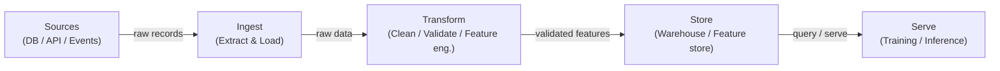

# Pipelines de datos

## Definición

Una pipeline de datos es una secuencia automatizada de pasos que mueve datos sin procesar de una o más fuentes a un destino donde pueden ser consumidos por analistas, dashboards o modelos de machine learning. En el contexto ML, las pipelines no son solo sobre mover datos: garantizan que los datos lleguen en la forma correcta, en el momento correcto y con una calidad verificable para que los modelos entrenen y sirvan de manera predecible. Sin pipelines confiables, cada artefacto posterior — características, modelos entrenados, predicciones — es sospechoso.

Las pipelines de datos se encuentran en la base de todo sistema MLOps. Abarcan la ingesta de fuentes heterogéneas (bases de datos, APIs, streams de eventos, archivos), la transformación para producir conjuntos de datos limpios y estructurados o vectores de características, el almacenamiento en data warehouses o feature stores, y el serving a trabajos de entrenamiento o endpoints de inferencia en línea. Las elecciones de diseño en la capa de pipeline — batch vs. streaming, push vs. pull, schema-on-read vs. schema-on-write — se propagan hasta la latencia, frescura y confiabilidad del modelo.

La calidad de los datos es el contrato oculto entre los ingenieros de datos y los equipos de modelos. La deriva de esquema, las explosiones de nulos, el cambio de distribución y los registros duplicados son algunas de las causas más comunes de degradación silenciosa del modelo. Las pipelines modernas incorporan puntos de control de validación (usando herramientas como Great Expectations o tests de dbt) para detectar estos problemas antes de que los datos malos lleguen al entrenamiento o serving.

## Cómo funciona

### Batch vs. Streaming

Las pipelines batch procesan datos en fragmentos acotados según un horario — cada hora, diario, o desencadenado por la llegada de archivos. Son más simples de construir y razonar, y son el estándar correcto cuando el consumidor posterior (un trabajo de entrenamiento nocturno, un dashboard BI) no requiere frescura de menos de un minuto. Las pipelines de streaming procesan registros a medida que llegan, habilitando características casi en tiempo real para modelos en línea. La compensación es la complejidad operacional: debe manejar llegadas tardías, eventos fuera de orden y semántica exactly-once. La mayoría de las plataformas ML maduras ejecutan ambas: batch para re-entrenamiento a gran escala y evaluación offline, streaming para computación de características en línea.

### ETL vs. ELT

Extract-Transform-Load (ETL) aplica transformaciones antes de que los datos lleguen al almacén de destino. Extract-Load-Transform (ELT) carga primero los datos sin procesar y luego los transforma dentro de un poderoso warehouse o lakehouse (por ejemplo, BigQuery, Snowflake, Databricks). ELT preserva el historial sin procesar y permite exploración ad hoc sin re-ingesta — una ventaja importante en cargas de trabajo ML donde la ingeniería de características evoluciona constantemente.

### Calidad de datos y validación de esquema

Las comprobaciones de calidad de datos deben estar integradas en cada etapa de la pipeline, no añadidas al final. En la ingesta, las comprobaciones verifican que los datos de origen se ajusten al esquema esperado. En la transformación, las comprobaciones de nivel de fila afirman reglas de negocio. En la capa de serving, las comprobaciones estadísticas detectan deriva de distribución — el asesino silencioso de los modelos desplegados.



## Cuándo usar / Cuándo NO usar

| Usar cuando | Evitar cuando |
|---|---|
| Múltiples fuentes de datos necesitan consolidarse para el entrenamiento ML | Los datos ya existen en una sola tabla limpia lista para uso directo |
| Los datos deben actualizarse según un horario o en tiempo real | Su análisis es una exploración puntual que no se repetirá |
| Los modelos posteriores requieren garantías de calidad (esquema, integridad, frescura) | El overhead de una pipeline completa supera el valor para un prototipo rápido |
| Las transformaciones necesitan ser versionadas, probadas y reproducibles | El volumen de datos es trivial y un script simple en un notebook es suficiente |
| Múltiples consumidores (entrenamiento, dashboards, APIs) comparten los mismos datos procesados | El sistema fuente ya proporciona una API limpia y con contrato |

## Comparaciones

| Criterio | Pipeline batch | Pipeline de streaming |
|---|---|---|
| Frescura de datos | Minutos a horas (basado en horario) | Sub-segundo a segundos |
| Complejidad | Baja — conjuntos de datos acotados, reintentos simples | Alta — datos tardíos, windowing, estado |
| Costo | Predecible, cómputo en ráfagas | Cómputo continuo, baseline a menudo más alta |
| Tolerancia a fallos | Volver a ejecutar el batch fallido | Se requiere semántica exactly-once o at-least-once |
| Caso de uso ML típico | Entrenamiento offline, actualización nocturna de características | Feature store en línea, puntuación en tiempo real |

## Pros y contras

| Pros | Contras |
|---|---|
| Centraliza y estandariza el acceso a datos entre equipos | Inversión inicial no trivial para construir y mantener |
| Permite transformaciones de datos reproducibles y probadas | Los fallos en la pipeline se propagan a todos los consumidores posteriores |
| Incorpora comprobaciones de calidad antes de que los datos malos lleguen a los modelos | Depurar pipelines distribuidas es complejo |
| Soporta versionado y seguimiento de linaje | El streaming añade una sobrecarga operacional significativa |
| Desacopla productores de consumidores | Requiere disciplina de gobernanza y propiedad de datos |

## Ejemplos de código

```python
"""
Simple batch data pipeline with pandas.
"""
import pandas as pd
import pandera as pa
from pandera import Column, DataFrameSchema, Check
from pathlib import Path

raw_schema = DataFrameSchema({
    "user_id": Column(int, nullable=False),
    "event_ts": Column(str, nullable=False),
    "amount": Column(float, Check(lambda x: x >= 0), nullable=False),
    "category": Column(str, nullable=True),
})

def extract(source_path: str) -> pd.DataFrame:
    df = pd.read_csv(source_path)
    print(f"[extract] loaded {len(df):,} rows from {source_path}")
    return df

def validate(df: pd.DataFrame, schema: DataFrameSchema) -> pd.DataFrame:
    validated = schema.validate(df)
    print(f"[validate] schema check passed for {len(validated):,} rows")
    return validated

def transform(df: pd.DataFrame) -> pd.DataFrame:
    df = df.copy()
    df["event_date"] = pd.to_datetime(df["event_ts"])
    df.drop(columns=["event_ts"], inplace=True)
    df["category"] = df["category"].fillna("unknown")
    import numpy as np
    df["log_amount"] = np.log1p(df["amount"])
    df.drop_duplicates(subset=["user_id", "event_date"], inplace=True)
    return df

def load(df: pd.DataFrame, dest_path: str) -> None:
    Path(dest_path).parent.mkdir(parents=True, exist_ok=True)
    df.to_parquet(dest_path, index=False)
    print(f"[load] wrote {len(df):,} rows to {dest_path}")

def run_pipeline(source: str, destination: str) -> None:
    raw = extract(source)
    validated_raw = validate(raw, raw_schema)
    clean = transform(validated_raw)
    load(clean, destination)
    print("[pipeline] completed successfully")

if __name__ == "__main__":
    run_pipeline("data/raw/events.csv", "data/processed/events.parquet")
```

## Recursos prácticos

- [The Data Engineering Cookbook (Andreas Kretz)](https://github.com/andkret/Cookbook) — Guía completa de código abierto que cubre patrones de ingesta, almacenamiento y procesamiento.
- [Documentación de dbt](https://docs.getdbt.com/) — El estándar para transformaciones ELT en SQL con pruebas integradas y linaje.
- [Great Expectations](https://docs.greatexpectations.io/) — Framework de calidad y validación de datos que se integra con la mayoría de las herramientas de pipeline.
- [Pandera](https://pandera.readthedocs.io/) — Validación de esquema ligera para DataFrames de pandas y Spark en Python.
- [Fundamentals of Data Engineering (O'Reilly)](https://www.oreilly.com/library/view/fundamentals-of-data/9781098108298/) — Libro que cubre el ciclo de vida completo de ingeniería de datos.

## Ver también

- [Apache Airflow](/docs/mlops/data-engineering/airflow)
- [Apache Spark](/docs/mlops/data-engineering/spark)
- [Apache Kafka](/docs/mlops/data-engineering/kafka)
- [MLOps](/docs/mlops)
