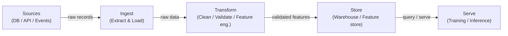

# Pipelines de datos

## Definición

Un pipeline de datos es una secuencia automatizada de pasos que mueve datos brutos de una o más fuentes a un destino donde pueden ser consumidos — por analistas, dashboards o modelos de aprendizaje automático. En el contexto de ML, los pipelines no se tratan solo de mover datos: garantizan que los datos lleguen con la forma correcta, en el momento correcto y con una calidad verificable para que los modelos entrenen y sirvan de manera predecible. Sin pipelines confiables, cada artefacto downstream — características, modelos entrenados, predicciones — es sospechoso.

Los pipelines de datos se encuentran en la base de todo sistema MLOps. Abarcan la ingestión desde fuentes heterogéneas (bases de datos, APIs, flujos de eventos, archivos), la transformación para producir conjuntos de datos limpios y estructurados o vectores de características, el almacenamiento en data warehouses o feature stores, y el servicio a trabajos de entrenamiento o endpoints de inferencia online. Las decisiones de diseño tomadas en la capa del pipeline — batch vs. streaming, push vs. pull, schema-on-read vs. schema-on-write — se propagan hasta la latencia, la frescura y la confiabilidad del modelo.

La calidad de los datos es el contrato oculto entre los ingenieros de datos y los equipos de modelos. El drift de esquema, explosiones de nulos, cambio de distribución y registros duplicados están entre las causas más comunes de degradación silenciosa del modelo. Los pipelines modernos incorporan puntos de control de validación (usando herramientas como Great Expectations o pruebas de dbt) para detectar estos problemas antes de que los datos defectuosos lleguen al entrenamiento o al servicio.

## Cómo funciona

### Batch vs. streaming

Los pipelines batch procesan datos en fragmentos acotados según un calendario — por hora, diariamente, o disparados por la llegada de un archivo. Son más simples de construir y razonar, y son el valor predeterminado correcto cuando el consumidor downstream (un trabajo de entrenamiento nocturno, un dashboard de BI) no requiere frescura inferior al minuto. Los pipelines de streaming procesan registros a medida que llegan, permitiendo características casi en tiempo real para modelos online. El compromiso es la complejidad operacional: debes manejar llegadas tardías, eventos fuera de orden y semántica de exactamente-una-vez. La mayoría de las plataformas de ML maduras ejecutan ambos: batch para reentrenamiento a gran escala y evaluación offline, streaming para el cómputo de características online.

### ETL vs. ELT

Extract-Transform-Load (ETL) aplica transformaciones antes de que los datos lleguen al almacén de destino. Este fue el patrón dominante cuando el almacenamiento era costoso y los warehouses carecían de cómputo. Extract-Load-Transform (ELT) carga los datos brutos primero, luego los transforma dentro de un warehouse o lakehouse potente (p. ej. BigQuery, Snowflake, Databricks). ELT preserva el historial bruto y permite la exploración ad-hoc sin re-ingestión — una gran ventaja en cargas de trabajo de ML donde la ingeniería de características evoluciona constantemente. La elección está principalmente impulsada por las herramientas, los requisitos de gobernanza y si el sistema de destino puede manejar el cómputo de transformación de manera eficiente.

### Calidad de datos y validación de esquemas

Las verificaciones de calidad de datos deben estar integradas en cada etapa del pipeline, no añadidas al final. En la ingestión, las verificaciones confirman que los datos fuente se ajustan al esquema esperado (nombres de columnas, tipos, restricciones de nulos). En la transformación, las verificaciones a nivel de fila afirman reglas de negocio (precios no negativos, rangos de fechas válidos, integridad referencial). En la capa de servicio, las verificaciones estadísticas detectan el drift de distribución — el asesino silencioso de los modelos desplegados. La validación de esquemas puede realizarse con herramientas como Pandera, Great Expectations o pruebas de dbt; el monitoreo de distribución típicamente lo manejan capas de observabilidad dedicadas.



## Cuándo usar / Cuándo NO usar

| Usar cuando | Evitar cuando |
|----------|------------|
| Múltiples fuentes de datos necesitan consolidarse para el entrenamiento de ML | Los datos ya viven en una única tabla limpia lista para uso directo |
| Los datos deben actualizarse según un calendario o en tiempo real | Tu análisis es una exploración única que no se repetirá |
| Los modelos downstream requieren garantías de calidad (esquema, completitud, frescura) | La sobrecarga de un pipeline completo supera el valor de un prototipo rápido |
| Las transformaciones necesitan ser versionadas, probadas y reproducibles | El volumen de datos es trivial y un script simple en un notebook es suficiente |
| Múltiples consumidores (entrenamiento, dashboards, APIs) comparten los mismos datos procesados | El sistema fuente ya proporciona una API limpia y contratada |

## Comparaciones

| Criterio | Pipeline batch | Pipeline de streaming |
|-----------|---------------|--------------------|
| Frescura de datos | Minutos a horas (impulsado por calendario) | Submilisegundo a segundos |
| Complejidad | Baja — conjuntos de datos acotados, reintentos simples | Alta — datos tardíos, ventanas, estado |
| Costo | Predecible, cómputo en ráfagas | Cómputo continuo, línea base a menudo mayor |
| Tolerancia a fallos | Re-ejecutar el lote fallido | Se requiere semántica de exactamente-una-vez o al-menos-una-vez |
| Caso de uso típico en ML | Entrenamiento offline, actualización nocturna de características | Feature store online, puntuación en tiempo real |

## Ventajas y desventajas

| Ventajas | Desventajas |
|------|------|
| Centraliza y estandariza el acceso a datos entre equipos | Inversión inicial no trivial para construir y mantener |
| Permite transformaciones de datos reproducibles y probadas | Los fallos del pipeline se propagan a todos los consumidores downstream |
| Incorpora verificaciones de calidad antes de que los datos defectuosos lleguen a los modelos | Depurar pipelines distribuidos es complejo |
| Soporta versionado y rastreo de linaje | El streaming agrega una sobrecarga operacional significativa |
| Desacopla a los productores de los consumidores | Requiere disciplina de gobernanza y propiedad de datos |

## Ejemplos de código

```python
"""
Simple batch data pipeline with pandas.
Reads raw CSV data, validates schema, applies transformations,
and writes a clean Parquet file ready for model training.
"""

import pandas as pd
import pandera as pa
from pandera import Column, DataFrameSchema, Check
from pathlib import Path


# --- Schema definition (contract between pipeline and consumers) ---
raw_schema = DataFrameSchema(
    {
        "user_id": Column(int, nullable=False),
        "event_ts": Column(str, nullable=False),
        "amount": Column(float, Check(lambda x: x >= 0), nullable=False),
        "category": Column(str, nullable=True),
    }
)

output_schema = DataFrameSchema(
    {
        "user_id": Column(int),
        "event_date": Column("datetime64[ns]"),
        "amount": Column(float),
        "category": Column(str),
        "log_amount": Column(float),
    }
)


def extract(source_path: str) -> pd.DataFrame:
    """Load raw data from CSV."""
    df = pd.read_csv(source_path)
    print(f"[extract] loaded {len(df):,} rows from {source_path}")
    return df


def validate(df: pd.DataFrame, schema: DataFrameSchema) -> pd.DataFrame:
    """Fail fast if data does not match the declared schema."""
    validated = schema.validate(df)
    print(f"[validate] schema check passed for {len(validated):,} rows")
    return validated


def transform(df: pd.DataFrame) -> pd.DataFrame:
    """Apply cleaning and feature engineering."""
    df = df.copy()

    # Parse timestamp column
    df["event_date"] = pd.to_datetime(df["event_ts"])
    df.drop(columns=["event_ts"], inplace=True)

    # Fill missing categories with a sentinel value
    df["category"] = df["category"].fillna("unknown")

    # Feature engineering: log-transform amount (handles skew)
    import numpy as np
    df["log_amount"] = np.log1p(df["amount"])

    # Drop duplicates based on user_id + date
    df.drop_duplicates(subset=["user_id", "event_date"], inplace=True)

    print(f"[transform] produced {len(df):,} clean rows")
    return df


def load(df: pd.DataFrame, dest_path: str) -> None:
    """Write clean data to Parquet for efficient downstream reads."""
    Path(dest_path).parent.mkdir(parents=True, exist_ok=True)
    df.to_parquet(dest_path, index=False)
    print(f"[load] wrote {len(df):,} rows to {dest_path}")


def run_pipeline(source: str, destination: str) -> None:
    """Orchestrate the full ETL pipeline."""
    raw = extract(source)
    validated_raw = validate(raw, raw_schema)
    clean = transform(validated_raw)
    validated_clean = validate(clean, output_schema)
    load(validated_clean, destination)
    print("[pipeline] completed successfully")


if __name__ == "__main__":
    run_pipeline(
        source="data/raw/events.csv",
        destination="data/processed/events.parquet",
    )
```

## Recursos prácticos

- [The Data Engineering Cookbook (Andreas Kretz)](https://github.com/andkret/Cookbook) — Guía de código abierto exhaustiva que cubre patrones de ingestión, almacenamiento y procesamiento
- [Documentación de dbt](https://docs.getdbt.com/) — El estándar para transformaciones ELT en SQL con pruebas y linaje integrados
- [Great Expectations](https://docs.greatexpectations.io/) — Framework de calidad y validación de datos que se integra con la mayoría de las herramientas de pipeline
- [Pandera](https://pandera.readthedocs.io/) — Validación ligera de esquemas para DataFrames de pandas y Spark en Python
- [Fundamentals of Data Engineering (O'Reilly)](https://www.oreilly.com/library/view/fundamentals-of-data/9781098108298/) — Libro que cubre el ciclo de vida completo de la ingeniería de datos desde la ingestión hasta el servicio

## Ver también

- [Apache Airflow](/docs/mlops/data-engineering/airflow)
- [Apache Spark](/docs/mlops/data-engineering/spark)
- [Apache Kafka](/docs/mlops/data-engineering/kafka)
- [MLOps](/docs/mlops)
