# Apache Kafka

## Definición

Apache Kafka es una plataforma de streaming de eventos distribuida desarrollada originalmente en LinkedIn y de código abierto en 2011. Está diseñada para manejar flujos de eventos de alta throughput, baja latencia y duraderos — mensajes de log, eventos de actividad de usuario, lecturas de sensores, transacciones — a través de un clúster de hardware commodity. Kafka actúa como un log persistente y reproducible: los productores escriben eventos en **topics** con nombre, y los consumidores leen de esos topics a su propio ritmo, independientemente unos de otros. Este desacoplamiento de productores y consumidores es la propiedad arquitectónica definitoria que hace a Kafka tan poderoso como columna vertebral de integración.

En el contexto del aprendizaje automático, Kafka ocupa dos roles críticos. Primero, sirve como la columna vertebral de datos para **pipelines de características en tiempo real**: los eventos brutos (clics, transacciones, lecturas de sensores) fluyen a través de Kafka, son consumidos por procesadores de stream ([Apache Spark](/docs/mlops/data-engineering/spark) Structured Streaming, Apache Flink o Kafka Streams), transformados en vectores de características y escritos en un feature store online (p. ej. Feast, Tecton) para el servicio de modelos de baja latencia. Segundo, Kafka se usa para **pipelines de servicio de modelos**: las solicitudes de predicción llegan como mensajes de Kafka, un consumidor aplica el modelo y produce eventos de predicción a un topic de resultados, habilitando inferencia asíncrona y desacoplada a escala.

Las garantías de durabilidad de Kafka — los mensajes se persisten en disco y se replican entre brokers — significan que los grupos de consumidores pueden reproducir el log de eventos desde cualquier offset, lo que permite el relleno de feature stores cuando se despliegan nuevas definiciones de características, y soporta semántica de exactamente-una-vez para pipelines de ML críticos.

## Cómo funciona

### Topics y particiones

Un **topic** es un log ordenado, inmutable y con nombre de eventos. Los topics se dividen en **particiones** — la unidad de paralelismo en Kafka. Cada partición es una secuencia ordenada, de solo-adición de registros almacenados en disco y replicados entre múltiples brokers para tolerancia a fallos. El número de particiones determina el paralelismo máximo de los consumidores: dentro de un grupo de consumidores, cada partición se asigna a exactamente una instancia de consumidor. Elegir el número correcto de particiones es una decisión crítica de capacidad — muy pocas limitan el throughput, demasiadas aumentan la sobrecarga del broker.

### Productores

Un **productor** es un cliente que publica registros en uno o más topics. Los registros consisten en una clave opcional, un valor (típicamente serializado como JSON, Avro o Protobuf), una marca de tiempo opcional y cabeceras opcionales. Cuando hay una clave presente, Kafka usa hashing consistente para enrutar todos los registros con la misma clave a la misma partición — garantizando el ordenamiento para una entidad dada (p. ej. todos los eventos para un `user_id` dado van a la misma partición). Los productores configuran la semántica de confirmación: `acks=0` (disparar y olvidar), `acks=1` (confirmación del líder), o `acks=all` (replicación completa ISR — mayor durabilidad).

### Consumidores y grupos de consumidores

Un **consumidor** lee registros de una o más particiones. Los consumidores se organizan en **grupos de consumidores**: cada registro se entrega a exactamente un consumidor dentro de un grupo, lo que permite el escalado horizontal del procesamiento. Diferentes grupos de consumidores pueden leer el mismo topic independientemente — un grupo de consumidores de pipeline de características, un grupo de consumidores de monitoreo y un grupo de consumidores de replay pueden todos consumir los mismos eventos brutos sin interferir entre sí. Los offsets de los consumidores (la posición en cada partición) se confirman de vuelta a Kafka, proporcionando tolerancia a fallos: si un consumidor falla, otra instancia retoma desde el último offset confirmado.

### Kafka en pipelines de ML en tiempo real

Kafka típicamente se posiciona entre las fuentes de eventos brutos y los sistemas de ML downstream. Los eventos brutos llegan desde backends de aplicaciones o dispositivos IoT a un topic bruto. Un procesador de stream (Spark Structured Streaming, Flink o Kafka Streams) consume estos eventos, calcula características (agregados móviles, búsquedas de entidades, embeddings) y escribe los resultados en un topic de características o directamente en un feature store online. El feature store sirve lecturas de baja latencia a la capa de servicio del modelo. Los resultados de predicción pueden a su vez escribirse de vuelta a un topic de Kafka para ser consumidos por sistemas de monitoreo, aplicaciones downstream o disparadores de reentrenamiento.

```mermaid
flowchart LR
  Producer["Producer\n(App / IoT / DB CDC)"] -- "publish events" --> Topic["Kafka Topic\n(partitioned, replicated)"]
  Topic -- "consume raw events" --> StreamProcessor["Stream Processor\n(Spark / Flink / Kafka Streams)"]
  StreamProcessor -- "write features" --> FeatureStore["Online Feature Store\n(Feast / Redis)"]
  FeatureStore -- "low-latency read" --> ModelServer["Model Server\n(REST / gRPC)"]
  ModelServer -- "publish predictions" --> PredictionTopic["Prediction Topic"]
  PredictionTopic -- "consume" --> Consumer["Consumer\n(Monitoring / Downstream app)"]
```



## Cuándo usar / Cuándo NO usar

| Usar cuando | Evitar cuando |
|----------|------------|
| Necesitas streaming de eventos duradero de alta throughput (millones de eventos/seg) | Tu caso de uso es una cola de tareas simple con una tasa de mensajes modesta |
| Múltiples grupos de consumidores independientes deben leer el mismo stream de eventos | Necesitas lógica de enrutamiento compleja, prioridades de mensajes o colas dead-letter listas para usar |
| Necesitas reproducir eventos históricos para rellenar feature stores | La complejidad operacional de un clúster Kafka no está justificada por la carga de trabajo |
| Se requiere cómputo de características en tiempo real para el servicio de ML online | Los mensajes son grandes (> unos pocos MB) — Kafka está optimizado para registros pequeños y frecuentes |
| Debe preservarse el ordenamiento de eventos por entidad (p. ej. por usuario) | Tu equipo necesita un broker de mensajes completamente gestionado con mínima carga operativa (considera SQS, Pub/Sub) |

## Comparaciones

| Criterio | Apache Kafka | RabbitMQ |
|-----------|-------------|----------|
| Throughput | Extremadamente alto — millones de mensajes/seg por clúster | Moderado — cientos de miles/seg |
| Latencia | Baja (un solo dígito de ms) pero optimizada para throughput, no latencia mínima | Muy baja — sub-milisegundo en algunas configuraciones |
| Persistencia de mensajes | Mensajes retenidos por un período configurable (días/semanas); completamente reproducibles | Mensajes eliminados tras confirmación por defecto; reproducción no nativa |
| Modelo de consumidor | Basado en pull; consumidores rastrean sus propios offsets; múltiples grupos leen independientemente | Basado en push; el broker enruta mensajes; cada mensaje entregado a un consumidor |
| Complejidad | Alta — clúster de brokers, ZooKeeper (pre-3.x) o KRaft, registro de esquemas, monitoreo | Moderada — más simple de operar; bueno para colas de tareas tradicionales |
| Mejor caso de uso en ML | Pipelines de características en tiempo real, event sourcing, agregación de logs | Colas de tareas para trabajos de ML asíncronos (p. ej. solicitudes de preprocesamiento) |

## Ventajas y desventajas

| Ventajas | Desventajas |
|------|------|
| Throughput extremadamente alto y escalabilidad horizontal | Complejidad operacional significativa — clúster, replicación, monitoreo |
| Log duradero y reproducible permite rellenos y auditabilidad | No adecuado para cargas de trabajo de mensajes muy pequeños o infrecuentes |
| Desacopla productores y consumidores — cada uno escala independientemente | La evolución de esquemas requiere un registro de esquemas (Confluent Schema Registry) |
| Múltiples grupos de consumidores pueden leer el mismo topic independientemente | Ajustar conteos de particiones, factores de replicación y retención requiere experiencia |
| Ecosistema sólido: Kafka Connect, Kafka Streams, ksqlDB, Confluent Cloud | La sobrecarga operacional históricamente mayor que las alternativas hospedadas (SQS, Pub/Sub) |

## Ejemplos de código

```python
"""
Kafka producer and consumer example using kafka-python.

Scenario: a feature pipeline for real-time ML scoring.
  - Producer: simulates user events (clicks) and publishes to Kafka.
  - Consumer: reads events, computes a simple feature, and logs predictions.

Requires: kafka-python >= 2.0
  pip install kafka-python

Start a local Kafka broker before running (e.g. via Docker):
  docker run -d -p 9092:9092 --name kafka \
    -e KAFKA_CFG_NODE_ID=0 \
    -e KAFKA_CFG_PROCESS_ROLES=controller,broker \
    -e KAFKA_CFG_LISTENERS=PLAINTEXT://:9092,CONTROLLER://:9093 \
    -e KAFKA_CFG_ADVERTISED_LISTENERS=PLAINTEXT://localhost:9092 \
    -e KAFKA_CFG_LISTENER_SECURITY_PROTOCOL_MAP=CONTROLLER:PLAINTEXT,PLAINTEXT:PLAINTEXT \
    -e KAFKA_CFG_CONTROLLER_QUORUM_VOTERS=0@kafka:9093 \
    -e KAFKA_CFG_CONTROLLER_LISTENER_NAMES=CONTROLLER \
    bitnami/kafka:latest
"""

import json
import time
import random
import threading
from datetime import datetime

from kafka import KafkaProducer, KafkaConsumer
from kafka.admin import KafkaAdminClient, NewTopic


BROKER = "localhost:9092"
EVENTS_TOPIC = "user-events"
PREDICTIONS_TOPIC = "predictions"


# ---------------------------------------------------------------------------
# Topic creation (idempotent)
# ---------------------------------------------------------------------------

def ensure_topics() -> None:
    """Create Kafka topics if they do not already exist."""
    admin = KafkaAdminClient(bootstrap_servers=BROKER)
    existing = admin.list_topics()
    topics_to_create = [
        NewTopic(name=t, num_partitions=3, replication_factor=1)
        for t in [EVENTS_TOPIC, PREDICTIONS_TOPIC]
        if t not in existing
    ]
    if topics_to_create:
        admin.create_topics(new_topics=topics_to_create, validate_only=False)
        print(f"[admin] created topics: {[t.name for t in topics_to_create]}")
    admin.close()


# ---------------------------------------------------------------------------
# Producer: simulate user click events
# ---------------------------------------------------------------------------

def run_producer(num_events: int = 20, delay: float = 0.5) -> None:
    """
    Publish synthetic user-click events to the events topic.
    Each event carries a user_id (used as the partition key for ordering),
    a page_id, and a timestamp.
    """
    producer = KafkaProducer(
        bootstrap_servers=BROKER,
        # Serialize Python dicts to JSON bytes
        value_serializer=lambda v: json.dumps(v).encode("utf-8"),
        # Key is UTF-8 encoded string (user_id) — ensures per-user ordering
        key_serializer=lambda k: k.encode("utf-8"),
        # Wait for full ISR replication before confirming (highest durability)
        acks="all",
        retries=3,
    )

    for i in range(num_events):
        user_id = f"user_{random.randint(1, 5)}"
        event = {
            "event_id": i,
            "user_id": user_id,
            "page_id": random.choice(["home", "product", "checkout", "search"]),
            "dwell_time_sec": round(random.uniform(1.0, 120.0), 2),
            "timestamp": datetime.utcnow().isoformat(),
        }
        future = producer.send(
            topic=EVENTS_TOPIC,
            key=user_id,    # Partition key — all events for a user go to same partition
            value=event,
        )
        record_metadata = future.get(timeout=10)
        print(
            f"[producer] sent event {i:02d} | user={user_id} | "
            f"partition={record_metadata.partition} offset={record_metadata.offset}"
        )
        time.sleep(delay)

    producer.flush()
    producer.close()
    print("[producer] finished")


# ---------------------------------------------------------------------------
# Consumer: compute features and produce a mock prediction
# ---------------------------------------------------------------------------

def score_event(event: dict) -> float:
    """
    Trivial scoring function — in production this calls a model server
    or retrieves features from an online feature store.
    """
    # Higher dwell time on 'product' or 'checkout' pages → higher purchase probability
    base = event["dwell_time_sec"] / 120.0
    multiplier = {"checkout": 1.5, "product": 1.2, "search": 0.9, "home": 0.7}.get(
        event["page_id"], 1.0
    )
    return min(round(base * multiplier, 4), 1.0)


def run_consumer(max_messages: int = 20) -> None:
    """
    Consume user events, compute a purchase-probability score,
    and publish the prediction to the predictions topic.
    """
    consumer = KafkaConsumer(
        EVENTS_TOPIC,
        bootstrap_servers=BROKER,
        group_id="ml-feature-pipeline",            # Consumer group for offset tracking
        value_deserializer=lambda b: json.loads(b.decode("utf-8")),
        auto_offset_reset="earliest",              # Start from beginning if no committed offset
        enable_auto_commit=True,
        consumer_timeout_ms=5000,                  # Stop after 5 s of inactivity
    )

    prediction_producer = KafkaProducer(
        bootstrap_servers=BROKER,
        value_serializer=lambda v: json.dumps(v).encode("utf-8"),
        key_serializer=lambda k: k.encode("utf-8"),
    )

    count = 0
    for message in consumer:
        if count >= max_messages:
            break

        event = message.value
        score = score_event(event)

        prediction = {
            "event_id": event["event_id"],
            "user_id": event["user_id"],
            "purchase_probability": score,
            "scored_at": datetime.utcnow().isoformat(),
        }

        prediction_producer.send(
            topic=PREDICTIONS_TOPIC,
            key=event["user_id"],
            value=prediction,
        )
        print(
            f"[consumer] event={event['event_id']:02d} user={event['user_id']} "
            f"page={event['page_id']} score={score:.4f}"
        )
        count += 1

    consumer.close()
    prediction_producer.flush()
    prediction_producer.close()
    print(f"[consumer] processed {count} messages")


# ---------------------------------------------------------------------------
# Main: run producer and consumer concurrently
# ---------------------------------------------------------------------------

if __name__ == "__main__":
    ensure_topics()

    # Start consumer in a background thread so it reads while producer writes
    consumer_thread = threading.Thread(target=run_consumer, args=(20,))
    consumer_thread.start()

    # Give the consumer a moment to initialize
    time.sleep(1.0)

    # Run producer in the main thread
    run_producer(num_events=20, delay=0.3)

    consumer_thread.join()
    print("[main] pipeline demo complete")
```

## Recursos prácticos

- [Documentación de Apache Kafka](https://kafka.apache.org/documentation/) — Referencia oficial que cubre brokers, productores, consumidores, Kafka Streams y Kafka Connect
- [Confluent Developer — Tutoriales de Kafka](https://developer.confluent.io/tutorials/) — Tutoriales prácticos para productores, consumidores, registro de esquemas y ksqlDB
- [Kafka: The Definitive Guide, 2ª edición (O'Reilly)](https://www.oreilly.com/library/view/kafka-the-definitive/9781492043072/) — Libro completo que cubre los internos, las operaciones y el procesamiento de streams
- [Biblioteca kafka-python](https://kafka-python.readthedocs.io/) — Documentación del cliente Python con referencia de API de productor, consumidor y administrador
- [Feast — Feature store de código abierto](https://docs.feast.dev/) — Feature store que se integra con Kafka para la ingestión de características en tiempo real

## Ver también

- [Pipelines de datos](/docs/mlops/data-engineering)
- [Apache Spark](/docs/mlops/data-engineering/spark)
- [Monitoreo de MLOps](/docs/mlops/monitoring)
