# Apache Kafka

## Definición

Apache Kafka es una plataforma de streaming de eventos distribuida desarrollada originalmente en LinkedIn y publicada como código abierto en 2011. Está diseñada para manejar streams de eventos de alta velocidad, baja latencia y durables — mensajes de log, eventos de actividad de usuarios, lecturas de sensores, transacciones — en un clúster de hardware commodity. Kafka actúa como un log persistente y reproducible: los productores escriben eventos en **topics** nombrados, y los consumidores leen de esos topics a su propio ritmo, independientemente unos de otros.

En el contexto ML, Kafka ocupa dos roles críticos. Primero, sirve como la columna vertebral de datos para las **pipelines de características en tiempo real**. Segundo, se usa para **pipelines de serving de modelos**: las solicitudes de predicción llegan como mensajes de Kafka, un consumidor aplica el modelo y produce eventos de predicción a un topic de resultados.

## Cómo funciona

### Topics y particiones

Un **topic** es un log nombrado, ordenado e inmutable de eventos. Los topics se dividen en **particiones** — la unidad de paralelismo en Kafka. El número de particiones determina el paralelismo máximo de los consumidores.

### Productores

Un **productor** es un cliente que publica registros en uno o más topics. Cuando hay una clave presente, Kafka usa hashing consistente para enrutar todos los registros con la misma clave a la misma partición.

### Consumidores y grupos de consumidores

Un **consumidor** lee registros de una o más particiones. Los consumidores se organizan en **grupos de consumidores**: cada registro se entrega exactamente a un consumidor dentro de un grupo.



```mermaid
flowchart LR
  Producer["Producer\n(App / IoT / DB CDC)"] -- "publish events" --> Topic["Kafka Topic\n(partitioned, replicated)"]
  Topic -- "consume raw events" --> StreamProcessor["Stream Processor\n(Spark / Flink / Kafka Streams)"]
  StreamProcessor -- "write features" --> FeatureStore["Online Feature Store\n(Feast / Redis)"]
  FeatureStore -- "low-latency read" --> ModelServer["Model Server\n(REST / gRPC)"]
  ModelServer -- "publish predictions" --> PredictionTopic["Prediction Topic"]
  PredictionTopic -- "consume" --> Consumer["Consumer\n(Monitoring / Downstream app)"]
```

## Cuándo usar / Cuándo NO usar

| Usar cuando | Evitar cuando |
|---|---|
| Necesita streaming de eventos de alta velocidad y duradero (millones de eventos/seg.) | Su caso de uso es cola de tareas simple con una tasa de mensajes modesta |
| Múltiples grupos de consumidores independientes deben leer el mismo stream de eventos | Necesita lógica de enrutamiento compleja, prioridades de mensajes o colas de mensajes muertos |
| Necesita reproducir eventos históricos para rellenar feature stores | La complejidad operacional de un clúster Kafka no está justificada por la carga de trabajo |
| Se requiere computación de características en tiempo real para serving ML en línea | Los mensajes son grandes (> algunos MB) |
| El orden de eventos por entidad debe preservarse | Su equipo necesita un message broker completamente gestionado |

## Comparaciones

| Criterio | Apache Kafka | RabbitMQ |
|---|---|---|
| Rendimiento | Extremadamente alto — millones de mensajes/seg. | Moderado — cientos de miles/seg. |
| Latencia | Baja (ms de un solo dígito) | Muy baja — sub-milisegundo |
| Persistencia de mensajes | Mensajes retenidos por período configurable; completamente reproducibles | Mensajes eliminados tras confirmación por defecto |
| Modelo de consumidor | Basado en pull | Basado en push |
| Complejidad | Alta | Moderada |
| Mejor caso de uso ML | Pipelines de características en tiempo real, event sourcing | Colas de tareas para trabajos ML asíncronos |

## Pros y contras

| Pros | Contras |
|---|---|
| Rendimiento extremadamente alto y escalabilidad horizontal | Complejidad operacional significativa |
| Log duradero y reproducible permite backfills y auditabilidad | No adecuado para cargas de trabajo de mensajes muy pequeños o infrecuentes |
| Desacopla productores y consumidores | La evolución del esquema requiere un schema registry |
| Múltiples grupos de consumidores pueden leer el mismo topic independientemente | Ajustar conteos de particiones requiere experiencia |
| Fuerte ecosistema: Kafka Connect, Kafka Streams, ksqlDB | Overhead operacional históricamente mayor que las alternativas alojadas |

## Ejemplo de código

```python
import json, time, random, threading
from datetime import datetime
from kafka import KafkaProducer, KafkaConsumer
from kafka.admin import KafkaAdminClient, NewTopic

BROKER = "localhost:9092"
EVENTS_TOPIC = "user-events"
PREDICTIONS_TOPIC = "predictions"

def ensure_topics() -> None:
    admin = KafkaAdminClient(bootstrap_servers=BROKER)
    existing = admin.list_topics()
    topics_to_create = [
        NewTopic(name=t, num_partitions=3, replication_factor=1)
        for t in [EVENTS_TOPIC, PREDICTIONS_TOPIC] if t not in existing
    ]
    if topics_to_create:
        admin.create_topics(new_topics=topics_to_create, validate_only=False)
    admin.close()

def run_producer(num_events: int = 20, delay: float = 0.5) -> None:
    producer = KafkaProducer(
        bootstrap_servers=BROKER,
        value_serializer=lambda v: json.dumps(v).encode("utf-8"),
        key_serializer=lambda k: k.encode("utf-8"),
        acks="all", retries=3,
    )
    for i in range(num_events):
        user_id = f"user_{random.randint(1, 5)}"
        event = {
            "event_id": i, "user_id": user_id,
            "page_id": random.choice(["home", "product", "checkout", "search"]),
            "dwell_time_sec": round(random.uniform(1.0, 120.0), 2),
            "timestamp": datetime.utcnow().isoformat(),
        }
        producer.send(topic=EVENTS_TOPIC, key=user_id, value=event)
        time.sleep(delay)
    producer.flush()
    producer.close()

def score_event(event: dict) -> float:
    base = event["dwell_time_sec"] / 120.0
    multiplier = {"checkout": 1.5, "product": 1.2, "search": 0.9, "home": 0.7}.get(event["page_id"], 1.0)
    return min(round(base * multiplier, 4), 1.0)

def run_consumer(max_messages: int = 20) -> None:
    consumer = KafkaConsumer(
        EVENTS_TOPIC, bootstrap_servers=BROKER,
        group_id="ml-feature-pipeline",
        value_deserializer=lambda b: json.loads(b.decode("utf-8")),
        auto_offset_reset="earliest", enable_auto_commit=True, consumer_timeout_ms=5000,
    )
    prediction_producer = KafkaProducer(
        bootstrap_servers=BROKER,
        value_serializer=lambda v: json.dumps(v).encode("utf-8"),
        key_serializer=lambda k: k.encode("utf-8"),
    )
    count = 0
    for message in consumer:
        if count >= max_messages:
            break
        event = message.value
        score = score_event(event)
        prediction = {
            "event_id": event["event_id"], "user_id": event["user_id"],
            "purchase_probability": score, "scored_at": datetime.utcnow().isoformat(),
        }
        prediction_producer.send(topic=PREDICTIONS_TOPIC, key=event["user_id"], value=prediction)
        count += 1
    consumer.close()
    prediction_producer.flush()
    prediction_producer.close()

if __name__ == "__main__":
    ensure_topics()
    consumer_thread = threading.Thread(target=run_consumer, args=(20,))
    consumer_thread.start()
    time.sleep(1.0)
    run_producer(num_events=20, delay=0.3)
    consumer_thread.join()
```

## Recursos prácticos

- [Documentación de Apache Kafka](https://kafka.apache.org/documentation/) — Referencia oficial para brokers, productores, consumidores, Kafka Streams y Kafka Connect.
- [Confluent Developer — Tutoriales Kafka](https://developer.confluent.io/tutorials/) — Tutoriales prácticos para productores, consumidores y schema registry.
- [Kafka: The Definitive Guide, 2nd edition (O'Reilly)](https://www.oreilly.com/library/view/kafka-the-definitive/9781492043072/) — Libro completo sobre internos, operaciones y procesamiento de streams.
- [Librería kafka-python](https://kafka-python.readthedocs.io/) — Documentación del cliente Python.
- [Feast — Open Source Feature Store](https://docs.feast.dev/) — Feature store que se integra con Kafka para ingesta de características en tiempo real.

## Ver también

- [Pipelines de datos](/docs/mlops/data-engineering)
- [Apache Spark](/docs/mlops/data-engineering/spark)
- [Monitoreo MLOps](/docs/mlops/monitoring)
