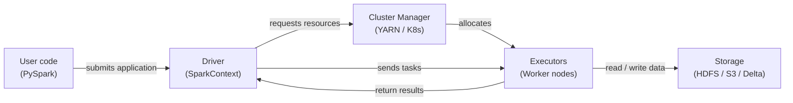

# Apache Spark

## Definición

Apache Spark es un motor de computación distribuida de código abierto diseñado para el procesamiento de datos a gran escala. Fue creado en el AMPLab de UC Berkeley en 2009 y donado a la Apache Software Foundation, donde se convirtió en el framework dominante para análisis de big data. Spark ejecuta cómputos en memoria a través de un clúster de máquinas, superando dramáticamente a los predecesores basados en disco como Hadoop MapReduce para cargas de trabajo iterativas — una propiedad que lo hace especialmente adecuado para el aprendizaje automático.

Spark proporciona una API unificada a través de cuatro cargas de trabajo principales: procesamiento batch, análisis SQL, streaming (Structured Streaming) y aprendizaje automático (MLlib). Esta unificación significa que los equipos pueden usar un único clúster y un único modelo de programación para todo el pipeline de datos de ML — desde la ingestión de logs brutos e ingeniería de características a escala de petabytes hasta el entrenamiento de modelos distribuido con MLlib. PySpark, la API de Python, es la interfaz más ampliamente utilizada en la comunidad de ciencia de datos.

El modelo de programación está construido alrededor de transformaciones y acciones sobre colecciones distribuidas. Las transformaciones (map, filter, join, groupBy) son perezosas — construyen un plan de ejecución pero no se ejecutan hasta que se llama una acción (count, collect, write). El optimizador de Spark (Catalyst) reescribe y optimiza este plan antes de la ejecución, a menudo superando al SQL ajustado manualmente. El resultado es una API expresiva de alto nivel que escala desde un portátil (modo local) a miles de núcleos sin cambios de código.

## Cómo funciona

### RDDs y DataFrames

Los Resilient Distributed Datasets (RDDs) son la abstracción de bajo nivel de Spark: colecciones inmutables, tolerantes a fallos y particionadas de registros distribuidos a través de un clúster. Los RDDs soportan transformaciones arbitrarias en Python, Scala o Java, pero no ofrecen información de esquema, por lo que el optimizador tiene visibilidad limitada sobre los datos. Los **DataFrames** (y su contraparte tipada, Datasets en Scala/Java) agregan un esquema nombrado sobre los RDDs y exponen una API similar a SQL. El optimizador Catalyst puede aplicar pushdown de predicados, poda de columnas y reordenamiento de joins a las consultas de DataFrame de formas que no son posibles con RDDs sin procesar. En la práctica, usa DataFrames a menos que necesites funcionalidad que solo los RDDs exponen.

### Spark SQL

Spark SQL te permite consultar DataFrames con sintaxis SQL estándar, mezclando llamadas SQL y API de DataFrame en el mismo programa. Se conecta a Hive metastore, Delta Lake, Iceberg y otros formatos de tabla, lo que permite a Spark actuar como motor de consultas sobre un data lakehouse. En los pipelines de ML, Spark SQL se usa para consultas de agregación de características — ventanas móviles, agregaciones a nivel de usuario y operaciones de join en tablas grandes — que serían prohibitivamente lentas en una sola máquina.

### MLlib

MLlib es la biblioteca de aprendizaje automático distribuido de Spark. Proporciona algoritmos para clasificación, regresión, clustering, filtrado colaborativo e ingeniería de características, todos implementados para ejecutarse en paralelo a través del clúster. La API Pipeline (`pyspark.ml`) refleja el diseño de scikit-learn: los pasos `Transformer` (escaladores, codificadores) y los pasos `Estimator` (ajuste de modelos) se encadenan en un objeto `Pipeline` que puede ajustarse y serializarse. MLlib es más adecuado cuando los datos de entrenamiento son demasiado grandes para caber en memoria en una sola máquina, o cuando necesitas ajuste de hiperparámetros distribuido vía `CrossValidator`.

### Arquitectura driver y executor

Una aplicación Spark tiene un proceso **driver** y uno o más procesos **executor**. El driver ejecuta el programa del usuario, construye el plan lógico, negocia recursos con el gestor de clúster (YARN, Kubernetes o Spark Standalone) y divide el trabajo en **tareas**. Los executors son procesos JVM que se ejecutan en nodos worker; cada executor mantiene un número configurable de núcleos de CPU y slots de memoria (slots de tareas). Las tareas se serializan y envían a los executors, que procesan sus particiones de datos asignadas y escriben los resultados de vuelta a memoria, disco o un sumidero de salida. La tolerancia a fallos se logra recomputando las particiones perdidas desde su linaje (la secuencia de transformaciones que las produjo).



## Cuándo usar / Cuándo NO usar

| Usar cuando | Evitar cuando |
|----------|------------|
| El conjunto de datos no cabe en la RAM de una sola máquina (> ~50 GB) | Los datos caben cómodamente en memoria — pandas o Polars serán más rápidos |
| La ingeniería de características requiere joins o agregaciones en miles de millones de filas | Tu equipo carece de experiencia con sistemas distribuidos y gestión de clústeres |
| Necesitas entrenamiento de ML distribuido (MLlib) o búsqueda de hiperparámetros | La sobrecarga de inicio del trabajo (JVM, asignación de clúster) es inaceptable para tareas sensibles a la latencia |
| Ya tienes un clúster Spark (Databricks, EMR, Dataproc) | Necesitas procesamiento en tiempo real sub-segundo (usa Flink o Kafka Streams) |
| Quieres un motor unificado para batch, SQL y streaming sobre los mismos datos | Tus transformaciones son lógica personalizada compleja que se beneficia del depurado en un solo hilo |

## Comparaciones

| Criterio | Apache Spark | Pandas |
|-----------|-------------|--------|
| Escala de datos | Petabytes — particionado a través de un clúster | Gigabytes — limitado por la RAM de una sola máquina |
| Modelo de ejecución | Distribuido, paralelo, evaluación perezosa | En proceso, eager, un solo hilo por defecto |
| Complejidad de configuración | Alta — clúster, JVM, gestión de dependencias | Baja — `pip install pandas` y ejecutar |
| Rendimiento con datos pequeños | Lento debido a serialización y sobrecarga de programación de tareas | Rápido — sobrecarga mínima, amigable con caché |
| Familiaridad con la API | PySpark es similar a pandas pero con semántica distribuida | Ampliamente conocido; el estándar para ciencia de datos en Python |
| Integración con ML | MLlib para entrenamiento distribuido; se integra con XGBoost en Spark | Ecosistema scikit-learn; mejor en su clase para ML en una sola máquina |

## Ventajas y desventajas

| Ventajas | Desventajas |
|------|------|
| Escala a petabytes sin cambios de código | Complejidad de infraestructura y operación significativa |
| Motor unificado para batch, SQL y streaming | El inicio de JVM y la programación de tareas añaden latencia — no adecuado para trabajos pequeños |
| El procesamiento en memoria es dramáticamente más rápido que MapReduce basado en disco | La gestión de memoria (desbordamientos, presión GC) requiere ajuste cuidadoso |
| Ecosistema rico: Delta Lake, Iceberg, Hudi, integración con MLflow | PySpark serializa los UDFs de Python a través de Py4J — puede ser lento para lógica personalizada |
| Tolerancia a fallos vía recomputación de linaje | Depurar trabajos distribuidos es más difícil que el código pandas en una sola máquina |

## Ejemplos de código

```python
"""
PySpark examples:
  1. DataFrame operations for feature engineering at scale
  2. MLlib Pipeline for training a logistic regression model

Requires: pyspark >= 3.4
Run locally with: spark-submit spark_ml_example.py
  or in a notebook with a SparkSession already available.
"""

from pyspark.sql import SparkSession
from pyspark.sql import functions as F
from pyspark.sql.types import DoubleType
from pyspark.ml import Pipeline
from pyspark.ml.feature import VectorAssembler, StandardScaler, StringIndexer
from pyspark.ml.classification import LogisticRegression
from pyspark.ml.evaluation import BinaryClassificationEvaluator


# --- 1. Create a SparkSession (local mode for demo) ---
spark = (
    SparkSession.builder
    .appName("MLPipelineExample")
    .master("local[*]")           # Use all local CPU cores
    .config("spark.sql.shuffle.partitions", "8")  # Reduce for small data
    .getOrCreate()
)

spark.sparkContext.setLogLevel("WARN")


# --- 2. Load raw data ---
# In production: spark.read.parquet("s3://bucket/path/") or .format("delta")
raw_df = spark.createDataFrame(
    [
        (1, 25.0, "engineer", 55000.0, 0),
        (2, 32.0, "manager", 85000.0, 1),
        (3, 28.0, "engineer", 62000.0, 0),
        (4, 45.0, "manager", 110000.0, 1),
        (5, 38.0, "analyst", 72000.0, 1),
        (6, 22.0, "analyst", 48000.0, 0),
        (7, 51.0, "manager", 125000.0, 1),
        (8, 29.0, "engineer", 59000.0, 0),
    ],
    schema=["id", "age", "role", "salary", "high_earner"],
)

print("=== Raw data ===")
raw_df.show()


# --- 3. DataFrame feature engineering ---
feature_df = (
    raw_df
    # Log-transform salary to reduce skew
    .withColumn("log_salary", F.log1p(F.col("salary")))
    # Normalized age within role group (window function)
    .withColumn(
        "age_norm",
        (F.col("age") - F.mean("age").over(
            __import__("pyspark.sql.window", fromlist=["Window"])
            .Window.partitionBy("role")
        )).cast(DoubleType())
    )
    # Drop the original salary column (replaced by log_salary)
    .drop("salary")
)

print("=== Engineered features ===")
feature_df.show()


# --- 4. MLlib Pipeline: encode → assemble → scale → train ---

# 4a. Encode categorical column 'role' to numeric index
role_indexer = StringIndexer(inputCol="role", outputCol="role_idx")

# 4b. Assemble feature columns into a single vector
assembler = VectorAssembler(
    inputCols=["age", "log_salary", "role_idx"],
    outputCol="raw_features",
)

# 4c. Standardize feature vector (zero mean, unit variance)
scaler = StandardScaler(
    inputCol="raw_features",
    outputCol="features",
    withMean=True,
    withStd=True,
)

# 4d. Logistic regression classifier
lr = LogisticRegression(
    featuresCol="features",
    labelCol="high_earner",
    maxIter=100,
    regParam=0.01,
)

# 4e. Build and fit the pipeline
pipeline = Pipeline(stages=[role_indexer, assembler, scaler, lr])

# Use the raw_df (with salary) because VectorAssembler picks log_salary after transform
train_df, test_df = raw_df.randomSplit([0.8, 0.2], seed=42)
model = pipeline.fit(train_df)

# --- 5. Evaluate ---
predictions = model.transform(test_df)
evaluator = BinaryClassificationEvaluator(labelCol="high_earner")
auc = evaluator.evaluate(predictions)
print(f"=== AUC on test set: {auc:.4f} ===")

predictions.select("id", "high_earner", "prediction", "probability").show()

# --- 6. Save model for serving ---
model.write().overwrite().save("/tmp/spark_lr_model")
print("Model saved to /tmp/spark_lr_model")

spark.stop()
```

## Recursos prácticos

- [Documentación de Apache Spark](https://spark.apache.org/docs/latest/) — Referencia oficial para todas las APIs incluyendo PySpark, SQL, Streaming y MLlib
- [Referencia de la API de PySpark](https://spark.apache.org/docs/latest/api/python/) — Documentación completa de la API Python para DataFrames, SQL y MLlib
- [Databricks — Tutoriales de Spark](https://docs.databricks.com/en/getting-started/index.html) — Notebooks prácticos que cubren Spark a escala con Delta Lake
- [Learning Spark, 2ª edición (O'Reilly)](https://www.oreilly.com/library/view/learning-spark-2nd/9781492050032/) — Libro completo que cubre Spark 3.x, Structured Streaming y Delta Lake

## Ver también

- [Pipelines de datos](/docs/mlops/data-engineering)
- [Apache Kafka](/docs/mlops/data-engineering/kafka)
- [Apache Airflow](/docs/mlops/data-engineering/airflow)
