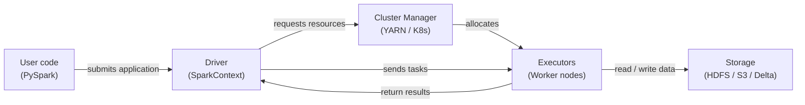

# Apache Spark

## Definición

Apache Spark es un motor de computación distribuida de código abierto diseñado para el procesamiento de datos a gran escala. Fue creado en el AMPLab de UC Berkeley en 2009 y donado a la Apache Software Foundation, donde se convirtió en el framework dominante para análisis de big data. Spark ejecuta computaciones en memoria en un clúster de máquinas, superando dramáticamente a los predecesores basados en disco como Hadoop MapReduce para cargas de trabajo iterativas — una propiedad que lo hace especialmente adecuado para el machine learning.

Spark proporciona una API unificada para cuatro cargas de trabajo principales: procesamiento batch, análisis SQL, streaming (Structured Streaming) y machine learning (MLlib).

## Cómo funciona

### RDDs y DataFrames

Los Resilient Distributed Datasets (RDDs) son la abstracción de bajo nivel de Spark. Los **DataFrames** agregan un esquema nombrado sobre los RDDs y exponen una API similar a SQL. El optimizador Catalyst puede aplicar predicate pushdown, pruning de columnas y reordenamiento de joins.

### Spark SQL

Spark SQL permite consultar DataFrames con sintaxis SQL estándar, mezclando llamadas SQL y DataFrame API en el mismo programa.

### MLlib

MLlib es la biblioteca de machine learning distribuido de Spark. La API Pipeline (`pyspark.ml`) refleja el diseño de scikit-learn.

### Arquitectura driver y executor

Una aplicación Spark tiene un proceso **driver** y uno o más procesos **executor**. El driver ejecuta el programa del usuario, construye el plan lógico y divide el trabajo en **tareas**.



## Cuándo usar / Cuándo NO usar

| Usar cuando | Evitar cuando |
|---|---|
| El conjunto de datos no cabe en la RAM de una sola máquina (> ~50 GB) | Los datos caben cómodamente en memoria — pandas o Polars serán más rápidos |
| La ingeniería de características requiere joins o agregaciones sobre miles de millones de filas | Su equipo carece de experiencia con sistemas distribuidos |
| Necesita entrenamiento ML distribuido (MLlib) o búsqueda de hiperparámetros | El overhead de inicio del job es inaceptable para tareas sensibles a la latencia |
| Ya tiene un clúster Spark (Databricks, EMR, Dataproc) | Necesita procesamiento en tiempo real sub-segundo |

## Comparaciones

| Criterio | Apache Spark | Pandas |
|---|---|---|
| Escala de datos | Petabytes — particionado en un clúster | Gigabytes — limitado por RAM de una máquina |
| Modelo de ejecución | Distribuido, paralelo, evaluación lazy | In-process, eager, single-threaded por defecto |
| Complejidad de configuración | Alta | Baja |
| Rendimiento en datos pequeños | Lento por overhead de serialización | Rápido |

## Pros y contras

| Pros | Contras |
|---|---|
| Escala a petabytes sin cambios de código | Complejidad de infraestructura y operacional significativa |
| Motor unificado para batch, SQL y streaming | Startup de JVM y scheduling de tareas añaden latencia |
| Procesamiento en memoria dramáticamente más rápido que MapReduce | La gestión de memoria requiere ajuste cuidadoso |
| Rico ecosistema: Delta Lake, Iceberg, Hudi, MLflow | PySpark serializa UDFs Python via Py4J |

## Ejemplo de código

```python
from pyspark.sql import SparkSession
from pyspark.sql import functions as F
from pyspark.ml import Pipeline
from pyspark.ml.feature import VectorAssembler, StandardScaler, StringIndexer
from pyspark.ml.classification import LogisticRegression
from pyspark.ml.evaluation import BinaryClassificationEvaluator

spark = (
    SparkSession.builder
    .appName("MLPipelineExample")
    .master("local[*]")
    .config("spark.sql.shuffle.partitions", "8")
    .getOrCreate()
)

raw_df = spark.createDataFrame(
    [(1, 25.0, "engineer", 55000.0, 0), (2, 32.0, "manager", 85000.0, 1),
     (3, 28.0, "engineer", 62000.0, 0), (4, 45.0, "manager", 110000.0, 1),
     (5, 38.0, "analyst", 72000.0, 1), (6, 22.0, "analyst", 48000.0, 0)],
    schema=["id", "age", "role", "salary", "high_earner"],
)

feature_df = raw_df.withColumn("log_salary", F.log1p(F.col("salary"))).drop("salary")

role_indexer = StringIndexer(inputCol="role", outputCol="role_idx")
assembler = VectorAssembler(inputCols=["age", "log_salary", "role_idx"], outputCol="raw_features")
scaler = StandardScaler(inputCol="raw_features", outputCol="features", withMean=True, withStd=True)
lr = LogisticRegression(featuresCol="features", labelCol="high_earner", maxIter=100, regParam=0.01)

pipeline = Pipeline(stages=[role_indexer, assembler, scaler, lr])
train_df, test_df = raw_df.randomSplit([0.8, 0.2], seed=42)
model = pipeline.fit(train_df)

predictions = model.transform(test_df)
evaluator = BinaryClassificationEvaluator(labelCol="high_earner")
auc = evaluator.evaluate(predictions)
print(f"=== AUC on test set: {auc:.4f} ===")

model.write().overwrite().save("/tmp/spark_lr_model")
spark.stop()
```

## Recursos prácticos

- [Documentación Apache Spark](https://spark.apache.org/docs/latest/) — Referencia oficial para todas las APIs.
- [Referencia API de PySpark](https://spark.apache.org/docs/latest/api/python/) — Documentación completa de la API Python.
- [Databricks — Tutoriales Spark](https://docs.databricks.com/en/getting-started/index.html) — Notebooks prácticos con Spark y Delta Lake.
- [Learning Spark, 2nd edition (O'Reilly)](https://www.oreilly.com/library/view/learning-spark-2nd/9781492050032/) — Libro completo sobre Spark 3.x.

## Ver también

- [Pipelines de datos](/docs/mlops/data-engineering)
- [Apache Kafka](/docs/mlops/data-engineering/kafka)
- [Apache Airflow](/docs/mlops/data-engineering/airflow)
