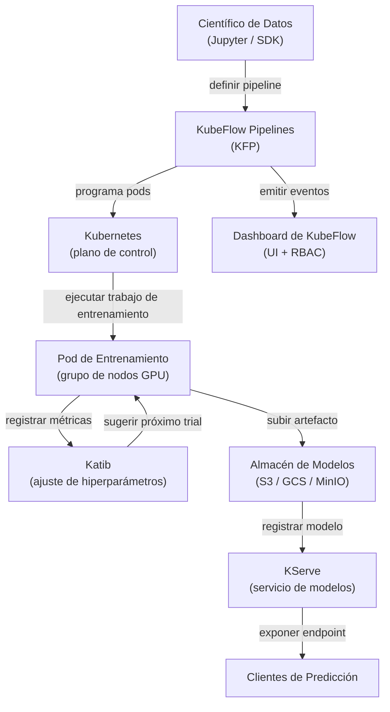

# KubeFlow

## Definición

KubeFlow es un kit de herramientas ML de código abierto diseñado para hacer que el despliegue de flujos de trabajo ML en Kubernetes sea simple, portable y escalable. Fue creado originalmente por Google y ahora es un proyecto de la Cloud Native Computing Foundation (CNCF) con amplia adopción en la industria. KubeFlow no pretende ser una plataforma monolítica única; en cambio, es una colección curada de componentes nativos de Kubernetes que cada uno resuelve un problema distinto de infraestructura ML.

Los componentes principales son: **KubeFlow Pipelines (KFP)** para definir y ejecutar flujos de trabajo ML basados en DAG como trabajos de Kubernetes; **Katib** para ajuste automatizado de hiperparámetros y búsqueda de arquitectura neuronal usando optimización bayesiana, búsqueda aleatoria o aprendizaje por refuerzo; **KFServing (ahora KServe)** para servicio de modelos escalable con escalado sin servidor, despliegues canary y soporte para múltiples runtimes de servicio; y **Jupyter Notebook Servers** gestionados por el dashboard de KubeFlow para desarrollo interactivo en un entorno multi-inquilino. Toda la plataforma se instala mediante un único conjunto de manifiestos de Kubernetes y se gestiona a través de una interfaz web.

La fortaleza de KubeFlow es que se ejecuta en cualquier clúster de Kubernetes — on-premises, GKE, EKS, AKS o un clúster kind local — lo que lo hace adecuado para organizaciones que requieren que los datos permanezcan dentro de su propia infraestructura. Su principal costo es la complejidad operacional: la curva de aprendizaje es pronunciada, y operar KubeFlow en producción requiere sólidos conocimientos de Kubernetes.

## Cómo funciona



### KubeFlow Pipelines (KFP)

KFP permite a los científicos de datos definir pipelines ML como código Python usando el SDK de KFP. Cada paso del pipeline es un componente en contenedor: una función Python decorada con `@dsl.component` se compila en una especificación de contenedor que KFP ejecuta como un pod de Kubernetes. El DAG del pipeline se compila en un archivo de Representación Intermedia (IR YAML) que el controlador backend de KFP programa en el clúster. Este enfoque significa que cada paso es completamente reproducible: la imagen del contenedor está fijada, las entradas y salidas son artefactos rastreados en el almacén de metadatos de KFP (ML Metadata / MLMD), y todo el grafo de ejecución es visible en la UI con logs, entradas, salidas y estado por paso.

### Katib — Ajuste de Hiperparámetros

Katib es el componente AutoML de KubeFlow. Define un recurso personalizado `Experiment` de Kubernetes que especifica el espacio de búsqueda (rangos y tipos de parámetros), la métrica objetivo (minimizar pérdida, maximizar precisión) y el algoritmo de búsqueda (optimización bayesiana vía proceso gaussiano, CMA-ES, búsqueda aleatoria o búsqueda en cuadrícula). Katib ejecuta trials paralelos — cada trial es un trabajo de entrenamiento completo — y usa los resultados para sugerir mejores configuraciones para los trials subsiguientes. La integración con KFP significa que un pipeline completo (datos → ingeniería de características → entrenamiento → evaluación) puede tratarse como un único trial de Katib, habilitando AutoML de extremo a extremo en pipelines complejos.

### KServe (anteriormente KFServing)

KServe extiende Kubernetes con recursos personalizados `InferenceService` que definen declarativamente los despliegues de servicio de modelos. Se especifica el framework (sklearn, xgboost, pytorch, tensorflow, personalizado) y el URI del modelo (ruta S3, PVC) y KServe maneja: descargar el modelo, seleccionar el runtime de servicio correcto, configurar el proxy sidecar, exponer el endpoint vía Istio y escalar réplicas a cero cuando están inactivas (modo sin servidor). Los despliegues canary dividen el tráfico entre dos versiones del modelo por porcentaje, habilitando lanzamientos seguros. Los componentes de transformador y explicador permiten conectar lógica de preprocesamiento y explicabilidad basada en SHAP junto al predictor.

### Multi-inquilino y RBAC

El dashboard de KubeFlow implementa multi-inquilino mediante namespaces de Kubernetes: cada usuario o equipo obtiene un namespace aislado con sus propias cuotas de recursos, servidores de notebooks y ejecuciones de pipeline. El Control de Acceso Basado en Roles (RBAC) restringe qué usuarios pueden ver, ejecutar o gestionar pipelines y modelos. Esto hace a KubeFlow adecuado para grandes organizaciones donde múltiples equipos comparten un único clúster GPU y necesitan aislamiento sin clústeres separados.

## Cuándo usar / Cuándo NO usar

| Usar cuando | Evitar cuando |
|---|---|
| Se ejecutan cargas de trabajo ML en un clúster Kubernetes existente | El equipo no tiene experiencia en Kubernetes ni ingeniero de plataforma dedicado |
| Se necesita orquestación completa de pipelines, AutoML y servicio en una plataforma | Un servicio gestionado (SageMaker, Vertex AI) se ajusta a la estrategia del proveedor cloud |
| Los requisitos de residencia de datos impiden usar servicios ML cloud gestionados | Solo se necesita servicio de modelos, no orquestación completa de pipelines |
| La organización opera un clúster GPU compartido con necesidades de multi-inquilino | Los flujos de trabajo ML son suficientemente simples para un único script de entrenamiento |
| Se requieren características avanzadas de servicio (escalado sin servidor, canary, transformadores) | La velocidad de llegada a producción es más importante que el control de infraestructura |

## Comparaciones

| Criterio | KubeFlow | ML en Kubernetes (vanilla) |
|---|---|---|
| Complejidad | Alta — muchos CRDs, controladores y dependencias de Istio | Media — solo objetos estándar de Kubernetes |
| Características | Pipelines, AutoML (Katib), servicio (KServe), gestión de notebooks | Lo que se construya y configure manualmente |
| Curva de aprendizaje | Pronunciada — requiere conocimiento de dominio de Kubernetes + KubeFlow | Media — conocimiento estándar de K8s suficiente |
| Flexibilidad | Moderada — extensible pero ligado a abstracciones de KubeFlow | Alta — control total sobre cada recurso de Kubernetes |
| Opciones gestionadas | Kubeflow en GKE (Vertex AI Pipelines), AWS Managed KubeFlow | Cualquier Kubernetes gestionado (EKS, GKE, AKS) |
| Tiempo de configuración | Días a semanas para instalación de grado producción | Horas a días según complejidad de la carga de trabajo |

## Ventajas y desventajas

| Ventajas | Desventajas |
|---|---|
| Plataforma ML unificada — pipelines, ajuste, servicio en un sistema | Complejidad operacional muy alta y gran número de partes móviles |
| Agnóstico a la nube — se ejecuta en cualquier clúster Kubernetes | Curva de aprendizaje pronunciada; requiere experiencia en Kubernetes para operar |
| Servicio de modelos sin servidor con escalado automático a cero | Instalación intensiva en recursos (Istio, Argo Workflows, MLMD, Knative) |
| Multi-inquilino sólido con aislamiento de namespace y RBAC | Las actualizaciones entre versiones de KubeFlow pueden ser complicadas |
| Comunidad CNCF activa e integraciones amplias del ecosistema | Depurar fallos a menudo requiere comprender múltiples capas (K8s → Argo → Python SDK) |

## Ejemplos de código

```python
# kubeflow_pipeline.py
# SDK KubeFlow Pipelines v2 — define un pipeline ML de dos pasos:
#   1. Componente de preprocesamiento de datos
#   2. Componente de entrenamiento
# Requiere: pip install kfp==2.*

from kfp import dsl
from kfp.client import Client


# --- Componente 1: Preprocesar datos CSV sin procesar ---

@dsl.component(
    base_image="python:3.11-slim",
    packages_to_install=["pandas==2.2.0", "scikit-learn==1.4.0"],
)
def preprocess(
    raw_data_path: str,
    output_features: dsl.Output[dsl.Dataset],
) -> None:
    """
    Lee CSV sin procesar, aplica ingeniería de características y escribe características como Parquet.
    KFP rastrea output_features como un artefacto Dataset con URI y metadatos.
    """
    import pandas as pd
    from sklearn.preprocessing import StandardScaler

    df = pd.read_csv(raw_data_path)

    # Ingeniería de características simple: escalar columnas numéricas
    scaler = StandardScaler()
    numeric_cols = df.select_dtypes("number").columns.tolist()
    df[numeric_cols] = scaler.fit_transform(df[numeric_cols])

    # KFP proporciona output_features.path — escribir artefacto allí
    df.to_parquet(output_features.path, index=False)
    print(f"Wrote {len(df)} rows to {output_features.path}")


# --- Componente 2: Entrenar un modelo sobre las características preprocesadas ---

@dsl.component(
    base_image="python:3.11-slim",
    packages_to_install=["pandas==2.2.0", "scikit-learn==1.4.0", "joblib==1.3.0"],
)
def train(
    features: dsl.Input[dsl.Dataset],
    n_estimators: int,
    model_output: dsl.Output[dsl.Model],
    metrics_output: dsl.Output[dsl.Metrics],
) -> None:
    """
    Entrena un RandomForestClassifier y escribe el artefacto del modelo + métricas.
    """
    import json
    import joblib
    import pandas as pd
    from sklearn.ensemble import RandomForestClassifier
    from sklearn.model_selection import train_test_split
    from sklearn.metrics import accuracy_score

    df = pd.read_parquet(features.path)
    X = df.drop(columns=["label"]).values
    y = df["label"].values
    X_train, X_test, y_train, y_test = train_test_split(X, y, test_size=0.2, random_state=42)

    clf = RandomForestClassifier(n_estimators=n_estimators, random_state=42)
    clf.fit(X_train, y_train)

    accuracy = float(accuracy_score(y_test, clf.predict(X_test)))

    # Escribir artefacto del modelo (KFP rastrea el URI y el linaje)
    joblib.dump(clf, model_output.path)

    # Registrar métricas — visibles en la UI de KubeFlow Pipelines
    metrics_output.log_metric("accuracy", accuracy)
    metrics_output.log_metric("n_estimators", n_estimators)
    print(f"Accuracy: {accuracy:.4f}")


# --- Definición del pipeline ---

@dsl.pipeline(
    name="fraud-detection-pipeline",
    description="Pipeline de dos etapas: preprocesar datos CSV, luego entrenar RandomForest.",
)
def fraud_pipeline(
    raw_data_path: str = "gs://my-bucket/data/train.csv",
    n_estimators: int = 100,
) -> None:
    # Paso 1: preprocesamiento — se ejecuta en su propio pod
    preprocess_task = preprocess(raw_data_path=raw_data_path)

    # Paso 2: entrenamiento — depende del artefacto Dataset del paso 1
    train_task = train(
        features=preprocess_task.outputs["output_features"],
        n_estimators=n_estimators,
    )
    # Asignar este task a un grupo de nodos con GPU (solicitud de recursos opcional)
    train_task.set_accelerator_type("NVIDIA_TESLA_T4").set_accelerator_limit(1)


# --- Enviar el pipeline a una instancia en ejecución de KubeFlow Pipelines ---

if __name__ == "__main__":
    # Conectar al backend KFP (port-forward: kubectl port-forward -n kubeflow svc/ml-pipeline 8888:8888)
    client = Client(host="http://localhost:8888")

    run = client.create_run_from_pipeline_func(
        pipeline_func=fraud_pipeline,
        arguments={
            "raw_data_path": "gs://my-bucket/data/train.csv",
            "n_estimators": 200,
        },
        run_name="fraud-pipeline-run-v1",
        experiment_name="fraud-detection",
    )
    print(f"Pipeline run created: {run.run_id}")
    print(f"View at: http://localhost:8888/#/runs/details/{run.run_id}")
```

## Recursos prácticos

- [Documentación oficial de KubeFlow](https://www.kubeflow.org/docs/) — Visión general de la arquitectura, guías de componentes e instrucciones de instalación.
- [Referencia del SDK de KubeFlow Pipelines](https://kubeflow-pipelines.readthedocs.io/) — Referencia completa de la API para el SDK Python de KFP v2.
- [Documentación de KServe](https://kserve.github.io/website/) — Runtime de servicio, especificación de InferenceService y guía de lanzamiento canary.
- [Guía de ajuste de hiperparámetros de Katib](https://www.kubeflow.org/docs/components/katib/overview/) — Especificación de experimentos, algoritmos de búsqueda e integración con operadores de entrenamiento.

## Ver también

- [ML en Kubernetes](/docs/mlops/deployment/ml-kubernetes)
- [Servicio de modelos](/docs/mlops/deployment/model-serving)
- [Monitorización](/docs/mlops/monitoring)
