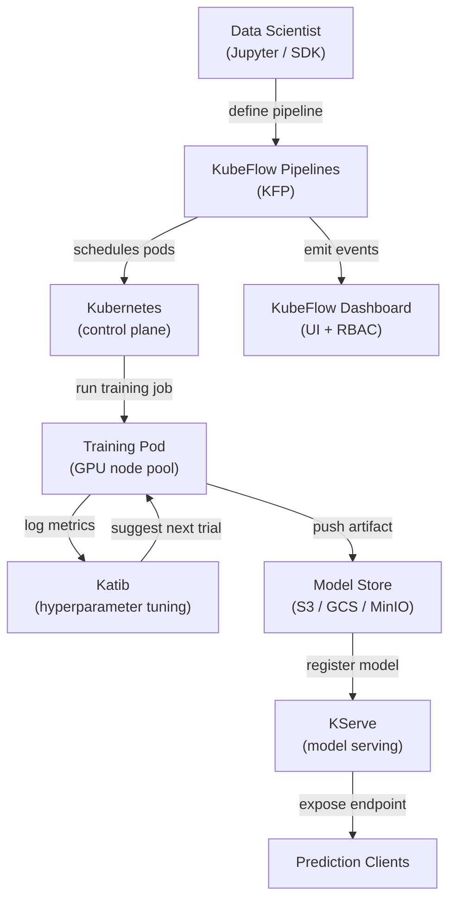

# KubeFlow

## Definición

KubeFlow es un kit de herramientas ML de código abierto diseñado para hacer que el despliegue de flujos de trabajo de ML en Kubernetes sea simple, portable y escalable. Fue creado originalmente por Google y ahora es un proyecto de la Cloud Native Computing Foundation (CNCF) con amplia adopción en la industria. KubeFlow no intenta ser una plataforma monolítica única; en cambio, es una colección curada de componentes nativos de Kubernetes que cada uno resuelve un problema de infraestructura de ML distinto.

Los componentes principales son: **KubeFlow Pipelines (KFP)** para definir y ejecutar flujos de trabajo de ML basados en DAG como trabajos de Kubernetes; **Katib** para el ajuste automatizado de hiperparámetros y búsqueda de arquitectura neuronal usando optimización bayesiana, búsqueda aleatoria o aprendizaje por refuerzo; **KFServing (ahora KServe)** para servicio de modelos escalable con escalado sin servidor, despliegues canary y soporte para múltiples runtimes de servicio; y **Servidores de Jupyter Notebook** gestionados por el panel de KubeFlow para el desarrollo interactivo en un entorno multi-inquilino. Toda la plataforma se instala mediante un único conjunto de manifiestos de Kubernetes y se gestiona a través de una interfaz web.

La fortaleza de KubeFlow es que se ejecuta en cualquier clúster de Kubernetes — on-premises, GKE, EKS, AKS o un clúster kind local —, lo que lo hace adecuado para organizaciones que requieren que los datos permanezcan dentro de su propia infraestructura. Su principal costo es la complejidad operativa: la curva de aprendizaje es pronunciada, y operar KubeFlow en producción requiere sólida experiencia en Kubernetes.

## Cómo funciona



### KubeFlow Pipelines (KFP)

KFP permite a los científicos de datos definir pipelines de ML como código Python usando el SDK de KFP. Cada paso del pipeline es un componente contenerizado: una función Python decorada con `@dsl.component` se compila en una especificación de contenedor que KFP ejecuta como un pod de Kubernetes. El DAG del pipeline se compila en un archivo de Representación Intermedia (IR YAML) que el controlador backend de KFP programa en el clúster. Este enfoque significa que cada paso es completamente reproducible: la imagen del contenedor está fijada, las entradas y salidas son artefactos rastreados en el almacén de metadatos de KFP (ML Metadata / MLMD), y todo el gráfico de ejecución es visible en la interfaz con logs, entradas, salidas y estado por paso.

### Katib — Ajuste de hiperparámetros

Katib es el componente AutoML de KubeFlow. Define un recurso personalizado de Kubernetes `Experiment` que especifica el espacio de búsqueda (rangos y tipos de parámetros), la métrica objetivo (minimizar pérdida, maximizar precisión) y el algoritmo de búsqueda (optimización bayesiana vía Proceso Gaussiano, CMA-ES, búsqueda aleatoria o búsqueda en cuadrícula). Katib ejecuta pruebas en paralelo — cada prueba es un trabajo de entrenamiento completo — y usa los resultados para sugerir mejores configuraciones para pruebas posteriores. La integración con KFP significa que un pipeline completo (datos → ingeniería de características → entrenamiento → evaluación) puede tratarse como una única prueba de Katib, habilitando AutoML de extremo a extremo en pipelines complejos.

### KServe (anteriormente KFServing)

KServe extiende Kubernetes con recursos personalizados `InferenceService` que definen declarativamente los despliegues de servicio de modelos. Se especifica el framework (sklearn, xgboost, pytorch, tensorflow, custom) y el URI del modelo (ruta S3, PVC) y KServe gestiona: descarga del modelo, selección del runtime de servicio correcto, configuración del proxy sidecar, exposición del endpoint vía Istio y escalado de réplicas a cero cuando está inactivo (modo sin servidor). Los despliegues canary dividen el tráfico entre dos versiones del modelo por porcentaje, habilitando lanzamientos seguros. Los componentes transformer y explainer permiten conectar lógica de preprocesamiento y explicabilidad basada en SHAP junto al predictor.

### Multi-tenancy y RBAC

El panel de KubeFlow implementa multi-tenancy a través de espacios de nombres de Kubernetes: cada usuario o equipo obtiene un espacio de nombres aislado con sus propias cuotas de recursos, servidores de notebooks y ejecuciones de pipeline. El Control de Acceso Basado en Roles (RBAC) restringe qué usuarios pueden ver, ejecutar o gestionar pipelines y modelos. Esto hace que KubeFlow sea adecuado para grandes organizaciones donde múltiples equipos comparten un único clúster GPU y necesitan aislamiento sin clústeres separados.

## Cuándo usar / Cuándo NO usar

| Usar cuando | Evitar cuando |
|---|---|
| Se ejecutan cargas de trabajo de ML en un clúster de Kubernetes existente | El equipo no tiene experiencia en Kubernetes y no hay un ingeniero de plataforma dedicado |
| Se necesita orquestación completa de pipelines, AutoML y servicio en una plataforma | Un servicio gestionado (SageMaker, Vertex AI) se ajusta a la estrategia del proveedor de nube |
| Los requisitos de residencia de datos impiden usar servicios de ML en nube gestionados | Solo se necesita servicio de modelos, no orquestación completa de pipeline |
| La organización opera un clúster GPU compartido con necesidades de multi-tenancy | Los flujos de trabajo de ML son lo suficientemente simples para un único script de entrenamiento |
| Se requieren funciones avanzadas de servicio (escalado sin servidor, canary, transformers) | La rapidez de llegada a producción es más importante que el control de infraestructura |

## Comparaciones

| Criterio | KubeFlow | ML en Kubernetes (vanilla) |
|---|---|---|
| Complejidad | Alta — muchos CRDs, controladores y dependencias de Istio | Media — solo objetos estándar de Kubernetes |
| Características | Pipelines, AutoML (Katib), servicio (KServe), gestión de notebooks | Lo que se construya y configure manualmente |
| Curva de aprendizaje | Pronunciada — requiere conocimiento de dominio de Kubernetes + KubeFlow | Media — conocimiento estándar de K8s suficiente |
| Flexibilidad | Moderada — extensible pero ligada a las abstracciones de KubeFlow | Alta — control total sobre cada recurso de Kubernetes |
| Opciones gestionadas | KubeFlow en GKE (Vertex AI Pipelines), AWS Managed KubeFlow | Cualquier Kubernetes gestionado (EKS, GKE, AKS) |
| Tiempo de configuración | Días a semanas para una instalación de grado producción | Horas a días según la complejidad de la carga de trabajo |

## Ventajas y desventajas

| Ventajas | Desventajas |
|---|---|
| Plataforma ML unificada — pipelines, ajuste, servicio en un sistema | Complejidad operativa muy alta y gran cantidad de partes móviles |
| Agnóstico a la nube — se ejecuta en cualquier clúster de Kubernetes | Curva de aprendizaje pronunciada; requiere experiencia en Kubernetes para operar |
| Servicio de modelos sin servidor con escala automática a cero | Instalación con uso intensivo de recursos (Istio, Argo Workflows, MLMD, Knative) |
| Multi-tenancy sólido con aislamiento de espacios de nombres y RBAC | Las actualizaciones entre versiones de KubeFlow pueden ser complicadas |
| Comunidad activa de CNCF e integraciones amplias del ecosistema | La depuración de fallos suele requerir comprender múltiples capas (K8s → Argo → Python SDK) |

## Ejemplos de código

```python
# kubeflow_pipeline.py
# KubeFlow Pipelines v2 SDK — defines a two-step ML pipeline:
#   1. Data preprocessing component
#   2. Training component
# Requires: pip install kfp==2.*

from kfp import dsl
from kfp.client import Client


# --- Component 1: Preprocess raw CSV data ---

@dsl.component(
    base_image="python:3.11-slim",
    packages_to_install=["pandas==2.2.0", "scikit-learn==1.4.0"],
)
def preprocess(
    raw_data_path: str,
    output_features: dsl.Output[dsl.Dataset],
) -> None:
    """
    Reads raw CSV, applies feature engineering, and writes features as Parquet.
    KFP tracks output_features as a Dataset artifact with URI and metadata.
    """
    import pandas as pd
    from sklearn.preprocessing import StandardScaler

    df = pd.read_csv(raw_data_path)

    # Simple feature engineering: scale numeric columns
    scaler = StandardScaler()
    numeric_cols = df.select_dtypes("number").columns.tolist()
    df[numeric_cols] = scaler.fit_transform(df[numeric_cols])

    # KFP provides output_features.path — write artifact there
    df.to_parquet(output_features.path, index=False)
    print(f"Wrote {len(df)} rows to {output_features.path}")


# --- Component 2: Train a model on the preprocessed features ---

@dsl.component(
    base_image="python:3.11-slim",
    packages_to_install=["pandas==2.2.0", "scikit-learn==1.4.0", "joblib==1.3.0"],
)
def train(
    features: dsl.Input[dsl.Dataset],
    n_estimators: int,
    model_output: dsl.Output[dsl.Model],
    metrics_output: dsl.Output[dsl.Metrics],
) -> None:
    """
    Trains a RandomForestClassifier and writes the model artifact + metrics.
    """
    import json
    import joblib
    import pandas as pd
    from sklearn.ensemble import RandomForestClassifier
    from sklearn.model_selection import train_test_split
    from sklearn.metrics import accuracy_score

    df = pd.read_parquet(features.path)
    X = df.drop(columns=["label"]).values
    y = df["label"].values
    X_train, X_test, y_train, y_test = train_test_split(X, y, test_size=0.2, random_state=42)

    clf = RandomForestClassifier(n_estimators=n_estimators, random_state=42)
    clf.fit(X_train, y_train)

    accuracy = float(accuracy_score(y_test, clf.predict(X_test)))

    # Write model artifact (KFP tracks the URI and lineage)
    joblib.dump(clf, model_output.path)

    # Log metrics — visible in the KubeFlow Pipelines UI
    metrics_output.log_metric("accuracy", accuracy)
    metrics_output.log_metric("n_estimators", n_estimators)
    print(f"Accuracy: {accuracy:.4f}")


# --- Pipeline definition ---

@dsl.pipeline(
    name="fraud-detection-pipeline",
    description="Two-stage pipeline: preprocess CSV data, then train RandomForest.",
)
def fraud_pipeline(
    raw_data_path: str = "gs://my-bucket/data/train.csv",
    n_estimators: int = 100,
) -> None:
    # Step 1: preprocess — runs in its own pod
    preprocess_task = preprocess(raw_data_path=raw_data_path)

    # Step 2: train — depends on the Dataset artifact from step 1
    train_task = train(
        features=preprocess_task.outputs["output_features"],
        n_estimators=n_estimators,
    )
    # Assign this task to a node pool with GPU (optional resource request)
    train_task.set_accelerator_type("NVIDIA_TESLA_T4").set_accelerator_limit(1)


# --- Submit the pipeline to a running KubeFlow Pipelines instance ---

if __name__ == "__main__":
    # Connect to KFP backend (port-forward: kubectl port-forward -n kubeflow svc/ml-pipeline 8888:8888)
    client = Client(host="http://localhost:8888")

    run = client.create_run_from_pipeline_func(
        pipeline_func=fraud_pipeline,
        arguments={
            "raw_data_path": "gs://my-bucket/data/train.csv",
            "n_estimators": 200,
        },
        run_name="fraud-pipeline-run-v1",
        experiment_name="fraud-detection",
    )
    print(f"Pipeline run created: {run.run_id}")
    print(f"View at: http://localhost:8888/#/runs/details/{run.run_id}")
```

## Recursos prácticos

- [Documentación oficial de KubeFlow](https://www.kubeflow.org/docs/) — Descripción general de la arquitectura, guías de componentes e instrucciones de instalación.
- [Referencia del SDK de KubeFlow Pipelines](https://kubeflow-pipelines.readthedocs.io/) — Referencia completa de la API para el SDK Python de KFP v2.
- [Documentación de KServe](https://kserve.github.io/website/) — Runtime de servicio, especificación de InferenceService y guía de lanzamiento canary.
- [Guía de ajuste de hiperparámetros de Katib](https://www.kubeflow.org/docs/components/katib/overview/) — Especificación de experimentos, algoritmos de búsqueda e integración con operadores de entrenamiento.

## Ver también

- [ML en Kubernetes](/docs/mlops/deployment/ml-kubernetes)
- [Servicio de modelos](/docs/mlops/deployment/model-serving)
- [Monitoreo](/docs/mlops/monitoring)
