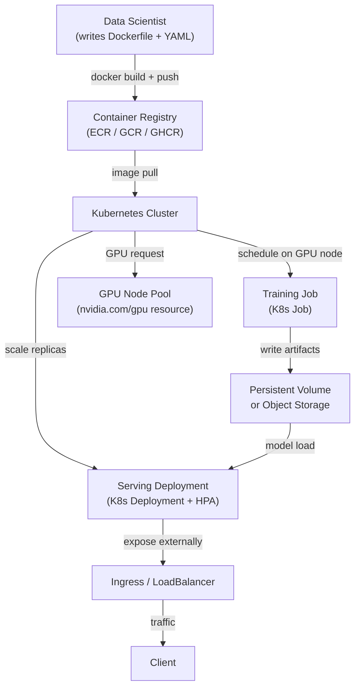

# ML en Kubernetes

## Definición

Kubernetes (K8s) es una plataforma de orquestación de contenedores que automatiza el despliegue, el escalado y la gestión de cargas de trabajo contenerizadas. Aunque Kubernetes fue diseñado para servicios web sin estado, la comunidad de ML lo ha adoptado ampliamente como columna vertebral de infraestructura para trabajos de entrenamiento, puntuación por lotes y servicio de modelos, porque resuelve los problemas de infraestructura de ML más difíciles: aislamiento de recursos, entornos reproducibles, programación de GPU y escalado horizontal.

Ejecutar ML en Kubernetes sin adornos — sin una abstracción de nivel superior como [KubeFlow](/docs/mlops/deployment/kubeflow) — significa componer primitivas estándar de Kubernetes: `Job` para ejecuciones de entrenamiento únicas, `CronJob` para reentrenamiento programado, `Deployment` para instancias de servicio de larga duración y `HorizontalPodAutoscaler` para el autoescalado. Este enfoque otorga a los equipos control total sobre cada aspecto de sus cargas de trabajo al costo de más creación de YAML y menos herramientas específicas de ML integradas.

La diferencia clave respecto a ejecutar ML en VMs básicas es que Kubernetes proporciona gestión declarativa de recursos: se especifica cuánta CPU, RAM y GPU necesita un trabajo de entrenamiento, y el planificador lo ubica automáticamente en un nodo apropiado. Kubernetes también maneja fallos de nodos, reinicios de pods y despliegues continuos sin intervención manual. Para los equipos de ML que ya operan un clúster de Kubernetes (o cuya organización tiene uno), este suele ser el camino pragmático hacia la producción antes de invertir en una plataforma completa como KubeFlow.

## Cómo funciona



### Contenerización de modelos de ML

El primer paso para ejecutar ML en Kubernetes es empaquetar el código del modelo y sus dependencias en una imagen Docker. Un Dockerfile de ML bien estructurado utiliza compilaciones de múltiples etapas para separar la capa de instalación de dependencias (que cambia raramente y es cacheable) de la capa de código de aplicación (que cambia frecuentemente). La imagen base debe estar fijada a una versión específica — para cargas de trabajo de GPU, NVIDIA proporciona imágenes base `nvcr.io/nvidia/pytorch` y `nvcr.io/nvidia/tensorflow` que incluyen CUDA, cuDNN y NCCL preinstalados y validados juntos. La imagen resultante se sube a un registro de contenedores y se referencia por nombre y resumen (no `latest`) en los manifiestos de Kubernetes, garantizando que se use exactamente el mismo entorno cada vez.

### Programación de GPU y gestión de recursos

Kubernetes admite la programación de GPU a través del plugin de dispositivos NVIDIA, que expone las GPUs como un recurso programable (`nvidia.com/gpu`). Un pod que solicita `nvidia.com/gpu: 1` solo se programará en un nodo que tenga una GPU libre, y la GPU se asigna exclusivamente a ese pod durante toda su vida. Los grupos de nodos suelen configurarse con diferentes tipos de GPU (T4 para inferencia, A100 para trabajos de entrenamiento grandes) y se etiquetan en consecuencia, permitiendo que los pods usen `nodeSelector` o `nodeAffinity` para seleccionar el hardware apropiado. Las cuotas de recursos a nivel de espacio de nombres evitan que un solo equipo monopolice la capacidad de GPU del clúster.

### Trabajos de entrenamiento

Las ejecuciones de entrenamiento únicas se expresan como objetos `Job` de Kubernetes. Un Job crea uno o más pods, espera a que se completen correctamente (salida 0) y registra el resultado. Para el entrenamiento distribuido en múltiples GPUs o nodos, el `training-operator` (anteriormente el Kubeflow Training Operator, pero desplegable de forma independiente) extiende Kubernetes con recursos personalizados `PyTorchJob` y `TFJob` que coordinan el entrenamiento multi-nodo y multi-GPU con PyTorch DDP o Horovod. Cada pod trabajador recibe la misma imagen de contenedor pero diferentes variables de entorno de rango y tamaño de mundo, lo que permite el entrenamiento paralelo de datos con rendezvous automático.

### Despliegues de servicio y autoescalado

El servicio de modelos se expresa como un `Deployment` de Kubernetes con un número deseado de réplicas y solicitudes/límites de recursos. Un `Service` de tipo `ClusterIP` enruta el tráfico entre réplicas, y un servicio `Ingress` o `LoadBalancer` expone el endpoint externamente. El `HorizontalPodAutoscaler` (HPA) escala el número de réplicas según la utilización de CPU, métricas personalizadas (p. ej., solicitudes por segundo de Prometheus) o métricas externas (p. ej., profundidad de cola SQS para trabajadores por lotes). Para el servicio sensible a la latencia, los `PodDisruptionBudgets` garantizan que las actualizaciones continuas nunca derriben más de una fracción configurable de réplicas simultáneamente.

## Cuándo usar / Cuándo NO usar

| Usar cuando | Evitar cuando |
|---|---|
| La organización ya opera un clúster de Kubernetes | El equipo no tiene experiencia en Kubernetes y no hay equipo de plataforma que lo soporte |
| Se requiere control total sobre la infraestructura (on-premises, air-gapped) | Hay disponible un servicio de ML gestionado (SageMaker, Vertex AI) que se ajusta al caso de uso |
| Las cargas de trabajo de ML deben compartir un clúster con otras cargas de trabajo de ingeniería | La simplicidad de una VM o un trabajo de entrenamiento en la nube es suficiente |
| Se necesita programación de GPU sin la sobrecarga de una plataforma de ML completa | El costo de configuración y mantenimiento de K8s supera los beneficios operativos |
| La portabilidad entre proveedores de nube es un requisito estricto | Se necesita AutoML, seguimiento de experimentos o multi-tenancy (considerar KubeFlow) |

## Comparaciones

| Criterio | ML en Kubernetes (vanilla) | KubeFlow |
|---|---|---|
| Complejidad | Media — objetos K8s estándar | Alta — muchos CRDs, Istio, Argo, MLMD |
| Características | Manual — construir lo que se necesita | Integradas: pipelines, AutoML (Katib), servicio (KServe), notebooks |
| Curva de aprendizaje | Media — conocimiento de K8s suficiente | Empinada — requiere conocimiento específico de KubeFlow además de K8s |
| Flexibilidad | Alta — uso irrestricto de primitivas K8s | Moderada — ligada a las abstracciones de KubeFlow |
| Opciones gestionadas | EKS, GKE, AKS (cualquier K8s gestionado) | Vertex AI Pipelines (basado en GKE), AWS Managed KubeFlow |
| Tiempo de configuración | Horas a días | Días a semanas |

## Ventajas y desventajas

| Ventajas | Desventajas |
|---|---|
| Control total — usar cualquier recurso K8s sin restricciones de framework | Todas las herramientas específicas de ML (UI de pipeline, seguimiento de experimentos) deben añadirse por separado |
| Programación de GPU y entrenamiento multi-nodo con el training-operator | Cargado de YAML — la creación de manifiestos puede ser tediosa y propensa a errores |
| Funciona en cualquier nube o clúster on-premises (sin dependencia de proveedor) | La depuración de GPU en K8s requiere familiaridad con taints de nodos, límites y plugin de dispositivos |
| Despliegues continuos y autoescalado con el HPA estándar de K8s | La configuración de cuotas de recursos y afinidad de nodos requiere la participación del equipo de plataforma |
| Se integra en flujos de trabajo GitOps existentes (Argo CD, Flux) | Sin registro de modelos, rastreador de experimentos ni UI de pipeline integrados |

## Ejemplos de código

```dockerfile
# Dockerfile — Multi-stage build for an ML model serving image
# Stage 1: install Python dependencies (cacheable layer)
# Stage 2: copy application code on top

# --- Stage 1: dependency builder ---
FROM python:3.11-slim AS builder

WORKDIR /build

# Install build tools and compile dependencies
RUN apt-get update && apt-get install -y --no-install-recommends \
    gcc \
    libgomp1 \
 && rm -rf /var/lib/apt/lists/*

COPY requirements.txt .
# Install dependencies into an isolated prefix so we can copy only them to the final image
RUN pip install --prefix=/install --no-cache-dir -r requirements.txt


# --- Stage 2: lean runtime image ---
FROM python:3.11-slim AS runtime

WORKDIR /app

# Copy only the installed packages from the builder (keeps image small)
COPY --from=builder /install /usr/local

# Copy application source code
COPY src/ ./src/

# The model artifact is mounted via a Kubernetes PersistentVolumeClaim or downloaded at startup
# It is NOT baked into the image to keep image size manageable
ENV MODEL_PATH=/models/model.joblib
ENV MODEL_VERSION=unknown
ENV PORT=8080

EXPOSE 8080

# Run as non-root for security best practices
RUN useradd -m appuser
USER appuser

CMD ["python", "-m", "uvicorn", "src.fastapi_serving:app", "--host", "0.0.0.0", "--port", "8080"]
```

```yaml
# k8s-manifests.yaml
# Three Kubernetes resources:
#   1. Deployment — runs the model serving pods
#   2. Service — routes traffic to the pods
#   3. HorizontalPodAutoscaler — scales replicas based on CPU usage

---
apiVersion: apps/v1
kind: Deployment
metadata:
  name: fraud-detector
  namespace: ml-serving
  labels:
    app: fraud-detector
    version: v1
spec:
  replicas: 2
  selector:
    matchLabels:
      app: fraud-detector
  strategy:
    type: RollingUpdate
    rollingUpdate:
      maxSurge: 1          # allow one extra pod during rollout
      maxUnavailable: 0    # never take a pod down before a new one is ready
  template:
    metadata:
      labels:
        app: fraud-detector
        version: v1
    spec:
      # Pull the model from an init container instead of baking it into the image
      initContainers:
        - name: download-model
          image: amazon/aws-cli:2.15.0
          command:
            - aws
            - s3
            - cp
            - s3://my-ml-bucket/models/fraud-detector/v1/model.joblib
            - /models/model.joblib
          env:
            - name: AWS_REGION
              value: us-east-1
          volumeMounts:
            - name: model-volume
              mountPath: /models

      containers:
        - name: serving
          image: ghcr.io/org/fraud-detector:sha-abc1234  # pinned by digest, not latest
          ports:
            - containerPort: 8080
          env:
            - name: MODEL_PATH
              value: /models/model.joblib
            - name: MODEL_VERSION
              value: v1
          resources:
            requests:
              cpu: "500m"
              memory: "512Mi"
            limits:
              cpu: "1"
              memory: "1Gi"
              # Uncomment for GPU-based inference:
              # nvidia.com/gpu: "1"
          volumeMounts:
            - name: model-volume
              mountPath: /models
          # Liveness probe — restart if the app hangs
          livenessProbe:
            httpGet:
              path: /health
              port: 8080
            initialDelaySeconds: 15
            periodSeconds: 10
          # Readiness probe — do not send traffic until model is loaded
          readinessProbe:
            httpGet:
              path: /health
              port: 8080
            initialDelaySeconds: 10
            periodSeconds: 5

      volumes:
        - name: model-volume
          emptyDir: {}  # ephemeral volume shared between init and main containers

---
apiVersion: v1
kind: Service
metadata:
  name: fraud-detector
  namespace: ml-serving
spec:
  selector:
    app: fraud-detector
  ports:
    - name: http
      port: 80
      targetPort: 8080
  type: ClusterIP

---
apiVersion: autoscaling/v2
kind: HorizontalPodAutoscaler
metadata:
  name: fraud-detector-hpa
  namespace: ml-serving
spec:
  scaleTargetRef:
    apiVersion: apps/v1
    kind: Deployment
    name: fraud-detector
  minReplicas: 2
  maxReplicas: 10
  metrics:
    - type: Resource
      resource:
        name: cpu
        target:
          type: Utilization
          averageUtilization: 70   # scale out when average CPU exceeds 70%
```

```bash
# Useful kubectl commands for ML workloads on Kubernetes

# Check GPU node availability and allocatable GPUs
kubectl get nodes -l accelerator=nvidia-tesla-t4 -o custom-columns="NODE:.metadata.name,GPU:.status.allocatable.nvidia\.com/gpu"

# Watch pod startup (useful for debugging model download in init containers)
kubectl logs -n ml-serving deploy/fraud-detector -c download-model --follow

# View resource usage of serving pods
kubectl top pods -n ml-serving -l app=fraud-detector

# Scale the deployment manually (overrides HPA temporarily)
kubectl scale deploy/fraud-detector -n ml-serving --replicas=4

# Trigger a rolling update with a new image
kubectl set image deploy/fraud-detector serving=ghcr.io/org/fraud-detector:sha-def5678 -n ml-serving

# Watch rollout status
kubectl rollout status deploy/fraud-detector -n ml-serving
```

## Recursos prácticos

- [Documentación oficial de Kubernetes](https://kubernetes.io/docs/) — Referencia completa de todos los conceptos y objetos API de Kubernetes.
- [NVIDIA GPU Operator para Kubernetes](https://docs.nvidia.com/datacenter/cloud-native/gpu-operator/overview.html) — Automatiza la configuración de controladores de GPU, plugins de dispositivos y monitoreo en nodos K8s.
- [Kubeflow Training Operator](https://www.kubeflow.org/docs/components/training/) — CRDs independientes para PyTorchJob, TFJob y entrenamiento distribuido MPI (desplegable sin KubeFlow completo).
- [Documentación de HPA de Kubernetes](https://kubernetes.io/docs/tasks/run-application/horizontal-pod-autoscale/) — Guía oficial para el autoescalado de CPU, memoria y métricas personalizadas.

## Ver también

- [KubeFlow](/docs/mlops/deployment/kubeflow)
- [Servicio de modelos](/docs/mlops/deployment/model-serving)
- [Terraform para infraestructura de ML](/docs/mlops/iac/terraform)
