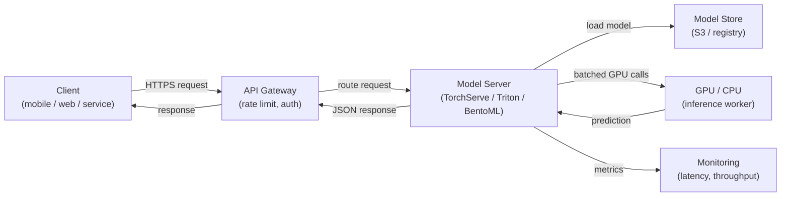

# Servicio de modelos

## Definición

El servicio de modelos es el proceso de hacer disponible un modelo de ML entrenado para la inferencia — aceptar datos de entrada, ejecutar una predicción y devolver resultados a los llamantes. Es el puente entre el mundo offline del entrenamiento y la experimentación y el mundo online de las aplicaciones en producción. Una capa de servicio bien diseñada es tan importante como la calidad del modelo: un modelo con 98% de precisión desplegado con una latencia de 10 segundos es a menudo inútil en un contexto de producto.

El servicio de modelos abarca tres paradigmas distintos que difieren fundamentalmente en sus requisitos de latencia, throughput e infraestructura. La **inferencia batch** procesa grandes volúmenes de datos según un calendario, escribiendo predicciones en una base de datos o archivo; es la opción de mayor throughput pero no puede responder a solicitudes individuales en tiempo real. La **inferencia en tiempo real (online)** expone un endpoint de API que devuelve predicciones en milisegundos; prioriza la baja latencia sobre el throughput. La **inferencia de streaming** procesa eventos de una cola o stream a medida que llegan, situándose entre batch y tiempo real tanto en latencia como en complejidad.

Escalar un sistema de servicio de modelos implica desafíos específicos del ML: los modelos son típicamente archivos grandes cargados en memoria (o VRAM de GPU), el tiempo de inicio importa para el autoescalado, la utilización de GPU debe maximizarse para ser rentable, y la distribución de latencia de predicción puede ser impredecible bajo carga. Frameworks como NVIDIA Triton Inference Server, TorchServe y BentoML existen específicamente para abordar estos desafíos.

## Cómo funciona



### Inferencia batch

En la inferencia batch, un trabajo programado (cron, DAG de Airflow o un scheduler en la nube) lee un conjunto de datos del almacenamiento, ejecuta predicciones en todo el conjunto y escribe los resultados de vuelta. El modelo se carga una vez por ejecución del trabajo, por lo que el costo amortizado por predicción de la carga es despreciable. Este patrón es adecuado para casos de uso como generar recomendaciones nocturnas, puntuar a todos los clientes para el riesgo de abandono o anotar un data warehouse con sentimiento predicho. La palanca de escalado principal es el paralelismo entre particiones de datos — cada partición puede ser procesada por un worker separado. Un problema común es el skew entre entrenamiento y servicio: el script de puntuación batch usa una lógica de preprocesamiento diferente a la del pipeline de entrenamiento.

### Inferencia de API en tiempo real

El servicio en tiempo real expone el modelo detrás de un endpoint HTTP (o gRPC) que responde sincrónicamente a solicitudes individuales. El desafío clave de ingeniería es la latencia: la carga del modelo es lenta (segundos a minutos para modelos grandes), por lo que las instancias deben mantenerse calientes o pre-escaladas. Frameworks como TorchServe y BentoML manejan la carga del modelo, la deserialización de solicitudes, el agrupamiento de solicitudes concurrentes (batching dinámico) y las verificaciones de salud. El escalado horizontal vía Kubernetes o servicios gestionados (AWS SageMaker Endpoints, GCP Vertex AI Endpoints) agrega réplicas cuando el throughput supera un umbral. La memoria GPU determina cuántas réplicas del modelo caben en un solo nodo, lo que impulsa directamente el costo.

### Inferencia de streaming

La inferencia de streaming conecta el servidor de modelos a un stream de eventos (Kafka, Kinesis, Pub/Sub). Los eventos llegan continuamente y las predicciones se emiten a un topic de salida. Este patrón es adecuado para la detección de fraude en streams de transacciones, detección de anomalías en tiempo real en datos de sensores, o cualquier caso de uso donde un nuevo evento debe puntuarse en cientos de milisegundos pero el volumen es demasiado alto para HTTP síncrono. El servidor de modelos actúa como consumidor-productor: lee del topic de entrada, ejecuta la inferencia y escribe en el topic de salida. La gestión de la contrapresión es crítica — el consumidor no debe quedarse atrás del productor durante picos de tráfico.

### Consideraciones de escalado

La programación de GPU es el factor de costo dominante para modelos grandes. Las palancas clave incluyen: **batching dinámico** (acumular múltiples solicitudes en una sola llamada de GPU), **cuantización del modelo** (reducir la precisión de FP32 a INT8 para caber más modelos por GPU), **caché del modelo** (mantener el modelo en VRAM entre solicitudes) y **autoescalado** (agregar o eliminar réplicas basándose en la profundidad de la cola o los SLOs de latencia). Triton Inference Server soporta todo esto con un archivo de configuración declarativo por modelo, lo que lo convierte en la opción preferida para flotas de modelos heterogéneos en producción.

## Cuándo usar / Cuándo NO usar

| Usar cuando | Evitar cuando |
|---|---|
| Una aplicación downstream necesita predicciones en el momento de la solicitud | Todos los consumidores pueden tolerar predicciones calculadas con horas de anticipación |
| Las predicciones deben reflejar la última versión del modelo inmediatamente | El conjunto de datos es suficientemente pequeño para ser puntuado en un batch nocturno de forma económica |
| Se necesita puntuación basada en eventos (streaming) | El modelo se usa solo para análisis offline sin sistema downstream |
| El costo de inferencia del modelo es alto y la utilización de GPU debe maximizarse | Etapa de prototipo donde un script simple llamado directamente es suficiente |

## Comparaciones

| Criterio | TorchServe | TF Serving | NVIDIA Triton | BentoML | FastAPI (personalizado) |
|---|---|---|---|---|---|
| Soporte de frameworks | Nativo de PyTorch | TensorFlow / Keras | Multi-framework (ONNX, TF, PyTorch, TensorRT) | Agnóstico al framework | Agnóstico al framework |
| Batching dinámico | Sí | Sí | Sí (altamente configurable) | Sí | Implementación manual |
| Soporte gRPC | Sí | Sí | Sí | Sí | Vía grpcio |
| Optimización GPU | Buena | Buena | La mejor de su clase | Buena | Manual |
| Facilidad de configuración | Media | Media | Alta (configuración compleja) | Baja (nativo Python) | Muy baja |
| Preparación para producción | Alta | Alta | Muy alta | Alta | Depende de la implementación |

## Ventajas y desventajas

| Ventajas | Desventajas |
|---|---|
| Desacopla las actualizaciones del modelo de las releases del código de la aplicación | Agrega complejidad de infraestructura sobre ejecutar la inferencia en línea |
| Permite el escalado independiente de la capacidad de inferencia | La latencia de inicio en frío puede ser significativa para modelos grandes |
| Los frameworks de propósito específico manejan batching, verificaciones de salud y versionado | Las instancias GPU son costosas; la gestión de costos requiere cuidado |
| Soporta pruebas A/B y despliegues canary de forma nativa | La inferencia de streaming requiere experiencia en Kafka/Kinesis además del ML |
| Hooks de monitoreo para latencia, throughput y drift de predicciones | El skew modelo-servicio (preprocesamiento diferente) es un riesgo persistente |

## Ejemplos de código

```python
# fastapi_serving.py
# Production-ready FastAPI model serving endpoint with dynamic model loading,
# input validation via Pydantic, and health check endpoint.

from __future__ import annotations

import os
from contextlib import asynccontextmanager
from typing import List

import joblib
import numpy as np
import uvicorn
from fastapi import FastAPI, HTTPException
from pydantic import BaseModel, Field

# --- Input/output schemas ---

class PredictionRequest(BaseModel):
    """Input features for a single inference request."""
    features: List[float] = Field(
        ...,
        min_length=20,
        max_length=20,
        description="Exactly 20 numerical features (must match training schema).",
        example=[0.1, -0.5, 1.2] + [0.0] * 17,
    )


class PredictionResponse(BaseModel):
    label: int
    probability: float
    model_version: str


# --- Model lifecycle management ---

MODEL: dict = {}  # holds the loaded model and metadata


@asynccontextmanager
async def lifespan(app: FastAPI):
    """Load model at startup; release resources on shutdown."""
    model_path = os.environ.get("MODEL_PATH", "models/model.joblib")
    model_version = os.environ.get("MODEL_VERSION", "unknown")

    if not os.path.exists(model_path):
        raise RuntimeError(f"Model file not found at {model_path}")

    MODEL["clf"] = joblib.load(model_path)
    MODEL["version"] = model_version
    print(f"Model v{model_version} loaded from {model_path}")
    yield
    MODEL.clear()
    print("Model unloaded.")


# --- API definition ---

app = FastAPI(
    title="ML Model Serving API",
    description="Real-time inference endpoint for the fraud detection model.",
    version="1.0.0",
    lifespan=lifespan,
)


@app.get("/health")
def health() -> dict:
    """Liveness probe — returns 200 when the model is loaded."""
    if "clf" not in MODEL:
        raise HTTPException(status_code=503, detail="Model not loaded")
    return {"status": "ok", "model_version": MODEL["version"]}


@app.post("/predict", response_model=PredictionResponse)
def predict(request: PredictionRequest) -> PredictionResponse:
    """
    Run inference on a single input vector.
    Returns the predicted label and the positive-class probability.
    """
    clf = MODEL.get("clf")
    if clf is None:
        raise HTTPException(status_code=503, detail="Model not ready")

    X = np.array(request.features).reshape(1, -1)
    label = int(clf.predict(X)[0])
    probability = float(clf.predict_proba(X)[0][label])

    return PredictionResponse(
        label=label,
        probability=probability,
        model_version=MODEL["version"],
    )


if __name__ == "__main__":
    # For local testing: MODEL_PATH=models/model.joblib MODEL_VERSION=v1 python fastapi_serving.py
    uvicorn.run(app, host="0.0.0.0", port=8080, log_level="info")
```

```python
# client_example.py
# Simple client that calls the FastAPI serving endpoint

import httpx

BASE_URL = "http://localhost:8080"

# Health check
response = httpx.get(f"{BASE_URL}/health")
print(response.json())  # {"status": "ok", "model_version": "v1"}

# Prediction
payload = {"features": [0.1, -0.5, 1.2] + [0.0] * 17}
response = httpx.post(f"{BASE_URL}/predict", json=payload)
print(response.json())
# {"label": 1, "probability": 0.87, "model_version": "v1"}
```

## Recursos prácticos

- [Documentación de BentoML](https://docs.bentoml.com/) — Servicio de modelos agnóstico al framework con batching integrado, contenedores y integraciones de despliegue.
- [NVIDIA Triton Inference Server](https://docs.nvidia.com/deeplearning/triton-inference-server/user-guide/docs/index.html) — Servicio de alto rendimiento para flotas de modelos multi-framework con optimización GPU.
- [Documentación de TorchServe](https://pytorch.org/serve/) — Solución oficial de servicio de modelos de PyTorch con personalización de handlers.
- [Documentación de FastAPI](https://fastapi.tiangolo.com/) — Framework web Python moderno y de alto rendimiento ampliamente utilizado para APIs de servicio de ML personalizadas.

## Ver también

- [KubeFlow](/docs/mlops/deployment/kubeflow)
- [ML en Kubernetes](/docs/mlops/deployment/ml-kubernetes)
- [Monitoreo](/docs/mlops/monitoring)
