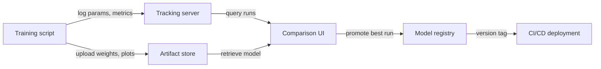

# Seguimiento de experimentos

## Definición

El seguimiento de experimentos es la práctica de registrar sistemáticamente cada detalle de una ejecución de entrenamiento de ML para que los resultados puedan reproducirse, compararse y auditarse. Sin él, los equipos pierden el rastro de qué hiperparámetros produjeron qué resultados, desperdician cómputo redescubriendo configuraciones y no pueden demostrar cumplimiento cuando los modelos influyen en decisiones de alto riesgo.

Un registro completo de experimento captura cuatro categorías de información. Los **parámetros** son las entradas al entrenamiento: tasa de aprendizaje, tamaño del batch, elecciones de arquitectura del modelo, conjuntos de características. Las **métricas** son las salidas: curvas de pérdida, precisión, F1, AUC, latencia. Los **artefactos** son los archivos producidos: pesos del modelo entrenado, datasets preprocesados, gráficos de evaluación, matrices de confusión. Los **metadatos** son el contexto: versión del código (commit de git), entorno (versiones de librerías, hardware), versión del dataset, tiempo de ejecución y el nombre de la persona que lo ejecutó.

El versionado de modelos es la extensión natural: una vez que se rastrean los experimentos, se puede promover el artefacto de la mejor ejecución a un registro de modelos, etiquetarlo con una versión semántica y vincular cada despliegue de serving a un experimento específico. Esto cierra el ciclo entre experimentación y producción, haciendo que los rollbacks sean sencillos y los auditorías posibles.

## Cómo funciona

### Instrumentación

El script de entrenamiento se instrumenta con unas pocas líneas de código del SDK que abren un contexto de "ejecución" y registran datos en un servidor central durante el entrenamiento. La mayoría de los frameworks (PyTorch Lightning, Hugging Face Trainer, Keras) tienen integraciones nativas que registran automáticamente métricas comunes sin código adicional.

### Almacenamiento centralizado

Los datos registrados se persisten en un almacén backend — un sistema de archivos local, una base de datos en la nube gestionada o una plataforma SaaS. Los parámetros y métricas se almacenan como registros estructurados; los artefactos se envían al almacenamiento de objetos (S3, GCS, Azure Blob). El backend es consultado por la UI y el SDK.

### Comparación y análisis

La UI de seguimiento permite filtrar, ordenar y comparar ejecuciones en las cuatro dimensiones. Se pueden graficar curvas de métricas de muchas ejecuciones en el mismo gráfico, agrupar por valores de parámetros y exportar resultados a un dataframe para análisis personalizados. Esto facilita la identificación de las ejecuciones Pareto-óptimas (mejor precisión para un presupuesto de latencia dado, por ejemplo).

### Promoción de modelos

El artefacto de la mejor ejecución se registra en un registro de modelos con un número de versión y un estado de transición (Staging → Production → Archived). Los sistemas CI/CD posteriores consultan el registro para saber qué versión del modelo desplegar, creando una entrega limpia entre experimentación y serving.





## Cuándo usar / Cuándo NO usar

| Se ejecutan más de u... | Se está ejecutando u... |
|----------|------------|
| Se ejecutan más de unos pocos experimentos y se necesita comparar resultados | Se está ejecutando un único entrenamiento puntual que nunca se revisará |
| La reproducibilidad es requerida (industria regulada, publicación de investigación) | El experimento es trivial (p. ej., una búsqueda en grid de dos parámetros con resultados obvios) |
| Varios miembros del equipo comparten resultados de experimentos | El equipo trabaja solo y toma notas en una hoja de cálculo personal que es suficiente |
| Se desea promover versiones de modelos a producción de forma sistemática | El modelo nunca se despliega y los resultados no necesitan ser auditados |

## Ejemplos de código

```python
# generic_tracking.py
# Framework-agnostic experiment tracking pattern.
# Works with any ML library; swap out the model training code as needed.
# pip install mlflow scikit-learn pandas

import mlflow
from sklearn.linear_model import LogisticRegression
from sklearn.datasets import make_classification
from sklearn.model_selection import train_test_split
from sklearn.metrics import accuracy_score, roc_auc_score
import numpy as np

# --- Configuration ---
EXPERIMENT_NAME = "binary-classification-demo"
PARAMS = {
    "C": 0.1,           # Regularization strength
    "max_iter": 1000,
    "solver": "lbfgs",
    "random_state": 42,
}

# --- Data preparation ---
X, y = make_classification(
    n_samples=2000, n_features=20, n_informative=10, random_state=42
)
X_train, X_test, y_train, y_test = train_test_split(
    X, y, test_size=0.2, random_state=42
)

mlflow.set_experiment(EXPERIMENT_NAME)

with mlflow.start_run(run_name=f"logreg-C{PARAMS['C']}") as run:
    mlflow.log_params(PARAMS)

    model = LogisticRegression(**PARAMS)
    model.fit(X_train, y_train)

    y_pred = model.predict(X_test)
    y_prob = model.predict_proba(X_test)[:, 1]

    metrics = {
        "accuracy": accuracy_score(y_test, y_pred),
        "roc_auc": roc_auc_score(y_test, y_prob),
        "n_train": len(X_train),
        "n_test": len(X_test),
    }
    mlflow.log_metrics(metrics)

    mlflow.sklearn.log_model(model, artifact_path="model")

    import json, tempfile, os
    with tempfile.TemporaryDirectory() as tmp:
        meta_path = os.path.join(tmp, "run_metadata.json")
        with open(meta_path, "w") as f:
            json.dump({"git_commit": "abc1234", "dataset_version": "v1.3"}, f)
        mlflow.log_artifact(meta_path)

    print(f"Run ID : {run.info.run_id}")
    print(f"Accuracy: {metrics['accuracy']:.4f} | ROC-AUC: {metrics['roc_auc']:.4f}")
```


## Comparaciones

| Criterio | MLflow | Weights & Biases (W&B) |
|-----------|--------|------------------------|
| Facilidad de configuración | Autoalojable con `mlflow ui`; solo pip install | Se requiere cuenta SaaS; instalación CLI; nivel gratuito disponible |
| Calidad de la UI | Funcional pero austera; buena para comparación tabular | Pulida, interactiva; excelente para medios y superposición de curvas |
| Colaboración | Se requiere servidor compartido; sin control de acceso integrado en OSS | Espacios de trabajo de equipo, acceso basado en roles y compartición integrados |
| Precio | Gratuito y de código abierto; oferta gestionada a través de Databricks | Nivel gratuito para individuos; de pago para equipos grandes |
| Integraciones | Integración profunda con Databricks, Spark, sklearn, PyTorch | Amplias integraciones; fuerte en investigación y academia |

## Recursos prácticos

- [MLflow Tracking Documentation](https://mlflow.org/docs/latest/tracking.html) — Guía oficial que cubre la API de tracking, backends, almacenes de artefactos y autologging.
- [Weights & Biases – Experiment Tracking Quickstart](https://docs.wandb.ai/quickstart) — Guía paso a paso para registrar su primera ejecución de W&B en menos de cinco minutos.
- [Neptune.ai – Experiment Tracking Guide](https://neptune.ai/blog/ml-experiment-tracking) — Visión general neutral del proveedor sobre qué rastrear, por qué y cómo comparar herramientas.
- [Made With ML – Experiment Tracking](https://madewithml.com/courses/mlops/experiment-tracking/) — Tutorial práctico basado en notebooks que integra MLflow en un bucle de entrenamiento real.

## Ver también

- [MLflow](/docs/mlops/mlflow)
- [Weights & Biases](/docs/mlops/wandb)
- [MLOps](/docs/mlops)
