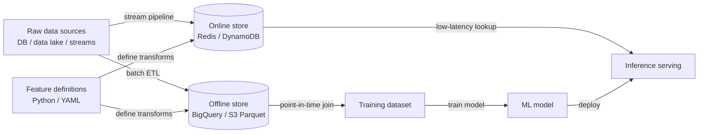

# Feature stores

## Definición

Un feature store es un sistema de datos diseñado específicamente para gestionar el ciclo de vida de las características de ML — desde la transformación de datos brutos, pasando por el almacenamiento, hasta el servicio de baja latencia — de forma coherente entre el entrenamiento del modelo y la inferencia en producción. Sin un feature store, los equipos suelen encontrar **sesgo entrenamiento-servicio**: la lógica de cálculo de características ejecutada offline durante el entrenamiento difiere sutilmente de la lógica utilizada en el momento del servicio, haciendo que los modelos en producción rindan por debajo de lo esperado en comparación con la evaluación offline.

Los feature stores abordan esto almacenando las definiciones de características como código y ejecutando la misma lógica de transformación en ambos contextos. Mantienen dos capas de almacenamiento complementarias: un **almacén offline** (un almacén de datos o lago de datos, p. ej. BigQuery, Redshift, archivos Parquet en S3) que alberga grandes conjuntos de datos históricos utilizados para entrenamiento y puntuación por lotes, y un **almacén en línea** (una base de datos de valores clave de baja latencia, p. ej. Redis, DynamoDB, Cassandra) que sirve valores de características precalculados a los modelos en el momento de la inferencia con latencia de sub-milisegundos.

El problema del sesgo entrenamiento-servicio y la necesidad de reutilización de características se vuelven agudos a escala. Una organización grande puede tener docenas de equipos calculando características similares (gasto del cliente en los últimos 7 días, duración de la sesión, tipo de dispositivo) de forma independiente, con sutiles diferencias en la lógica de negocio. Un feature store proporciona un catálogo gobernado donde las características se definen una vez, se validan y se reutilizan entre equipos y modelos, reduciendo drásticamente el esfuerzo de ingeniería duplicado y el riesgo de lógica de características inconsistente.

## Cómo funciona

### Definición de características y pipelines de transformación

Las características se definen como código — clases Python o manifiestos YAML — que especifican la fuente de datos, la lógica de transformación y la clave de entidad (el identificador usado para buscar características, p. ej., `user_id`, `product_id`). Los pipelines de transformación por lotes se ejecutan según un programa para materializar características en el almacén offline. Los pipelines de transformación por stream (p. ej., usando Flink o Spark Structured Streaming) mantienen el almacén en línea actualizado para características sensibles al tiempo como señales de fraude en tiempo real.

### Almacén offline: recuperación de datos de entrenamiento

Al entrenar un modelo, se genera un conjunto de datos proporcionando una lista de claves de entidad y un conjunto de marcas de tiempo (una "unión punto en el tiempo"). El feature store recupera los valores de características que eran correctos a partir de cada marca de tiempo, evitando la fuga de datos futuros. Esta corrección punto en el tiempo es una de las cosas más difíciles de implementar correctamente sin un feature store y una de las garantías más valiosas que proporciona.

### Almacén en línea: servicio de baja latencia

Antes de que un modelo sirva una predicción, necesita valores de características para la entidad que se está puntuando (p. ej., el usuario que realiza una solicitud). El cliente del feature store consulta el almacén en línea por clave de entidad y devuelve un vector de características en milisegundos. Dado que las mismas definiciones de características sustentan tanto los almacenes offline como online, se garantiza que los valores se calculan de forma idéntica.

### Registro de características y gobernanza

Un catálogo de características documenta cada característica: su definición, propietario, tipo de dato, garantía de frescura y qué modelos la consumen. Esta capa de gobernanza habilita la descubribilidad — un nuevo equipo puede explorar características existentes antes de escribir las propias — y el análisis de impacto — comprender qué modelos se ven afectados si cambia la fuente de datos upstream de una característica.

### Trabajos de materialización

La materialización es el proceso de ejecutar pipelines de transformación y escribir resultados en los almacenes. La materialización offline se ejecuta como un trabajo por lotes programado. La materialización en línea copia un subconjunto de datos offline en el almacén en línea para una recuperación rápida, o está impulsada por pipelines de streaming cuando se requiere frescura en tiempo real. Feast, Tecton y Hopsworks proporcionan comandos CLI o integraciones de orquestación para activar y monitorear la materialización.



## Cuándo usar / Cuándo NO usar

| Usar cuando | Evitar cuando |
|----------|------------|
| Múltiples equipos o modelos comparten la misma lógica de características y la coherencia es crítica | Se tiene un único modelo con un conjunto pequeño y estable de características que nunca cambia |
| El sesgo entrenamiento-servicio ha causado incidentes en producción o brechas de precisión | Los requisitos de latencia de inferencia son relajados y la puntuación por lotes es suficiente |
| Se necesitan conjuntos de datos de entrenamiento correctos punto en el tiempo para evitar fuga de datos | La sobrecarga de ingeniería de operar un feature store supera la escala del proyecto |
| Las características deben servirse con latencia de sub-milisegundos para predicciones en tiempo real | Se está en exploración temprana y las características aún no son suficientemente estables para formalizarse |
| Los requisitos regulatorios exigen un catálogo de características gobernado y auditable | El equipo de ciencia de datos es pequeño y carece de soporte de ingeniería de ML para gestionar la infraestructura |

## Comparaciones

| Criterio | Feast | Tecton | Hopsworks |
|-----------|-------|--------|-----------|
| Código abierto | Sí (Apache 2.0) | No (SaaS / gestionado) | Sí núcleo; empresa de pago |
| Oferta gestionada | No (solo auto-hospedado) | Sí (totalmente gestionado) | Sí (nube o on-prem) |
| Características de streaming | Limitado (vía fuente Kafka) | Nativo, grado producción | Nativo con integración Flink |
| Monitoreo de características | Básico | Avanzado (deriva integrada) | Avanzado |
| Mejor para | Equipos que quieren control OSS | Empresas que necesitan características en tiempo real gestionadas | Equipos que quieren código abierto de pila completa |

## Ventajas y desventajas

| Ventajas | Desventajas |
|------|------|
| Elimina el sesgo entrenamiento-servicio al compartir la lógica de transformación | Inversión significativa de ingeniería para configurar y operar |
| Habilita la reutilización de características entre equipos, reduciendo el esfuerzo duplicado | Añade una dependencia operativa en la ruta de servicio (disponibilidad del almacén en línea) |
| Las uniones punto en el tiempo previenen la fuga de datos en los datos de entrenamiento | Las definiciones de características pueden convertirse en un cuello de botella si la gobernanza es demasiado rígida |
| Centraliza la gobernanza y documentación de características | Curva de aprendizaje para científicos de datos no familiarizados con la abstracción |
| Admite servicio de características por lotes y en tiempo real | Excesivo para equipos con un pequeño número de modelos y características estables |

## Ejemplos de código

```python
# feast_feature_store_example.py
# Demonstrates defining, materializing, and retrieving features with Feast.
# Prerequisites:
#   pip install feast pandas scikit-learn
#   feast init my_feature_repo && cd my_feature_repo
#   (Adjust the data source path below to match your environment.)

# ── feature_repo/features.py ──────────────────────────────────────────────────
# This file defines the feature views and entities in your Feast registry.

from datetime import timedelta
import pandas as pd
from feast import (
    Entity,
    FeatureStore,
    FeatureView,
    Field,
    FileSource,
)
from feast.types import Float32, Int64

# 1. Define the entity — the primary key used to look up features
driver = Entity(
    name="driver",
    description="A taxi driver identified by driver_id",
)

# 2. Define the data source (parquet file for local demo; swap for BigQuery etc.)
driver_stats_source = FileSource(
    path="data/driver_stats.parquet",   # generated below
    timestamp_field="event_timestamp",
    created_timestamp_column="created",
)

# 3. Define a FeatureView — the transformation and storage spec
driver_stats_fv = FeatureView(
    name="driver_hourly_stats",
    entities=[driver],
    ttl=timedelta(days=7),              # how long features stay valid
    schema=[
        Field(name="conv_rate", dtype=Float32),
        Field(name="acc_rate", dtype=Float32),
        Field(name="avg_daily_trips", dtype=Int64),
    ],
    online=True,                        # materialize to online store
    source=driver_stats_source,
)


# ── generate_sample_data.py ───────────────────────────────────────────────────
# Run this once to create sample data before materializing.
def generate_driver_stats(path: str = "data/driver_stats.parquet") -> None:
    import os
    os.makedirs("data", exist_ok=True)

    rng = pd.date_range(end=pd.Timestamp.now(tz="UTC"), periods=48, freq="h")
    df = pd.DataFrame({
        "driver_id": [1001, 1002, 1003] * 16,
        "event_timestamp": list(rng[:48]),
        "created": pd.Timestamp.now(tz="UTC"),
        "conv_rate": [0.8, 0.6, 0.9] * 16,
        "acc_rate": [0.95, 0.88, 0.92] * 16,
        "avg_daily_trips": [150, 200, 175] * 16,
    })
    df.to_parquet(path, index=False)
    print(f"Sample data written to {path}")


# ── training_data_retrieval.py ────────────────────────────────────────────────
# Retrieve a point-in-time correct training dataset.
def get_training_data(repo_path: str = ".") -> pd.DataFrame:
    store = FeatureStore(repo_path=repo_path)

    # Entity DataFrame: the entities and timestamps we want features for
    entity_df = pd.DataFrame({
        "driver_id": [1001, 1002, 1003],
        "event_timestamp": [
            pd.Timestamp("2024-01-15 10:00:00", tz="UTC"),
            pd.Timestamp("2024-01-15 11:00:00", tz="UTC"),
            pd.Timestamp("2024-01-15 12:00:00", tz="UTC"),
        ],
        "label": [1, 0, 1],   # target variable for supervised training
    })

    # Point-in-time join: retrieves feature values as-of each row's timestamp
    training_df = store.get_historical_features(
        entity_df=entity_df,
        features=[
            "driver_hourly_stats:conv_rate",
            "driver_hourly_stats:acc_rate",
            "driver_hourly_stats:avg_daily_trips",
        ],
    ).to_df()

    print("Training dataset:")
    print(training_df.to_string())
    return training_df


# ── online_serving.py ─────────────────────────────────────────────────────────
# Retrieve features for real-time inference after materialization.
def get_online_features(driver_ids: list, repo_path: str = ".") -> dict:
    store = FeatureStore(repo_path=repo_path)

    # Materialize features to the online store first:
    # store.materialize_incremental(end_date=pd.Timestamp.now(tz="UTC"))

    feature_vector = store.get_online_features(
        features=[
            "driver_hourly_stats:conv_rate",
            "driver_hourly_stats:acc_rate",
            "driver_hourly_stats:avg_daily_trips",
        ],
        entity_rows=[{"driver_id": did} for did in driver_ids],
    ).to_dict()

    print("Online feature vector:")
    for key, values in feature_vector.items():
        print(f"  {key}: {values}")
    return feature_vector


# ── main ──────────────────────────────────────────────────────────────────────
if __name__ == "__main__":
    generate_driver_stats()
    # After running `feast apply` to register the feature views:
    # training_df = get_training_data()
    # online_fv   = get_online_features([1001, 1002])
    print("Feature definitions ready. Run `feast apply` to register them.")
```

## Recursos prácticos

- [Documentación de Feast](https://docs.feast.dev/) — Documentación oficial del feature store de código abierto más utilizado, incluyendo inicio rápido, API de vistas de características y guías de despliegue.
- [Tecton – Conceptos de feature store](https://docs.tecton.ai/docs/introduction/feature-store-concepts) — Descripción conceptual neutral al proveedor de almacenes online/offline, uniones punto en el tiempo y pipelines de características.
- [Documentación de Hopsworks](https://docs.hopsworks.ai/) — Feature store de pila completa con streaming Flink nativo, monitoreo de características y un registro de modelos.
- [Feature Store para ML – O'Reilly](https://www.featurestore.org/) — Recurso comunitario que agrega investigación, publicaciones de blog y charlas sobre patrones de diseño de feature stores.
- [Chip Huyen – Ingeniería de características para sistemas de ML](https://huyenchip.com/2022/01/02/real-time-machine-learning-challenges-and-solutions.html) — Análisis profundo de los desafíos de ingeniería del cálculo de características en tiempo real y cómo los feature stores los resuelven.

## Ver también

- [MLOps](/docs/mlops)
- [MLflow](/docs/mlops/mlflow)
- [Seguimiento de experimentos](/docs/mlops/experiment-tracking)
