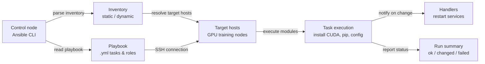

# Ansible

## Definición

Ansible es una herramienta de automatización de código abierto creada por Red Hat que gestiona la configuración, el despliegue de aplicaciones y la automatización de tareas en una flota de servidores usando archivos YAML simples y legibles por humanos llamados **playbooks**. Su elección arquitectónica definitoria es ser **sin agentes**: Ansible se conecta a nodos gestionados a través de SSH (Linux) o WinRM (Windows) y ejecuta tareas directamente, sin necesidad de software daemon o agente en las máquinas de destino. Esto lo hace significativamente más fácil de adoptar que las herramientas basadas en agentes — se pueden gestionar servidores existentes sin ningún software preinstalado más allá de Python y un servidor SSH.

Ansible opera con un **modelo push**: un operador ejecuta un playbook desde un nodo de control, Ansible se conecta al inventario objetivo de hosts y ejecuta tareas en orden. Las tareas llaman a **módulos** — unidades de trabajo idempotentes que saben cómo instalar paquetes, gestionar archivos, iniciar servicios, ejecutar comandos e interactuar con APIs de nube. Los módulos comunitarios y oficiales cubren prácticamente todos los gestores de paquetes de Linux, servicios, proveedores de nube, dispositivos de red y aplicaciones. Los roles agrupan tareas, archivos, plantillas y variables relacionados en unidades reutilizables y compartibles que pueden publicarse en Ansible Galaxy o mantenerse en repositorios Git internos.

En contextos de ML e ingeniería de datos, Ansible llena el vacío que deja [Terraform](/docs/mlops/iac/terraform). Terraform aprovisiona infraestructura (crea la instancia GPU, la VPC, el bucket S3); Ansible configura lo que se ejecuta en esa infraestructura (instala la versión correcta de CUDA, configura el entorno Python, configura las dependencias de entrenamiento distribuido y garantiza que las herramientas de monitoreo de GPU estén en ejecución). Las dos herramientas son complementarias en lugar de competidoras: un flujo de trabajo típico de MLOps usa Terraform para aprovisionar recursos en la nube y Ansible para arrancar esos recursos en un estado listo para el entrenamiento.

## Cómo funciona

### Inventario

El inventario define qué hosts gestiona Ansible. Un inventario estático es un archivo INI o YAML que lista nombres de host o direcciones IP agrupadas por rol (p. ej., `[gpu_training_nodes]`, `[model_serving]`). Los inventarios dinámicos consultan las APIs de la nube (AWS EC2, GCP Compute, Azure VMs) en tiempo de ejecución para construir la lista de hosts a partir de la infraestructura en vivo — esencial para entornos de autoescalado. Las variables de host y grupo definen valores de configuración por host o por grupo que se referencian en los playbooks.

### Playbooks y tareas

Un playbook es un archivo YAML que contiene uno o más **plays**. Cada play apunta a un grupo de hosts y una lista de **tareas**. Cada tarea llama a un módulo con argumentos y opcionalmente define condiciones (`when`), bucles (`loop`) y manejadores activados por cambios. Las tareas se ejecutan secuencialmente dentro de un play; los plays pueden ejecutarse en paralelo entre hosts. El resultado de cada tarea es uno de: `ok` (no se necesita cambio), `changed` (se realizó el cambio), `failed` o `skipped`. Ansible imprime un resumen de estos resultados después de cada ejecución de playbook.

### Roles

Los roles proporcionan una estructura de directorios estandarizada para organizar la automatización relacionada: `tasks/`, `handlers/`, `templates/`, `files/`, `vars/`, `defaults/` y `meta/`. Un rol puede aplicarse a múltiples plays en múltiples playbooks, y los roles pueden depender de otros roles. Ansible Galaxy alberga miles de roles de la comunidad (p. ej., `geerlingguy.docker`, `nvidia.nvidia_driver`) que pueden instalarse con `ansible-galaxy install` y usarse directamente en playbooks.

### Variables y plantillas

Ansible usa el motor de plantillas Jinja2 en todos los playbooks y archivos de plantilla. Las variables pueden definirse en múltiples niveles (valores predeterminados de rol, vars de grupo, vars de host, vars de playbook, vars adicionales pasadas con `-e`) con un orden de precedencia claro. Las plantillas (archivos `.j2`) generan archivos de configuración dinámicamente — por ejemplo, generando un archivo de configuración de entrenamiento distribuido con la IP correcta del nodo maestro, el número de GPUs y el tamaño de lote para cada entorno.

### Idempotencia y manejadores

Los módulos de Ansible están diseñados para ser idempotentes: ejecutar un playbook varias veces produce el mismo estado final sin causar efectos secundarios no deseados. Si un paquete ya está instalado en la versión correcta, la tarea reporta `ok` y no hace nada. Los **manejadores** son tareas especiales que se ejecutan al final de un play solo si son notificados por una tarea que resultó en `changed` — utilizados para reiniciar servicios (como un daemon de entrenamiento acelerado por CUDA) solo cuando su configuración realmente cambia.



## Cuándo usar / Cuándo NO usar

| Usar cuando | Evitar cuando |
|----------|------------|
| Se configura software en servidores existentes: instalar CUDA, Python, paquetes pip, servicios del sistema | Se aprovisiona nueva infraestructura en la nube desde cero (usar Terraform para eso) |
| Se arrancan nodos de entrenamiento GPU después de que Terraform los crea | Se necesita seguimiento de estado detallado en cientos de recursos (Ansible no tiene archivo de estado) |
| Se configuran entornos ML coherentes en máquinas de desarrollo, staging y producción | Se necesitan grafos de dependencias complejos entre recursos de nube con ordenamiento automático |
| Se ejecutan comandos ad-hoc en una flota de servidores (p. ej., actualizar un archivo de configuración en todas partes) | Las máquinas de destino no son accesibles vía SSH o WinRM desde el nodo de control |
| Se despliegan actualizaciones de aplicaciones o se lanzan cambios de configuración en muchos nodos | Se aprovisiona recursos nativos de nube (VPCs, roles IAM, buckets S3) — usar Terraform |
| Equipos que necesitan herramientas IaC con poca barrera de aprendizaje YAML | Se necesita ejecución paralela muy rápida; la sobrecarga SSH de Ansible limita la escalabilidad con miles de nodos |

## Comparaciones

| Criterio | Ansible | Terraform |
|-----------|---------|-----------|
| Paradigma | Procedimental con módulos idempotentes — las tareas se ejecutan en orden | Declarativo — describir el estado deseado, Terraform calcula el diferencial |
| Gestión de estado | Sin estado — sin seguimiento integrado de lo aplicado previamente | Archivo de estado explícito que mapea la configuración a los IDs de recursos reales |
| Caso de uso principal | Gestión de configuración y despliegue de software en hosts existentes | Aprovisionamiento de infraestructura en la nube (instancias, redes, almacenamiento) |
| Soporte de proveedores de nube | Existen módulos de nube pero son menos completos que los proveedores de Terraform | Más de 1.000 proveedores con cobertura API profunda y versionada |
| Idempotencia | A nivel de tarea — cada módulo debe escribirse de forma idempotente | Nativa — plan/apply siempre converge al estado declarado |
| Curva de aprendizaje | Baja — las tareas YAML son legibles; no se requiere nuevo lenguaje | Moderada — sintaxis HCL + modelo mental de estado/plan a aprender |
| ¿Requiere agente? | No — sin agentes, se conecta vía SSH | No — Terraform se ejecuta en la máquina de control, llama a las APIs de la nube |
| Cuándo usar ambos | Ansible configura software en infraestructura que Terraform ha aprovisionado | Terraform aprovisiona recursos; Ansible gestiona la configuración del SO y la aplicación |

## Ventajas y desventajas

| Aspecto | Ventajas | Desventajas |
|--------|------|------|
| Arquitectura sin agentes | Sin software que instalar en nodos de destino; funciona con SSH existente | La sobrecarga SSH limita el rendimiento a escala muy grande (más de 10.000 nodos) |
| Playbooks YAML | Automatización legible y auto-documentada | La lógica compleja (bucles, condicionales) se vuelve verbose en YAML |
| Módulos idempotentes | Seguro de re-ejecutar; corrección de deriva sin efectos secundarios | La idempotencia depende de la calidad del módulo; los módulos shell/command no son inherentemente idempotentes |
| Ansible Galaxy | Gran ecosistema de roles de la comunidad para software común | La calidad de los roles de la comunidad varía; fijar versiones de roles es crítico para la reproducibilidad |
| Sin archivo de estado | Simple, sin sobrecarga de gestión de estado | Sin detección de deriva integrada entre ejecuciones; se requieren herramientas manuales o de terceros |
| Plantillas Jinja2 | Generación de configuración dinámica poderosa | La depuración de plantillas es más difícil que el código nativo; los errores aparecen en tiempo de ejecución |

## Ejemplos de código

```yaml
# ml_environment_setup.yml
# Ansible playbook to configure a GPU training node for ML workloads.
# Installs CUDA toolkit, cuDNN, Python 3.11, pip packages, and sets up
# a systemd service for the Prometheus node exporter.
#
# Usage:
#   ansible-playbook -i inventory.ini ml_environment_setup.yml
#
# inventory.ini example:
#   [gpu_training_nodes]
#   10.0.1.10 ansible_user=ubuntu ansible_ssh_private_key_file=~/.ssh/ml-key.pem
#   10.0.1.11 ansible_user=ubuntu ansible_ssh_private_key_file=~/.ssh/ml-key.pem

---
- name: Configure GPU training nodes for ML workloads
  hosts: gpu_training_nodes
  become: true  # Run tasks as root via sudo
  vars:
    cuda_version: "12.1"
    python_version: "3.11"
    pip_packages:
      - torch==2.3.0
      - torchvision==0.18.0
      - torchaudio==2.3.0
      - numpy==1.26.4
      - pandas==2.2.2
      - scikit-learn==1.4.2
      - mlflow==2.13.0
      - evidently==0.4.30
      - prometheus-client==0.20.0
    node_exporter_version: "1.8.1"
    ml_user: "mlops"
    ml_workdir: "/opt/ml"

  handlers:
    - name: restart node_exporter
      ansible.builtin.systemd:
        name: node_exporter
        state: restarted
        daemon_reload: true

  tasks:
    # --- System prerequisites ---

    - name: Update apt package cache
      ansible.builtin.apt:
        update_cache: true
        cache_valid_time: 3600  # Skip update if cache is less than 1 hour old

    - name: Install system dependencies
      ansible.builtin.apt:
        name:
          - build-essential
          - git
          - wget
          - curl
          - htop
          - nvtop          # GPU monitoring in terminal
          - python{{ python_version }}
          - python{{ python_version }}-dev
          - python{{ python_version }}-venv
          - python3-pip
        state: present

    # --- CUDA installation ---

    - name: Check if CUDA {{ cuda_version }} is already installed
      ansible.builtin.command: nvcc --version
      register: nvcc_check
      changed_when: false
      failed_when: false

    - name: Add CUDA repository keyring
      ansible.builtin.shell: |
        wget -qO /tmp/cuda-keyring.deb \
          https://developer.download.nvidia.com/compute/cuda/repos/ubuntu2204/x86_64/cuda-keyring_1.1-1_all.deb
        dpkg -i /tmp/cuda-keyring.deb
      when: cuda_version not in (nvcc_check.stdout | default(''))
      args:
        creates: /usr/share/keyrings/cuda-archive-keyring.gpg

    - name: Install CUDA toolkit {{ cuda_version }}
      ansible.builtin.apt:
        name: cuda-toolkit-{{ cuda_version | replace('.', '-') }}
        state: present
        update_cache: true
      when: cuda_version not in (nvcc_check.stdout | default(''))

    - name: Set CUDA environment variables in /etc/environment
      ansible.builtin.lineinfile:
        path: /etc/environment
        line: "{{ item }}"
        state: present
      loop:
        - 'CUDA_HOME=/usr/local/cuda'
        - 'PATH=/usr/local/cuda/bin:$PATH'
        - 'LD_LIBRARY_PATH=/usr/local/cuda/lib64:$LD_LIBRARY_PATH'

    # --- ML user and workspace ---

    - name: Create dedicated ML user
      ansible.builtin.user:
        name: "{{ ml_user }}"
        shell: /bin/bash
        home: "/home/{{ ml_user }}"
        create_home: true
        state: present

    - name: Create ML working directory
      ansible.builtin.file:
        path: "{{ ml_workdir }}"
        state: directory
        owner: "{{ ml_user }}"
        group: "{{ ml_user }}"
        mode: "0755"

    # --- Python virtual environment and packages ---

    - name: Create Python virtual environment
      ansible.builtin.command:
        cmd: python{{ python_version }} -m venv {{ ml_workdir }}/venv
        creates: "{{ ml_workdir }}/venv/bin/python"
      become_user: "{{ ml_user }}"

    - name: Upgrade pip in virtual environment
      ansible.builtin.pip:
        name: pip
        state: latest
        virtualenv: "{{ ml_workdir }}/venv"
      become_user: "{{ ml_user }}"

    - name: Install ML Python packages
      ansible.builtin.pip:
        name: "{{ pip_packages }}"
        virtualenv: "{{ ml_workdir }}/venv"
        state: present
      become_user: "{{ ml_user }}"

    - name: Write requirements.txt for reproducibility
      ansible.builtin.copy:
        dest: "{{ ml_workdir }}/requirements.txt"
        content: "{{ pip_packages | join('\n') }}\n"
        owner: "{{ ml_user }}"
        group: "{{ ml_user }}"
        mode: "0644"

    # --- Prometheus Node Exporter for infrastructure monitoring ---

    - name: Check if node_exporter is already installed
      ansible.builtin.stat:
        path: /usr/local/bin/node_exporter
      register: node_exporter_stat

    - name: Download Prometheus node_exporter {{ node_exporter_version }}
      ansible.builtin.get_url:
        url: "https://github.com/prometheus/node_exporter/releases/download/v{{ node_exporter_version }}/node_exporter-{{ node_exporter_version }}.linux-amd64.tar.gz"
        dest: /tmp/node_exporter.tar.gz
        mode: "0644"
      when: not node_exporter_stat.stat.exists

    - name: Extract and install node_exporter
      ansible.builtin.unarchive:
        src: /tmp/node_exporter.tar.gz
        dest: /tmp
        remote_src: true
      when: not node_exporter_stat.stat.exists

    - name: Copy node_exporter binary to /usr/local/bin
      ansible.builtin.copy:
        src: "/tmp/node_exporter-{{ node_exporter_version }}.linux-amd64/node_exporter"
        dest: /usr/local/bin/node_exporter
        mode: "0755"
        remote_src: true
      when: not node_exporter_stat.stat.exists
      notify: restart node_exporter

    - name: Create node_exporter systemd service
      ansible.builtin.copy:
        dest: /etc/systemd/system/node_exporter.service
        content: |
          [Unit]
          Description=Prometheus Node Exporter
          After=network.target

          [Service]
          User=nobody
          ExecStart=/usr/local/bin/node_exporter \
            --collector.systemd \
            --collector.processes
          Restart=on-failure

          [Install]
          WantedBy=multi-user.target
        mode: "0644"
      notify: restart node_exporter

    - name: Enable and start node_exporter
      ansible.builtin.systemd:
        name: node_exporter
        enabled: true
        state: started
        daemon_reload: true

    # --- Verification ---

    - name: Verify GPU is visible to CUDA
      ansible.builtin.command: nvidia-smi
      register: nvidia_smi_output
      changed_when: false
      failed_when: nvidia_smi_output.rc != 0

    - name: Print GPU info
      ansible.builtin.debug:
        var: nvidia_smi_output.stdout_lines

    - name: Verify PyTorch can see the GPU
      ansible.builtin.command:
        cmd: "{{ ml_workdir }}/venv/bin/python -c \"import torch; print('CUDA available:', torch.cuda.is_available()); print('GPU count:', torch.cuda.device_count())\""
      register: torch_check
      changed_when: false
      become_user: "{{ ml_user }}"

    - name: Print PyTorch GPU availability
      ansible.builtin.debug:
        var: torch_check.stdout_lines
```

## Recursos prácticos

- [Documentación de Ansible](https://docs.ansible.com/ansible/latest/index.html) — Documentación oficial que cubre playbooks, módulos, roles, inventario y mejores prácticas.
- [Ansible Galaxy](https://galaxy.ansible.com/) — Centro comunitario para roles y colecciones de Ansible reutilizables, incluyendo roles para controladores GPU de NVIDIA, Docker y Kubernetes.
- [Jeff Geerling — Ansible para DevOps](https://www.ansiblefordevops.com/) — Libro completo y repositorio GitHub que cubre Ansible desde los conceptos básicos hasta los patrones de producción.
- [Colección NVIDIA Ansible](https://github.com/nvidia/ansible-collection-nvidia-gpu) — Colección oficial de NVIDIA Ansible para gestionar instalaciones de controladores GPU, CUDA y NCCL.
- [Guía de mejores prácticas de Ansible](https://docs.ansible.com/ansible/latest/tips_tricks/ansible_tips_tricks.html) — Consejos y trucos oficiales sobre estructura de directorios, gestión de variables y optimización del rendimiento.

## Ver también

- [Terraform](/docs/mlops/iac/terraform)
- [ML Kubernetes](/docs/mlops/deployment/ml-kubernetes)
- [MLOps](/docs/mlops)
