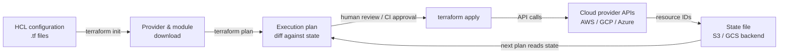

# Terraform

## Definición

Terraform es una herramienta de Infraestructura como Código (IaC) de código abierto creada por HashiCorp que permite definir, aprovisionar y gestionar infraestructura en la nube y on-premises usando un lenguaje de configuración declarativo llamado HCL (HashiCorp Configuration Language). Describes el estado final deseado de tu infraestructura — qué recursos deben existir, cómo deben estar configurados y cómo se relacionan entre sí — y Terraform determina qué crear, actualizar o destruir para alcanzar ese estado. Este modelo declarativo es fundamentalmente diferente de los enfoques de scripting imperativo donde describes la secuencia de pasos a ejecutar.

La piedra angular de la arquitectura de Terraform es su ecosistema de **providers**. Un provider es un plugin que traduce las definiciones de recursos HCL en llamadas a la API de una plataforma específica: AWS, Google Cloud, Azure, Kubernetes, Datadog, GitHub y cientos más. Cada provider mantiene su propio ciclo de versiones, y Terraform descarga los providers automáticamente basándose en los bloques `required_providers`. Esto significa que una única configuración de Terraform puede simultáneamente aprovisionar un clúster de entrenamiento GPU en AWS, un bucket GCS para datos de entrenamiento, un namespace de Kubernetes para el servicio de modelos y un dashboard de Grafana para el monitoreo — con herramientas coherentes en todas las plataformas.

La **gestión de estado** es lo que hace que Terraform sea idempotente y planificable. Terraform mantiene un archivo de estado que mapea cada recurso en la configuración a su contraparte en el mundo real (identificado por los IDs de recursos del proveedor de nube). Cuando ejecutas `terraform plan`, Terraform compara el archivo de estado actual con tu configuración y la infraestructura en vivo, produciendo un diff que muestra exactamente qué cambiará antes de que se realice cualquier cambio. Para los flujos de trabajo en equipo, el estado se almacena en un backend compartido (S3, GCS, Terraform Cloud) con bloqueo para prevenir modificaciones concurrentes. Esta auditabilidad y predictibilidad hacen de Terraform la herramienta IaC dominante para aprovisionar infraestructura de entrenamiento y servicio de ML en entornos regulados y colaborativos.

## Cómo funciona

### Escribir la configuración

Los ingenieros escriben archivos HCL (`.tf`) que declaran recursos, fuentes de datos, variables, salidas y módulos. Los recursos corresponden a objetos de infraestructura (una instancia EC2, un bucket S3, un despliegue de Kubernetes). Las fuentes de datos leen la infraestructura existente sin gestionarla. Las variables parametrizan las configuraciones para su reutilización en entornos. Los módulos encapsulan conjuntos reutilizables de recursos — un módulo de "clúster de entrenamiento GPU" puede instanciarse múltiples veces con diferentes tipos de instancia y regiones.

### Inicializar y planificar

Ejecutar `terraform init` descarga los providers y módulos requeridos e inicializa el backend. Ejecutar `terraform plan` produce un plan de ejecución legible por humanos: una lista de recursos a agregar (+), cambiar (~) o destruir (−). La fase de plan es de solo lectura — no realiza cambios en la infraestructura. Los equipos típicamente integran `terraform plan` en los pipelines de CI para revisar los cambios en los pull requests antes de hacer merge.

### Aplicar y gestión de estado

`terraform apply` ejecuta el plan, llamando a las APIs de los providers para crear, actualizar o eliminar recursos en orden de dependencia. Terraform resuelve el gráfico de dependencias automáticamente basándose en las referencias entre recursos (p. ej., una subnet que referencia un ID de VPC). Después de apply, el archivo de estado se actualiza para reflejar el nuevo estado de la infraestructura. Para la infraestructura de ML, esto significa que las instancias GPU, los buckets de almacenamiento, los roles IAM y los clústeres de Kubernetes se crean todos en el orden correcto con las configuraciones correctas en un solo comando.

### Destruir y gestión del ciclo de vida

`terraform destroy` elimina todos los recursos gestionados por la configuración — útil para entornos de entrenamiento efímeros que no deben ejecutarse (y costar dinero) entre trabajos de entrenamiento. Los meta-argumentos del ciclo de vida (`create_before_destroy`, `prevent_destroy`, `ignore_changes`) dan control detallado sobre cómo Terraform maneja recursos sensibles como los buckets de almacenamiento de artefactos de modelos que nunca deben borrarse accidentalmente.



## Cuándo usar / Cuándo NO usar

| Usar cuando | Evitar cuando |
|----------|------------|
| Aprovisionando infraestructura en la nube que debe ser reproducible entre entornos | Configurando software dentro de instancias existentes (usa Ansible para eso) |
| Gestionando infraestructura de ML a escala: clústeres GPU, almacenamiento, redes, Kubernetes | Tu equipo no tiene infraestructura en la nube que gestionar (sin servidores, sin cuentas en la nube) |
| Múltiples miembros del equipo necesitan colaborar en la misma infraestructura | Necesitas ejecutar comandos de shell arbitrarios o configurar ajustes a nivel de SO en las instancias |
| Quieres que los cambios de infraestructura se revisen a través de pull requests antes de la aplicación | Tu infraestructura existente no fue creada con Terraform y el costo de migración es prohibitivo |
| La infraestructura necesita ser versionada, auditada y revertida de forma confiable | Necesitas cambios rápidos e iterativos en la configuración de la aplicación durante el desarrollo |
| Operas en múltiples proveedores de nube y quieres un flujo de trabajo unificado | Tu organización ya estandariza en una herramienta IaC competidora (Pulumi, CDK) con conocimiento institucional |

## Comparaciones

| Criterio | Terraform | Ansible |
|-----------|-----------|---------|
| Paradigma | Declarativo — describe el estado deseado | Procedimental — describe los pasos para alcanzar el estado |
| Gestión de estado | Archivo de estado explícito; rastrea los IDs de recursos | Sin estado — sin rastreo de estado integrado |
| Caso de uso principal | Aprovisionamiento de recursos en la nube (instancias, redes, almacenamiento) | Gestión de configuración y despliegue de aplicaciones en instancias existentes |
| Soporte de proveedores de nube | Más de 1.000 providers vía ecosistema de plugins | Módulos para las principales nubes; menos completo que Terraform |
| Idempotencia | Nativa — plan/apply siempre converge al estado deseado | A nivel de tarea — cada tarea debe escribirse para ser idempotente |
| Curva de aprendizaje | Sintaxis HCL + modelo mental de estado/plan | Playbooks YAML; barrera inicial más baja |
| Cuándo usar ambos | Terraform aprovisiona infraestructura; Ansible configura software en ella — se complementan | Ver arriba |

## Ventajas y desventajas

| Aspecto | Ventajas | Desventajas |
|--------|------|------|
| Modelo declarativo | La intención es clara; el plan muestra los cambios exactos antes de apply | No puede expresar fácilmente lógica condicional o bucles complejos (aunque HCL ha mejorado) |
| Archivo de estado | Permite planificación precisa y detección de drift | El archivo de estado es sensible; la corrupción o pérdida es un incidente grave |
| Ecosistema de providers | Cubre virtualmente todos los servicios en la nube y herramientas SaaS | La calidad de los providers varía; algunos providers comunitarios están mal mantenidos |
| Flujo de trabajo plan/apply | Los cambios son revisables antes de la ejecución | Ciclo de iteración más lento que los scripts imperativos para la creación de prototipos rápidos |
| Reutilización de módulos | Patrones de infraestructura DRY mediante módulos publicados o internos | Los gráficos de módulos grandes pueden ser lentos de inicializar y planificar |
| Idempotencia | Seguro de ejecutar repetidamente; comportamiento convergente | Los ciclos de destruir/recrear para ciertos cambios de recursos (p. ej., renombrar) causan tiempo de inactividad |

## Ejemplos de código

```hcl
# ml_infrastructure.tf
# Provisions an AWS GPU training instance and S3 bucket for ML artifacts.
# Prerequisites: AWS CLI configured, Terraform >= 1.5, appropriate IAM permissions.
# Run: terraform init && terraform plan && terraform apply

terraform {
  required_version = ">= 1.5"
  required_providers {
    aws = {
      source  = "hashicorp/aws"
      version = "~> 5.0"
    }
  }
  # Remote state backend — replace with your bucket and key
  backend "s3" {
    bucket         = "my-org-terraform-state"
    key            = "mlops/training/terraform.tfstate"
    region         = "us-east-1"
    dynamodb_table = "terraform-state-lock"
    encrypt        = true
  }
}

provider "aws" {
  region = var.aws_region
}

# --- Variables ---

variable "aws_region" {
  description = "AWS region for all resources"
  type        = string
  default     = "us-east-1"
}

variable "environment" {
  description = "Deployment environment: dev, staging, prod"
  type        = string
  default     = "dev"
}

variable "gpu_instance_type" {
  description = "EC2 instance type for GPU training. p3.2xlarge has 1x V100."
  type        = string
  default     = "p3.2xlarge"
}

variable "key_pair_name" {
  description = "Name of an existing EC2 key pair for SSH access"
  type        = string
}

# --- Data sources ---

# Use the latest Deep Learning AMI (GPU) for the region
data "aws_ami" "dl_ami" {
  most_recent = true
  owners      = ["amazon"]

  filter {
    name   = "name"
    values = ["Deep Learning AMI GPU PyTorch*"]
  }

  filter {
    name   = "architecture"
    values = ["x86_64"]
  }
}

# Default VPC for simplicity — use a dedicated VPC in production
data "aws_vpc" "default" {
  default = true
}

# --- S3 bucket for training artifacts ---

resource "aws_s3_bucket" "ml_artifacts" {
  bucket = "ml-artifacts-${var.environment}-${random_id.suffix.hex}"

  tags = {
    Environment = var.environment
    Purpose     = "ml-training-artifacts"
    ManagedBy   = "terraform"
  }
}

resource "random_id" "suffix" {
  byte_length = 4
}

# Block all public access to the artifacts bucket
resource "aws_s3_bucket_public_access_block" "ml_artifacts" {
  bucket                  = aws_s3_bucket.ml_artifacts.id
  block_public_acls       = true
  block_public_policy     = true
  ignore_public_acls      = true
  restrict_public_buckets = true
}

# Enable versioning so artifact overwrites can be recovered
resource "aws_s3_bucket_versioning" "ml_artifacts" {
  bucket = aws_s3_bucket.ml_artifacts.id
  versioning_configuration {
    status = "Enabled"
  }
}

# --- IAM role for the training instance ---

resource "aws_iam_role" "ml_training" {
  name = "ml-training-role-${var.environment}"

  assume_role_policy = jsonencode({
    Version = "2012-10-17"
    Statement = [{
      Action    = "sts:AssumeRole"
      Effect    = "Allow"
      Principal = { Service = "ec2.amazonaws.com" }
    }]
  })

  tags = {
    Environment = var.environment
    ManagedBy   = "terraform"
  }
}

resource "aws_iam_role_policy" "ml_s3_access" {
  name = "ml-s3-access"
  role = aws_iam_role.ml_training.id

  policy = jsonencode({
    Version = "2012-10-17"
    Statement = [{
      Effect = "Allow"
      Action = [
        "s3:GetObject",
        "s3:PutObject",
        "s3:ListBucket",
        "s3:DeleteObject"
      ]
      Resource = [
        aws_s3_bucket.ml_artifacts.arn,
        "${aws_s3_bucket.ml_artifacts.arn}/*"
      ]
    }]
  })
}

resource "aws_iam_instance_profile" "ml_training" {
  name = "ml-training-profile-${var.environment}"
  role = aws_iam_role.ml_training.name
}

# --- Security group for training instance ---

resource "aws_security_group" "ml_training" {
  name        = "ml-training-sg-${var.environment}"
  description = "Security group for ML GPU training instances"
  vpc_id      = data.aws_vpc.default.id

  # SSH access — restrict to your IP in production
  ingress {
    from_port   = 22
    to_port     = 22
    protocol    = "tcp"
    cidr_blocks = ["0.0.0.0/0"]
    description = "SSH — restrict to known IPs in production"
  }

  # JupyterLab access
  ingress {
    from_port   = 8888
    to_port     = 8888
    protocol    = "tcp"
    cidr_blocks = ["0.0.0.0/0"]
    description = "JupyterLab — restrict to known IPs in production"
  }

  egress {
    from_port   = 0
    to_port     = 0
    protocol    = "-1"
    cidr_blocks = ["0.0.0.0/0"]
    description = "Allow all outbound traffic"
  }

  tags = {
    Environment = var.environment
    ManagedBy   = "terraform"
  }
}

# --- GPU Training EC2 instance ---

resource "aws_instance" "ml_training" {
  ami                    = data.aws_ami.dl_ami.id
  instance_type          = var.gpu_instance_type
  key_name               = var.key_pair_name
  iam_instance_profile   = aws_iam_instance_profile.ml_training.name
  vpc_security_group_ids = [aws_security_group.ml_training.id]

  # 100 GB root volume for datasets and model checkpoints
  root_block_device {
    volume_type           = "gp3"
    volume_size           = 100
    delete_on_termination = true
    encrypted             = true
  }

  # Bootstrap script: export the S3 bucket name as an environment variable
  user_data = <<-EOF
    #!/bin/bash
    echo "export ML_ARTIFACTS_BUCKET=${aws_s3_bucket.ml_artifacts.bucket}" >> /etc/environment
    echo "export AWS_DEFAULT_REGION=${var.aws_region}" >> /etc/environment
  EOF

  tags = {
    Name        = "ml-training-${var.environment}"
    Environment = var.environment
    Purpose     = "gpu-training"
    ManagedBy   = "terraform"
  }

  # Prevent accidental destruction in production
  lifecycle {
    prevent_destroy = false # Set to true for production instances
  }
}

# --- Outputs ---

output "training_instance_id" {
  description = "EC2 instance ID of the GPU training instance"
  value       = aws_instance.ml_training.id
}

output "training_instance_public_ip" {
  description = "Public IP address of the GPU training instance"
  value       = aws_instance.ml_training.public_ip
}

output "ml_artifacts_bucket_name" {
  description = "Name of the S3 bucket for ML artifacts"
  value       = aws_s3_bucket.ml_artifacts.bucket
}

output "ml_artifacts_bucket_arn" {
  description = "ARN of the S3 bucket for ML artifacts"
  value       = aws_s3_bucket.ml_artifacts.arn
}
```

## Recursos prácticos

- [Documentación de Terraform](https://developer.hashicorp.com/terraform/docs) — Documentación oficial de HashiCorp que cubre la sintaxis HCL, providers, estado, workspaces y módulos.
- [Documentación del provider AWS de Terraform](https://registry.terraform.io/providers/hashicorp/aws/latest/docs) — Referencia completa para todos los recursos y fuentes de datos de AWS disponibles en el provider AWS de Terraform.
- [Mejores prácticas de Terraform](https://developer.hashicorp.com/terraform/language/style) — Guía de estilo oficial que cubre la estructura de módulos, convenciones de nomenclatura y patrones de gestión de estado.
- [Gruntwork — Terraform: Up and Running](https://www.terraformupandrunning.com/) — Libro ampliamente recomendado sobre patrones de Terraform en producción, módulos y pruebas.
- [Terraform Registry](https://registry.terraform.io/) — Registro oficial de providers y módulos publicados, incluyendo módulos comunitarios para Kubernetes, EKS y configuraciones de instancias GPU.

## Ver también

- [Ansible](/docs/mlops/iac/ansible)
- [ML en Kubernetes](/docs/mlops/deployment/ml-kubernetes)
- [MLOps](/docs/mlops)
